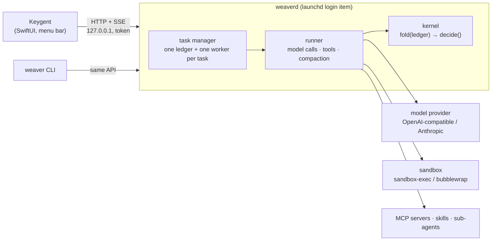

# Keygent

**English** | [简体中文](README.zh-CN.md)

[](https://github.com/kiwi0719/keygent/actions/workflows/ci.yml)
[](LICENSE)
[](#install)
[](#run-weaver-without-the-app)
[](https://github.com/kiwi0719/keygent/releases)

**Hand a long task to a coding agent from a keystroke, and come back when it needs you.**

Keygent is a macOS menu-bar app on top of **Weaver**, a local coding agent that runs as a background service (`weaverd`). Press <kbd>⌘ ⇧ Space</kbd>, say what you want done in which folder, and go back to your work. The agent reads, edits and runs things in a sandbox; a capsule in the menu bar shows whether it is running, done, or waiting for you. Approvals, questions and errors from every task land in one queue you can clear from the keyboard.

Weaver's core is built on one rule: **the event ledger is the only source of truth, and the kernel is a pure function over it.** Everything else (model calls, tools, the daemon, the app) hangs off the outside, so a task survives a crash, can be replayed, and every file change can be undone.

## Contents

- [Status](#status)
- [Quick look](#quick-look)
- [How it works](#how-it-works)
- [Install](#install)
- [Configure a model](#configure-a-model)
- [Run Weaver without the app](#run-weaver-without-the-app)
- [Documentation](#documentation)
- [Contributing](#contributing)
- [License](#license)

## Status

| | |
|---|---|
| Version | `v0.1.0` ([changelog](CHANGELOG.md)) |
| Runs on | macOS 14+ on Apple silicon (the app); the Weaver CLI and daemon also run on Linux with Python 3.10+ |
| Models | any OpenAI-compatible chat endpoint or the Anthropic Messages API; presets for OpenRouter, OpenAI, Anthropic, DeepSeek, Kimi, Qwen, GLM, SiliconFlow, Groq, Together, xAI, Gemini, Ollama, LM Studio, vLLM |
| Maturity | early. The API and on-disk formats can still change between minor versions |

## Quick look

| Key | What it does |
|---|---|
| <kbd>⌘ ⇧ Space</kbd> | open / close the launcher (the only global hotkey): one line of what you want, a working folder, optional files or clipboard; whatever is waiting for you sits at <kbd>⌘ 1</kbd> |
| <kbd>⌘ ,</kbd> | settings: Model · MCP · Skills · Permissions · Memory (<kbd>⌘ [</kbd> <kbd>⌘ ]</kbd> to switch pages), keyboard only |
| <kbd>⌘ ⇧ O</kbd> | attach a file from Finder |
| menu-bar capsule | left click opens it; right click has *Waiting for you*, *Reconnect*, *Quit* |

When a task needs you, it waits instead of guessing: **approve**, **deny**, **edit the arguments and approve**, or **answer the question**, from the task window or from the queue that collects waits across all tasks. If the app is closed, a system notification does the same job.

## How it works



- **Kernel** (`weaver/kernel.py`): the ledger is an append-only JSONL file of nine event types. `fold` replays it into state, `decide` is a rule table that says what happens next. No IO, fully tested offline.
- **Runner**: calls the model (streaming, prompt caching, compaction when the context fills), runs tools in parallel batches, and writes every result back to the ledger, redacted before it gets there.
- **Tools**: `read_file`, `grep` / `find_files` (bundled ripgrep), `write_file`, `edit_file`, `bash`, `todo`, `ask_user`, `task` (sub-agents), `recall` (search the ledger), plus whatever MCP servers expose.
- **Safety**: permissions allow reads and writes inside the working folder, ask about the rest, and hard-deny a short list. `bash` runs in an OS sandbox that can only write the working folder and temp. Every file change keeps the original, so it can be undone. Secrets (gitleaks-style rules plus known values from the environment) are masked before they reach the ledger or the model.
- **weaverd** keeps tasks under `~/.weaver/tasks/<id>/`, serves the API in [design/api.md](design/api.md) on localhost with a token from `~/.weaver/daemon.json`, and is shared by the app and the CLI.

## Install

### Download

Grab `Keygent-<version>-arm64.zip` from [Releases](https://github.com/kiwi0719/keygent/releases), unzip, and move `Keygent.app` to `/Applications`.

The build is ad-hoc signed, not notarized, so macOS quarantines it on download. Clear that once:

```bash
xattr -dr com.apple.quarantine /Applications/Keygent.app
```

On first launch Keygent registers `weaverd` as a login item. The app bundle carries its own Python and the MCP SDK; nothing else needs to be installed.

### Build from source

Needs Xcode (CI builds with Xcode 26) and [XcodeGen](https://github.com/yonaskolb/XcodeGen) (`brew install xcodegen`).

```bash
make run
```

That downloads the embedded Python once (`Keygent/scripts/fetch-python.sh`), generates the Xcode project, builds a Debug app and opens it. `make app CONFIG=Release` builds the release configuration. Or `open Keygent/Keygent.xcodeproj` and press <kbd>⌘ R</kbd>. More in [Keygent/README.md](Keygent/README.md).

## Configure a model

Open settings with <kbd>⌘ ,</kbd> → **Model**, paste an API base URL, key and model ID, and restart Weaver from there. The settings page writes `~/.weaver/.env`; you can also write it by hand:

```bash
# ~/.weaver/.env
WEAVER_BASE_URL=https://openrouter.ai/api/v1    # the provider is recognised from the URL
WEAVER_API_KEY=sk-...
WEAVER_MODEL=<model id>                         # must support tool calling
```

`WEAVER_PROVIDER=<preset>` picks a preset instead of a URL; local servers (`ollama`, `lmstudio`, `vllm`) need no key. Per-provider quirks (reasoning echo, cache markers, max-tokens field name) are covered in [design/providers.md](design/providers.md).

`weaverd` does not start without this file; it logs why to `~/.weaver/daemon.out` and waits.

## Run Weaver without the app

The agent is plain Python with no required dependencies. On macOS or Linux:

```bash
python3 -m weaver "find why the login test is flaky and fix it"
```

| Command | |
|---|---|
| `python3 -m weaver "…"` | new session in the current folder (sessions live in `./.weaver/`) |
| `python3 -m weaver -s <id> "…"` | continue a session; without a prompt, resume after a crash |
| `python3 -m weaver --list` / `-s <id> --log` | list sessions / print a ledger |
| `python3 -m weaver -s <id> --undo` | undo the last file change (repeatable) |
| `python3 -m weaver daemon install \| start \| stop \| status \| logs` | run `weaverd` under launchd without the app |
| `python3 -m weaver tasks \| waits \| attach \| approve \| cancel` | drive tasks in a running `weaverd` |

When `weaverd` is running, the CLI hands prompts to it (`--local` to run in-process anyway). MCP needs the official SDK: `python3 -m venv .venv && .venv/bin/pip install -r requirements-mcp.txt`. On Linux, install `bubblewrap` for the sandbox; without it `bash` runs unsandboxed and `--yes` refuses unless you pass `--no-sandbox`.

## Documentation

The design docs are in Chinese; each ends with a progress section recording what was built and verified.

- [design/README.md](design/README.md): index and code map
- Core: [kernel](design/kernel.md), [providers](design/providers.md), [prompt cache](design/cache.md), [compaction](design/compaction.md), [memory](design/memory.md)
- Tools and safety: [read and search](design/tools.md), [write tools, permissions, sandbox, undo](design/write-tools.md), [redaction](design/redaction.md), [parallel tools and sub-agents](design/parallel-subagent.md), [todo and loop guards](design/todo-loop.md)
- Extensions: [MCP](design/mcp.md), [skills](design/skills.md), [built-in skills](design/builtin-skills.md)
- Service and app: [weaverd](design/daemon.md), [HTTP + SSE API](design/api.md), [settings](design/settings.md), [Keygent](Keygent/README.md)
- [design/main.md](design/main.md): the tutorial Weaver was built from, layer by layer, comparing 16 open-source agents

## Contributing

Issues and PRs are welcome. [CONTRIBUTING.md](CONTRIBUTING.md) has the ground rules; the short version:

```bash
make check
```

runs ruff and all 400-odd offline tests (fake models, fake SSE streams; no API key). Add `make test-linux` (Docker) when you touch the sandbox, `bash` or ripgrep lookup, and build the app (`make app`) when you touch `Keygent/` or the daemon API. **The ledger is the only source of truth**: a change that keeps state outside it, or lets the kernel do IO, needs a design note first. Add a line to `CHANGELOG.md` under Unreleased.

Security issues go through [private reporting](https://github.com/kiwi0719/keygent/security/advisories/new), not public issues; see [SECURITY.md](SECURITY.md).

## License

[Apache 2.0](LICENSE). Bundled third-party components keep their own licenses: the built-in skills under `weaver/builtin_skills/` come from [obra/superpowers](https://github.com/obra/superpowers) (MIT, changes listed in [NOTICE.md](weaver/builtin_skills/NOTICE.md)); `weaver/vendor/ripgrep/` is [ripgrep](https://github.com/BurntSushi/ripgrep) (MIT or Unlicense); release builds embed [python-build-standalone](https://github.com/astral-sh/python-build-standalone) CPython (PSF) and the [MCP Python SDK](https://github.com/modelcontextprotocol/python-sdk) (MIT); the app uses [MarkdownUI](https://github.com/gonzalezreal/swift-markdown-ui) (MIT).
