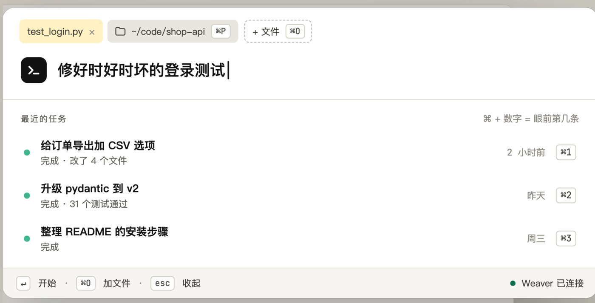
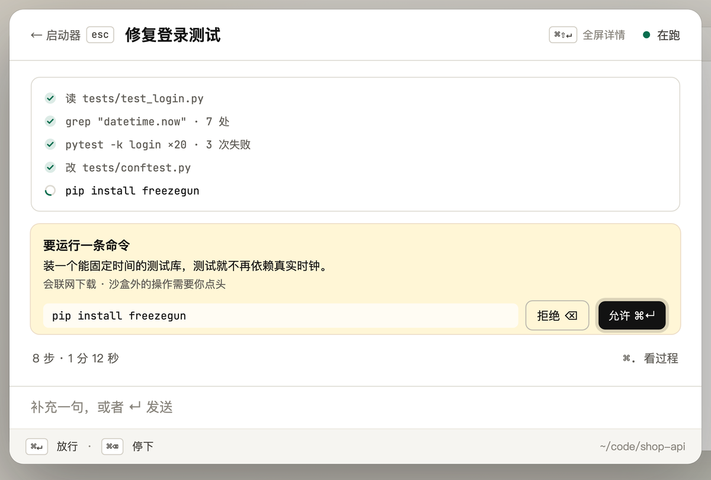
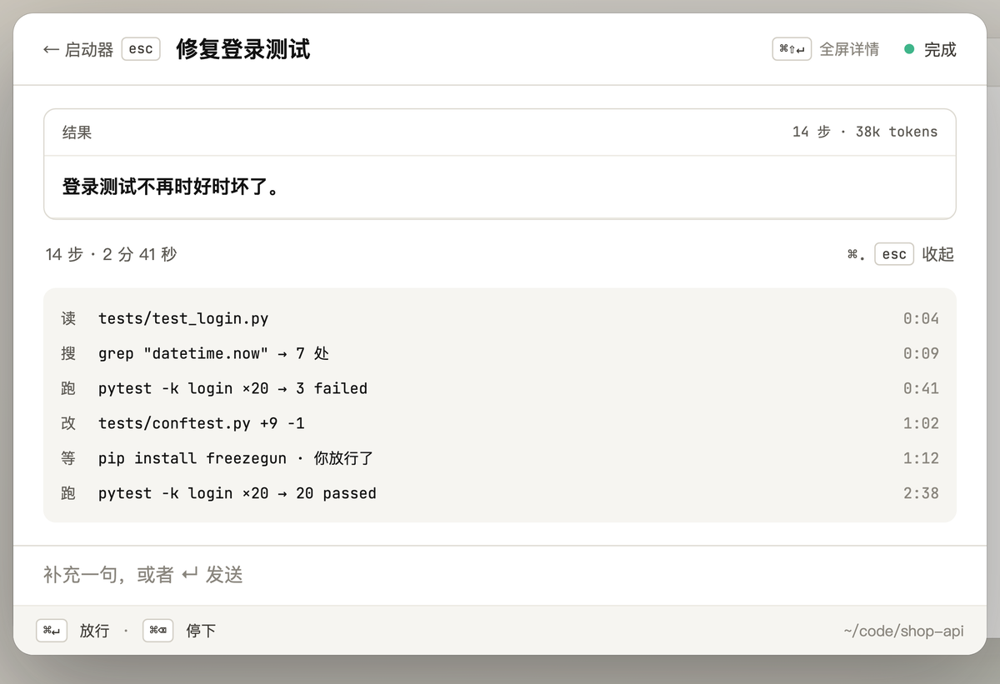
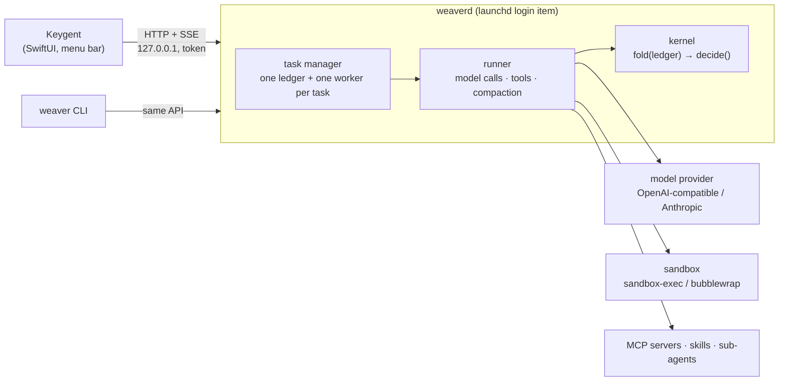

# Keygent

**English** | [简体中文](README.zh-CN.md)

[](https://github.com/kiwi0719/keygent/actions/workflows/ci.yml)
[](LICENSE)
[](#install)
[](#run-weaver-without-the-app)
[](https://github.com/kiwi0719/keygent/releases)

**Hand a long task to a coding agent from a keystroke, and come back when it needs you.**

<p align="center">
  
</p>

Keygent is a macOS menu-bar app on top of **Weaver**, a local coding agent that runs as a background service (`weaverd`). Press <kbd>⌘ ⇧ Space</kbd>, say what you want done in which folder, and go back to your work. The agent reads, edits and runs things in a sandbox; a capsule in the menu bar shows whether it is running, done, or waiting for you. Approvals, questions and errors from every task land in one queue you can clear from the keyboard.

Weaver's core is built on one rule: **the event ledger is the only source of truth, and the kernel is a pure function over it.** Everything else (model calls, tools, the daemon, the app) hangs off the outside, so a task survives a crash, can be replayed, and every file change can be undone.

## Contents

- [Status](#status)
- [Quick look](#quick-look)
- [What you get](#what-you-get)
- [Keyboard](#keyboard)
- [How it works](#how-it-works)
- [Install](#install)
- [Configure a model](#configure-a-model)
- [Troubleshooting](#troubleshooting)
- [Run Weaver without the app](#run-weaver-without-the-app)
- [Documentation](#documentation)
- [Contributing](#contributing)
- [License](#license)

## Status

| | |
|---|---|
| Version | `v0.1.0` ([changelog](CHANGELOG.md)) |
| Runs on | macOS 14+ on Apple silicon (the app); the Weaver CLI and daemon also run on Linux with Python 3.10+ |
| Models | any OpenAI-compatible chat endpoint or the Anthropic Messages API; presets for OpenRouter, OpenAI, Anthropic, DeepSeek, Kimi, Qwen, GLM, SiliconFlow, Groq, Together, xAI, Gemini, Ollama, LM Studio, vLLM |
| Maturity | early. The API and on-disk formats can still change between minor versions |

## Quick look

1. Press <kbd>⌘ ⇧ Space</kbd> anywhere, type what you want (*"fix the flaky login test"*), pick a folder with <kbd>⌘ E</kbd>, press <kbd>↵</kbd>.
2. Go back to your work. The capsule in the menu bar shows the task running.
3. When the agent wants to do something outside its sandbox, it stops and asks. <kbd>⌘ ↵</kbd> allows, <kbd>⌫</kbd> denies, or edit the command first.
4. When it is done, read the result, see what changed with <kbd>⌘ D</kbd>, and undo a file with <kbd>⌘ Z</kbd> if you don't like it.

<table>
  <tr>
    <td width="50%"></td>
    <td width="50%"></td>
  </tr>
  <tr>
    <td align="center"><sub>It waits for you instead of guessing</sub></td>
    <td align="center"><sub>Result first, every step underneath</sub></td>
  </tr>
</table>

If the app is closed, a system notification does the same job, and the daemon keeps working.

## What you get

- **One queue for everything waiting on you.** Approvals, questions and errors from all tasks land in one place: approve, deny, edit the arguments and approve, or answer, without hunting for the right window.
- **Every change is reversible.** The task page lists changed files with +/- counts; <kbd>⌘ D</kbd> shows the diff, <kbd>⌘ Z</kbd> puts a file back the way it was before the task touched it.
- **You can see what it is doing.** Live steps in plain language, a todo card the agent keeps up to date, a peek card under the menu-bar capsule, and <kbd>⌘ .</kbd> for the full process, including each sub-agent's own steps.
- **Sandboxed by default.** `bash` can only write the working folder and temp; anything else asks you first. Secrets are masked before they reach the model or the log.
- **Survives crashes.** Tasks run in `weaverd`, a background service started at login. Quit the app, reboot, or let it crash: the task picks up from its ledger.
- **Bring your own model.** Any OpenAI-compatible endpoint or the Anthropic API, including local Ollama, LM Studio and vLLM.
- **Extensible.** MCP servers (stdio and HTTP, OAuth, questions and sampling with per-call approval, `/` prompts in the launcher), skills, and memory you can view and edit in settings.

## Keyboard

Keygent is meant to be used without the mouse. The global hotkey is the only one that works outside the app; everything else works while its panel is open.

| Where | Key | What it does |
|---|---|---|
| anywhere | <kbd>⌘ ⇧ Space</kbd> | open / close the launcher |
| launcher | <kbd>↵</kbd> | start the task |
| | <kbd>⌘ E</kbd> · <kbd>⌘ O</kbd> · <kbd>⌘ ⇧ O</kbd> | working folder · attach a recent file · attach from Finder |
| | <kbd>⌘ 1</kbd>–<kbd>⌘ 9</kbd>, <kbd>↑</kbd> <kbd>↓</kbd> | pick a recent task, <kbd>↵</kbd> opens it; whatever is waiting for you sits at <kbd>⌘ 1</kbd> |
| | `?` … | search earlier tasks, archived ones included |
| | `/` … | use a prompt from an MCP server |
| | <kbd>⌘ ⇧ A</kbd> | archived tasks (<kbd>⌘ R</kbd> restores) |
| task | <kbd>⌘ ↵</kbd> · <kbd>⌫</kbd> | allow · deny |
| | <kbd>⌘ ⌫</kbd> | stop the task |
| | <kbd>⌘ .</kbd> | the full process; <kbd>↑</kbd> <kbd>↓</kbd> select a step, <kbd>↵</kbd> opens a sub-agent |
| | <kbd>⌘ D</kbd> · <kbd>⌘ Z</kbd> | diff of changed files · undo a file (press twice) |
| | <kbd>⌘ C</kbd> | copy the result |
| | <kbd>⌘ ⇧ ↵</kbd> | full-screen details |
| everywhere | <kbd>⌘ ,</kbd> | settings: Model · MCP · Skills · Permissions · Memory (<kbd>⌘ [</kbd> <kbd>⌘ ]</kbd> switch pages) |
| | <kbd>esc</kbd> | back, or hide the panel |

The menu-bar capsule: left click opens the task it shows, right click has *Waiting for you*, *Reconnect* and *Quit*.

## How it works



- **Kernel** (`weaver/kernel.py`): the ledger is an append-only JSONL file of nine event types. `fold` replays it into state, `decide` is a rule table that says what happens next. No IO, fully tested offline.
- **Runner**: calls the model (streaming, prompt caching, compaction when the context fills), runs tools in parallel batches, and writes every result back to the ledger, redacted before it gets there.
- **Tools**: `read_file`, `grep` / `find_files` (bundled ripgrep), `write_file`, `edit_file`, `bash`, `todo`, `ask_user`, `task` (sub-agents), `recall` (search the ledger), plus whatever MCP servers expose.
- **Safety**: permissions allow reads and writes inside the working folder, ask about the rest, and hard-deny a short list. `bash` runs in an OS sandbox that can only write the working folder and temp. Every file change keeps the original, so it can be undone. Secrets (gitleaks-style rules plus known values from the environment) are masked before they reach the ledger or the model.
- **weaverd** keeps tasks under `~/.weaver/tasks/<id>/`, serves the API in [design/api.md](design/api.md) on localhost with a token from `~/.weaver/daemon.json`, and is shared by the app and the CLI.

## Install

### Download

Requires macOS 14 or later on Apple silicon (M1 or newer).

1. Download `Keygent-<version>-arm64.zip` from the [latest release](https://github.com/kiwi0719/keygent/releases/latest). Optionally check it against the `.sha256` file next to it:

   ```bash
   shasum -a 256 -c Keygent-0.1.0-arm64.zip.sha256
   ```

2. Unzip it and move `Keygent.app` to `/Applications`.
3. Clear the quarantine flag once. The build is ad-hoc signed, not notarized by Apple, so without this macOS says the app *"is damaged and can't be opened"* or *"cannot be verified"*:

   ```bash
   xattr -dr com.apple.quarantine /Applications/Keygent.app
   ```

4. Open Keygent. On first launch it registers `weaverd` as a login item (macOS may show a *"Background item added"* notice; leave it on) and opens settings so you can [configure a model](#configure-a-model).

The app bundle carries its own Python and the MCP SDK; nothing else needs to be installed.

**Updating:** quit Keygent, replace the app in `/Applications`, clear the quarantine flag again, and open it. The app restarts `weaverd` when its bundled code changed; running tasks resume.

**Uninstalling:** quit Keygent, then

```bash
launchctl bootout gui/$(id -u)/com.keygent.weaverd
rm -rf /Applications/Keygent.app
```

Tasks, memories and your model settings live in `~/.weaver/`. Delete that folder too if you want them gone.

### Build from source

Needs Xcode (CI builds with Xcode 26) and [XcodeGen](https://github.com/yonaskolb/XcodeGen) (`brew install xcodegen`).

```bash
make run
```

That downloads the embedded Python once (`Keygent/scripts/fetch-python.sh`), generates the Xcode project, builds a Debug app and opens it. `make app CONFIG=Release` builds the release configuration. Or `open Keygent/Keygent.xcodeproj` and press <kbd>⌘ R</kbd>. More in [Keygent/README.md](Keygent/README.md).

## Configure a model

Open settings with <kbd>⌘ ,</kbd> → **Model**, paste an API base URL, key and model ID, and restart Weaver from there. The settings page writes `~/.weaver/.env`; you can also write it by hand:

```bash
# ~/.weaver/.env
WEAVER_BASE_URL=https://openrouter.ai/api/v1    # the provider is recognised from the URL
WEAVER_API_KEY=sk-...
WEAVER_MODEL=<model id>                         # must support tool calling
```

`WEAVER_PROVIDER=<preset>` picks a preset instead of a URL; local servers (`ollama`, `lmstudio`, `vllm`) need no key. Per-provider quirks (reasoning echo, cache markers, max-tokens field name) are covered in [design/providers.md](design/providers.md).

`weaverd` does not start without this file; it logs why to `~/.weaver/daemon.out` and waits.

## Troubleshooting

| Symptom | What to do |
|---|---|
| *"Keygent is damaged and can't be opened"* | The download is quarantined. Run the `xattr` command from [Install](#download). |
| <kbd>⌘ ⇧ Space</kbd> does nothing | Another app may own that shortcut (check input-source and launcher apps in System Settings › Keyboard › Keyboard Shortcuts). Quit and reopen Keygent so it registers the hotkey again. |
| The app says *Weaver 没在运行* (Weaver is not running) | Check `~/.weaver/daemon.out` for the reason. Usually the model is not configured yet (<kbd>⌘ ,</kbd> → Model), or the login item was switched off in System Settings › General › Login Items. |
| A task stopped with a model error | Open <kbd>⌘ ,</kbd> → Model and check the base URL, key and model ID. The model must support tool calling. |
| You want the logs | `python3 -m weaver daemon logs`, or read `~/.weaver/daemon.out`. Each task's full ledger is in `~/.weaver/tasks/<id>/`. |

Still stuck? [Open an issue](https://github.com/kiwi0719/keygent/issues/new) with the macOS version and the last lines of `daemon.out` (check it for anything private first).

## Run Weaver without the app

The agent is plain Python with no required dependencies. On macOS or Linux:

```bash
python3 -m weaver "find why the login test is flaky and fix it"
```

| Command | |
|---|---|
| `python3 -m weaver "…"` | new session in the current folder (sessions live in `./.weaver/`) |
| `python3 -m weaver -s <id> "…"` | continue a session; without a prompt, resume after a crash |
| `python3 -m weaver --list` / `-s <id> --log` | list sessions / print a ledger |
| `python3 -m weaver -s <id> --undo` | undo the last file change (repeatable) |
| `python3 -m weaver daemon install \| start \| stop \| status \| logs` | run `weaverd` under launchd without the app |
| `python3 -m weaver tasks \| waits \| attach \| approve \| cancel` | drive tasks in a running `weaverd` |

When `weaverd` is running, the CLI hands prompts to it (`--local` to run in-process anyway). MCP needs the official SDK: `python3 -m venv .venv && .venv/bin/pip install -r requirements-mcp.txt`. On Linux, install `bubblewrap` for the sandbox; without it `bash` runs unsandboxed and `--yes` refuses unless you pass `--no-sandbox`.

## Documentation

The design docs are in Chinese; each ends with a progress section recording what was built and verified.

- [design/README.md](design/README.md): index and code map
- Core: [kernel](design/kernel.md), [providers](design/providers.md), [prompt cache](design/cache.md), [compaction](design/compaction.md), [memory](design/memory.md)
- Tools and safety: [read and search](design/tools.md), [write tools, permissions, sandbox, undo](design/write-tools.md), [redaction](design/redaction.md), [parallel tools and sub-agents](design/parallel-subagent.md), [todo and loop guards](design/todo-loop.md)
- Extensions: [MCP](design/mcp.md), [skills](design/skills.md), [built-in skills](design/builtin-skills.md)
- Service and app: [weaverd](design/daemon.md), [HTTP + SSE API](design/api.md), [settings](design/settings.md), [Keygent](Keygent/README.md)
- [design/main.md](design/main.md): the tutorial Weaver was built from, layer by layer, comparing 16 open-source agents

## Contributing

Issues and PRs are welcome. [CONTRIBUTING.md](CONTRIBUTING.md) has the ground rules; the short version:

```bash
make check
```

runs ruff and all 400-odd offline tests (fake models, fake SSE streams; no API key). Add `make test-linux` (Docker) when you touch the sandbox, `bash` or ripgrep lookup, and build the app (`make app`) when you touch `Keygent/` or the daemon API. **The ledger is the only source of truth**: a change that keeps state outside it, or lets the kernel do IO, needs a design note first. Add a line to `CHANGELOG.md` under Unreleased.

Security issues go through [private reporting](https://github.com/kiwi0719/keygent/security/advisories/new), not public issues; see [SECURITY.md](SECURITY.md).

## License

[Apache 2.0](LICENSE). Bundled third-party components keep their own licenses: the built-in skills under `weaver/builtin_skills/` come from [obra/superpowers](https://github.com/obra/superpowers) (MIT, changes listed in [NOTICE.md](weaver/builtin_skills/NOTICE.md)); `weaver/vendor/ripgrep/` is [ripgrep](https://github.com/BurntSushi/ripgrep) (MIT or Unlicense); release builds embed [python-build-standalone](https://github.com/astral-sh/python-build-standalone) CPython (PSF) and the [MCP Python SDK](https://github.com/modelcontextprotocol/python-sdk) (MIT); the app uses [MarkdownUI](https://github.com/gonzalezreal/swift-markdown-ui) (MIT).
