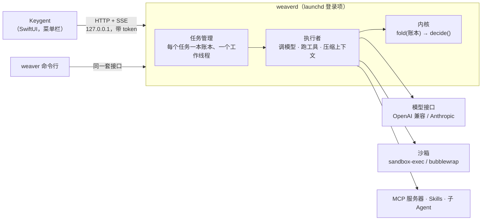

# Keygent

[English](README.md) | **简体中文**

[](https://github.com/kiwi0719/keygent/actions/workflows/ci.yml)
[](LICENSE)
[](#安装)
[](#不用-app-直接跑-weaver)
[](https://github.com/kiwi0719/keygent/releases)

**按一个键，把一件长活交给编码 Agent；它需要你的时候再回来。**

<p align="center">
  
</p>

Keygent 是一个 macOS 菜单栏 App，后面是 **Weaver**：一个跑在本机后台（`weaverd`）的编码 Agent。按 <kbd>⌘ ⇧ 空格</kbd>，说要在哪个文件夹做什么，然后回去干你的事。Agent 在沙箱里读、改、跑；菜单栏上的胶囊告诉你它在跑、做完了，还是在等你。所有任务里要你放行、要你回答、出错的事，都汇到一个队列里，全键盘就能处理完。

Weaver 的内核只守一条规则：**事件日志（账本）是唯一的事实，内核是账本上的纯函数。**其余一切（调模型、工具、常驻服务、App）都挂在外面，所以任务崩了能接着跑、能重放，每一处文件改动都能撤销。

## 目录

- [现状](#现状)
- [一眼看懂](#一眼看懂)
- [能做什么](#能做什么)
- [快捷键](#快捷键)
- [怎么工作的](#怎么工作的)
- [安装](#安装)
- [配置模型](#配置模型)
- [常见问题](#常见问题)
- [不用 App 直接跑 Weaver](#不用-app-直接跑-weaver)
- [文档](#文档)
- [参与贡献](#参与贡献)
- [许可](#许可)

## 现状

| | |
|---|---|
| 版本 | `v0.1.0`（[更新日志](CHANGELOG.md)） |
| 运行环境 | App：macOS 14+，Apple 芯片；Weaver 命令行和 weaverd 在 Linux 上也能跑（Python 3.10+） |
| 模型 | 任意 OpenAI 兼容的 chat 接口，或 Anthropic Messages 接口；预设了 OpenRouter、OpenAI、Anthropic、DeepSeek、Kimi、通义千问、智谱 GLM、硅基流动、Groq、Together、xAI、Gemini、Ollama、LM Studio、vLLM |
| 成熟度 | 早期。接口和磁盘格式在小版本之间还可能变 |

## 一眼看懂

1. 在哪儿都行，按 <kbd>⌘ ⇧ 空格</kbd>，写一句要做什么（「修好时好时坏的登录测试」），<kbd>⌘ E</kbd> 选文件夹，<kbd>↵</kbd>。
2. 回去干你的事。菜单栏上的胶囊显示任务在跑。
3. Agent 要做沙箱外的事时，会停下来问你：<kbd>⌘ ↵</kbd> 放行，<kbd>⌫</kbd> 拒绝，或者先改一下命令再放行。
4. 做完了看结果，<kbd>⌘ D</kbd> 看改了什么，不满意就 <kbd>⌘ Z</kbd> 把某个文件撤回去。

<table>
  <tr>
    <td width="50%"></td>
    <td width="50%"></td>
  </tr>
  <tr>
    <td align="center"><sub>拿不准就停下来等你，不瞎猜</sub></td>
    <td align="center"><sub>先看结论，每一步都在下面</sub></td>
  </tr>
</table>

App 没开时用系统通知提醒你，后台服务照样在干活。

## 能做什么

- **等你的事都在一个队列里。** 所有任务里要你放行、要你回答、出错的事汇在一处：放行、拒绝、改一下参数再放行、或者回答，不用到处找窗口。
- **每一处改动都能撤销。** 任务页列出改过的文件和 +/- 行数；<kbd>⌘ D</kbd> 看 diff，<kbd>⌘ Z</kbd> 把文件恢复到这个任务改它之前。
- **看得见它在干什么。** 实时步骤用人话写；Agent 自己维护的清单卡片；菜单栏胶囊下的小卡；<kbd>⌘ .</kbd> 看完整过程，子 Agent 的步骤也能点进去看。
- **默认在沙箱里。** `bash` 只能写工作文件夹和临时目录，别的都要先问你。密钥在发给模型、写进日志之前就打码了。
- **崩了也不丢。** 任务跑在 `weaverd` 里，这是登录时自动启动的后台服务。退出 App、重启电脑、或者它崩了，任务都会从账本接着跑。
- **模型自己选。** 任何 OpenAI 兼容接口或 Anthropic API，包括本地的 Ollama、LM Studio、vLLM。
- **能扩展。** MCP 服务器（stdio 和 HTTP、OAuth、服务器提问和逐次批准的 sampling、启动器里 `/` 用提示词）、skills，还有能在设置里查看和编辑的记忆。

## 快捷键

Keygent 设计成不用鼠标。只有全局热键在 App 外也能用，其余的在面板开着时生效。

| 在哪 | 按键 | 作用 |
|---|---|---|
| 任何地方 | <kbd>⌘ ⇧ 空格</kbd> | 呼出 / 收起启动器 |
| 启动器 | <kbd>↵</kbd> | 开始任务 |
| | <kbd>⌘ E</kbd> · <kbd>⌘ O</kbd> · <kbd>⌘ ⇧ O</kbd> | 工作文件夹 · 加最近用过的文件 · 从访达选文件 |
| | <kbd>⌘ 1</kbd>–<kbd>⌘ 9</kbd>、<kbd>↑</kbd> <kbd>↓</kbd> | 选最近的任务，<kbd>↵</kbd> 打开；等你的那件事排在 <kbd>⌘ 1</kbd> |
| | `?` 开头 | 搜以前的任务，含归档的 |
| | `/` 开头 | 用 MCP 服务器的提示词 |
| | <kbd>⌘ ⇧ A</kbd> | 已归档的任务（<kbd>⌘ R</kbd> 恢复） |
| 任务 | <kbd>⌘ ↵</kbd> · <kbd>⌫</kbd> | 放行 · 拒绝 |
| | <kbd>⌘ ⌫</kbd> | 停下任务 |
| | <kbd>⌘ .</kbd> | 看完整过程；<kbd>↑</kbd> <kbd>↓</kbd> 选步骤，<kbd>↵</kbd> 进子 Agent |
| | <kbd>⌘ D</kbd> · <kbd>⌘ Z</kbd> | 看改动 · 撤销一个文件（按两次） |
| | <kbd>⌘ C</kbd> | 复制结论 |
| | <kbd>⌘ ⇧ ↵</kbd> | 全屏详情 |
| 哪儿都行 | <kbd>⌘ ,</kbd> | 设置：模型 · MCP · Skills · 权限 · 记忆（<kbd>⌘ [</kbd> <kbd>⌘ ]</kbd> 切换） |
| | <kbd>esc</kbd> | 返回，或收起面板 |

菜单栏胶囊：左键打开它显示的那件事，右键有「等你的事」「重新连接」「退出」。

## 怎么工作的



- **内核**（`weaver/kernel.py`）：账本是只追加的 JSONL，9 种事件。`fold` 把它翻成状态，`decide` 是一张规则表，决定下一步。没有 IO，全部离线测试。
- **执行者**：调模型（流式、提示缓存、上下文满了自动压缩），分批并行执行工具，结果写回账本，写之前先脱敏。
- **工具**：`read_file`、`grep` / `find_files`（随项目打包 ripgrep）、`write_file`、`edit_file`、`bash`、`todo`、`ask_user`、`task`（子 Agent）、`recall`（查账本原文），再加上 MCP 服务器提供的。
- **安全**：权限规则是工作目录内读写放行、其余问人、极少数直接拒绝；`bash` 跑在系统沙箱里，只能写工作目录和临时目录；每次改文件都先存原文，可以撤销；密钥（gitleaks 精选规则 + 环境变量里的已知值）进账本、发给模型之前就打码。
- **weaverd**：任务存在 `~/.weaver/tasks/<id>/`，在本机提供 [design/api.md](design/api.md) 里的接口，token 在 `~/.weaver/daemon.json`；App 和命令行共用。

## 安装

### 下载

需要 macOS 14 或更新，Apple 芯片（M1 及以后）。

1. 从[最新 Release](https://github.com/kiwi0719/keygent/releases/latest) 下载 `Keygent-<版本>-arm64.zip`。想核对的话，用旁边的 `.sha256` 文件校验：

   ```bash
   shasum -a 256 -c Keygent-0.1.0-arm64.zip.sha256
   ```

2. 解压，把 `Keygent.app` 拖进「应用程序」。
3. 清一次隔离标记。发布包是本地签名（ad-hoc），没有经过苹果公证，不清的话 macOS 会说 App「已损坏，无法打开」或「无法验证开发者」：

   ```bash
   xattr -dr com.apple.quarantine /Applications/Keygent.app
   ```

4. 打开 Keygent。第一次打开会把 `weaverd` 注册成登录项（系统可能提示「已添加后台项目」，保持开着就行），并打开设置让你[配置模型](#配置模型)。

App 包里自带 Python 和 MCP SDK，不用另外装任何东西。

**更新：** 退出 Keygent，用新的替换「应用程序」里的旧版，再清一次隔离标记，打开。App 发现自带的代码变了会重启 `weaverd`，在跑的任务会接着跑。

**卸载：** 退出 Keygent，然后

```bash
launchctl bootout gui/$(id -u)/com.keygent.weaverd
rm -rf /Applications/Keygent.app
```

任务、记忆和模型设置在 `~/.weaver/` 里，不想留就把这个文件夹也删掉。

### 从源码构建

需要 Xcode（CI 用 Xcode 26 构建）和 [XcodeGen](https://github.com/yonaskolb/XcodeGen)（`brew install xcodegen`）。

```bash
make run
```

第一次会下载内嵌 Python（`Keygent/scripts/fetch-python.sh`），然后生成 Xcode 工程、构建 Debug 版并打开。`make app CONFIG=Release` 构建发布版。也可以 `open Keygent/Keygent.xcodeproj` 后 <kbd>⌘ R</kbd>。详见 [Keygent/README.md](Keygent/README.md)。

## 配置模型

<kbd>⌘ ,</kbd> 打开设置 → **模型**，填接口地址、API key 和模型 ID，在那里重启 Weaver 即可。设置页写的是 `~/.weaver/.env`，也可以手写：

```bash
# ~/.weaver/.env
WEAVER_BASE_URL=https://openrouter.ai/api/v1    # 按地址自动认出是哪家
WEAVER_API_KEY=sk-...
WEAVER_MODEL=<模型 ID>                           # 要支持 tool calling
```

也可以用 `WEAVER_PROVIDER=<预设名>` 代替地址；本地服务（`ollama`、`lmstudio`、`vllm`）不需要 key。各家的方言差异（推理内容回传、缓存标记、max tokens 字段名）见 [design/providers.md](design/providers.md)。

没有这个文件 `weaverd` 不会启动，原因写在 `~/.weaver/daemon.out`。

## 常见问题

| 现象 | 怎么办 |
|---|---|
| 「Keygent 已损坏，无法打开」 | 下载的包被隔离了，运行[安装](#下载)里那条 `xattr` 命令。 |
| <kbd>⌘ ⇧ 空格</kbd> 没反应 | 可能被别的 App 占了（到「系统设置 › 键盘 › 键盘快捷键」看看输入法切换和其他启动器）。退出再打开 Keygent，让它重新注册热键。 |
| App 显示「Weaver 没在运行」 | 看 `~/.weaver/daemon.out` 里写的原因。多半是还没配模型（<kbd>⌘ ,</kbd> → 模型），或者在「系统设置 › 通用 › 登录项」里把它关了。 |
| 任务因为模型出错停了 | <kbd>⌘ ,</kbd> → 模型，检查接口地址、key 和模型 ID。模型要支持 tool calling。 |
| 想看日志 | `python3 -m weaver daemon logs`，或者直接看 `~/.weaver/daemon.out`。每个任务的完整账本在 `~/.weaver/tasks/<id>/`。 |

还是不行？[提个 issue](https://github.com/kiwi0719/keygent/issues/new)，带上 macOS 版本和 `daemon.out` 最后几行（先检查一下有没有隐私信息）。

## 不用 App 直接跑 Weaver

Agent 是纯 Python，没有必需的依赖。macOS 或 Linux 上：

```bash
python3 -m weaver "查一下登录测试为什么时好时坏，修掉"
```

| 命令 | |
|---|---|
| `python3 -m weaver "…"` | 在当前文件夹开新会话（会话存在 `./.weaver/`） |
| `python3 -m weaver -s <id> "…"` | 接着已有会话问；不带问题就是崩溃后恢复 |
| `python3 -m weaver --list` / `-s <id> --log` | 列出会话 / 打印账本 |
| `python3 -m weaver -s <id> --undo` | 撤销最近一次文件改动（可以连续撤销） |
| `python3 -m weaver daemon install \| start \| stop \| status \| logs` | 不装 App，用 launchd 跑 `weaverd` |
| `python3 -m weaver tasks \| waits \| attach \| approve \| cancel` | 操作正在运行的 `weaverd` 里的任务 |

`weaverd` 在运行时，命令行会把问题交给它（加 `--local` 则仍在本进程里跑）。MCP 需要官方 SDK：`python3 -m venv .venv && .venv/bin/pip install -r requirements-mcp.txt`。Linux 上装 `bubblewrap` 才有沙箱；没有时 `bash` 不受沙箱限制，`--yes` 会拒绝运行，除非再加 `--no-sandbox`。

## 文档

每份设计文档末尾都有「进度」一节：实现了什么、真实验证的结果、实测中发现并修掉的问题。

- [design/README.md](design/README.md)：总览和代码地图
- 内核：[内核](design/kernel.md)、[模型接入](design/providers.md)、[提示缓存](design/cache.md)、[上下文压缩](design/compaction.md)、[记忆](design/memory.md)
- 工具与安全：[读与搜索](design/tools.md)、[写工具、权限、沙箱、撤销](design/write-tools.md)、[脱敏](design/redaction.md)、[并行工具与子 Agent](design/parallel-subagent.md)、[todo 与防死循环](design/todo-loop.md)
- 扩展：[MCP](design/mcp.md)、[Skills](design/skills.md)、[内置 Skills](design/builtin-skills.md)
- 服务与 App：[weaverd](design/daemon.md)、[HTTP + SSE 接口](design/api.md)、[设置](design/settings.md)、[Keygent](Keygent/README.md)
- [design/main.md](design/main.md)：Weaver 一层层搭起来所依据的教程，对比了 16 个开源 Agent 项目

## 参与贡献

欢迎提 issue 和 PR。规则见 [CONTRIBUTING.md](CONTRIBUTING.md)，简单说：

```bash
make check
```

跑 ruff 和全部 400 多个离线测试（假模型、假 SSE 流，不需要 API key）。动了沙箱、`bash` 或 ripgrep 查找时再跑 `make test-linux`（需要 Docker）；动了 `Keygent/` 或 daemon 接口时构建一次 App（`make app`）。**账本是唯一的事实**：把状态存到账本外面、或者让内核做 IO 的改动，先写设计说明。在 `CHANGELOG.md` 的 Unreleased 下加一行。

安全问题请走[私密报告](https://github.com/kiwi0719/keygent/security/advisories/new)，不要开公开 issue，见 [SECURITY.md](SECURITY.md)。

## 许可

[Apache 2.0](LICENSE)。随附的第三方组件保留各自的许可：`weaver/builtin_skills/` 下的内置 skills 来自 [obra/superpowers](https://github.com/obra/superpowers)（MIT，改动见 [NOTICE.md](weaver/builtin_skills/NOTICE.md)）；`weaver/vendor/ripgrep/` 是 [ripgrep](https://github.com/BurntSushi/ripgrep)（MIT 或 Unlicense）；发布包内嵌 [python-build-standalone](https://github.com/astral-sh/python-build-standalone) 的 CPython（PSF）和 [MCP Python SDK](https://github.com/modelcontextprotocol/python-sdk)（MIT）；App 用了 [MarkdownUI](https://github.com/gonzalezreal/swift-markdown-ui)（MIT）。
