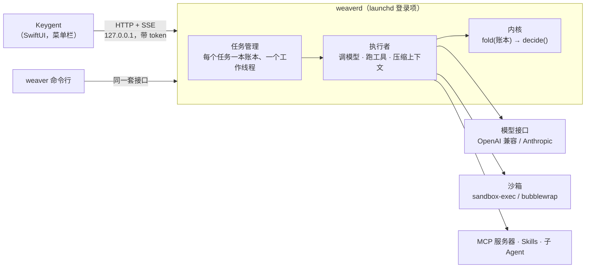

# Keygent

[English](README.md) | **简体中文**

[](https://github.com/kiwi0719/keygent/actions/workflows/ci.yml)
[](LICENSE)
[](#安装)
[](#不用-app-直接跑-weaver)
[](https://github.com/kiwi0719/keygent/releases)

**按一个键，把一件长活交给编码 Agent；它需要你的时候再回来。**

Keygent 是一个 macOS 菜单栏 App，后面是 **Weaver**：一个跑在本机后台（`weaverd`）的编码 Agent。按 <kbd>⌘ ⇧ 空格</kbd>，说要在哪个文件夹做什么，然后回去干你的事。Agent 在沙箱里读、改、跑；菜单栏上的胶囊告诉你它在跑、做完了，还是在等你。所有任务里要你放行、要你回答、出错的事，都汇到一个队列里，全键盘就能处理完。

Weaver 的内核只守一条规则：**事件日志（账本）是唯一的事实，内核是账本上的纯函数。**其余一切（调模型、工具、常驻服务、App）都挂在外面，所以任务崩了能接着跑、能重放，每一处文件改动都能撤销。

## 目录

- [现状](#现状)
- [一眼看懂](#一眼看懂)
- [怎么工作的](#怎么工作的)
- [安装](#安装)
- [配置模型](#配置模型)
- [不用 App 直接跑 Weaver](#不用-app-直接跑-weaver)
- [文档](#文档)
- [参与贡献](#参与贡献)
- [许可](#许可)

## 现状

| | |
|---|---|
| 版本 | `v0.1.0`（[更新日志](CHANGELOG.md)） |
| 运行环境 | App：macOS 14+，Apple 芯片；Weaver 命令行和 weaverd 在 Linux 上也能跑（Python 3.10+） |
| 模型 | 任意 OpenAI 兼容的 chat 接口，或 Anthropic Messages 接口；预设了 OpenRouter、OpenAI、Anthropic、DeepSeek、Kimi、通义千问、智谱 GLM、硅基流动、Groq、Together、xAI、Gemini、Ollama、LM Studio、vLLM |
| 成熟度 | 早期。接口和磁盘格式在小版本之间还可能变 |

## 一眼看懂

| 按键 | 作用 |
|---|---|
| <kbd>⌘ ⇧ 空格</kbd> | 呼出 / 收起启动器（唯一的全局热键）：一句话、工作文件夹，可以带文件或剪贴板；等你的那件事排在 <kbd>⌘ 1</kbd> |
| <kbd>⌘ ,</kbd> | 设置：模型 · MCP · Skills · 权限 · 记忆（<kbd>⌘ [</kbd> <kbd>⌘ ]</kbd> 切换），全键盘 |
| <kbd>⌘ ⇧ O</kbd> | 从访达附加文件 |
| 菜单栏胶囊 | 左键打开；右键有「等你的事」「重新连接」「退出」 |

任务需要你时，它会停下来等，不会瞎猜：**放行**、**不行**、**改一下参数再放行**、或者**回答问题**。可以在任务窗口里处理，也可以在汇总了所有任务的「等你的事」队列里逐件处理。App 没开时，用系统通知提醒。

## 怎么工作的



- **内核**（`weaver/kernel.py`）：账本是只追加的 JSONL，9 种事件。`fold` 把它翻成状态，`decide` 是一张规则表，决定下一步。没有 IO，全部离线测试。
- **执行者**：调模型（流式、提示缓存、上下文满了自动压缩），分批并行执行工具，结果写回账本，写之前先脱敏。
- **工具**：`read_file`、`grep` / `find_files`（随项目打包 ripgrep）、`write_file`、`edit_file`、`bash`、`todo`、`ask_user`、`task`（子 Agent）、`recall`（查账本原文），再加上 MCP 服务器提供的。
- **安全**：权限规则是工作目录内读写放行、其余问人、极少数直接拒绝；`bash` 跑在系统沙箱里，只能写工作目录和临时目录；每次改文件都先存原文，可以撤销；密钥（gitleaks 精选规则 + 环境变量里的已知值）进账本、发给模型之前就打码。
- **weaverd**：任务存在 `~/.weaver/tasks/<id>/`，在本机提供 [design/api.md](design/api.md) 里的接口，token 在 `~/.weaver/daemon.json`；App 和命令行共用。

## 安装

### 下载

从 [Releases](https://github.com/kiwi0719/keygent/releases) 下载 `Keygent-<版本>-arm64.zip`，解压，把 `Keygent.app` 拖进「应用程序」。

发布包是本地签名（ad-hoc），没有经过苹果公证，下载后会被隔离。清一次就好：

```bash
xattr -dr com.apple.quarantine /Applications/Keygent.app
```

第一次打开时，Keygent 会把 `weaverd` 注册成登录项。App 包里自带 Python 和 MCP SDK，不用另外装任何东西。

### 从源码构建

需要 Xcode（CI 用 Xcode 26 构建）和 [XcodeGen](https://github.com/yonaskolb/XcodeGen)（`brew install xcodegen`）。

```bash
make run
```

第一次会下载内嵌 Python（`Keygent/scripts/fetch-python.sh`），然后生成 Xcode 工程、构建 Debug 版并打开。`make app CONFIG=Release` 构建发布版。也可以 `open Keygent/Keygent.xcodeproj` 后 <kbd>⌘ R</kbd>。详见 [Keygent/README.md](Keygent/README.md)。

## 配置模型

<kbd>⌘ ,</kbd> 打开设置 → **模型**，填接口地址、API key 和模型 ID，在那里重启 Weaver 即可。设置页写的是 `~/.weaver/.env`，也可以手写：

```bash
# ~/.weaver/.env
WEAVER_BASE_URL=https://openrouter.ai/api/v1    # 按地址自动认出是哪家
WEAVER_API_KEY=sk-...
WEAVER_MODEL=<模型 ID>                           # 要支持 tool calling
```

也可以用 `WEAVER_PROVIDER=<预设名>` 代替地址；本地服务（`ollama`、`lmstudio`、`vllm`）不需要 key。各家的方言差异（推理内容回传、缓存标记、max tokens 字段名）见 [design/providers.md](design/providers.md)。

没有这个文件 `weaverd` 不会启动，原因写在 `~/.weaver/daemon.out`。

## 不用 App 直接跑 Weaver

Agent 是纯 Python，没有必需的依赖。macOS 或 Linux 上：

```bash
python3 -m weaver "查一下登录测试为什么时好时坏，修掉"
```

| 命令 | |
|---|---|
| `python3 -m weaver "…"` | 在当前文件夹开新会话（会话存在 `./.weaver/`） |
| `python3 -m weaver -s <id> "…"` | 接着已有会话问；不带问题就是崩溃后恢复 |
| `python3 -m weaver --list` / `-s <id> --log` | 列出会话 / 打印账本 |
| `python3 -m weaver -s <id> --undo` | 撤销最近一次文件改动（可以连续撤销） |
| `python3 -m weaver daemon install \| start \| stop \| status \| logs` | 不装 App，用 launchd 跑 `weaverd` |
| `python3 -m weaver tasks \| waits \| attach \| approve \| cancel` | 操作正在运行的 `weaverd` 里的任务 |

`weaverd` 在运行时，命令行会把问题交给它（加 `--local` 则仍在本进程里跑）。MCP 需要官方 SDK：`python3 -m venv .venv && .venv/bin/pip install -r requirements-mcp.txt`。Linux 上装 `bubblewrap` 才有沙箱；没有时 `bash` 不受沙箱限制，`--yes` 会拒绝运行，除非再加 `--no-sandbox`。

## 文档

每份设计文档末尾都有「进度」一节：实现了什么、真实验证的结果、实测中发现并修掉的问题。

- [design/README.md](design/README.md)：总览和代码地图
- 内核：[内核](design/kernel.md)、[模型接入](design/providers.md)、[提示缓存](design/cache.md)、[上下文压缩](design/compaction.md)、[记忆](design/memory.md)
- 工具与安全：[读与搜索](design/tools.md)、[写工具、权限、沙箱、撤销](design/write-tools.md)、[脱敏](design/redaction.md)、[并行工具与子 Agent](design/parallel-subagent.md)、[todo 与防死循环](design/todo-loop.md)
- 扩展：[MCP](design/mcp.md)、[Skills](design/skills.md)、[内置 Skills](design/builtin-skills.md)
- 服务与 App：[weaverd](design/daemon.md)、[HTTP + SSE 接口](design/api.md)、[设置](design/settings.md)、[Keygent](Keygent/README.md)
- [design/main.md](design/main.md)：Weaver 一层层搭起来所依据的教程，对比了 16 个开源 Agent 项目

## 参与贡献

欢迎提 issue 和 PR。规则见 [CONTRIBUTING.md](CONTRIBUTING.md)，简单说：

```bash
make check
```

跑 ruff 和全部 400 多个离线测试（假模型、假 SSE 流，不需要 API key）。动了沙箱、`bash` 或 ripgrep 查找时再跑 `make test-linux`（需要 Docker）；动了 `Keygent/` 或 daemon 接口时构建一次 App（`make app`）。**账本是唯一的事实**：把状态存到账本外面、或者让内核做 IO 的改动，先写设计说明。在 `CHANGELOG.md` 的 Unreleased 下加一行。

安全问题请走[私密报告](https://github.com/kiwi0719/keygent/security/advisories/new)，不要开公开 issue，见 [SECURITY.md](SECURITY.md)。

## 许可

[Apache 2.0](LICENSE)。随附的第三方组件保留各自的许可：`weaver/builtin_skills/` 下的内置 skills 来自 [obra/superpowers](https://github.com/obra/superpowers)（MIT，改动见 [NOTICE.md](weaver/builtin_skills/NOTICE.md)）；`weaver/vendor/ripgrep/` 是 [ripgrep](https://github.com/BurntSushi/ripgrep)（MIT 或 Unlicense）；发布包内嵌 [python-build-standalone](https://github.com/astral-sh/python-build-standalone) 的 CPython（PSF）和 [MCP Python SDK](https://github.com/modelcontextprotocol/python-sdk)（MIT）；App 用了 [MarkdownUI](https://github.com/gonzalezreal/swift-markdown-ui)（MIT）。
