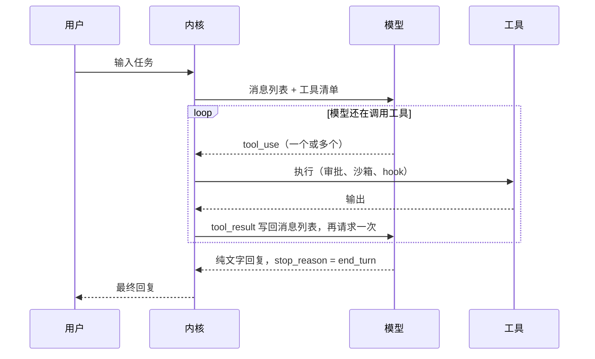
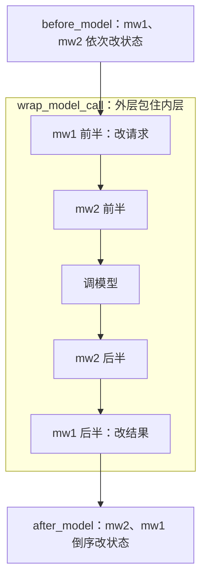
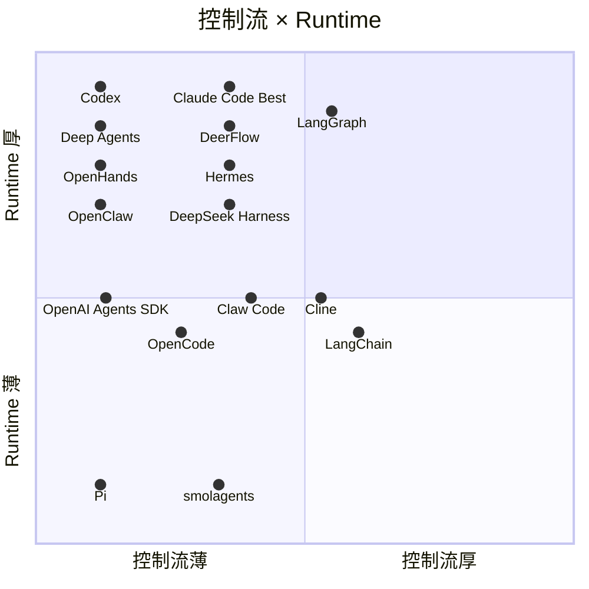
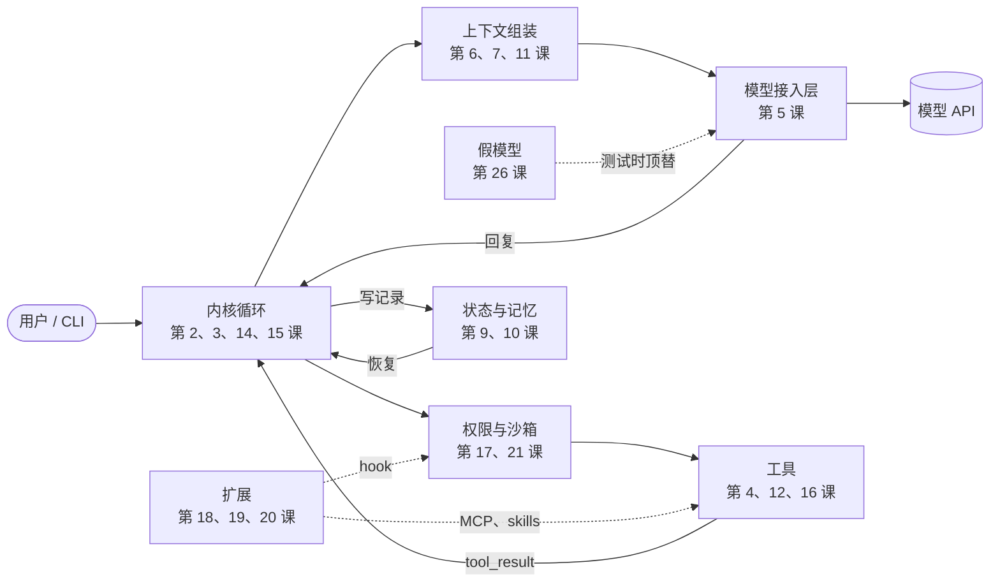

# 开源 AI Agent 架构教程：从一次模型调用到完整 Runtime

2026-09-28 · @kiwi

## 概览

这是一份自底向上的教程。以 17 个开源 AI Agent 仓库（16 个项目，OpenHands 分应用和 SDK 两个仓库）的源码为素材，从最小的单位——一次模型调用——讲起，一层层搭出完整的 Agent：循环、工具、模型接入、上下文、状态与记忆、执行控制、协作与安全、扩展能力、产品化，最后回到全景对比和趋势判断，并动手拼一个自己的 Agent。代码已浅克隆到本地 `~/Desktop/bio/agents/`。

每一课都用同样的方式展开：先讲这一层要解决什么问题，再对比各家怎么做，最后给出结论。

### 目录

- [第零阶段：认识出场项目](#第零阶段认识出场项目)
  - [第 1 课：出场项目](#第-1-课出场项目)
- [第一阶段：从一次调用到一个循环](#第一阶段从一次调用到一个循环)
  - [第 2 课：模型怎么决定“聊天”还是“调用工具”](#第-2-课模型怎么决定聊天还是调用工具)
  - [第 3 课：内核循环](#第-3-课内核循环)
  - [第 4 课：工具](#第-4-课工具)
  - [第 5 课：模型接入层](#第-5-课模型接入层)
- [第二阶段：管理上下文](#第二阶段管理上下文)
  - [第 6 课：提示缓存（Prefix Prompt Caching）](#第-6-课提示缓存prefix-prompt-caching)
  - [第 7 课：上下文压缩](#第-7-课上下文压缩)
  - [第 8 课：多模态输入输出](#第-8-课多模态输入输出)
- [第三阶段：状态与记忆](#第三阶段状态与记忆)
  - [第 9 课：状态管理](#第-9-课状态管理)
  - [第 10 课：记忆系统](#第-10-课记忆系统)
  - [第 11 课：上下文组装：每轮请求怎么拼出来](#第-11-课上下文组装每轮请求怎么拼出来)
- [第四阶段：让 Agent 可靠地做完事](#第四阶段让-agent-可靠地做完事)
  - [第 12 课：规划与任务管理](#第-12-课规划与任务管理)
  - [第 13 课：完成判定与验证](#第-13-课完成判定与验证)
  - [第 14 课：成本控制与防失控](#第-14-课成本控制与防失控)
  - [第 15 课：出错与恢复](#第-15-课出错与恢复)
- [第五阶段：协作与安全](#第五阶段协作与安全)
  - [第 16 课：多 Agent 协作](#第-16-课多-agent-协作)
  - [第 17 课：沙箱与权限](#第-17-课沙箱与权限)
- [第六阶段：扩展能力](#第六阶段扩展能力)
  - [第 18 课：扩展体系与配置层级](#第-18-课扩展体系与配置层级)
  - [第 19 课：MCP 深入](#第-19-课mcp-深入)
  - [第 20 课：Skills 与自我学习](#第-20-课skills-与自我学习)
  - [第 21 课：供应链与隐私](#第-21-课供应链与隐私)
  - [第 22 课：电脑操作与浏览器](#第-22-课电脑操作与浏览器)
  - [第 23 课：定时任务与主动触发](#第-23-课定时任务与主动触发)
- [第七阶段：产品化](#第七阶段产品化)
  - [第 24 课：前后端协议、IDE 与交互](#第-24-课前后端协议ide-与交互)
  - [第 25 课：Git 与协作流程](#第-25-课git-与协作流程)
  - [第 26 课：可观测性与评测](#第-26-课可观测性与评测)
- [第八阶段：全景与判断](#第八阶段全景与判断)
  - [第 27 课：按厚薄分类（控制流 × Runtime）](#第-27-课按厚薄分类控制流--runtime)
  - [第 28 课：共性](#第-28-课共性)
  - [第 29 课：总表（15 家 × 各维度）](#第-29-课总表15-家--各维度)
  - [第 30 课：趋势——薄内核、厚 Runtime](#第-30-课趋势薄内核厚-runtime)
  - [第 31 课：未来展望](#第-31-课未来展望)
- [第九阶段：动手](#第九阶段动手)
  - [第 32 课：拼一个自己的 Agent](#第-32-课拼一个自己的-agent)
- [附录](#附录)
  - [时间线](#时间线)
  - [工程元信息](#工程元信息)
  - [预测明细与信号](#预测明细与信号)
  - [方法与勘误](#方法与勘误)

### 贯穿全书的概念

- **内核（Kernel）**：Agent 的核心循环，负责调模型、执行工具、把结果写回，以及决定什么时候停，第 3 课详解。
- **Runtime**：内核之外的执行环境，包括上下文管理、状态、记忆、沙箱、调度、扩展等。
- **Harness**：内核 + Runtime 的整体，也就是包在模型外面、让它能干活的整套程序。本书也用“框架 / Harness”称呼 Deep Agents、DeerFlow 这类开箱即用的 Agent 底座。
- **薄 / 厚**：分两个轴看。**控制流**：薄 = 下一步做什么交给模型，厚 = 程序预先规定流程（写死边的状态图、固定步数规划）；LangGraph 这类图框架两种都能搭，按具体应用定位。**Runtime**：薄 = 基础设施少，厚 = 内置压缩、记忆、沙箱、调度等。全书的主线是：**控制流越来越薄，Runtime 越来越厚**。第 27、30 课展开。

### 术语表

| 术语 | 一句话 | 详见 |
|---|---|---|
| System Prompt | 每次请求开头的系统指令，定义身份、规则和可用能力 | 第 3、11 课 |
| tool_use / tool_result | 模型发出的工具调用和内核写回的执行结果，必须一一配对，否则接口报错 | 第 2、15 课 |
| stop_reason | 模型这次为什么停：要调工具（`tool_use`）、说完了（`end_turn`）、到了输出上限 | 第 2 课 |
| token / 上下文窗口 | 模型计量和计费的单位；窗口是一次请求能放下的 token 上限 | 第 7 课 |
| KV cache / 前缀缓存 | 模型读过的前缀在注意力层算出的中间结果；前缀不变就能复用，省钱也省时间 | 第 6 课 |
| 压缩（compaction） | 上下文快满时裁掉旧内容，或让模型写摘要替换旧历史 | 第 7 课 |
| system-reminder | 内核在对话中途插入的提示，包在该标签里放进消息，不改 System Prompt | 第 3、11 课 |
| developer 消息 | OpenAI 接口的一种消息角色，优先级介于 system 和 user 之间 | 第 3 课 |
| steering / follow-up | steering 是模型干活途中用户插进来的话，下一次调模型前送进去；follow-up 是这一轮结束后才处理的排队消息 | 第 3 课 |
| 中间件（middleware） | 包在“调模型 / 调工具”外面的一层函数，调用前改请求、调用后改结果，多层像洋葱一样嵌套 | 第 3 课 |
| hook | 用户配置的脚本或回调，在固定时机（如工具执行前）运行，可以放行、拦截或补充上下文 | 第 11、18 课 |
| 529 | Anthropic API 的“服务过载”错误码，通常退避重试或切备用模型 | 第 5 课 |
| 事件溯源 | 把所有变化记成一条事件日志，当前状态由事件重放得出，天然支持恢复和回溯 | 第 9 课 |
| checkpointer | LangGraph 保存每一步执行状态的存储接口，可以从任意一步恢复 | 第 9 课 |
| rollout | Codex 对会话记录文件（JSONL）的叫法 | 第 9 课 |
| 子 Agent（subagent） | 由主 Agent 派出、带独立上下文的另一个 Agent 循环，做完把结果交回 | 第 16 课 |
| 分叉（fork） | 子 Agent 复制父 Agent 的历史开始工作，而不是从空白上下文开始 | 第 16 课 |
| handoff / guardrail | handoff 是把对话整个转交给另一个 Agent；guardrail 是对输入或输出做检查、不通过就中止 | 第 16、17 课 |
| worktree | git 的功能：同一仓库检出多个互不干扰的工作目录，常用来隔离并行任务 | 第 16 课 |
| 沙箱 | 限制命令能读写哪些路径、能否联网的执行环境；seatbelt（macOS）、bubblewrap / Landlock / seccomp（Linux）是常见机制 | 第 17 课 |
| HITL | human-in-the-loop，关键步骤停下来等人确认 | 第 17 课 |
| AGENTS.md | 仓库里的项目说明文件，启动时自动读进上下文（Claude Code 叫 CLAUDE.md） | 第 18、28 课 |
| MCP | Model Context Protocol，把外部工具和数据源按统一格式接给 Agent 的开放协议 | 第 19 课 |
| SSE | Server-Sent Events，服务端单向推送事件流的 HTTP 方式 | 第 19 课 |
| Skill / SKILL.md | 以 SKILL.md 为核心的能力包，平时只把名字和描述放进提示词，需要时再读全文 | 第 20 课 |
| ACP | Agent Client Protocol，编辑器和 Agent 之间的通用协议 | 第 24 课 |
| TUI | 在终端里画出来的交互界面（Text User Interface） | 第 1 课 |

### 怎么读

- **从头读**：按阶段顺序，每一课都建立在前一课之上。
- **只想看结论**：读第八阶段（共性、总表、趋势、未来展望）。
- **想自己动手**：读第 32 课。配套的最小 Agent 在 `examples/`，可以离线跑测试；第 32 课还按主题列了读源码的顺序。
- **查某项能力**：直接跳到对应的课，每课末尾都有结论。
- 课与课之间的交叉引用都标了课号。

### 读前须知

- 所有事实都是 2026-09-28 本地源码快照上的情况（各仓库 commit 见附录“工程元信息”）。这些项目迭代很快，细节可能已经变化。
- 表格里“—”只表示没搜到，不代表确定没有；“（默认关）”表示已实现但默认关闭，“（实验）”表示需要打开实验开关。结论里的“只有某几家”也按这个口径读：指检索到的，不排除没搜到的。
- 说法的证据强弱不同：带路径或行号的是固定源码已核对；注明“官方文档”的是接口语义，未必核对到锁定提交；“未发现”“没搜到”是关键词检索结果；“厚 / 薄”、成因、趋势是架构判断；第 31 课是预测。
- 第 31 课“未来展望”是推测，不是事实。
- 取材方法和核对记录见附录“方法与勘误”。

## 第零阶段：认识出场项目

先知道要对比的是谁。这里只给分类，时间线和工程数据放在附录。

### 第 1 课：出场项目

> **前置知识**：无
>
> **本课要点**：17 个仓库（16 个项目）分成四类：终端编码 Agent、IDE 插件、通用自主 Agent / 个人助手、Agent 框架与 Harness；后面每课都拿它们对比。


#### 1. 终端编码 Agent（CLI / TUI）

在终端里读写代码、执行命令的编码助手。

- **Codex**（openai/codex）：OpenAI 的本地编码 Agent，Rust 实现（CLI / TUI，另有 IDE 插件和桌面 App）。
- **OpenCode**（sst/opencode，现已迁到 anomalyco/opencode）：开源的终端编码 Agent，可以接多家模型。
- **Pi**（badlogic/pi-mono，现已迁到 earendil-works/pi）：一套 Agent 工具包，包含统一的 LLM API、Agent 循环、TUI 和编码 CLI。
- **Claw Code**（ultraworkers/claw-code）：用 Rust 写的 Claude Code 式复刻，据说由 Agent 自主维护。
- **Claude Code Best**（claude-code-best/claude-code）：社区还原的 Claude Code，可以构建和调试。

#### 2. IDE 插件型编码 Agent

- **Cline**（cline/cline）：VS Code 里的自主编码 Agent，现在也提供 SDK 和 CLI。

#### 3. 通用自主 Agent / 个人助理

任务不限于写代码，强调长期记忆、多平台接入和长时间任务。

- **OpenHands**（All-Hands-AI/OpenHands，现已迁到 OpenHands/OpenHands）：开源的 AI 软件工程师平台，前身是 OpenDevin，在沙箱里执行任务。主仓库现在是 Agent Canvas 前端，Agent 循环在 SDK 仓库（OpenHands/software-agent-sdk）里。
- **Hermes**（NousResearch/hermes-agent）：Nous Research 的个人 Agent，主打随使用成长。
- **OpenClaw**（openclaw/openclaw）：跨平台、能实际动手做事的个人 AI 助理。

#### 4. Agent 框架 / Harness

用来搭建 Agent 的底座和运行框架。

- **DeerFlow**（bytedance/deer-flow）：字节的长时程 SuperAgent Harness，集成沙箱、记忆、技能和子 Agent。
- **Deep Agents**（langchain-ai/deepagents）：LangChain 的开箱即用 Agent Harness。
- **DeepSeek Harness**（deepseek-ai/deepseek-harness）：DeepSeek 的插件化 Harness，口号是“Everything is a Plugin”。
- **LangChain**（langchain-ai/langchain）：最早流行的 LLM 应用框架。v1 以 `create_agent` 加中间件为核心，早期的链、检索器等抽象已拆到 langchain-classic。
- **LangGraph**（langchain-ai/langgraph）：LangChain 团队的图式有状态 Agent 编排框架，Deep Agents 就构建在它之上。
- **smolagents**（huggingface/smolagents）：Hugging Face 的极简 Agent 库，README 称核心约千行（实际 `agents.py` 约 1800 行），主打 Code Agent。
- **OpenAI Agents SDK**（openai/openai-agents-python）：OpenAI 的多 Agent 框架（官方自称轻量），核心概念是 handoff 和 guardrail。

#### 读前约定

- **计数**：17 个仓库 = 16 个项目。OpenHands 分应用仓库和 SDK 仓库，正文的 OpenHands 均以 SDK 为准；第 29 课总表把 LangChain、LangGraph 合为一列，共 15 列。
- **名称**：“Claude Code”指官方产品。它不开源，文中描述其内部实现，一律依据社区还原版 Claude Code Best（简称 CCB）的源码。CCB 有约 36 个标着“Auto-generated stub”的空壳文件（如 `src/services/contextCollapse/`），本书只以有实现的代码为准。
- **简称**：文中的 OpenAI SDK 即 OpenAI Agents SDK；DSH 即 DeepSeek Harness；pi-ai 是 Pi 的统一 LLM 包（`@earendil-works/pi-ai`）。
- **表格标注**：“—”表示没搜到，不代表确定没有；已实现但默认关闭的标“（默认关）”；需要实验开关才能用的标“（实验）”。

#### 结论

- 17 个仓库（16 个项目）按形态分四类：终端编码 Agent、IDE 插件、通用自主 Agent / 个人助理、Agent 框架 / Harness。
- 前两类专注写代码，第三类的任务不限于写代码，第四类是搭建 Agent 的底座；后面每课都拿这些项目对比。

## 第一阶段：从一次调用到一个循环

从最小单位讲起：一次模型调用长什么样、模型怎么决定调工具，再把调用串成循环，最后看循环两端的工具和模型接入。学完这一阶段，你就能读懂任何 Agent 的核心代码。

### 第 2 课：模型怎么决定“聊天”还是“调用工具”

> **前置知识**：无
>
> **本课要点**：一次模型调用 = System Prompt + 工具清单 + 消息历史；模型每次自己决定输出文字还是调用工具；`tool_choice` 是唯一的硬开关；MCP、skills 只是往请求里装东西。


没有开关。**要不要调用工具，是模型在生成每条回复时自己决定的。** MCP、skills 决定的是“工具清单里有什么”，不决定“这一次调不调用”。

**一次请求**（以 Anthropic API 为例）：

```jsonc
{
  "system": "你是一个编码助手……",
  "tools": [
    {"name": "read", "description": "读取文件", "input_schema": {...}},
    {"name": "bash", "description": "执行命令", "input_schema": {...}}
  ],
  "messages": [{"role": "user", "content": "帮我看看 main.py 里写了什么"}]
}
```

**模型的两种回复**：

```jsonc
// A. 要动手
{"stop_reason": "tool_use",
 "content": [{"type": "text", "text": "我先读一下。"},
             {"type": "tool_use", "name": "read", "input": {"path": "main.py"}}]}

// B. 直接回答
{"stop_reason": "end_turn",
 "content": [{"type": "text", "text": "列表是可变的，元组是不可变的……"}]}
```

内核只看 `stop_reason`：`tool_use` 就执行工具、把结果塞回去再调一次模型；`end_turn` 就把文字显示给用户。“对话”和“Agent 调用”走的是同一个请求、同一个模型、同一个循环。

**模型凭什么选**：

1. **训练出来的能力**：后训练（监督微调 + 强化学习）专门练“需要外部信息就调工具、自己能答就直接答、信息够了就总结”。
2. **底层也是生成文字**：工具清单按固定模板渲染进提示词，模型想调用时生成一段特殊标记包起来的内容（概念上类似 `<tool_call>{...}</tool_call>`），服务端再解析成结构化的 `tool_use` 块。开源模型的对话模板里能直接看到这类标记。
3. **上下文的线索**：`tools` 是否为空、工具描述怎么写、System Prompt 怎么要求、用户怎么问。

**唯一的硬开关：`tool_choice`**

| 取值 | 含义 |
| --- | --- |
| `auto`（默认） | 模型自己决定 |
| `any` / `required` | 必须调用某个工具 |
| 指定工具名 | 必须调用这个工具 |
| `none` | 禁止调用 |

大多数 Agent 用 `auto`。OpenCode 要求结构化输出时会设为 `required`，逼模型通过一个输出工具返回 JSON。smolagents 的 ToolCallingAgent 默认就是 `required`（`models.py:510`），每一步都必须调工具，最后靠调用 `final_answer` 工具结束。

**MCP 和 skills 的角色**：都不是开关，只是往请求里装东西的来源。先认识后面反复出现的三个名字：

- **MCP**（Model Context Protocol）：把外部工具和数据源按统一格式接给 Agent 的开放协议，第 19 课详解。
- **Skill**：一个以 SKILL.md 为核心的目录，平时只把名字和描述放进提示词，需要时再读全文，第 20 课详解。
- **AGENTS.md**：仓库里的项目说明文件，启动时自动读进上下文；Claude Code 里叫 CLAUDE.md。

| 来源 | 最终变成请求里的什么 |
| --- | --- |
| 内置工具 | `tools` 里的条目 |
| MCP 服务器 | 也是 `tools` 里的条目（如 `mcp__github__create_pr`） |
| Skills | 一段清单（System Prompt 或 developer 消息）+ `skill` 工具；Pi、Codex 没有 skill 工具，模型直接用 read / shell 读 SKILL.md |
| AGENTS.md | System Prompt 里的一段文字 |

模型根本不知道什么是 MCP，在它眼里 MCP 工具和内置工具没有区别。装上一个 MCP 服务器后模型“突然会用 GitHub 了”，只是因为清单里多了几条工具。

#### 结论

- 一次模型调用 = System Prompt + 工具清单 + 消息历史；“对话”和“Agent 调用”走的是同一个请求、同一个模型、同一个循环。
- 有没有工具可用，由系统决定；这一次用不用，由模型决定。`tool_choice` 是唯一的硬开关。
- MCP、Skills、AGENTS.md 都不是开关，只是往请求里装东西的来源；在模型眼里，MCP 工具和内置工具没有区别。

### 第 3 课：内核循环

> **前置知识**：第 2 课
>
> **本课要点**：Agent 的内核就是一个 `while` 循环：准备请求 → 调模型 → 执行工具 → 结果写回；各家差别集中在“准备”和“执行”两端；判断交给模型，安全、成本、执行留在内核和 Runtime。


#### 内核是什么

模型本身没有状态，也没有手脚。它每次只做一件事：读入一整段消息列表，输出下一条消息。这条消息要么是给人看的文字，要么是一个或多个**工具调用**。内核（Agent loop）负责其余所有事：维护消息列表、执行工具、把结果塞回去、决定何时停止。

一轮任务里，内核、模型、工具之间的往返：



#### 主流内核的实现（伪代码）

下面是四种有代表性的内核。伪代码只保留骨架，省略了错误处理（见第 15 课）和各种功能开关。

**1. 最小内核：Pi**（`packages/agent/src/agent-loop.ts`，约 900 行）

```python
def agent_loop(messages, config):
    pending = config.get_steering()              # 用户在等待期间输入的话
    while True:                                  # 外层循环：处理后续消息
        has_tool_calls = True
        while has_tool_calls or pending:         # 内层循环：一轮轮对话
            if not first_turn:                   # 回合之间：必要时压缩；重算提示词，
                pending = config.prepare_next_turn() + pending   # 有变化才补一条 system 消息
            messages += pending; pending = []
            ctx = config.transform_context(messages)   # 插件改写上下文
            ctx = config.convert_to_llm(ctx)           # 去掉或转换自定义消息
            reply = llm.stream(ctx)              # 提示词和工具清单都记在 system 消息里
            messages.append(reply)
            if reply.stop_reason in ("error", "aborted"):
                return
            messages += execute_parallel(reply.tool_calls)   # 默认并行，结果按原顺序写回
            has_tool_calls = bool(reply.tool_calls)
            pending = config.get_steering()      # 每轮结束后检查有没有新插话
        pending = config.get_follow_ups()
        if not pending:
            break
```

特点：没有权限层，没有子 Agent，所有扩展点都是可替换的函数。System Prompt 不是单独的参数，而是记在 transcript 里的 system 消息：每轮开始前按分区重算，与当前的 system 消息比对，有变化才追加一条（`coding-agent/src/core/agent-session.ts:696-730`）；支持中途 system 消息的模型原样接收，前缀缓存不断，其他模型则合并回开头。

**2. 编码 CLI 型：Claude Code**（以 claude-code-best 的 `src/query.ts`、`QueryEngine.ts` 为参照）

```python
def submit(user_input):
    system = build_system_prompt()               # 每次用户提交时组装一次
    # 静态部分 | DYNAMIC_BOUNDARY | skills、环境、MCP 说明、记忆
    system += git_status()
    messages.prepend(user_msg(claude_md + date)) # CLAUDE.md 作为一条用户消息
    messages.append(user_input)
    yield from query(messages, system, tools=assemble_tool_pool())

def query(messages, system, tools):              # 子 Agent 也调用这个函数
    while True:
        msgs = apply_tool_result_budget(messages)    # 按每轮预算把大结果换成落盘引用（功能开关）
        msgs = snip(msgs)                            # 剪掉部分历史（功能开关，默认关）
        msgs = microcompact(msgs)                    # 局部压缩，可直接改服务端缓存
        msgs = context_collapse(msgs)                # 功能开关，默认关；CCB 里是空壳
        msgs = autocompact_if_needed(msgs)           # 超阈值时让模型写摘要
        msgs = normalize_for_api(msgs)
        add_cache_breakpoints(system, msgs)

        reply = anthropic.stream(system, msgs, tools)
        messages.append(reply)
        if not reply.tool_calls:
            # hook：用户在固定事件点运行的脚本，见第 18 课
            if run_stop_hooks(reply).blocked:    # Stop hook 拦下：把原因写回，继续循环
                messages.append(stop_hook_feedback); continue
            return
        for call in reply.tool_calls:            # 能并行的工具会并行执行
            run_pre_tool_hooks(call)
            if not permission_check(call):       # 权限规则 + 用户审批
                messages.append(tool_result(call, "用户拒绝")); continue
            result = call.tool.run(call.input)   # Agent 工具在这里递归调用 query()
            run_post_tool_hooks(call, result)
            messages.append(tool_result(call, result))
        messages += attachments_and_reminders()  # 工具执行后收集：<system-reminder>、文件变更、排队的消息
```

特点：循环本身很薄，调用模型前的处理链很厚；子 Agent 就是一个工具，里面递归调用同一个 `query()`。

**3. 缓存优先型：Codex**（`codex-rs/core/src/session/turn.rs`）

```python
def new_session():
    base_instructions = config.override or model_default()   # 整个会话固定不变
    history.append(developer_msg(permissions, sandbox_policy, skills, apps))
    history.append(user_msg(agents_md))
    history.append(env_context(cwd, shell, ...))

def run_turn(user_input):
    run_auto_compact_if_needed()                 # 回合开始前压缩，先于记录新输入
    record_context_updates()                     # 只把变化的部分作为消息追加
    history.append(user_input)
    while True:
        tools = build_tools(builtin, mcp, apps, plugins).filter(turn_ctx)
        prompt = Prompt(base_instructions,
                        input=history.for_prompt(modalities),  # 历史只追加，前缀稳定
                        tools=tools.model_visible(),
                        parallel_tool_calls=True)
        reply = openai_responses.stream(prompt)
        history.append(reply)
        if not reply.tool_calls:
            break
        for call in reply.tool_calls:
            history.append(sandbox.exec(call))   # 系统级沙箱：macOS seatbelt / Linux bubblewrap + seccomp
        if tokens_near_limit():
            run_auto_compact()                   # 回合中途也会压缩
```

特点：System Prompt 整个会话不变，所有变化都追加到历史末尾，保证前缀缓存命中；安全靠两层叠加：系统级沙箱限制命令能碰到的范围，审批策略决定何时要用户或自动审查（工具编排器先按策略判定跳过、禁止或需审批，再选沙箱执行）。

**4. 中间件框架型：LangChain v1 `create_agent`**（`langchain_v1/langchain/agents/factory.py`，Deep Agents、DeerFlow 建在它上面）

```python
# 编译成状态图：before_model → model → after_model → tools → 回到 before_model
def model_node(state):
    for mw in middlewares:
        state = mw.before_model(state)           # 摘要压缩、todo 提醒等
    request = ModelRequest(system_message=static_system_prompt,
                           messages=state.messages, tools=default_tools)
    handler = call_model                         # 洋葱模型：每层包裹下一层
    for mw in reversed(middlewares):
        handler = partial(mw.wrap_model_call, next=handler)
    reply = handler(request)
    # Deep Agents 的中间件链：Skills → Filesystem → SubAgent → Summarization
    #   → ... → 自定义中间件 → PromptCaching → Memory → HITL（可选）
    #   → UnsupportedContent → ToolExclusion（可选）
    for mw in reversed(middlewares):             # after_model 倒序执行
        state = mw.after_model(state, reply)
    return route(reply)                          # 有工具调用去 tools 节点，否则结束

def tools_node(state):
    for call in state.last.tool_calls:
        for mw in middlewares:
            call = mw.wrap_tool_call(call)       # 人工审批、重试等
        state.messages.append(run(call))
    return "model_node"
```

特点：循环被编译成图，所有功能都做成中间件，每次调用模型都重新拼一遍请求。中间件的钩子分两类：`before_model` / `after_model` 只在调用前后读写状态；`wrap_model_call` 包住调用本身，既能改请求（如加缓存标记），也能决定调不调、调几次（如重试、换备用模型）。

中间件洋葱：请求从外往里穿过每层 `wrap_model_call`，响应再从里往外；`before_model` / `after_model` 在洋葱外面，只改状态。



**5. 合成：主流内核的通用骨架**

```python
def agent(user_input):
    messages.append(user_input)
    steps = 0
    while True:
        # ① 准备（Runtime 负责，越来越厚）
        system = assemble_system_prompt()        # 静态 | 缓存分界 | 动态内容
        tools  = assemble_tools().filter(permissions, mode)
        msgs   = prepare(messages)               # 截断 → 裁剪 → 必要时写摘要 → 插入提醒
        run_hooks("before_model", system, tools, msgs)

        # ② 调用模型：判断全在这一步（交给模型）
        reply = llm(system, msgs, tools)
        messages.append(reply)

        # ③ 终止条件（内核留下的护栏）
        steps += 1
        if not reply.tool_calls:                  break
        if steps > MAX_STEPS or over_budget():    break
        if loop_detected(messages):               inject_warning()

        # ④ 执行（Runtime 负责）
        for call in reply.tool_calls:
            run_hooks("pre_tool", call)
            if not approve(call):
                messages.append(denied(call)); continue
            result = sandbox.run(call)           # 子 Agent 就是递归调用 agent()
            run_hooks("post_tool", call, result)
            messages.append(truncate(result))

        # ⑤ 插话与后台任务
        messages += drain_steering_queue()
        messages += drain_notifications()
    return reply.text
```

| 位置 | Pi | Claude Code | Codex | LangChain 系 |
| --- | --- | --- | --- | --- |
| ① 准备 | 可替换函数 | 多层压缩链 + 缓存分界 | 历史只追加，变化作为消息 | 中间件链 |
| ② 模型 | 多家模型 | Anthropic | OpenAI Responses API | 任意模型 |
| ③ 终止 | 没有更多工具调用 | 没有工具调用 + 预算 | 没有工具调用 | 按图路由 + 调用次数限制 |
| ④ 执行 | 直接执行 | Hook + 审批 + worktree | 系统级沙箱 | `wrap_tool_call` 中间件 |
| ⑤ 插话 | steering / follow-up 队列 | 附件 + 任务通知 | 待处理输入队列 + 上下文更新消息 | 状态图中断 |

② 这一行各家几乎一样，差别全在 ① 和 ④。内核就是这个 `while` 循环，已经薄到没什么可改的；各家的功夫都花在 Runtime 上。

所有项目都在这个骨架上扩展功能：压缩加在调用模型之前，审批和 Hook 加在工具执行前后，子 Agent 就是一个工具——它在内部再跑一遍这个循环。

#### 模拟：作为模型，我会收到什么

下面以模型的第一人称，按时间顺序列出内核在一次任务里会塞给我的各类消息。示例任务是“修复登录页的空指针 bug”。

**① System Prompt：告诉我我是谁、在哪里、有什么规矩**

```text
你是一个编码助手，在用户的终端里工作。
工作目录：/home/u/app　平台：linux　日期：2026-09-26
<AGENTS.md 内容>测试用 pnpm test；不要改 migrations/ 目录</AGENTS.md>
<可用 skills> pdf: 处理 PDF 文件… </可用 skills>   ← 只有支持 skills 路由的项目才会注入
```

**② 工具清单：每个工具的名字、说明和 JSON Schema**

```text
bash(command, timeout)   执行 shell 命令
read(path, offset, limit)
edit(path, old, new)
todo_write(items[])       列出并更新计划
task(prompt)              把子任务交给子 Agent
mcp__github__create_pr(...)   ← MCP 服务器注入的工具
```

**③ 用户消息**

```text
user: 登录页点提交报 Cannot read properties of null，帮我修一下
```

→ 我输出：`todo_write([...])`，`bash("grep -rn 'login' src")`

**④ 工具结果（toolResult）：最常见的输入**

```text
toolResult[bash]: src/pages/Login.tsx:42: const el = document.getElementById('pwd')
                  …(输出过长，已截断 3200 行)
```

内核会替我截断超长输出，并在末尾注明，让我知道内容不完整。

**⑤ 拒绝与错误：审批层和沙箱的反馈**

```text
toolResult[bash]: ❌ 用户拒绝了这次操作：rm -rf node_modules
toolResult[edit]: ❌ old_string 在文件中出现 2 次，请提供更多上下文
toolResult[bash]: ❌ sandbox: network access denied
```

这些报错对我来说就是普通文字，我要根据它们换一种做法，不能原样重试。

**⑥ 系统提醒：内核在对话中途插入的元信息**

```text
<system-reminder>你的 todo 列表已经 10 轮没更新了</system-reminder>
<system-reminder>文件 Login.tsx 已被用户在外部修改</system-reminder>
```

**⑦ Steering：我还在干活时用户插进来的话**

```text
user: 顺便加个单测
```

这就是上面伪代码里的 steering，它被插在两次工具调用之间。

**⑧ 压缩摘要：上下文快满时，前面的对话被替换成一段总结**

```text
[之前对话的摘要] 用户要修登录页空指针。已定位在 Login.tsx:42，
原因是组件挂载前就查 DOM。已修改为 useRef，待办：补单测、跑测试。
```

此时我不记得之前的工具输出原文，只能靠这段摘要继续工作。

**⑨ 子 Agent 视角：我被主 Agent 委派时**

```text
system: 你是一个只读的搜索子 Agent，完成后用一段话汇报结论
user: 找出所有调用 getElementById 的地方，判断哪些有同样的 bug
```

我看不到主对话，我的最终回复会变成主 Agent 那边的一条 toolResult。

**⑩ 截断与续写**

```text
（上一条回复 stopReason = length）
user: 你的输出被截断了，请从断点继续
```

**→ 任务结束**：当我输出一条没有工具调用的纯文字回复，内层循环就退出。如果此时队列里也没有 follow-up 消息，外层循环也随之结束。

每一轮请求具体是怎么拼出来的，见第 11 课；Skills 的调度流程见第 20 课；粘贴的超长文本去了哪里，见第 8 课。

#### 模型与内核的分工

很多看起来是“框架功能”的东西，核心判断其实来自模型。准确的说法是：**判断和写内容靠模型，什么时候触发、有什么约束、结果怎么收回来靠系统（内核和 Runtime）。**

| 能力 | 模型负责 | 系统负责 |
| --- | --- | --- |
| 规划任务 | 拆解任务、写计划、边做边更新 | 提供 todo 工具并保存计划；很久没更新就插入提醒 |
| 压缩上下文 | 写摘要：留什么、丢什么 | 何时压缩（token 阈值）、原样保留哪些消息、摘要用什么提示词、放回哪里 |
| 派发子 Agent | 要不要派、派几个、任务怎么写 | 独立上下文和精简提示词、限制工具和并发、把结果收回为一条工具结果 |

**有些环节完全不用模型**：截断过长的工具输出、按缓存过期裁旧工具结果和截图、按 token 数直接裁消息。这些比让模型写摘要便宜，所以很多项目先做机械裁剪，实在不够才让模型写摘要。

**把判断从模型手里拿走多少，对应的是控制流的薄与厚：**

- **控制流薄的项目几乎把判断全交给模型**：Pi 故意不内置子 Agent 和计划模式；Codex、Claude Code 系的规划主要由模型决定（Codex 的计划模式由用户切换）。
- **控制流厚（或局部加厚）的做法替模型做一部分决定**：smolagents 可选的 `planning_interval` 每隔固定步数强制规划一次（默认关）；LangGraph 可以用写死的边规定走向（也可以让模型的工具调用或 `Command.goto` 在运行时选下一节点）；DeerFlow 写死子 Agent 的并发和总数上限；Cline 用 Plan/Act 模式强制分开“想”和“做”。

趋势是：模型越强，控制流越薄，框架退回到只提供机制和护栏，把判断留给模型。但三件事始终不交给模型，留在内核和 Runtime 手里：**安全**（权限、审批、沙箱）、**成本**（何时压缩、提示缓存）、**执行本身**（模型只会输出文字，真正动手的永远是内核）。

#### 结论

- Agent 的内核就是一个 `while` 循环：准备请求 → 调模型 → 执行工具 → 结果写回；各家的差别集中在“准备”和“执行”两端。
- 判断和写内容交给模型；安全、成本和执行本身始终不交给模型，留在内核和 Runtime 手里。
- 对模型来说，所有“指令”都只是消息列表里的文字：System Prompt、AGENTS.md、工具结果、审批拒绝、压缩摘要、子任务，都是内核往这个列表里写入的内容。
- Runtime 的厚薄体现在内核往消息列表里写多少东西；控制流的厚薄体现在替模型做多少决定。

### 第 4 课：工具

> **前置知识**：第 3 课
>
> **本课要点**：工具调用分六层：协议格式、动作粒度、工具集、工具发现、执行调度、结果回传；并行执行由工具声明能否并发、内核分批加锁，结果按原顺序写回；超长输出从“截断丢弃”走向“存文件、给预览和路径”；“写代码当动作”和“工具搜索”是新趋势；工具是 Runtime 能力开放给模型的接口。


#### 工具调用方式（六层）

**第一层：调用怎么表达**
- **原生函数调用**：请求带上工具的 JSON Schema，模型返回结构化的 `tool_use` 块，由 API 解析，支持并行。现在几乎都用这种。
- **文本协议**：在正文里写 XML 或 ReAct 格式（`Thought / Action / Action Input`），由内核解析。早期 Cline、LangChain ReAct 用过；smolagents CodeAgent 按“Thought → Code → Observation”输出（`prompts/code_agent.yaml:4`）。
- **两种都支持**：OpenHands SDK 经 LiteLLM 默认走原生函数调用；把 `native_tool_calling` 关掉后，改为把工具说明写进提示词、再从正文里解析调用，给不支持函数调用的模型用（`openhands-sdk/openhands/sdk/llm/mixins/non_native_fc.py`）。

**第二层：一次动作的粒度**

一次调用一个工具（主流）：
```text
轮 1：grep("getUser") → 30 个文件
轮 2..31：read(file_i) → 每个文件内容都进上下文
```

写代码当动作（Code as Action）：
```js
const files = await tools.grep({ pattern: "getUser" })
const results = await Promise.all(files.map(async f => {
  const src = await tools.read({ path: f })
  return { file: f, unsafe: !src.includes("if (!user)") }
}))
return results.filter(r => r.unsafe).map(r => r.file)   // 只把结果交回模型
```
- smolagents CodeAgent：模型写 Python，由 `LocalPythonExecutor` 执行，只允许白名单模块（`authorized_imports`，`agents.py:1544`）。
- OpenCode `codemode` 包：模型写 JavaScript，只能调用宿主提供的工具，没有文件系统、进程、网络等环境权限，自带解释器；目前是内部包，已作为实验性的 `execute` 工具接入（开关 `OPENCODE_EXPERIMENTAL_CODE_MODE`），程序里调用的是已连接的 MCP 工具，核心工具仍直连。
- Codex：模型目录 `models-manager/models.json` 里比 gpt-5.5 新的模型都标了 `tool_mode: code_mode_only`，大部分工具收进 `exec`（在 V8 隔离环境里跑 JavaScript，用 `tools.*` 调嵌套工具）和 `wait`（取没跑完的脚本的后续输出）两个入口，只有提问、多 Agent 等少数工具仍直连（`codex-rs/core/src/tools/mod.rs:74-84`）。

| | 一次调用一个工具 | 写代码当动作 |
|---|---|---|
| 轮次 | 多 | 少 |
| 上下文 | 中间结果全部进入 | 只进入最终结果 |
| 可审查性 | 每步可见、可审批 | 中间过程不透明 |
| 安全 | 每个工具单独审批 | 依赖解释器沙箱 |
| 对模型要求 | 低 | 要写出正确代码 |

写代码当动作把控制流从内核移到了模型写的程序里，是“把判断交给模型”走得最远的形式。

**第三层：工具集设计**
- 理论上 bash 能做一切，但主流仍提供专用工具：权限可细分、输出可控、编辑更安全、界面好展示、内核能追踪读改过的文件（压缩后重读文件靠这个）。
- 编辑格式三种：字符串替换（Claude Code、Pi 的 `edit.ts`）、补丁（Codex 独立的 `apply-patch` crate，含 `streaming_parser.rs`）、整文件重写。格式不同是因为各家模型按自家格式训练。
- OpenHands SDK 把“编辑格式跟着模型走”做成了预设（`openhands-tools/openhands/tools/preset/`）：默认预设是终端、Claude 风格的文件编辑器（`str_replace` 等命令）、任务跟踪器，非 CLI 模式再加浏览器，子 Agent 工具要显式打开；GPT-5 预设把文件编辑器换成 `apply_patch`；Gemini 预设换成 `read_file` / `write_file` / `edit` / `list_directory`。另有独立的 `glob`、`grep` 工具。内置工具里 `finish`、`think` 每个 Agent 都带，`invoke_skill` 在加载了 SKILL.md 格式的 skill 时自动挂上，`switch_llm`、`vision_inspect` 要显式启用（`openhands-sdk/openhands/sdk/tool/builtins/__init__.py`）。

**第四层：工具发现**
- 全部一次性给出（工具少时）→ 按权限、模式提前过滤 → 延迟加载 + 工具搜索（OpenClaw `attempt-tool-search-*.ts`、DeerFlow tool_search、Claude Code Best `SearchExtraToolsTool`、Codex `tool_search`）。
- Claude Code 本身也是如此：很多工具先只给名字，用 `ToolSearch` 加载 schema 后才能调用。

**第五层：执行调度**

模型一次回复可以带多个工具调用（OpenAI 接口用 `parallel_tool_calls` 控制，Codex 发请求时设为 `true`）。内核拿到这一批后要回答四个问题：哪些能同时跑、结果按什么顺序写回、审批放在执行前还是执行中、一个失败会不会连累别的。

| 项目 | 谁判断能否并行 | 并发上限 | 结果写回顺序 | 一个失败时 |
|---|---|---|---|---|
| Claude Code Best | 工具按本次输入声明 `isConcurrencySafe`，默认否；相邻的安全调用一起并发，不安全的等前面跑完再独占执行（非流式路径由 `partitionToolCalls` 分批，`src/services/tools/toolOrchestration.ts`） | 默认的流式执行器不设上限；非流式路径 10（`CLAUDE_CODE_MAX_TOOL_USE_CONCURRENCY`） | 按模型发出的顺序（`src/services/tools/StreamingToolExecutor.ts`） | 只有 Bash 出错会取消同批其余调用，别的工具失败互不影响 |
| Codex | 每个工具的 `supports_parallel_tool_calls`，默认否（`codex-rs/core/src/tools/registry.rs`）；可并行的拿读锁，其余拿写锁独占（`core/src/tools/parallel.rs`） | 不限 | 按发出顺序（`FuturesOrdered`，`core/src/session/turn.rs`） | 普通错误作为结果交回模型，`Fatal` 才中止本轮 |
| Pi | 全局 `toolExecution`，默认 `"parallel"`；这批里只要有工具声明 `executionMode: "sequential"`，整批改串行（`packages/agent/src/types.ts`） | 不限 | 完成事件按完成先后发，结果按原顺序写回 | 各自变成错误结果，其余照常 |
| OpenHands SDK | `tool_concurrency_limit`，默认 1 即串行；工具用 `declared_resources()` 声明要占的资源，没声明的按工具名加锁（`openhands-sdk/openhands/sdk/agent/parallel_executor.py`） | 由上面的参数定 | 按原顺序 | 异常转成该调用的错误事件；中断后还没开始的调用直接返回“已取消” |
| smolagents | `ToolCallingAgent` 收到多个调用就全部并行，工具无法声明 | `max_tool_threads`（默认用线程池的默认值） | 按调用 ID 排序后拼成一条观察，不保证是发出顺序 | 任一调用抛异常，整步记为错误交回模型 |

- **“能不能并行”由工具声明，内核只负责分批和加锁**：Claude Code、Codex 都是默认不能、工具自己声明能。Claude Code 的判断还看输入：同一个 Bash，只读命令可以并发，写命令就独占（`isConcurrencySafe` 直接复用 `isReadOnly`）。MCP 工具看服务器标的 `readOnlyHint`，Codex 也一样，还能在 MCP 服务器配置里整体打开。Codex 的 shell 工具 `exec_command` 声明可并行，`apply_patch` 没声明，独占执行。
- **同一文件的写入要串行**：Pi 的 `edit`、`write` 按真实路径（`realpath`）排队（`packages/coding-agent/src/core/tools/file-mutation-queue.ts`），改不同文件仍然并行；OpenHands SDK 用 `file:/绝对路径` 这样的资源锁做同一件事；Claude Code、Codex 更粗，写工具一律独占。
- **乱序完成，按序写回**：谁先跑完都行，但写回历史时要按模型发出的顺序排好，每个 `tool_use` 配上自己的 `tool_result`。Pi 把两件事分开：`tool_execution_end` 事件按完成先后发，写进消息列表的结果按原顺序。
- **先预检、再并发执行**：Pi 的并行模式先逐个预检（校验参数，`beforeToolCall` 可以拦下），通过的再一起跑；OpenHands SDK 开了确认策略时整批判断，只要有一个调用需要确认，整批停下等用户（`agent/agent.py` 的 `_requires_user_confirmation`）。
- **失败连坐的范围**：Claude Code 只让 Bash 的失败取消同批调用，注释给的理由是 bash 命令之间常有隐含依赖（`mkdir` 失败，后面的命令就没意义了），而读文件、抓网页彼此独立；被取消的调用也要补一条“Cancelled: parallel tool call … errored”的结果，保证配对。
- **边生成边执行、长命令转后台**：Claude Code（`StreamingToolExecutor`）和 Codex 不等模型说完，一个调用的参数完整就开始执行；Claude Code 的 Bash 有 `run_in_background`，Codex 的 `exec_command` 等满 `yield_time_ms`（默认 10 秒）命令还没结束，就先交回会话 ID，之后用 `write_stdin` 继续读输出。

**第六层：结果回传**

工具输出可能很长（一次全仓 grep、一份构建日志、一个网页），全塞进上下文既贵又挤占别的内容。做法分三档：截断后丢弃、截断并把全文存文件、整条换成“预览 + 路径”。

| 项目 | 单条上限 | 超了怎么办 | 全文去哪 | 给模型的提示 |
|---|---|---|---|---|
| Pi | 2000 行 / 50KB，先到为准（`packages/coding-agent/src/core/tools/truncate.ts`） | `read` 留开头，`bash` 留结尾 | `bash` 的全文写进临时文件（`output-accumulator.ts`） | `read`：“Use offset=N to continue”；`bash`：给出全文路径 |
| OpenCode | 同样 2000 行 / 50KB，可在配置 `tool_output` 里改；工具没自己截断的都统一过这一道（`packages/opencode/src/tool/truncate.ts`） | 默认留开头 | 截断目录，保留 7 天 | 能派子 Agent 时，提示把文件交给 explore 子 Agent 用 Grep / Read 处理，不要自己读全文；否则提示用 Grep 或分段 Read |
| Claude Code Best | 单条 5 万字符，工具可声明更低（Bash 3 万、Grep 2 万） | 不截断，整条换成 `<persisted-output>`：全文路径 + 前 2KB 预览（`src/utils/toolResultStorage.ts`） | 会话目录下的 `tool-results/` | 同一轮并行结果合计超 20 万字符时，把最大的几条也换成预览（功能开关，默认关） |
| Codex | 按模型配置：`codex-rs/models-manager/models.json` 里当前模型都是 1 万 token，未收录的模型 1 万字节；`tool_output_token_limit` 可覆盖；`exec_command` 还让模型自己传 `max_output_tokens` | 截掉中间、保留头尾（`codex-rs/utils/output-truncation/`） | 不存 | 开头注明原始 token 数和总行数，中间标“…N tokens truncated…” |
| OpenHands SDK | 终端 3 万字符、文件编辑器 1.6 万、浏览器 5 万 | 截掉中间、保留头尾（`openhands-sdk/openhands/sdk/utils/truncate.py`） | 终端、浏览器在开了持久化时写进会话目录的 `observations/` | 注明全文路径和大约从第几行开始被截 |
| Deep Agents | 2 万 token（按每 token 4 字符估算） | 整条换成头尾各 5 行的预览（`libs/deepagents/deepagents/middleware/_message_eviction.py`） | Agent 的虚拟文件系统 `/large_tool_results/{tool_call_id}`（默认存在图状态里） | 提示用 `read_file` 带 offset / limit 分段读；`read_file`、`grep` 等文件工具不参与 |
| smolagents | CodeAgent 的执行输出 2 万字符 | 保留头尾各一半 | 不存 | 中间插一句“内容已截断” |

- **上限大体一致**：按行和字节算的 2000 行 / 50KB（Pi、OpenCode），按字符算的 2–5 万（Claude Code Best、OpenHands、smolagents），按 token 算的 1–2 万（Codex、Deep Agents）。
- **留哪一段看工具**：读文件留开头，接着用 offset 往下读；命令输出留结尾，报错通常在最后；Codex、OpenHands、smolagents 截掉中间、头尾都留。
- **全文不丢，需要时再取**：Pi（bash）、OpenCode、Claude Code Best、OpenHands、Deep Agents 都把全文存下，只给模型路径和预览，和第 7 课“原文不删、只移出上下文”是同一个思路。OpenCode 更进一步，建议把大文件交给子 Agent 去查，用子 Agent 的上下文换主 Agent 的上下文。
- **提示要写清楚**：截断标记里写明总量和从哪继续；空结果也要补一句，Claude Code Best 把空输出改成“(X completed with no output)”，注释说空结果放在提示末尾会让部分模型直接结束回合。
- 错误也作为结果交回模型（怎么回填见第 15 课）；截图作为图片块交回（Claude Code Best 带图片的结果不参与存盘）。

| 层 | 已收敛 | 分歧 / 新趋势 |
|---|---|---|
| 协议格式 | 原生函数调用 | 文本协议留作兜底（OpenHands SDK 可切换） |
| 动作粒度 | 一次一个工具 | 写代码当动作兴起 |
| 工具集 | read / write / edit / bash / grep / find | 编辑格式跟着模型训练走（OpenHands SDK 按模型选预设） |
| 工具发现 | 按权限过滤 | 延迟加载 + 工具搜索 |
| 调度 | 并行执行，结果按发出顺序写回 | 谁声明能并行（工具 / 全局开关 / 资源锁）；一个失败连不连坐；边生成边执行、长命令转后台 |
| 结果回传 | 超长就截断（2000 行 / 50KB 或 1 万 token 量级） | 全文存文件，只给预览和路径；提示分段读或交给子 Agent |

主线：上下文是最稀缺的资源，演化方向都是少往上下文里塞东西。

#### 核心工具与分层

Pi 的工具集是 read、write、edit、bash、grep、find、ls，外加 bash 的 Windows 版 powershell（`packages/coding-agent/src/core/tools/`），不是“只有 bash”。

- **能力核心**只有 bash（或执行代码）：其余六个都能用 `cat`、`sed`、`grep`、`find`、`ls` 实现。
- **编码的易用核心**才是这七个（不算 powershell）；个人助手的核心可能是发消息、查日历、记笔记。

以 Claude Code Best 的六十多个工具为例：

| 层 | 作用 | 例子 |
|---|---|---|
| L0 执行 | 能力的根 | Bash、PowerShell、REPL |
| L1 文件系统 | 编码易用核心 | FileRead、FileWrite、FileEdit、Glob、Grep、NotebookEdit |
| L2 外部信息 | 突破本地环境 | WebFetch、WebSearch、WebBrowser、LSP |
| L3 控制流工具 | 把内核决定权交给模型 | TodoWrite、Agent、Skill、Enter/ExitPlanMode、AskUserQuestion、Task 系列 |
| L4 环境与基础设施 | 把 Runtime 能力开放给模型 | EnterWorktree、LocalMemoryRecall、ScheduleCron、Monitor、PushNotification、SearchExtraTools |
| L5 领域集成 | 特定场景 | SubscribePR、SendUserFile、Artifact、TeamCreate、SendMessage |

- **L3 让控制流变薄**：规划、派子任务、计划模式本可写死在内核里（smolagents 固定步数规划、LangGraph 流程图），做成工具后由模型决定何时用。
- **L4 是厚 Runtime，但以工具形式开放**：记忆、隔离、工具搜索不再由系统自动触发，而是模型需要时调用。

判断标准看“谁触发”：

| 触发方式 | 例子 | 性质 |
|---|---|---|
| 系统自动做，模型不知情 | 阈值压缩、工具过滤、自动注入记忆 | 控制流厚：系统替模型决定 |
| 做成工具，模型决定用不用 | TodoWrite、Agent、Skill、EnterWorktree、记忆召回 | 控制流薄：决定权在模型 |
| 两者都有 | 压缩（自动 + Deep Agents `compact_conversation`）、记忆（Hermes 自动预取 + 工具） | 过渡形态 |

工具越多，控制流反而可以越薄；工具是 Runtime 能力开放给模型的接口。

#### 结论

1. **底座已经收敛**：原生函数调用，read / write / edit / bash / grep / find 这套基础工具，输出截断；编辑格式仍跟着各家模型的训练走。
2. **并行已是标配，“能不能并行”由工具声明**：内核只让声明安全的调用并发（只读工具、按资源加锁），写操作排队或独占，结果按模型发出的顺序写回，保证 `tool_use` 和 `tool_result` 一一配对。
3. **演化方向是少往上下文里塞东西**：写代码当动作只交回最终结果，工具搜索按需加载 schema；超长输出从“截断丢弃”变成“全文存文件、只给预览和路径”，需要时再分段读。
4. **工具是 Runtime 能力开放给模型的接口**：规划、派子任务、记忆、隔离做成工具后，何时用由模型决定，控制流随之变薄。

### 第 5 课：模型接入层

> **前置知识**：第 2、3、4 课（会提到第 6 课的提示缓存）
>
> **本课要点**：接入层把各家协议差异藏起来，分协议层、适配层、策略层；难点在 ID 规则、消息顺序、schema 方言、推理内容回传；大小模型分工已成标配。


以下基于对 14 个仓库和 OpenHands SDK 源码的快速检索（grep 级别），行号未逐一复核；标“未核实”的只凭文件名推断。

#### 同一件事，四种写法

以“模型调用工具，再把结果交回去”为例：

**Anthropic Messages**：工具结果放在 user 角色里，System Prompt 是单独字段。
```json
{"role":"assistant","content":[
  {"type":"text","text":"我读一下"},
  {"type":"tool_use","id":"t1","name":"read","input":{"path":"a.py"}}]}
{"role":"user","content":[
  {"type":"tool_result","tool_use_id":"t1","content":"print(1)"}]}
```

**OpenAI Chat Completions**：工具结果有专门的 tool 角色，参数是 JSON 字符串，System Prompt 是一条消息。
```json
{"role":"assistant","content":"我读一下",
 "tool_calls":[{"id":"t1","type":"function",
   "function":{"name":"read","arguments":"{\"path\":\"a.py\"}"}}]}
{"role":"tool","tool_call_id":"t1","content":"print(1)"}
```

**OpenAI Responses**：不再是消息列表，而是一串条目，推理也是条目，服务端可保存状态。
```jsonc
{"type":"function_call","call_id":"t1","name":"read","arguments":"{...}"}
{"type":"function_call_output","call_id":"t1","output":"print(1)"}
{"type":"reasoning","encrypted_content":"gAAAA..."}
```

**Gemini**：角色叫 model；`functionCall.id` 是可选字段，部分响应不带，缺失时工具结果只能按名字对应。
```json
{"role":"model","parts":[{"functionCall":{"name":"read","args":{"path":"a.py"}}}]}
{"role":"user","parts":[{"functionResponse":{"name":"read","response":{...}}}]}
```

接入层最基本的工作：定义一套内部格式，为每种协议写一个双向翻译器。

#### 真正难的地方

1. **ID 规则不同**：Gemini 的调用 ID 可能缺失，切到 Anthropic 要补造 ID 并保证一一对应；提供方给了 ID 就应保留（Pi 的 Google 适配在 ID 存在且不重复时沿用，缺失或重复才生成）。Pi 的 `transformMessages` 专门规范化跨厂商的工具调用 ID。
2. **消息顺序的硬约束**：Anthropic 会把相邻的同角色消息合并成一个回合，不必为机械交替插入假消息；但每个 `tool_use` 的结果必须放在紧随其后的 user 消息里，用 `tool_result` 按 ID 对应，有的接口不允许以推理块结尾（Claude Code Best `messages.ts` 专门处理）。历史不合规就 400。
3. **工具 schema 方言**：各家支持的 JSON Schema 子集不同。Hermes 为 Gemini、Moonshot 各写一个清洗器。
4. **流式事件不同**：Anthropic 有 `message_start`、`content_block_delta` 等事件，OpenAI 是 `delta`；工具参数是 JSON 碎片要自己拼。Cline 把流分类，模型已输出计费内容后不再重试，避免付两次钱。
5. **推理内容**：参数各异（Anthropic `thinking` + effort、OpenAI `reasoning_effort`、DeepSeek `reasoning_content`、有的塞进 `extra_body`）；内容带签名或加密，必须原样回传。各家做法见下文“推理过程怎么处理”。
6. **缓存跟着协议走**：Anthropic 手动断点，OpenAI 自动，Gemini 两种都有（见第 6 课）。OpenCode `llm` 包有专门的 `cache-policy.ts`。

#### 接入层的三层结构

```text
内核：reply = llm(system, messages, tools)
  ↓
③ 策略层：选哪个模型、失败怎么办
   重试 / 退避 / 备用模型 / 密钥轮换 / 冷却 / 计费
  ↓
② 适配层：按模型调整请求
   提示词、采样参数、schema 清洗、推理档位映射
  ↓
① 协议层：内部格式 ⇄ 各家线协议
   Anthropic / OpenAI Chat / Responses / Gemini
```

- **① 协议层**决定能接多少家。
- **② 适配层**决定好不好用，最容易被低估：“支持 40 家模型”不等于“在 40 家上都好用”。
- **③ 策略层**决定稳不稳。常驻助手这层最重，因为不能停。

下面按这三层展开。

#### ① 协议层：三条路线

| 路线 | 代表 | 好处 | 代价 |
|---|---|---|---|
| **一家为核心，其他转译**：内部统一用某家的消息格式，其他厂商转成它 | Claude Code Best（Anthropic 格式为核心，`services/api/` 下有 openai、gemini、grok 适配目录，以及 `bedrockClient.ts`）；Codex（几乎只支持 OpenAI Responses API，另有 ollama、lmstudio 本地模型）；DeepSeek Harness（通过 DeepSeek 的 Anthropic 风格接口，另有桥接 pi-ai 的适配） | 自家新功能第一时间用上 | 别家模型体验打折 |
| **自建统一层**：定义统一的消息和流类型，每种线协议一个适配 | Pi `packages/ai`（约 40 家厂商，每家一份自动生成的模型目录）；OpenCode `packages/llm`（正从 Vercel AI SDK 迁到自研的 Effect 协议层，默认仍走 Vercel AI SDK，自研层需开实验开关）；Hermes（`agent/transports/` 按协议分）；Claw Code（Anthropic、OpenAI 兼容、xAI 三类） | 模型选择最自由，能跨厂商切换 | 要一直追各家协议变化 |
| **借用现成抽象**：用 LangChain、Vercel AI SDK、LiteLLM | Cline（Vercel AI SDK）；Deep Agents（LangChain `init_chat_model`）；DeerFlow（按配置里的 `use` 反射加载 `BaseChatModel` 子类，外加自带的补丁类）；smolagents（LiteLLM 等）；OpenAI SDK（`Model` 接口 + LiteLLM 扩展，`MultiProvider` 按前缀路由）；OpenHands（LiteLLM，按模型元数据自动选 Chat Completions 或 Responses 接口，也可用 `api_mode` 指定） | 省事 | 新特性要等上游 |

#### ② 适配层：按模型适配

同一套 Agent 换个模型，提示词、参数、工具定义都可能要跟着换：

| 适配什么 | 做法 |
|---|---|
| **基础提示词** | Codex 为每个模型准备一份，写在模型目录 `models-manager/models.json` 的 `instructions_template` 里；OpenCode 按模型家族分（anthropic / gemini / beast / default） |
| **采样参数** | OpenCode 按家族决定 temperature / topP（Claude 不设，Gemini 单独设）；smolagents 对 o3、o4-mini、gpt-5 去掉 stop 参数 |
| **工具定义** | Hermes 为 Gemini、Moonshot 单独清洗工具 schema；Cline 对 OpenAI 兼容接口把工具结果里的图片拆出来 |
| **整套配置** | Deep Agents 按模型建“harness profile”（Opus 4.7、Sonnet 4.6、Haiku 4.5、Codex、Nemotron 各一份），甚至能按模型去掉某些中间件 |
| **能力描述** | LangChain `ModelProfile` 记录上下文长度、是否支持推理等；Codex `ModelInfo` 记录默认推理档位和支持的档位 |

#### ② 适配层：推理过程（thinking）怎么处理

| 问题 | 做法 |
|---|---|
| **统一推理档位** | Pi 定义 minimal / low / medium / high / xhigh / max，再按模型映射成各家参数；Hermes `reasoning_effort.py` 按厂商翻译成 `extra_body.thinking` 或 `reasoning_effort`；OpenAI SDK 按模型名设默认档位 |
| **跨轮回传** | 推理内容常带签名或是加密的，必须原样传回下一轮。Codex 请求 `reasoning.encrypted_content` 用于回传；Pi 用 `thinkingSignature` 保存；Claude Code Best 处理 thinking / redacted_thinking 块的签名、剥离和顺序 |
| **跨厂商切换** | Pi 支持把一家的推理内容在另一家上回放；DeerFlow 给 DeepSeek、MiniMax 等打补丁，保证 `reasoning_content` 正常回传 |
| **流式分类** | Cline 把流拆成推理开始 / 增量 / 结束 / 加密推理等类型，用来判断能否安全重试 |
| **和缓存的关系** | Claude Code Best 分叉子 Agent 时保持推理参数一致，否则缓存失效 |

#### ③ 策略层：重试、切换备用模型、计费

| 项目 | 重试 | 切换备用模型 | 上下文长度 / 计费 |
|---|---|---|---|
| Claude Code Best | 最多 10 次；连续 3 次 529 过载后抛 `FallbackTriggeredError` 切到备用模型 | ✓ | `calculateUSDCost` |
| Codex | 流 5 次、请求 4 次 | 压缩时可用备用模型 | 模型注册表 + 解析限流响应头 |
| Hermes | 抖动退避 + 解析 retry-after 和错误里的重置时间 | 凭据池 + 按模型冷却 + 限流跟踪 | `usage_pricing.py` |
| OpenClaw | 瞬时错误重试，遵守 retry-after | 认证配置轮换 → API key 轮换 → 模型备用链 | `estimateUsageCost` |
| Cline | 空响应重试；**模型已产出计费内容后不再重试** | — | 费用在 `ai-sdk.ts` 里算，`billing.ts` 只决定是否显示 |
| DeepSeek Harness | 独立的重试插件，带不变量检查 | — | token 计量包按路由计价 |
| LangChain | `with_retry`、`with_fallbacks`，以及重试 / 备用 / 调用次数中间件 | ✓ | `usage_metadata` |
| smolagents | 最多 3 次，指数退避加抖动 | LiteLLM 路由 | 只计 token，不算钱 |
| OpenCode | 遵守 `retry-after-ms`，按报错文字判断能否重试 | — | 模型目录（未核实） |
| OpenHands | 默认 5 次，指数退避 8–64 秒 | 重试用完按 `FallbackStrategy` 依次试备用模型（仅限瞬时错误），下一次请求仍先用主模型 | LiteLLM 计价，按模型用途分别累计 |

#### ③ 策略层：模型路由

主循环用最强的模型，辅助任务交给别的模型：

| 用途 | 用什么模型 | 各家做法 |
|---|---|---|
| 会话标题 | 小模型 | Claude Code Best（`getSmallFastModel` / Haiku）、Hermes、DeerFlow（单独配置标题模型）、OpenCode（未核实） |
| bash 命令分类 | 小模型 | Claude Code Best 用小模型判断命令前缀 |
| 挑选工具 | 小模型 | LangChain `LLMToolSelectorMiddleware` 先用便宜模型挑工具 |
| 压缩摘要 | 可单独配 | Deep Agents、DeerFlow 的摘要中间件可单独配模型；Codex 压缩可用备用模型 |
| 审批审查 | 独立审查模型 | Codex Guardian（默认关） |
| 子 Agent | 按任务选 | 几乎都支持按子 Agent 指定模型 |
| 辅助调用计费 | 辅助模型 | Hermes 有专门的辅助模型客户端，费用记入当前会话 |
| 多模型协作 | 多个模型 | Hermes 有 mixture-of-agents 循环 |
| 按内容分流 | 主 / 副模型 | OpenHands `MultimodalRouter`：带图片或超出副模型窗口才用主模型；另有随机路由器 |
| 中途换主模型 | 按任务选 | OpenHands：模型调 `switch_llm` 换到已存的模型配置；`route_task_to_model`（默认关）由分类模型按最近 6 条消息判断任务类型再换 |

缓存和模型绑定，主循环中途换模型缓存全部失效，所以辅助任务都单独发请求，不碰主循环上下文；子 Agent 本就是新上下文，换模型无妨。OpenHands 是例外：它允许主循环中途换模型，用一次缓存失效换来按任务选模型的灵活性。

#### 和全书主线的关系

- 薄内核之所以能薄，是因为接入层够厚：协议、ID、顺序、推理、缓存这些脏活都被它吸收了。
- “模型按自家格式训练”是这一层的根源，所以适配层永远做不完。
- 接入层也在变成共享基础设施：OpenClaw 曾建在 Pi 的包上，现已改用自发布的 `@openclaw/ai`（`package.json` 中为 workspace 包），界面仍用 `@earendil-works/pi-tui`；DeepSeek Harness 有桥接 pi-ai 的适配器，Cline 用 Vercel AI SDK。

#### 结论

1. **三条路线各有代价**：以一家为核心能把自家模型用到极致，自建统一层能覆盖最多模型，借用现成抽象最省事但新特性要等上游。
2. **“支持多模型”远不止换个接口地址**：提示词、采样参数、工具 schema、推理参数都要按模型调，Deep Agents 干脆为每个模型建一套配置。这也是第 4 课说的“模型按自家格式训练”的直接后果。
3. **推理内容是新的难点**：带签名、加密，必须原样回传，跨厂商切换时还要转换，处理不好会破坏缓存甚至报错。
4. **可用性越来越像运维**：重试、退避、凭据池、密钥轮换、按模型冷却、备用模型链，常驻助手（Hermes、OpenClaw）做得最重。
5. **大小模型分工成为标配**：主循环用强模型，标题、分类、挑工具、摘要交给小模型。但切换模型会让缓存失效，所以辅助调用通常单独发请求，不打断主循环。

## 第二阶段：管理上下文

循环跑起来后，第一个瓶颈是上下文：每轮都要重发历史，越来越长、越来越贵。这一阶段讲怎么省（缓存）、怎么缩（压缩），以及粘贴的长文本、图片这类大块输入怎么进上下文。

### 第 6 课：提示缓存（Prefix Prompt Caching）

> **前置知识**：第 3 课
>
> **本课要点**：缓存复用的是注意力层的 KV，只能复用完全相同的前缀；机制在 Infra，命中率取决于 Runtime 是否保持前缀稳定。


缓存的**机制**由 AI Infra（推理服务层）实现，但**能不能命中**取决于应用层怎么组织 prompt。

#### 缓存的是什么：KV Cache

模型处理输入时，每个 token 在每层注意力里算出一对 Key / Value 向量，后面的 token 靠它们“回头看”。

```text
Prefill：把整段输入一次算完，得到所有 token 的 KV   ← 输入越长越贵
Decode： 每生成一个新 token，读取前面所有 KV，只算新 token 的 KV
```

KV 只取决于这个 token 和它前面的所有 token，所以开头完全相同的两次请求，这段开头的 KV 也完全相同，可以复用。缓存必须是**前缀**：

```text
请求 1： [System][工具][历史 A][历史 B][新问题 1]
请求 2： [System][工具][历史 A][历史 B][历史 C][新问题 2]
          └────────── 完全相同的前缀，可复用 ──────┘
```

中间任何一个字节变了，从那里往后的 KV 都要重算。

#### Infra 层

- **vLLM Automatic Prefix Caching**：KV 按块切分（PagedAttention），每块以“前面所有 token 的哈希”为键，逐块查找复用。
- **SGLang RadixAttention**：用基数树管理所有请求的前缀，共享开头的请求共享同一段路径，适合多轮对话和分叉。
- **分层存储**：冷 KV 移到内存或 SSD（DeepSeek 公开宣传其上下文缓存落盘）。
- **路由**：同一前缀尽量发到同一台机器。

#### API 层（以 Anthropic 为例，数字来自 Claude API 最新文档）

```json
"system": [{"type":"text", "text":"……很长的系统提示……",
            "cache_control": {"type": "ephemeral"}}]
```

- 渲染顺序 `tools → system → messages`，断点之前的内容被缓存。
- 每次请求最多 4 个断点；也可在请求顶层开自动缓存。
- 每个断点最多往回找 20 个位置匹配上次的缓存，一轮追加太多内容会静默失效。

| 项 | 数值 |
|---|---|
| 写入 | 5 分钟有效期 1.25 倍输入价；1 小时有效期 2 倍 |
| 读取 | 约 0.1 倍输入价（Claude Fable 5.1 为 0.025 倍） |
| 续命 | 每次命中免费刷新计时 |
| 最短可缓存长度 | 按模型 512–4096 token，太短不报错只是不缓存 |
| 隔离 | 按 workspace（Bedrock、Vertex 上按组织），不跨组织 |
| 模型 | 缓存与模型绑定，换模型全部失效 |

其他厂商（只讲形式，未核实数字）：OpenAI 自动缓存，另有 `prompt_cache_key` 帮助路由（OpenAI Agents SDK 的 `PromptCacheKeyResolver`）；DeepSeek 自动缓存；Gemini 有隐式缓存，也可显式创建缓存对象。

#### 为什么 Agent 代码到处为缓存让路

| 设计 | 项目 | 在防什么 |
|---|---|---|
| System Prompt 动态分界标记 | Claude Code 系（`SYSTEM_PROMPT_DYNAMIC_BOUNDARY`）、OpenClaw（`SYSTEM_PROMPT_CACHE_BOUNDARY`） | 易变内容放分界之后 |
| 历史只追加不改写 | Codex | 环境变化以差异消息追加到末尾 |
| 状态只加在当前消息上 | Hermes | 历史逐字节不变 |
| 恢复会话逐字节还原 System Prompt | Hermes | 差一个字全部失效 |
| 状态以附件 / system-reminder 插在消息里 | Claude Code | 不改 System Prompt |
| 记忆中间件排在缓存中间件之后 | Deep Agents | 记忆变化不影响前缀 |
| 写摘要复用上一次请求的前缀 | DeepSeek Harness | 压缩请求也命中缓存 |
| 分叉子 Agent 继承相同工具和历史 | Claude Code | 子 Agent 直接命中主 Agent 的缓存 |
| 裁剪前算划不划算 | Hermes、OpenCode（默认关） | 裁剪会改写历史导致失效 |
| 按缓存过期时间裁剪旧结果 | Claude Code Best、OpenClaw | 缓存已过期，趁机裁剪不亏 |
| 缓存失效检测 | Claude Code Best（`promptCacheBreakDetection.ts`） | 发现前缀被意外改动 |

常见的静默失效：System Prompt 里放当前时间；JSON 键顺序不固定；中途增删或重排工具；中途换模型；删掉历史里的某条消息。

算一笔账。设前缀 50k token，5 分钟内调用 10 次，输入单价为 p：

- **无缓存**：10 × 50k × p = 500k·p。
- **前缀稳定**：首次写入 1.25 × 50k·p，其后 9 次读取 9 × 0.1 × 50k·p，合计 107.5k·p，约为原价的 21%。
- **System Prompt 开头放了精确到秒的当前时间**：每次都要重新写入，10 × 1.25 × 50k·p = 625k·p，比不开缓存还贵 25%。

#### 分工

| 层 | 负责什么 | 谁在做 |
|---|---|---|
| 推理引擎 | 存 KV、按前缀查找、分层存储、按前缀路由 | AI Infra（vLLM、SGLang、各家自研） |
| API | 断点、有效期、计价、最短长度 | 模型厂商 |
| Agent Runtime | 保持前缀稳定：分界标记、只追加、状态放末尾、慎重裁剪 | 应用开发者 |

缓存是 Infra 做的，但省不省钱取决于 Runtime 设计。“上下文是最稀缺的资源”还有下半句：**稳定的前缀是最值钱的资源。**

#### 结论

1. **缓存只认前缀**：复用的是注意力层的 KV，只有逐字节相同的开头才能命中，中间改一个字节，后面全部重算。
2. **机制在 Infra 和 API，命中率在 Runtime**：分界标记、只追加、状态放末尾、慎重裁剪，都是为了让前缀保持稳定。
3. **前缀稳不稳决定账单**：前缀稳定时读取只花约十分之一的输入价；前缀每次都变，就要反复付写入溢价，比不开缓存还贵。

### 第 7 课：上下文压缩

> **前置知识**：第 3、6 课
>
> **本课要点**：主流做法是“先机械裁剪、不够再让模型写摘要”；摘要模板已趋同；新趋势是把原文移到文件或数据库，压缩从有损变成可恢复。


以下基于对 14 个仓库和 OpenHands SDK 压缩代码的阅读，行号未逐一复核。

#### 共同骨架

```python
def compact(messages):
    # ① 触发：token 超阈值 / API 报上下文超长 / 用户手动 /compact
    # ② 机械裁剪（不调用模型，便宜）
    messages = clear_old_tool_results(messages)   # 旧工具结果换成占位符 "[cleared]"
    if still_fits(): return messages              # 裁剪够了就不写摘要
    # ③ 让模型写摘要（贵，会丢细节）
    head, tail = split_at_safe_boundary(messages, keep_recent)  # 不拆开工具调用和结果
    summary = llm(SUMMARY_PROMPT, head)
    # ④ 重建上下文
    return [system] + [续写说明 + summary] + tail + [继续干活的提示]
```

一次压缩前后上下文的变化（数字只是示意，各家阈值见下文）：

```text
压缩前 ≈ 160k，超过阈值（假设为 150k）
[system 6k][tools 12k][user#1][assistant + tool × 40 ≈ 120k][user#2][assistant + tool × 8 ≈ 20k]

② 机械裁剪后 ≈ 70k：旧工具结果换成 [cleared]，省下约 90k；够了就不写摘要
[system 6k][tools 12k][user#1][assistant + tool × 40 ≈ 30k][user#2][assistant + tool × 8 ≈ 20k]

③④ 如果裁剪后仍超限：写摘要、重建上下文 ≈ 40k
[system][tools][user: 摘要 2k][最近 20k 原样][继续工作的提示]
```

#### 触发

| 项目 | 自动触发阈值 | 上下文超长报错后 | 手动 |
| --- | --- | --- | --- |
| Codex | 窗口的 90% | 标记已满，下一轮开始前压缩；压缩请求本身超长才删最早的消息 | ✓ |
| Claude Code Best | 有效窗口减 13k（大窗口减 30k / 50k） | 被动压缩（功能开关） | /compact |
| Claw Code | 累计输入 ≥ 100k | 自动压缩再重试，最多 4 轮（保留条数 4 → 2 → 1 → 0） | /compact |
| Pi | 窗口减 16k | 压缩后重试一次 | ✓ |
| OpenCode | 可用空间减最多 20k 输出预留 | ✓ | ✓ |
| Cline | 输入预算的 90%，压到触发点的 70%（长对话压到输入预算的 50%） | 改用不调模型的裁剪 | ✓ |
| Hermes | 50%（窗口小于 512K 时 75%） | 压缩后重试 | /compress |
| OpenClaw | 每次调用前预估，预留最多 25% | 最多重试 3 次 | `/compact [附加要求]` |
| Deep Agents | 85% | ✓ | 模型自己调 `compact_conversation` 工具 |
| DeepSeek Harness | 80%，压到 16% | ✓ | /compact（不带参数；区段压缩只有程序接口） |
| OpenHands | 默认预设超过 80 个事件（压缩器类默认 240，也可设 token 上限） | 强制压缩，压掉约一半事件后继续 | 调用方执行 `condense()`；模型没有请求压缩的工具 |
| LangChain | 无默认，用户配置 | 无 | 无 |

#### 机械裁剪层

| 手法 | 谁在用 |
| --- | --- |
| 旧工具结果换成占位符 | Claude Code Best（microcompact）、OpenCode（prune，默认关）、Hermes、LangChain（ClearToolUsesEdit） |
| 过长工具输出只留头尾 | DeepSeek Harness、OpenClaw、smolagents（截到 2 万字符）、OpenHands（终端输出截到 3 万字符） |
| 截短旧的工具调用参数 | Deep Agents（只截 write_file / edit_file 的参数，每个 2000 字符）、Hermes |
| 删旧图片 | Hermes、OpenClaw、DeepSeek Harness |
| 按缓存过期裁剪 | Claude Code Best（空闲 60 分钟后只留最近 5 个）、OpenClaw（cache-ttl） |
| 完全不调模型，用代码拼摘要 | Claw Code、Cline 的 basic 模式 |

OpenClaw 会先估算：只裁工具结果能覆盖超出部分的 1.5 倍，就只裁剪、不写摘要。

#### 摘要模板

| 项目 | 摘要章节 |
| --- | --- |
| Claude Code Best | 先写 `<analysis>` 草稿，再写 9 节：主要请求、技术概念、文件和代码、错误和修复、解决过程、用户的所有消息、待办、当前工作、下一步 |
| Codex | 进展、约束和偏好、剩余工作、关键数据；开头写明“交接给另一个模型”。这是非 OpenAI 提供方的本地路径，OpenAI / Azure 上默认走服务端压缩 |
| Pi | 目标、约束、进展（完成 / 进行中 / 卡住）、关键决策、下一步、关键上下文 |
| OpenCode | 目标、重要细节、工作状态、下一步、相关文件 |
| Hermes | 历史任务快照、目标、约束和偏好、已完成动作、当前状态、阻塞、关键决策、错误和修复、已解决的问题、相关文件、关键上下文 |
| DeepSeek Harness | 主要请求和意图、关键技术概念、文件和代码、错误和修复、待办、当前工作、下一步、关键上下文 |
| Cline | 目标、状态、要点、下一步、文件 |
| OpenHands | 用户需求、任务跟踪（原样保留任务 ID 和状态）、已完成、待办、当前状态；代码任务另加代码状态、测试、改动、依赖、版本控制状态 |

反复出现的要求：原样保留路径、函数名、报错、ID；合并上一次的摘要而不是重写（Pi、OpenCode、Cline、Hermes、DeepSeek Harness、OpenHands）；写摘要时禁止调用工具。

#### 原样保留什么

| 保留的内容 | 做法 |
| --- | --- |
| 最近一段对话 | Pi / Cline / OpenClaw 约 20k token；Claw Code 4 条；DeerFlow 20 条；OpenCode 可用空间的 25%（限制在 2k–15k）；OpenHands 压到事件上限的一半（默认预设约保留结尾 35 个事件） |
| 工具调用和结果不拆开 | Claw Code、Cline、LangChain、DeepSeek Harness 调整切点；OpenHands 连同一次回复里的多个调用也整批保留或整批压掉 |
| 用户的原话 | Codex 本地路径保留最多 20k 用户消息，服务端压缩保留用户消息和单条 ≤ 10k 的 Agent 间消息（合计最多 64k），都丢弃助手和工具输出；Hermes 把用户消息按新到旧原样抄进摘要（总计 24k 字符、单条 4k 字符）；Claude Code Best 模板要求列出用户所有消息；Cline agentic 模式的切点不越过最近一条用户输入 |
| 最开头几条 | Hermes 保留前 3 条，首次压缩后降为 0；OpenHands 默认预设保留前 4 个事件（压缩器类默认 2），System Prompt 事件从不压缩 |
| 压缩后重读文件 | Claude Code Best 重读最近 5 个文件（每个 ≤ 5k，共 50k），并重新注入 skills |
| 文件清单 | Pi、Cline 在摘要末尾附上用代码统计的读改文件列表 |

Codex 的思路值得注意：模型自己说过的话和工具输出都可以丢，只有用户的原话最重要，因为那是需求的唯一来源。

#### 摘要放在哪里

| 项目 | 位置 | 前面加的说明 |
| --- | --- | --- |
| Claude Code Best | 用户消息，前有压缩分界标记 | “本会话从一段超出上下文的对话继续……”+ 完整记录路径 + “直接继续，不要再问用户” |
| Codex | 本地路径为用户消息；服务端压缩返回一个加密的压缩条目 | 本地路径：“另一个语言模型已经开始解决这个问题……” |
| Pi | 用户消息 | “此前的对话已被压缩成以下摘要” |
| OpenCode | 助手消息 | 后面补一条用户消息：“有下一步就继续，不确定怎么做就停下来问” |
| Claw Code | 系统消息 | 与 Claude Code Best 相同的“本会话从一段超出上下文的对话继续……”，外加“最近的消息原样保留” |
| Hermes | 用户或助手消息，避免连续同角色 | “仅供参考……只回复最新一条用户消息” |
| DeerFlow | 不作为普通消息，存在状态里单独注入 | — |
| OpenHands | 用户消息，插在保留的开头事件之后 | 无，只有摘要正文 |

#### 特色招数

1. **原文不删，只移出上下文，需要时能找回**：Deep Agents 把压掉的历史存成 `/conversation_history/{id}.md`、超过 20k 的工具结果存到 `/large_tool_results/`；Hermes 完整历史在数据库里，可用 `session_search` 查；Claude Code Best 在摘要里附完整记录路径；OpenClaw、DeepSeek Harness 保留完整日志；OpenHands 把压缩本身记成一个事件（被遗忘的事件 ID + 摘要），原事件留在日志里，模型看到的视图每次由事件重建。
2. **压缩前先写长期记忆**：OpenClaw 先悄悄跑一轮记忆写入；DeerFlow 有 `memory_flush_hook`。
3. **摘要请求也命中缓存**：DeepSeek Harness 原样复用上一次请求的 System Prompt、工具和消息前缀，只在末尾追加“请写摘要”。
4. **裁剪会让缓存失效，要算划不划算**：Hermes 要求至少腾出足够空间；OpenCode 要省下超过 20k 才裁（这项裁剪默认关）。
5. **交给服务端压缩**：Codex 在 OpenAI / Azure 上默认走服务端压缩（`provider.rs:411-414`），本地写摘要只用于其他提供方；OpenAI Agents SDK 自带可选的服务端压缩会话；OpenClaw 在 OpenAI / xAI 上也用原生接口。
6. **分段写摘要**：OpenClaw 把过长历史切段，分别摘要再合并。
7. **让模型自己决定压缩**：Deep Agents 的 `compact_conversation` 工具，用得太少时会拒绝执行。

#### 结论

1. 压缩是这些 Agent 里最“厚”的部分。主流做法是“先机械裁剪、不够再写摘要”的两层结构。
2. 摘要内容已经收敛：目标、约束、进度、文件、错误、下一步，外加用户原话。
3. 新趋势是“只移走、不删掉”：原文存进文件或数据库，压缩从“有损”变成“可恢复”。
4. 缓存在左右设计：何时裁剪、摘要放哪、摘要请求怎么发，都在权衡缓存命中率。
5. 呼应模型与系统的分工：何时压、保留多少由系统决定，摘要内容由模型来写。Claw Code 连摘要都用代码拼，是最极端的“不靠模型”。

### 第 8 课：多模态输入输出

> **前置知识**：第 6、7 课
>
> **本课要点**：粘贴的长文本原样进上下文，不写进工作目录，图片则作为单独的内容块发送；图片是上下文里最贵的内容，关键是控制体积；PDF 可原样交给模型，也可转文本或转图片；语音是常驻助手的特征。


#### 开场案例：粘贴的超长文本去了哪里

先看最常见的一种输入：往输入框里粘贴一大段文字。界面上看到的“文件”只是折叠显示，它实际进的是**上下文**，不会写进当前目录。以 claude-code-best 为例：

1. **粘贴时**：输入框只显示 `[Pasted text #1 +320 lines]`，原文放在内存的 `pastedContents` 表里（占位符格式见 `src/history.ts:35-56`，`pastedContents` 是 `expandPastedTextRefs` 的参数，`src/history.ts:81-83`）。
2. **提交时**：`expandPastedTextRefs`（`src/history.ts:81`，调用处 `handlePromptSubmit.ts:226`）把占位符替换回原文，模型收到的是一条普通用户消息。
3. **落盘**：展开后的消息和其他消息一样写进会话记录（`~/.claude/projects/` 下的 JSONL），`--resume` 时会回到上下文。另有一份给输入历史用（按 ↑ 调出）：不超过 1024 字符的粘贴直接存进 `~/.claude/history.jsonl`，更长的按哈希存到 `~/.claude/paste-cache/`（`src/history.ts:20`、`src/utils/pasteStore.ts:8`），这一份模型看不到。
4. **图片例外**：图片不展开成文字，而是作为图片内容块单独发送。

Claude 桌面 App 也一样：粘贴内容以 `<pasted_content>` 标签包着原文放在用户消息里，标签的作用是提醒模型“这段是数据，不是用户写的指令”。

| 做法 | 优点 | 代价 |
| --- | --- | --- |
| 原文放进上下文（主流） | 模型一次看到全部，不用工具 | 占 token，之后可能被压缩掉 |
| 存成文件让模型按需读 | 省上下文，可分段读 | 模型可能只读一部分，多几轮工具调用 |

坑：长文本进上下文后，如果对话触发压缩（第 7 课），它可能只剩一段摘要。需要反复参考的长文本，存成文件反而更可靠。

#### 图片、文档与语音

Agent 要处理的不只是文字：用户会粘贴截图、拖进 PDF、直接说话，Agent 也可能要出声或生成图片。难点有两个：一是体积，一张截图往往就要上千 token，还会随历史每轮重发（第 6、7 课）；二是格式，各家 API 对图片、文档、音频的块类型和大小、数量上限都不一样，接入层（第 5 课）要逐家翻译，不支持的只能降级成文字或占位符。

以下基于对各仓库源码的单次关键词检索，未读全文件；“—”表示没搜到。

| 项目 | 图片输入 | PDF / 文档 | 语音输入 | 语音输出 | 图片生成 |
|---|---|---|---|---|---|
| Claude Code Best | 剪贴板粘贴（原生模块）、缩放、存储、校验；base64 上限 5MB、最宽 2000px | 默认发原生 PDF 文档块；指定 `pages` 时才转成逐页图片 | 语音转文字（含流式、豆包） | — | — |
| Codex | Ctrl+V 粘贴；过大 / 失败 / 远程 URL 用占位符；压缩时插入缩放提示 | — | 实时转写、语音主机、WebRTC | 实时语音输出 | 作为一种工具类型 |
| Hermes | 剪贴板命令；截图降采样；有图片历史预算 | PDF、docx 转文本 | faster-whisper 等 | **多家 TTS**（edge、elevenlabs、gemini 等）；语音模式 + 唤醒词 | ✓ |
| OpenClaw | 粘贴；控制台链接阅读器的图片代理最多缓存 32 张 | 附件支持图片、音频、视频、PDF | 语音通话扩展 | `tts` 命令 | 多个图片生成提供方（含 ComfyUI） |
| OpenCode | 剪贴板；默认自动缩放 | 按提供方映射 PDF | — | — | ✓ |
| Cline | 剪贴板；大小上限；图片省略占位符 | ✓ | 流式和本地转写 | — | ✓ |
| Pi | 粘贴快捷键；`autoResizeImages`；图片可换成文字占位 | — | — | — | OpenRouter 图片生成 |
| Deep Agents | 剪贴板图片和视频；视频抽帧降采样 | 不支持的内容由中间件处理 | OpenAI / 本地 Parakeet | — | — |
| DeerFlow | 微信入站图片上限 20MB；序列化时剥离 data URL 图片 | 后端转成 Markdown | 前端语音转文字 | — | 图片生成 skill |
| DeepSeek Harness | 按像素预算降采样；每次请求图片数上限；图片省略占位符 | — | 实验性语音转文字 | — | — |
| Claw Code | — | 有 `pdf_extract` 模块，未接入 | — | — | — |
| OpenAI SDK | 沙箱 `view_image` 上限 10MB | `file_data` | 语音流水线 | 语音流水线 | `ImageGenerationTool` |
| LangChain | 只做格式转换 | 格式转换 | Whisper 解析器 | — | 格式转换 |
| smolagents | 示例中缩放 | — | 内置 `SpeechToTextTool` | — | Space 工具示例 |

#### 结论

1. **粘贴的长文本进的是上下文**：展开成一条普通用户消息、随会话记录落盘，界面上的“文件”只是折叠显示；之后可能被压缩成摘要，需要反复参考的长文本存成文件更可靠。
2. **图片输入人人都有，难点在控制体积**：缩放、像素预算、数量上限、旧图替换成占位符。和第 7 课压缩、第 22 课电脑操作是同一个问题：图片是上下文里最贵的东西。
3. **PDF 三种处理**：原样作为文档块交给模型（Claude Code 默认、OpenCode、OpenAI SDK）、转文本（省，Hermes、DeerFlow）或转图片（保留版式，Claude Code 指定页码时）。
4. **语音是常驻助手的特征**：Hermes（多家 TTS + 唤醒词）、OpenClaw（语音通话）做得最全；编码 CLI 里 Claude Code、Codex 有语音输入，Codex 还有实时语音输出。
5. **图片生成多作为工具或 skill 接入**，不属于内核。

## 第三阶段：状态与记忆

上下文只活在一次会话里。要能恢复、撤销、跨会话记住事情，就需要状态管理和记忆系统。最后把前面几课串起来，看每一轮请求到底是怎么拼出来的。

### 第 9 课：状态管理

> **前置知识**：第 3、5、6、7 课
>
> **本课要点**：“状态”包括会话持久化、执行检查点、工作区撤销、分支四件事；CLI、常驻助手、框架的需求不同，所以存储方案不同；事件日志可能是收敛方向。


说明：本课基于关键词统计（sqlite、jsonl、checkpoint、rewind、branch、resume 等）和读其他课相关代码时看到的内容，尚未逐家深读，是初步判断。

与压缩不同，状态管理是各家差别最大、还没有收敛的地方。

#### “状态”是四件事

| 层 | 问的是什么 | 收敛程度 |
| --- | --- | --- |
| ① 会话持久化 | 对话存在哪？关掉后能不能恢复？ | 基本一致 |
| ② 执行检查点 | 跑到一半崩了，能不能从断点继续？ | 分歧大 |
| ③ 工作区状态 | 改坏了文件，能不能撤销？ | 分歧最大 |
| ④ 分支与时间旅行 | 能不能回到第 N 步换个做法重来？ | 少数项目在做 |

**① 会话持久化**

| 存储方式 | 项目 |
| --- | --- |
| JSONL 追加日志 | Claude Code 系（`~/.claude/projects/…`）、Codex（rollout 文件，另有 SQLite 状态库做线程索引）、Pi |
| SQLite 数据库 | OpenCode、Hermes（state.db）、OpenClaw |
| SQLite 索引 + 每会话 JSON | Cline（SQLite 只存元数据，对话内容在每个会话的 JSON 文件里） |
| 事件流 | DeepSeek Harness、OpenHands（`base_state.json` 存基础状态，`events/` 下一个事件一个 JSON 文件） |
| 框架定义接口并自带若干后端，应用选择和配置 | OpenAI Agents SDK（Session，自带 `SQLiteSession` 等）、LangGraph（checkpointer：内存 / SQLite / Postgres） |
| 只在内存 | smolagents |

**② 执行检查点**：LangGraph 每走一步存一个检查点，可从任意一步恢复、中断等审批，DeerFlow 和 Deep Agents 继承这套能力。编码 CLI 恢复的是对话记录而非执行现场，执行到一半的工具调用会被清理（如 Claude Code Best 恢复时的 `filterUnresolvedToolUses`），靠模型自己重来。

**③ 工作区撤销**

| 做法 | 项目 |
| --- | --- |
| 影子 git 仓库，每步自动快照 | OpenCode（`session/revert.ts`） |
| 在用户自己的仓库里存 stash 式快照（私有 ref），每个用户回合一次 | Cline（checkpoints） |
| 文件级检查点 | Claude Code（rewind） |
| 用隔离代替撤销 | Codex（沙箱）、Claude Code 子 Agent（worktree）、OpenHands（可选的容器或远程工作区） |
| 不管，交给用户的 git | Pi、smolagents、大部分框架 |

背后是两种思路：事后能撤销 vs 事前先隔离。

**④ 分支与时间旅行**：Pi 的会话可从任意节点分叉，切换分支时会弹窗询问是否给被放弃的分支写摘要（`branch-summarization.ts`）；LangGraph 可从任意检查点分叉重跑；Claude Code 的 rewind 可连同文件一起回退；DeepSeek Harness 压缩时用“遮盖”代替删除，原始事件仍在日志里；OpenHands 的事件带父事件 ID、组成一棵树，`navigate_to` 把当前位置移回任一事件（其他分支仍留在磁盘上），`fork` 可从某个事件复制出新会话。

#### 为什么需求本身就不一样

**编码 CLI**：一个进程、一个人、一台机器，用完就关。状态只需要存下来、崩了能恢复。JSONL 或单机 SQLite 就够，都不用装数据库服务：JSONL 只追加写入快、崩溃最多丢一行、人能直接看和 grep；SQLite 方便列出和查找会话（OpenCode、Cline，Codex 也另有状态库）。不需要并发控制和多端同步。

**常驻助手**：一个 7×24 运行的服务，Discord、微信、网页、定时任务、家人的群同时在跟它说话。

- **并发写入**：手机上说“提醒我明天开会”的同时定时任务在写日报，需要事务和锁。
- **检索**：要回答“我上个月说过对什么过敏”，需要索引和全文搜索（Hermes 的 `session_search`）。
- **状态不只是对话**：用户画像、长期记忆、渠道绑定和权限、定时任务、设备节点——彼此关联的结构化数据。
- **多端同步**：电脑上聊到一半，出门在手机上继续，状态必须放在服务里。
- **会话没有结束**：可能持续几个月，压缩后的原文也需要可检索的存放处。

**框架**：给开发者做成产品，服务成千上万用户，跑在多台服务器上。

```text
            ┌─ 服务器 A ─┐
负载均衡 ──┼─ 服务器 B ─┼── 共享数据库（Postgres / Redis）
            └─ 服务器 C ─┘
用户 1 的第 1 条消息 → 服务器 A
用户 1 的第 2 条消息 → 服务器 C   ← 换了一台机器
```

- **状态必须和进程分离**：存在服务器 A 本地，服务器 C 就看不到。所以 LangGraph 提供可替换的 checkpointer（内存 / SQLite / Postgres），OpenAI SDK 提供 Session 接口。
- **任务跑到一半可能换机器**：发布、扩缩容、宕机都会打断执行，所以每步存检查点，另一台机器捡起来继续。
- **等审批可能一等几天**：报销 Agent 停在“等经理审批”，不可能让进程挂三天。整个执行状态存进数据库、进程退出，审批后再恢复（LangGraph 的 interrupt）。CLI 的审批是按一下 y，进程一直开着等。
- **不能替用户选定数据库**：定义统一接口并附带几种现成后端，由应用选择、配置；有特殊需求再自行实现。

|  | 编码 CLI | 常驻助手 | 框架 |
| --- | --- | --- | --- |
| 谁在用 | 1 个人 | 1 个人 + 家人，很多入口 | 成千上万用户 |
| 进程 | 用完就关 | 1 个常驻服务 | 多台服务器，随时增减 |
| 会话时长 | 分钟到小时 | 几个月，没有结束 | 不固定，可能暂停几天 |
| 谁在写状态 | 1 个写入方 | 多渠道 + 定时任务并发 | 多台机器并发 |
| 状态里有什么 | 对话记录 | 对话 + 记忆 + 画像 + 渠道 + 定时任务 | 对话 + 执行检查点 |
| 核心需求 | 存下来、能恢复 | 并发、检索、多端同步 | 与进程分离、从断点续跑、可替换存储 |
| 存储方案 | JSONL 或单机 SQLite | SQLite / 数据库 | checkpointer / Session 接口 |

#### 为什么没有收敛，以及可能的方向

压缩面对的问题三类产品一样（窗口就这么大），所以收敛了。状态管理面对的问题不一样：CLI 要简单，常驻助手要丰富，框架要抽象。此外还没有跨项目的会话格式标准；而工作区是真实世界的状态，文件、数据库、发出去的消息回滚不了。

一个可能的收敛方向是**事件日志作为唯一数据来源**：每个动作记成一条不可修改的事件，当前状态从日志推导，回滚或分支就从某条事件重放。DeepSeek Harness 和 OpenHands 已经这样做。它在单机上就是一个 JSONL 文件，在常驻服务里可以存数据库建索引，在分布式环境里天然适合共享和重放。OpenHands 已把它贯穿到持久化、压缩、恢复、分支和远程会话（见下面的案例），其他项目会不会跟进还有待观察。

**案例：OpenHands 的事件溯源**

- **一切都是事件**：用户消息、模型发出的动作、工具返回的观察、压缩、暂停都是带类型、可序列化的事件，按顺序落盘（格式见本课开头的“① 会话持久化”表）。
- **上下文是事件的投影**：`Agent.step()`（`agent/agent.py:674`）每轮先从事件推出给模型看的视图，交给压缩器处理后再调用模型；压缩只追加一个事件，记下遗忘了哪些事件和摘要，旧事件不改写（见第 7 课）。
- **恢复和分支都靠事件**：重建会话就从日志接着跑（入口见下文“③ 会话恢复”）；分支见上文“④ 分支与时间旅行”。
- **本地和远程共用一套 API**：`Conversation(...)` 按工作区类型返回本地或远程会话；远程时事件存在服务端、经 WebSocket 推给客户端，调用代码不用改。

#### 断点续传

Agent 里的“断点续传”分四层，断在不同地方，处理方式不同。

| 层 | 断在哪 | 例子 |
|---|---|---|
| ① 模型调用 | 流式输出到一半 | 网络断、限流、服务端 500 |
| ② 工具执行 | 发出了调用，还没拿到结果 | 按 Esc、命令超时、进程被杀 |
| ③ 会话 | 整个进程没了 | 关终端、重启，第二天接着聊 |
| ④ 长任务 | 跑了几小时，机器没了 | 服务器重启、发布、等审批三天 |

**① 模型调用：多数整条重试**

LLM API 不能让已中止的生成从第 N 个 token 接着算，普通同步请求断了只能重发整个请求。“恢复传输”是另一回事：OpenAI Responses 的后台模式在服务端继续生成，流断开后可按事件的 `sequence_number`（作为 `starting_after`）重新接上同一个响应，不必重新生成。下表是各项目的重试做法；这个 API 能力不代表它们都用了。

| 项目 | 做法 |
|---|---|
| Claude Code Best | `services/api/withRetry.ts`，默认最多 10 次（第 52 行） |
| OpenCode | `session/retry.ts`：最多 5 次，2 秒起指数退避 ×2，最多加 25% 抖动，响应没有头信息时最长 30 秒；有 `retry-after` 就按它等 |
| Cline | 超长报错时压缩一次再重试 |
| OpenClaw | 超长报错后最多压缩并重试 3 次 |
| Hermes | 失败后可换模型重试 |
| OpenHands | 默认重试 5 次（8–64 秒指数退避），用完再按备用模型策略换模型；超长报错时先强制压缩再继续 |

```python
for attempt in range(MAX_RETRIES):
    try:
        return llm.stream(request)
    except RateLimit as e:      sleep(e.retry_after or backoff(attempt))
    except Overloaded:          sleep(backoff(attempt))       # 2s, 4s, 8s... 加抖动
    except ContextTooLong:      request = compact(request)
    except FatalError:          raise                         # 鉴权失败等，重试无用
```

- 自动重试：丢掉半截输出，整条重来。
- 用户按 Esc：Claude Code 保留已输出部分，追加 `[Request interrupted by user]`（`utils/messages.ts:208`）。
- 长度截断（`stop_reason = length`）：内核追加“请从断点继续”。

**② 工具执行：保持配对完整**

API 规定每个 `tool_use` 必须有对应的 `tool_result`，否则再发历史会报错。

- 补结果：用户中断工具时，Claude Code 给没结果的调用补一条带 `is_error` 的 tool_result，再追加一条 `[Request interrupted by user for tool use]` 文字消息（`messages.ts:209-210`，完整过程见第 15 课）。
- 清理：Claude Code Best 恢复会话（包括恢复子 Agent）时用 `filterUnresolvedToolUses`，按消息删除调用全都没有结果的助手消息；分叉子 Agent、生成 AgentSummary 时用 `filterIncompleteToolCalls`，按块删除孤立的调用和结果，保留已完成的并行调用。
- 压缩切点也要避免拆开调用和结果（Claw Code、Cline、LangChain、DeepSeek Harness）。

难点是**副作用**：`rm -rf` 删了一半、邮件已发出但没收到回复、数据库写到一半。直接重试可能重复执行，所以各家基本不自动重试工具，而是告诉模型“中断了”，由模型查看现场后决定。

**③ 会话恢复：重放对话记录**

```python
def resume(session_id):
    messages = load_log(session_id)                # JSONL 或数据库
    messages = filter_unresolved_tool_uses(messages)
    system = rebuild_system_prompt()               # Hermes 例外：逐字节还原
    append_reminder("会话已恢复，期间文件可能被改动过")
```

存储方式见本课开头的“① 会话持久化”表。恢复入口：Claude Code 用 `--continue` / `--resume`，Codex 恢复线程，用 SQLite 的几家按会话 ID 加载，OpenHands 用同一个会话 ID 和持久化目录重建会话。Hermes 会逐字节还原存下的 System Prompt，保证缓存命中；换了模型或提供方才重建。

恢复的是对话，不是执行现场。隐患是外部世界已经变了（你改了代码、切了分支）；Claude Code 用 `edited_text_file` 附件提示模型文件在外部被改过。

**④ 长任务续跑：框架类做得最完整**

LangGraph checkpointer：

```python
for step in graph:
    state = run_node(step, state)
    checkpointer.save(thread_id, step, state)   # 每步落盘

# 换一台机器：
state, step = checkpointer.load_latest(thread_id)
graph.resume_from(step, state)
```

- 状态存在共享数据库，任何机器都能接着跑；`interrupt` 等审批也建在这上面。DeerFlow、Deep Agents 继承。
- 检查点不保证副作用恰好执行一次：按 LangGraph 官方文档，`interrupt` 恢复时会从头重新执行当前节点。节点里若先发邮件再暂停等审批，恢复后可能再发一次。副作用要么放到 `interrupt` 之后或单独的节点，要么带幂等键、先查外部回执。
- DeepSeek Harness：长操作用 `compaction/start` / `compaction/end` 成对事件包起来，恢复时只见 start 不见 end 就知道崩在中途，相当于能检测崩溃的锁。
- 编码 CLI 基本不做：进程挂了只能 `--resume` 恢复对话，执行现场丢失。

**小结**

| 层 | 主流做法 | 核心难点 |
|---|---|---|
| ① 模型调用 | 整条重试 + 退避抖动；超长先压缩；用户中断保留半截 | 无法从半截续生成 |
| ② 工具执行 | 补“被中断”结果或删孤立调用 | 副作用：不知是否执行，不敢自动重试 |
| ③ 会话 | 重放记录，清理残缺调用 | 外部世界可能已变 |
| ④ 长任务 | 每步存检查点；成对事件检测崩溃 | 状态必须与进程分离 |

越往下层越由系统机械处理（重试、补结果、清理），越往上层越依赖“存下状态 + 让模型重新判断”。系统保证能接上，模型决定怎么接。

状态怎么在每一轮送进模型，见第 11 课。

#### 结论

1. **“状态”是四件事，收敛程度不同**：会话持久化基本一致（JSONL、SQLite、事件流或框架接口），执行检查点、工作区撤销、分支仍各做各的。
2. **存储方案由产品形态决定**：单机 CLI 要简单，常驻助手要并发和检索，框架要与进程分离；事件日志作为唯一数据来源可能是收敛方向。
3. **恢复的是对话，不是执行现场**：只有框架类每步存检查点；其余靠系统补齐残缺调用、重放记录，再由模型重新判断怎么接。

### 第 10 课：记忆系统

> **前置知识**：第 9 课
>
> **本课要点**：记忆分指令、事实、画像、情景、程序五种；写入和读取都在走向“推拉结合”；Markdown 为原文、数据库为索引；维护（整合、遗忘）是新前沿。


以下基于对 15 个仓库（不含 LangChain 和 OpenHands 应用仓库）记忆相关代码的阅读，行号未逐一复核。

#### 五种记忆

| 类型 | 记的是什么 | 例子 |
|---|---|---|
| 指令记忆 | 项目规则、规范 | AGENTS.md、CLAUDE.md、.clinerules |
| 事实记忆 | 关于用户、项目的具体事实 | “用户对花生过敏”“这个项目用 pnpm” |
| 用户画像 | 用户是谁、偏好什么 | Hermes 的 `USER.md` |
| 情景记忆 | 过去的对话和事件 | 历史会话、每日日志 |
| 程序记忆 | 学会的做事方法 | 从经验沉淀出的 skills |

#### 五档

| 档位 | 项目 | 有什么 |
|---|---|---|
| 只有指令文件 | OpenCode、Pi、Cline、Claw Code、smolagents（仅单次运行内的步骤） | 用户手写，每轮全部注入 |
| 指令文件 + 模型自写 | Deep Agents（`MemoryMiddleware`，CLI 默认开）、OpenHands（System Prompt 让模型把心得写进 AGENTS.md；开 `load_memory` 后改用两级 `MEMORY.md`） | 注入 AGENTS.md，模型用文件工具自己改（Deep Agents 用 `edit_file`）；无自动提取和检索 |
| 提供存储原语 | LangGraph（`BaseStore`）、Deep Agents（`StoreBackend`）、OpenAI SDK Session | 接口由开发者使用 |
| 能查历史、无事实记忆 | DeepSeek Harness | 历史会话全文搜索 |
| 完整记忆系统 | Claude Code Best、Codex（默认关）、Hermes、OpenClaw、DeerFlow、OpenAI SDK 沙箱记忆 | 自动提取、检索、整理 |

编码 CLI 里有自动提取的完整记忆系统只有 Claude Code 和 Codex，且 Codex 默认关闭；Deep Agents CLI 默认开启的是模型自己维护的 AGENTS.md。OpenHands 的两级 `MEMORY.md` 也靠模型自己写、没有后台提取，且默认关（`load_memory`）。

#### 存在哪

| 存储 | 项目 |
|---|---|
| 纯 Markdown | Claude Code Best（每条一个 `.md` + `MEMORY.md` 索引）、Hermes（`MEMORY.md`、`USER.md`）、OpenAI SDK 沙箱、Deep Agents、OpenHands（用户级 `~/.openhands/memory/`、项目级 `.openhands/memory/`，各有 `MEMORY.md` 索引和按日日志） |
| Markdown + 数据库索引 | OpenClaw：原文 Markdown，SQLite FTS5 + sqlite-vec 做检索；DeerFlow：每条事实一个 `.md`（默认在 `.deer-flow/users/{uid}/agents/{agent}/facts/` 下），SQLite FTS5 检索，`memory.json` 只存摘要 |
| 数据库 + Markdown | Codex：SQLite 存中间结果，`~/.codex/memories/` 存 Markdown，目录本身是 git 仓库 |
| 键值 + 向量 | LangGraph：命名空间组织，Postgres 版支持 pgvector |

趋势：Markdown 为原文，数据库为索引。人能看、能改、能审查。

#### 谁来写

| 方式 | 项目 |
|---|---|
| 用户手写 | OpenCode、Pi、Cline、Claw Code |
| 模型当场用工具写 | Claude Code Best（用文件工具写记忆目录）、Hermes（`memory` 工具）、DeerFlow tool 模式（默认是中间件模式）、Deep Agents（`edit_file`）、Codex（用文件 / shell 工具改；专用的 `add_ad_hoc_note` 默认关）、OpenAI SDK 沙箱记忆（`live_update` 默认开，运行中可改记忆文件）、OpenHands（按 System Prompt 在任务快结束时写：细节进当日日志，长期有用的事实并入 `MEMORY.md`） |
| 后台另一个模型提取 | 见下表 |

| 项目 | 触发时机 | 做法 |
|---|---|---|
| Claude Code Best | 每轮结束 | 分叉子 Agent 提取；主模型这一轮已写过则跳过 |
| Hermes | 每 10 轮 | 后台复查；本地模型等机器空闲 |
| DeerFlow | 对话后防抖 30 秒 | 入队，由模型提取带置信度的事实，置信度 ≥ 0.7 才保存 |
| OpenClaw | 压缩之前 | 静默跑一轮，只能追加到当日日志，`MEMORY.md` 只读 |
| Codex（默认关） | 根会话开始新一轮用户输入时 | 处理闲置超 6 小时的旧会话，每次最多 2 个；跳过临时会话和子 Agent 会话 |
| OpenAI SDK | 会话关闭时 | 小模型逐个提取，大模型整合 |

#### 怎么读

| 方式 | 项目 |
|---|---|
| 每轮全部注入 | 所有指令文件；Hermes 的 `MEMORY.md` / `USER.md`（会话开始时冻结成快照） |
| 注入摘要 + 按需查全文 | Codex（`memory_summary.md`，注入时截到 2500 token）、OpenAI SDK（摘要限 15000 token）、Claude Code Best（`MEMORY.md` 索引）、OpenHands（两级 `MEMORY.md` 在会话开始时注入，日志按需读） |
| 按相关度检索后注入 | Claude Code Best、DeerFlow（需手动开启，默认按置信度注入）、Hermes 外部插件 |
| 模型用工具自己查 | OpenClaw（`memory_search`）、Hermes（`session_search`）、DeepSeek Harness（5 个 session 工具）、Codex（默认用文件 / shell 工具读）、DeerFlow tool 模式 |

| “相关”怎么判断 | 项目 |
|---|---|
| 另一个模型挑 | Claude Code Best：扫描最多 200 个记忆文件标题，让 Sonnet 挑最多 5 个 |
| 关键词 / BM25 | Hermes（FTS5）、DeerFlow（`memory_search` 用 FTS5 BM25 × 时间衰减 + 0.2 × 置信度）、Codex（子串匹配，专用工具默认关） |
| 向量 embedding | OpenClaw（memory-core 用 sqlite-vec；LanceDB 是另一个独立的记忆插件）、LangGraph（pgvector） |
| 检索子 Agent | OpenClaw active-memory 插件：默认 escalate 模式，先做轻量检索，消息里有回忆意图时才跑记忆子 Agent |

向量检索并非主流：记忆条目不多时，关键词加模型判断就够，且不用维护 embedding。

#### 怎么维护

| 手段 | 项目 |
|---|---|
| 容量上限 | Hermes（记忆 2200 字符、画像 1375 字符）、Claude Code Best（`MEMORY.md` 200 行 / 25KB）、DeerFlow（最多 100 条）、OpenHands（两级 `MEMORY.md` 合计约 6000 字符，超出从顶部整行截掉） |
| “做梦”式整合 | Claude Code Best autoDream（默认关；距上次 ≥ 24 小时且新增 ≥ 5 个会话时，子 Agent 合并整理）；OpenClaw dreaming（定时把短期记忆提升进 `MEMORY.md`，写 `DREAMS.md` 报告） |
| git diff 驱动整合 | Codex：记忆目录是 git 仓库，有变化才启动整合用的内部会话，受管沙箱下禁止联网 |
| 打分淘汰 | DeerFlow（默认只按置信度淘汰；可选策略 `hybrid-v1`：置信度 65% + 被确认 25%〔90 天半衰期〕+ 被访问 10%〔30 天半衰期〕，10% 名额留给纠错）；Codex（使用次数 + 新旧，30 天未用清理） |
| 时间衰减只影响排序 | OpenClaw（30 天半衰期，不删除任何记忆；`MEMORY.md`、`USER.md` 不衰减） |
| 只归档不删除 | Hermes skill curator |
| 过期 | LangGraph TTL，读取可续期 |

#### 特色做法

1. **记忆分类型**：Claude Code Best 分 user、feedback、project、reference 四类，带 frontmatter。
2. **子 Agent 独立记忆**：Claude Code Best `~/.claude/agent-memory/<类型>/`；DeerFlow 按用户和 Agent 分开。
3. **整合时产出 skills**：Codex（默认的 v1 整合；v2 不再产出）、OpenAI SDK 的整合阶段生成 `skills/`，程序记忆由情景记忆沉淀而来。
4. **记录错误**：DeerFlow 有“纠错”类事实，`hybrid-v1` 策略下保留名额。
5. **引用追踪**：Codex 解析回答引用了哪条记忆，写回使用次数。
6. **会话摘要记忆**：Claude Code Best 每新增 5k token 且（3 次工具调用或自然停顿）时，后台更新当前会话摘要（首次需 10k，上限 12k），为压缩提前准备素材。
7. **防注入**：Hermes 写入前扫描；Deep Agents 读出时注明“这是文件数据，不是指令”；DeepSeek Harness 把引用的其他会话快照标记为不可信（5 个查询工具的输出不标）；Claude Code Best 只给手写的 `LocalMemoryRecall` 加这类标注，自动记忆没有；DeerFlow 转义 `</memory>`。
8. **隐私**：Codex 过滤密钥；DeerFlow 入队时脱敏（默认关）。
9. **避免定时任务污染**：Hermes 搜索时降低定时任务会话权重。

#### 结论

1. 记忆系统最能体现“厚 Runtime”，编码 CLI 间差距最大：Pi、OpenCode 只有手写文件，Claude Code 有五套记忆、后台提取、模型挑选、做梦整合。
2. 写入和读取向“推拉结合”收敛：模型当场写 + 后台提取；注入摘要 / 索引 + 模型按需查。
3. 存储向“Markdown 为原文，数据库为索引”收敛。
4. 维护是新前沿：从“存下来”走向“会整理、会遗忘”。
5. 程序记忆开始出现：经验整理成 skills。
6. 分工：记什么、何时查越来越由模型决定；存哪、容量、何时整理、防注入由 Runtime 决定。

### 第 11 课：上下文组装：每轮请求怎么拼出来

> **前置知识**：第 3、6、7、9、10 课
>
> **本课要点**：每轮请求由工具 schema、System Prompt、历史消息、本轮注入四块拼成，越稳定的越靠前；System Prompt 本体多在 1K–6K token，大头是行为规范，还常按模型族换版本；各家的差别在于怎么把不变和会变的内容分开、状态从哪条渠道送进模型，以及改写请求的口子开放到什么程度。


第 3 课的内核循环里，每次调模型之前都有一步“准备请求”。前面几课分别讲了这一步要照顾的事：缓存（第 6 课）、压缩（第 7 课）、状态和记忆（第 9、10 课）。本课把这一步整体拆开：一次请求里装了什么，System Prompt 本身有多大，各家怎么把稳定的和会变的内容分开，状态怎么混进去，谁能改写请求。其中会提到第 18、19 课的插件和 MCP。

以下对比覆盖 16 个仓库（OpenHands 的应用仓库只有前端，不计），基于关键代码段的阅读，不是逐行追踪；System Prompt 的体量是实测。

#### 一次请求里有什么

所有项目在每次调用模型前都要拼好四样东西。下表按 Anthropic 的渲染顺序 `tools → system → messages`（第 6 课）排列，越靠前越稳定，缓存命中的前缀从最前面算起：

| 顺序 | 部分 | 内容 | 多久变一次 |
| --- | --- | --- | --- |
| ① | 工具 schema | 内置工具 + MCP / 插件工具，再按权限、模式过滤 | 会话内基本不变；中途增删工具，后面的缓存全部失效 |
| ② | System Prompt | 基础人设 + 环境信息 + 项目指令文件 + 按需拼接的各种片段 | 静态部分几乎不变；动态部分按会话、按天或按轮变 |
| ③ | 历史消息 | 之前的用户消息、模型回复、工具结果；压缩或裁剪后插入提醒，再转成当前厂商的 API 格式 | 平时只在末尾追加；压缩时整段改写 |
| ④ | 本轮注入 | 新的用户消息，加上附件、提醒、预取的记忆 | 每轮都变 |

OpenAI 的 Responses API 字段不同，道理一样：Codex 把基础指令放进请求的 `instructions` 字段，工具放 `tools`，其余都是 `input` 里的消息。

同一样东西，各家放的位置不一样：

| 内容 | 放进 System Prompt | 放进消息 |
| --- | --- | --- |
| 项目指令（AGENTS.md 等） | OpenCode、Pi、Hermes、OpenHands SDK（动态块） | Claude Code Best（开头单独一条用户消息 `<project-instructions>`）、Codex（`# AGENTS.md instructions` 用户消息） |
| skills 清单 | OpenCode、Pi、Hermes、OpenHands SDK | Claude Code Best（`skill_listing` 附件）、Codex（`<skills_instructions>` developer 消息） |
| 日期 | OpenCode（`<env>`）、Hermes（易变层，只精确到天）、OpenHands SDK（动态块最后） | Claude Code Best（开头的 `<system-reminder>`） |

放进消息，System Prompt 就能保持不变。Claude Code Best 还特意把 CLAUDE.md 单独做成一条用户消息，不和日期一起塞进带“可能无关”免责声明的 `<system-reminder>`，免得削弱它的指令分量（`src/utils/api.ts` 的 `prependUserContext`）。

#### System Prompt 的组成与体量

拆开各家的 System Prompt，大体是七块。以 Claude Code Best（`src/constants/prompts.ts` 的 `getSystemPrompt()`）为例：

| 组成 | 典型内容 | 多久变一次 | Claude Code Best 里对应的部分 |
| --- | --- | --- | --- |
| 身份 | 你是谁、为谁工作、安全红线 | 固定 | 开头一段 + 网络安全红线（`CYBER_RISK_INSTRUCTION`） |
| 行为规范 | 怎么做任务、代码风格、如实汇报、危险操作先确认、沟通风格 | 固定，常按模型族换版本 | `# Doing tasks`、`# Executing actions with care`、`# Communication style` |
| 工具使用规则 | 优先用专用工具、权限模式、何时派子 Agent、怎么用 skill | 随工具集变 | `# System`、`# Using your tools`，分界后的会话指引 |
| 环境信息 | 工作目录、平台、shell、git、模型名、知识截止日期 | 按会话 | `# Environment`；git 状态快照另附在 System Prompt 末尾 |
| 项目指令 | AGENTS.md、CLAUDE.md 等 | 按项目 | 不在 System Prompt 里，做成开头的用户消息 |
| skills 清单 | 名字 + 一行描述 | skills 增删时 | 不在 System Prompt 里，走 `skill_listing` 附件 |
| 记忆 | 记忆怎么用 + 索引或画像 | 随记忆写入 | 自动记忆使用说明（`loadMemoryPrompt()`），放在分界之后 |

前四块基本是写死的文本，后三块来自文件和运行状态。

实测体量如下。只量 System Prompt 本体，**不含**工具 schema、AGENTS.md 等项目指令、skills 清单和记忆内容；动态部分按典型配置估算；token 按英文约 4 字符 / token 粗算：

| 项目 | 量的是什么 | 字符 | 约 token |
| --- | --- | --- | --- |
| Claude Code Best（静态） | 分界前：身份、System、Doing tasks、谨慎执行、工具使用、沟通风格 | 17.1K | 4.3K |
| Claude Code Best（动态） | 分界后：会话指引 1.5K、自动记忆说明 6.3K、环境 1.1K 等 | 约 9K | 约 2.3K |
| Codex | `models-manager/models.json` 里各模型的 `instructions_template`；目录外的模型用 `prompt.md`（20.9K） | 17.3K–21.5K | 4.3K–5.4K |
| OpenHands SDK | 默认预设的静态块，含默认安全策略和风险评估（去掉这两块是 11.0K；规划预设 5.2K） | 15.2K–16.3K | 3.8K–4.1K |
| OpenCode | `session/prompt/*.txt` 按模型族选一份：gpt-astra 4.1K、codex 7.4K、anthropic 8.2K、default 8.5K、gpt 9.3K、beast 11.1K、gemini 15.4K | 4.1K–15.4K | 1.0K–3.8K |
| Hermes | 身份 + 通用指导 + 工具相关指导 + CLI 平台提示；在代码仓库里再加编码简报 2.6K，GPT、DeepSeek 等模型再加 4.8K | 6.0K–13.4K | 1.5K–3.4K |
| Pi | `system-prompt.ts` 在默认四个工具下的完整输出 | 2.6K | 0.65K |

1. **量级**：本体多在 1K–6K token。Claude Code Best 静态加动态约 26K 字符、6.5K token，最长；Pi 不到 3K 字符，System Prompt 里每个工具只有一行说明，规矩留给 AGENTS.md 和模型自己，是控制流和 Runtime 都“薄”的样子。
2. **大头是行为规范，不是身份**：Claude Code Best 的 `# Doing tasks` 一节就有 7.3K 字符，是 Pi 整个提示词的近三倍，身份只占一段；OpenHands SDK 的安全策略和风险评估约 4.2K，占静态块四分之一以上。
3. **按模型族定制**：OpenCode 按模型族选文件，Gemini 版最长，GPT-6 用的 gpt-astra 版最短；Codex 每个模型一份模板；OpenHands SDK、Hermes 在通用提示后按模型族追加片段（Hermes 给 GPT、DeepSeek 等模型加约 4.8K 的工具使用和执行纪律，Claude 不加）。提示词是对着具体模型调出来的，换模型不能原样照搬。
4. **本体只是开头的一部分**：工具说明和它同一量级甚至更大，OpenCode 放在 `tool/*.txt` 的工具说明合计约 15K 字符，Claude Code Best 的 Bash 工具说明所在的源文件就有约 2 万字符。再加上项目指令、skills 清单和记忆，用户还没开口，请求开头就有数千到上万 token，这正是第 6 课里最值得缓存的那段前缀。

#### 各家怎么拼：稳定前缀与动态部分

**1. System Prompt 多久重建一次**

- **每轮重建**：OpenCode、OpenClaw、DeepSeek Harness、LangChain 系（`wrap_model_call` 中间件）、OpenAI Agents SDK。
- **每次用户发消息时组装一次**：Claude Code Best、Cline。
- **整个会话只组装一次，之后增量追加**：Codex（工作目录、权限等变化以“上下文更新”消息追加）、Hermes（缓存并存库，恢复会话时逐字节还原；只在压缩、切换模型或修改系统提示配置后重建）、Claw Code、OpenHands SDK（会话开始时写成一条 `SystemPromptEvent` 存进事件日志）。
- **每轮重算，变了才追加**：Pi（按分区重算提示词，与 transcript 里当前的 system 消息比对，有变化才追加一条 system 消息）。

**2. 动态内容放哪里：为了命中提示缓存**

- **显式分界标记**：Claude Code Best / Claw Code 的 `SYSTEM_PROMPT_DYNAMIC_BOUNDARY`、OpenClaw 的 `SYSTEM_PROMPT_CACHE_BOUNDARY`。标记前是可缓存的静态内容，标记后放日期、git 状态、记忆等会变的内容。
- **分层**：Hermes 分稳定 / 上下文 / 易变三层，易变层放最后；OpenHands SDK 分静态、动态两个内容块，静态块跨会话可缓存，动态块（仓库上下文、记忆、skills 清单、自定义后缀、密钥名、日期）不打缓存标记，日期排在最后。
- **动态内容改成消息**：Codex 只把基础指令放系统字段，AGENTS.md、环境、权限策略都作为消息写进只追加的历史；Claude Code Best 的 CLAUDE.md 和日期也走消息（见本课开头的表）。
- **只有变了才发**：DeepSeek Harness 只在提示词或工具变化时写入新的系统消息；Pi 同样只追加有变化的提示词分区。
- **中间件排序**：Deep Agents 把记忆中间件排在缓存中间件之后（`graph.py:904` 注释）；DeerFlow 模板完全静态，记忆和日期由中间件在会话开头注入一次（冻结快照），跨过午夜再补一条日期更新（`dynamic_context_middleware.py:1-12`）。

**3. 消息历史怎么处理**

- **多层压缩**：Claude Code Best（工具结果预算 → 剪历史（默认关） → 局部小压缩 → 上下文折叠（默认关） → 自动压缩）、OpenClaw（按缓存过期裁旧工具结果和图片，再提前压缩）、Codex（回合前和回合中途各压一次）。
- **单一压缩策略**：Hermes、Claw Code、OpenCode、Deep Agents / DeerFlow（摘要中间件）；Cline 平时也只用一种（默认 agentic，让模型写摘要），超出窗口后的恢复改用确定性的 basic 策略。
- **默认不压缩**：smolagents、OpenAI Agents SDK、LangGraph，留给用户的钩子或会话实现；OpenAI Agents SDK 自带一个可选的压缩会话 `OpenAIResponsesCompactionSession`。

**4. 准备阶段往上下文里放的内容**

| 内容 | 谁在做 |
| --- | --- |
| 按模型选不同的基础提示词 | OpenCode（anthropic.txt / gpt.txt 等）、Codex；OpenHands SDK、Hermes 在通用提示后按模型族追加片段 |
| 环境（工作目录、平台、日期、git） | 几乎所有应用型 Agent |
| AGENTS.md / CLAUDE.md / .clinerules / HERMES.md | 除底层框架外都有；OpenHands SDK 还读 .cursorrules、GEMINI.md，CLAUDE.md、GEMINI.md 只给对应模型族 |
| Skills 清单 | 见第 28 课的三档表 |
| MCP 服务器使用说明 | OpenCode、Claude Code Best |
| 子 Agent 列表和说明 | Deep Agents、DeerFlow、smolagents、OpenAI SDK（handoff） |
| 长期记忆、用户画像 | Hermes（每轮预取）、OpenClaw、Claude Code Best、Deep Agents、DeerFlow、OpenHands SDK（`<MEMORY_CONTEXT>`，默认关） |
| 人格设定文件 | Hermes、OpenClaw（SOUL.md）、DeerFlow（agent soul）、OpenHands SDK（SOUL.md，缺省时用一句默认身份） |
| 聊天渠道信息 | OpenClaw、Hermes |
| Plan / Act 等模式说明 | Cline、DeepSeek Harness |
| 延迟加载的工具 schema | OpenClaw、DeerFlow、Claude Code Best（SearchExtraTools）、Codex（`tool_search`） |
| 子 Agent 等场景用精简版提示词 | OpenClaw（`promptMode: "minimal"`，工具策略受限时也自动切换） |
| 可用密钥的名字和说明（不含值） | OpenHands SDK（`<CUSTOM_SECRETS>`：命令里写到密钥名时自动导出成环境变量，输出里自动脱敏） |

**例：OpenHands SDK 的组装**。System Prompt 由预设注册表拼出（`context/prompts/presets.py`）：每个分区自带守卫，满足条件才输出。默认预设按固定顺序放十八个静态分区，从 `<SOUL>`、`<ROLE>` 开始，中间有安全策略和风险评估，最后是按模型族的 `<IMPORTANT>`；规划预设换成一个只读分析分区；两种预设共用同一组动态分区。SKILL.md 格式的 skill 和带触发词的旧格式 skill 都只以名字和描述列进 `<available_skills>`，全文等模型调 `invoke_skill` 或用户消息命中触发词时才加载；只有旧格式里不带触发词的 skill 才把全文常驻在 `<REPO_CONTEXT>`。AGENTS.md、.cursorrules、CLAUDE.md、GEMINI.md 就是被当作这种常驻 skill 读入的（`load_project_skills`，默认关），前面加一段 `<UNTRUSTED_CONTENT>` 声明，提醒模型这是未经核实的仓库内容；子目录里的 AGENTS.md 则变成路径规则，工具碰到该目录的文件时才注入。

#### 状态怎么进入上下文

System Prompt 讲的是规矩；每轮都在变的状态（改了哪些文件、todo 进度、模式切换、token 用量）要另找渠道送进模型。

##### Claude Code：附件系统是主渠道，hook 是第二渠道

`src/utils/attachments.ts` 的 `getAttachments()`（第 770 行）每轮调用模型前收集六十多种附件，渲染成 `<system-reminder>` 插进消息列表：

| 类别 | 附件类型（节选） |
|---|---|
| 文件与 IDE | `edited_text_file`、`selected_lines_in_ide`、`opened_file_in_ide`、`diagnostics` |
| 任务状态 | `todo_reminder`、`task_reminder`、`task_status`、`verify_plan_reminder` |
| 模式 | `plan_mode`、`plan_mode_exit`、`auto_mode`、`output_style` |
| 记忆 | `nested_memory`、`relevant_memories` |
| 能力变化 | `skill_listing`、`dynamic_skill`、`deferred_tools_delta`、`agent_listing_delta`、`mcp_resource` |
| 资源用量 | `token_usage`、`budget_usd`、`compaction_reminder`、`context_efficiency` |
| 环境 | `date_change`、`queued_command` |
| hook 输出 | `hook_additional_context`、`hook_blocking_error` 等 |

hook 是用户配置的扩展，有 command（shell 脚本）、prompt、http、agent 四种类型。事件共 27 种，如 UserPromptSubmit、PreToolUse、Stop（按时机分类见第 18 课）。能拦截、注入上下文（`additionalContext` → `hook_additional_context` 附件）、触发外部动作。

```text
内核知道的状态 → 附件系统 → <system-reminder> → 模型
内核不知道的状态 → 用户写 hook → hook 输出 → 也变成附件 → 模型
```

##### 别家

| 项目 | 内核主动推送 | 扩展口 |
|---|---|---|
| Claude Code | 附件系统 → `<system-reminder>` | hook（shell / prompt / http / agent 四类） |
| Codex | “上下文更新”消息，只追加变化部分 | hook（可由插件打包）+ 进程内 `ContextContributor` 扩展 |
| OpenCode | `session/reminders.ts` + 每轮重组 System Prompt | 插件事件（可改写整个消息列表） |
| Pi | 很少，只有插话和后续消息队列 | 可替换函数（`transformContext`、`before_agent_start`） |
| Cline | 系统提醒 + 排队的用户消息 | hook：beforeRun / beforeTool / afterTool 的输出包在 `<hook_context>`；`beforeModel` 直接改写请求 |
| Hermes | 每轮预取记忆、插件上下文，只加在当前用户消息上；临时 System Prompt 从不缓存 | `pre_llm_call` 插件 |
| OpenClaw | 运行时上下文注入 + 缓存分界后的易变部分 | `before_prompt_build` 等插件事件 |
| DeerFlow | `dynamic_context_middleware` 在会话开头注入一次记忆和日期（冻结快照），跨午夜再补一条日期更新 | 中间件 |
| LangChain / Deep Agents | 靠中间件 | `before_model`、`wrap_model_call` |
| DeepSeek Harness | 提示词注册表的动态分区，变化时才写入 | 功能包注册分区 |
| OpenAI Agents SDK | `instructions` 可为函数，每轮动态生成 | `call_model_input_filter`、运行钩子 |
| OpenHands SDK | 触发词命中的 skill 全文附在当前用户消息后（每个只激活一次）；子目录 AGENTS.md 的路径规则按需注入 | hook：`UserPromptSubmit` 的 `additional_context` 同样附在用户消息后 |

##### 两个差别

1. **状态放在哪**：Claude Code 放在消息里；Codex 以差异追加到历史末尾；Hermes 只加在当前用户消息上，历史逐字节不变；OpenCode、OpenClaw 每轮重建 System Prompt 但易变部分放在缓存分界之后；DeerFlow 只在会话开头注入一次。都在为缓存让路。
2. **推多少、拉多少**：Claude Code 推得多；Pi 几乎不推，靠模型用 bash 查；记忆常是推拉结合（Hermes 预取 + `session_search`；Claude Code 推送 `relevant_memories`，模型再按 `MEMORY.md` 索引读全文）。

#### 扩展口：谁能改写请求

| 形式 | 项目 |
| --- | --- |
| 中间件，层层包裹一次模型调用 | LangChain v1、Deep Agents、DeerFlow（二十多个中间件） |
| 单个钩子节点 | LangGraph 的 `pre_model_hook` |
| 可替换的函数 | Pi 的 `transformContext` / `convertToLlm`；OpenAI SDK 的 `call_model_input_filter` |
| 插件事件 | OpenCode 的 `experimental.chat.messages.transform`（可改写整个消息列表）、OpenClaw 的 `before_prompt_build`（可改写 System Prompt 和工具白名单）、Cline 的 `beforeModel`、Hermes 的 `pre_llm_call` |
| 按分区注册 | DeepSeek Harness：每个功能包登记自己的提示词分区和工具 |
| 几乎没有 | smolagents（只有步骤后回调）、Claw Code（只有工具前后钩子） |

归纳起来是四种形态：hook（Claude Code、Codex、Claw Code、Cline；Claude Code 除 shell 外还有 prompt / http / agent 型）、插件（OpenCode、OpenClaw、Hermes）、中间件（LangChain 系）、可替换函数（Pi、OpenAI SDK）。能动到哪一层差别很大：hook 和一部分插件事件只能拦截，或往上下文里追加内容（如 Hermes 的 `pre_llm_call`，内容附在当前用户消息上）；OpenCode、OpenClaw 的插件事件、Cline 的 `beforeModel`、中间件和可替换函数则能改写整个消息列表或 System Prompt。

#### 结论

1. **每轮请求由四块拼成**：工具 schema、System Prompt、历史消息、本轮注入，越稳定越靠前；项目指令、skills 清单、日期放 System Prompt 还是放消息，各家取舍不同。
2. **System Prompt 本体多在 1K–6K token，大头是行为规范**，而且常按模型族换版本；加上工具说明、项目指令和记忆，用户开口前就有数千到上万 token 的固定开销。
3. **各家拉开差距的第一点，是怎么把不变和会变的内容分开以命中缓存**：分界标记、分层、改成消息、变了才发、中间件排序；状态进入上下文的方式也都在为缓存让路：放进消息、差异追加、只加在当前用户消息上，或放在缓存分界之后。
4. **第二点是改写请求的口子开放到什么程度**：hook、插件、中间件、可替换函数四种形态。编码 CLI 在缓存稳定上最讲究，框架类用中间件完全开放准备阶段，通用助手类额外放入记忆、人格和渠道这些“人”的信息。

## 第四阶段：让 Agent 可靠地做完事

能跑、能记住之后，下一个问题是跑得对、跑得完、不失控：规划、完成判定与验证、刹车，以及出了错怎么恢复。

### 第 12 课：规划与任务管理

> **前置知识**：第 3、4 课
>
> **本课要点**：todo 清单已收敛为“内容 + 三到四态”；计划模式分“模型自主进入”和“用户切换”两派，限制多半靠提示词；内核用定期规划、过期提醒、重新注入防跑偏；长任务在向看板和任务注册表演化。


以下基于关键词检索，表中“—”表示没搜到，属于中等置信度，不等于确定没有。

#### 四个层次

| 层次 | 解决什么 | 例子 |
|---|---|---|
| Todo 清单 | 这一次任务拆成哪几步、做到哪了 | `TodoWrite`、`update_plan`、`write_todos` |
| 计划模式 | 先想清楚再动手，想的时候不许改东西 | EnterPlanMode / ExitPlanMode、`/plan` |
| 目标（Goal） | 整个任务什么时候算“真的完成”（第 13 课展开） | Codex / OpenClaw / DeepSeek Harness 的 goal 工具、Hermes 的 `/goal` 循环 |
| 长任务跟踪 | 跨会话、后台、多人的任务 | Task 系列、看板、jobs、任务注册表 |

#### Todo 清单

| 项目 | 工具 | 数据结构 | 存在哪 |
|---|---|---|---|
| Claude Code Best | 交互会话用 `TaskCreate` / `TaskUpdate` 等；`TodoWrite` 只在非交互会话里用 | content（Task 里叫 subject）、activeForm、status（pending / in_progress / completed） | Task 存成 `~/.claude/tasks/` 下的 JSON 文件；TodoWrite 在应用状态 |
| Claw Code | `TodoWrite` | 同上 | `.clawd-todos.json` |
| Codex | `update_plan`（**默认关闭**，需在配置 `tools.update_plan` 中开启） | explanation + [step, status] | 不存，只发给界面 |
| OpenCode | `todowrite` | content、status（多一个 cancelled）、**priority** | 数据库 |
| Hermes | `todo` | id、content、status（多一个 cancelled）、**parent**（支持子项） | Agent 自己持有，可从历史恢复 |
| OpenClaw | `progress_card` | Markdown + 步骤（最多 50 步，只能一个进行中） | 会话里持久的进度卡，给不看对话记录的人看 |
| LangChain | `write_todos` | content、status；允许多个并行进行中 | 图状态；DeerFlow 继承它，Deep Agents 自 0.7.0 起默认不带 |
| DeepSeek Harness | `todo_write` | content、status；能否多个进行中可配置，自带配置都允许 | — |
| Cline | `tasks` | todo / scheduled 两类；议程任务有 6 种类型、7 种状态（含“待批准”） | SQLite |
| OpenHands SDK | `task_tracker`（默认工具集自带） | title、notes、status（todo / in_progress / done）；只有 `view` 和 `plan` 两个命令，`plan` 每次提交整张清单 | 开了会话持久化时存 `TASKS.json` |
| Pi | 核心没有，只有示例扩展 | list / add / toggle / clear | 从会话记录重建 |
| smolagents、OpenAI SDK、LangGraph | — | — | — |

结构高度趋同：**内容 + 三到四态状态**（OpenCode、Hermes 多一个 cancelled），由模型自己写、自己更新。

更轻的一种是“想一想”工具：OpenHands SDK 给每个 Agent 默认挂上 `think`，它不取信息、不改文件，只把推理过程记进事件日志，供复杂推理和排查问题时整理思路。

#### 计划模式

| 项目 | 谁进入 | 怎么限制 | 怎么退出 / 审批 | 计划存在哪 |
|---|---|---|---|---|
| Claude Code Best | 模型调 `EnterPlanMode`，用户也可切换 | 靠提示词 + 普通权限询问；从 bypass 模式进入时基本全部放行 | 模型调 `ExitPlanMode`，需用户确认；可一并申请执行权限（`allowedPrompts`） | `<plansDir>/<slug>.md` |
| Claw Code | 模型调工具 | 写入工作树本地配置切到 plan 模式 | 退出时恢复原设置，无审批 | — |
| Codex | 用户切换协作模式 | **只靠提示词**：只允许不改动的操作，最后输出 `<proposed_plan>` 块；禁用 `update_plan` | 用户切回 | — |
| OpenCode | 用户按 Tab 切到 plan agent | 只禁编辑（可写 `plans/*.md`），bash 仍放行 | 实验开关下模型调 `plan_exit` 问用户，答“否”即拒绝；平时用户切回 | `.opencode/plans/*.md` |
| Cline | 用户切换 plan / act | 关闭改文件的工具；命令守卫拦截改文件的命令 | 用户批准切到 act，内核插入“用户已批准”消息 | — |
| DeepSeek Harness | 用户 `/plan` | **只靠提示词**，沙箱和审批不看计划状态 | 模型调 `exit_plan_mode` 呈上计划，用户批准后执行 | 会话日志，恢复、分叉后仍在 |
| Pi | 用户 `/plan` 或快捷键（示例扩展） | 只开放只读工具 + 检查 bash 是否安全 | 规划完弹出选择：要不要执行 | 会话记录 |
| DeerFlow | 配置开关 | 不限制工具，只是打开 todo | 无审批 | — |
| Hermes | 用户 `/plan`，只作用于当轮 | **只靠提示词** | 当轮只写计划、不执行 | `.hermes/plans/` |
| OpenHands SDK | 开发者在代码里选规划预设（`get_planning_agent`）；示例让规划 Agent 和执行 Agent 分两段跑 | **工具层**：只给 glob、grep 和规划专用编辑器，后者能查看任何文件、只能改 PLAN.md | 无审批，由调用方换成执行 Agent | 默认 `.agents_tmp/PLAN.md`，预置目标、背景、方案、步骤、验证五节 |
| OpenClaw、LangChain 等 | — | — | — | — |

两个分歧：
- **谁来进入**：Claude Code 让模型自己决定何时进计划模式（做成工具）；Codex、OpenCode、Cline、DeepSeek Harness、Pi、Hermes 由用户切换；OpenHands SDK 由开发者在代码里选预设。
- **怎么限制**：在工具层真正限制的只有 Cline、Pi、OpenHands SDK；OpenCode 只禁编辑，bash 仍放行；Claude Code 靠提示词加普通权限询问；Codex、DeepSeek Harness、Hermes 只在提示词里要求，靠模型自觉。

#### 内核驱动的规划：防跑偏

模型写了 todo，不等于会照着做。内核在三处补位：

| 手段 | 做法 | 代表 |
|---|---|---|
| **定期强制规划** | 第 1 步和之后每 N 步强制插入规划步骤 | smolagents（`planning_interval`） |
| **todo 过期提醒** | 10 轮没更新 todo 就插提醒 | Claude Code Best（`todo_reminder` / `task_reminder` 附件） |
| **todo 滚出上下文后重新注入** | 压缩后 todo 不见了就补回去 | DeerFlow |

防提前收工（todo 没做完就想停、做完不验证）见第 13 课。

#### 长任务跟踪

| 项目 | 做法 |
|---|---|
| Claude Code Best | Task 系列工具，任务有 owner 和依赖关系（`blocks` / `blockedBy`）；另有定时任务、Sleep |
| Hermes | 看板工具：分诊 / 待办 / 已排期 / 就绪 / 进行中 / 受阻 / 待审 / 完成 / 归档 9 种状态，每个任务派给长期运行的工作进程，有心跳 |
| OpenClaw | 任务注册表 + 任务流，SQLite 持久化，支持后台、定时、子 Agent 任务 |
| Cline | SQLite 议程 + 运行记录 + 定时任务 |
| DeepSeek Harness | jobs 包（任务控制器）+ schedule + workflow |
| Codex | 多 Agent 工具 + 后台进程 + 等待 / sleep |

#### 结论

1. **Todo 清单已经收敛**：内容 + 三到四态，模型自己写。这是“把规划交给模型”的典型：内核只提供一张纸。
2. **计划模式有两派**：模型自主进入（Claude Code）vs 用户切换（Codex、OpenCode、Cline、DeepSeek Harness、Pi、Hermes）；限制多半靠提示词，在工具层真正限制的只有 Cline、Pi 和 OpenHands SDK 的规划预设。
3. **内核在补模型跑偏的短板**：定期规划、过期提醒、上下文丢失后重新注入。提前收工的问题交给第 13 课的目标和验证。
4. **长任务在向看板、任务注册表演化**：依赖关系、负责人、心跳、持久化，越来越像项目管理系统。

### 第 13 课：完成判定与验证

> **前置知识**：第 3、12 课
>
> **本课要点**：完成与否不能只听模型自己说；“目标”定义什么算完成，内核在收工前拦一道，验证有五种方式；最强的形态是独立裁判加确定性关卡（测试通过才算完成）。


以下基于关键词级检索，未细读上下文代码；OpenHands SDK 的部分读过源码。

模型说“做完了”，可能落空在两处：没做完就收工，或者做了但做错。前者靠目标和收工前的拦截，后者靠验证。改完代码后怎么确认没改坏，是编码 Agent 最关键的能力之一。

#### 目标：什么时候才算真的完成

这是较新的一层，解决模型“自以为做完了”的问题：

| 项目 | 做法 |
|---|---|
| Codex | `get_goal` / `create_goal` / `update_goal`；目标状态有进行中、暂停、受阻、用量受限、预算受限、完成；可带 token 预算；空闲、预算耗尽、目标变化时内核主动引导 |
| OpenClaw | 同名的 `get_goal` / `create_goal` / `update_goal`，六种状态与 Codex 相同，可带 `token_budget`；模型只能标“完成”或“受阻”，用户用 `/goal` 暂停、恢复 |
| Claude Code Best | `GoalTool`：模型只能把目标标成“完成”或“受阻” |
| Hermes | `/goal` 循环：每轮结束后由**另一个裁判模型**判断目标是否达成，没达成就自动续跑；`/subgoal` 追加验收条件；裁判和关卡见下文“独立裁判” |
| Deep Agents | CLI 里模型报告完成后先“暂存”，由**评分标准（rubric）打分器**检查通过才算完成（`deepagents_code/goal_rubric.py`、`middleware/rubric.py`；打分器见下文） |
| DeepSeek Harness | goal 拆成四个包：数据类型、工具、多轮续跑驱动、`/goal` 命令 |
| OpenHands SDK | `run_goal` 目标循环：先把目标发给 Agent，每跑完一次交裁判模型判定，没完成就带着“还缺什么”再跑一次（见下文） |

接口分两种：**模型可见的 goal 工具 + 状态机**（Codex、OpenClaw、Claude Code Best、DeepSeek Harness），模型自己建目标、标状态，内核按状态和预算引导；**模型没有 goal 工具，由外部裁判驱动续跑**（Hermes、OpenHands SDK）。Deep Agents 也给模型 `update_goal`，但模型报完成后还要打分器放行。

共同思路：**完成与否不能只听模型自己说**，要么内核检查预算和状态，要么另请裁判模型，要么跑确定性的测试。

#### 防提前收工：内核驱动的提醒

模型常见的毛病是 todo 还没勾完就宣布完成，或者勾完了不验证。内核在收工前拦一道：

| 手段 | 做法 | 代表 |
|---|---|---|
| **没做完不许停** | todo 未完成时插提醒并跳回模型继续，最多提醒 2 次 | DeerFlow（完成守卫） |
| **做完提醒验证** | 全部完成时提示去验证 | Claude Code Best、Claw Code（`verificationNudgeNeeded`） |
| **验证计划执行** | 专门工具提交验证结论 | Claude Code Best（`VerifyPlanExecutionTool`，需环境变量开启，只回显模型自报的结论） |
| **收工时打分，不够就打回** | 模型调 `finish` 时评审器打分，低于阈值（默认 0.6）就提示逐条核对需求、继续做，最多 3 轮 | OpenHands SDK（`iterative_refinement`；默认不设评审器，实验） |

#### 五种验证方式

| 方式 | 做法 | 代表 |
|---|---|---|
| **模型自己跑检查** | 模型主动调 bash 跑测试、lint、构建，看结果再修 | 所有编码 Agent 的默认方式，靠提示词引导，不靠内核 |
| **内核自动检查** | 每次编辑后自动格式化、读 LSP 诊断反馈给模型 | OpenCode（格式化服务；编辑后回传 LSP 错误，但 LSP 默认关）、Claude Code Best（`diagnostics` 附件） |
| **专门的验证工具 / Agent** | 独立的验证步骤或子 Agent | Claude Code Best（内置 verification 子 Agent；`VerifyPlanExecutionTool` 见上文）、Codex（审查模型、Review 子会话） |
| **完成前的检查函数** | 接受最终答案前跑校验 | smolagents（`final_answer_checks`：一组函数，任一失败就不收工）、OpenAI SDK（输出护栏、工具输出护栏） |
| **独立裁判 + 质量关卡** | 另一个模型或评审器判断是否完成，最好先过测试这类确定性关卡 | Hermes、Deep Agents、OpenHands SDK，见下一节 |

#### 独立裁判

模型说完成不算，换一个角色来判。各家的裁判是谁、看什么、判不过怎么办：

| 项目 | 裁判是谁 | 看什么 | 确定性关卡 | 判不过 / 裁判出错时 |
|---|---|---|---|---|
| Hermes（`/goal`） | 另一个裁判模型 | 每轮结束后的对话 | 可配 **shell 质量关卡**（比如测试全过），先过关卡再交裁判；默认为空，要用户自己添加 | 自动续跑，默认最多 20 轮；裁判连续 3 次解析失败就自动暂停 |
| Deep Agents | 评分标准打分器：只有只读工具的 LLM 子 Agent，不跑测试 | 评分标准 + 对话记录，可用只读工具查仓库 | — | 反馈作为用户消息塞回、继续做，默认最多 3 轮；打分器自己出错就结束评审，保留最后的回答并记下状态 |
| OpenHands SDK 目标循环 | 裁判模型（`judge_goal`，纯 LLM，不依赖评审器） | 对话记录，去掉 System Prompt 省 token | — | 带着“还缺什么”续跑，默认最多 10 轮，结果分 complete / capped；裁判回复解析不了时按低分处理，宁可继续也不误报完成 |
| OpenHands SDK 评审器 | `AgentFinishedCritic`（以 finish 收尾且补丁非空）、`EmptyPatchCritic`（补丁非空）、`APIBasedCritic`（远端模型给成功概率） | 事件 + git 补丁 | 前两种本身是确定性规则，但只查补丁、不跑测试 | 默认只在 finish 和 Agent 发消息时评，可改成每个动作后都评；打回方式见上文“收工时打分” |

#### 结论

1. **完成与否不能只听模型自己说**：目标有两种接口，模型可见的 goal 工具 + 状态机（Codex、OpenClaw、Claude Code Best、DeepSeek Harness、Deep Agents），和外部裁判驱动续跑（Hermes、OpenHands SDK）。
2. **内核在收工前拦一道**：没做完不许停（DeerFlow）、做完提醒验证（Claude Code Best、Claw Code）、打分不够就打回（OpenHands SDK，实验）。
3. **大多数验证仍靠模型自觉**：提示词说“改完跑测试”，模型照做；内核层面的自动检查很少，OpenCode 编辑后回传 LSP 错误，但 LSP 默认关闭。验证正在工具化：验证子 Agent、完成检查函数、评审器，把“要验证”从提示词变成了机制。
4. **最强的形态是“独立裁判 + 确定性关卡”**：测试通过、裁判认可才算完成。目前能在裁判之前接测试关卡的只有 Hermes，且要用户自己添加；Deep Agents 的打分器和 OpenHands 的目标裁判都是模型，OpenHands 的确定性评审器只查补丁非空。和沙箱审批同一个道理：**模型可以说“做完了”，但确认权在模型之外。**

### 第 14 课：成本控制与防失控

> **前置知识**：第 3、13 课
>
> **本课要点**：三类刹车：步数上限、预算上限、死循环检测；让模型知道预算将尽、主动收尾，比硬停好。


Agent 怎么知道该停下来：步数、预算、死循环、超时。

#### 各家的刹车

| 项目 | 最大轮数 / 步数 | 预算 | 死循环检测 | 其他 |
|---|---|---|---|---|
| Claude Code Best | 子 Agent 定义里的 `maxTurns`（分叉子 Agent 200），CLI 可设 | `maxBudgetUsd`（美元）、`taskBudget`（token） | — | 工具结果预算 |
| Codex | — | rollout token 预算（开发中，默认关）：整棵 Agent 树共用，剩余额度跨过阈值时注入 `<rollout_budget>` 提醒，用尽时以 `SessionBudgetExceeded` 硬停；目标可带 token 预算 | — | MCP 输出预览有预算 |
| OpenHands | 每次运行最多 500 轮（`max_iteration_per_run`），超出报 `MaxIterationsReached` | `max_budget_per_run` 按美元设上限（默认不设），超出报 `MaxBudgetReached` | **卡死检测器**（默认开，阈值可配）：同一动作和观察重复 4 次、同一错误连报 4 次、连发 3 条消息自言自语、两个动作来回摇摆 6 次，判定后置为 STUCK 并停下 | — |
| Hermes | 迭代预算（可退还；父子 Agent 各一份、不共享，子 Agent 默认 250）；用尽后再调一次模型总结；`/goal` 默认 20 轮 | 按秒的运行时长预算（默认关，用到 80% 时提醒一次，不硬停） | 卡住的流检测；工具循环护栏（`tool_guardrails.py`，重复失败、无进展时先警告） | 账户额度查看 |
| OpenClaw | — | 界面显示美元用量 | **工具循环检测**（默认关，只有压缩后的防护默认开）：对工具调用算哈希，在执行前拦截，另有全局熔断和“无进展循环”检测 | 执行超时；Discord 机器人互相回复的冷却 |
| OpenCode | agent 配置里的 `steps` | 显示费用 | `doom_loop`：同一调用重复时强制审批；“限制重复调用”还有待办 | — |
| Cline | `maxIterations` | 只统计 `totalCost`，不设上限 | `loopDetection` + 连续出错次数上限（见第 15 课） | 推理 token 预算 |
| DeerFlow | 后端渠道默认 `recursion_limit: 100`（前端发起时为 1000）；子 Agent `max_turns` | `TokenBudgetMiddleware`：子 Agent 默认开（主 Agent 默认关），用到 70% 时警告，超限时去掉工具调用、强制给出最终答案 | 运行循环检测 | 子任务轮询超时；子 Agent 撞上限时有输出仍标 completed，并附停止原因 |
| Claw Code | 子 Agent 默认最多 32 次迭代（`DEFAULT_AGENT_MAX_ITERATIONS`）；主循环默认不限 | `/cost` 命令、按百万 token 定价估算 | — | — |
| DeepSeek Harness | 目标续跑有轮数上限（`maxGoalRounds`） | — | `repeat-tool-reminder`：同一调用连续重复 3 / 5 / 8 次时提醒模型，不拦截 | 按工具声明的调用超时 |
| Pi | — | 底栏显示费用，压缩也单独计费 | — | 重试次数 |
| LangChain | `ModelCallLimitMiddleware`、`ToolCallLimitMiddleware`、`recursion_limit` | — | — | 超限可选报错 |
| Deep Agents | `recursion_limit`（核心默认 9999，Talon 默认 500） | — | — | — |
| OpenAI SDK | `max_turns`，超出抛 `MaxTurnsExceeded`，可由错误处理器兜底 | — | — | — |
| smolagents | `max_steps` 默认 20，超出状态为 `max_steps_error` | — | — | — |

#### 碰到上限时怎么办

| 做法 | 代表 |
|---|---|
| 直接报错停止 | OpenAI SDK（可用错误处理器兜底）、LangChain（可选）、OpenHands（记一条错误事件，状态置为 ERROR） |
| 先警告，再给一次收尾机会 | Hermes（可选的迭代预算警告 → 用尽后再调一次模型总结）、DeerFlow（70% 警告 → 超限时强制给出最终答案）、smolagents（到上限后再调一次模型总结作答） |
| 把预算写进上下文，让模型自己收敛 | Codex（剩余额度跨过阈值时注入 `<rollout_budget>` 提醒，用尽后硬停；开发中）；Claude API 的 task budget 也是这个思路 |
| 把停止原因交给上层 | DeerFlow（子 Agent 结果附 `token_capped`、`turn_capped` 等原因，主 Agent 能分清“做完了”和“被截停”） |

#### 结论

1. **三类刹车**：步数上限（几乎都有）、预算上限（美元或 token，越来越常见）、死循环检测（OpenHands、Hermes、Cline、OpenCode、DeerFlow、DeepSeek Harness；OpenClaw 默认关）。
2. **死循环检测正在从“次数”走向“模式”**：OpenHands 能识别自言自语和来回摇摆，OpenClaw 按工具调用哈希检测并在执行前拦截。
3. **多数预算是软阈值**：调用后才记账，超了还会跑完本轮工具、再多调一次总结，实际用量会越过设定值；要硬上限，得在调用前检查、限制输出、为收尾预留额度，并把子 Agent、压缩、重试的开销算进去。token 数也不直接等于美元。
4. **优雅收尾比硬停好**：提前告诉模型预算快用完（DeerFlow 子 Agent 默认开，Hermes 可选，Codex 还在开发），或用尽后再给一次总结机会（Hermes、smolagents），模型能主动收尾，而不是做到一半被砍断。
5. **分工又一次印证**：何时停由系统决定（终止条件在内核里，预算记账和死循环检测多由 Runtime 提供）；怎么收尾可以交给模型。

### 第 15 课：出错与恢复

> **前置知识**：第 3、4、5、9、14 课
>
> **本课要点**：错误按“谁能修”分三类：交还给模型、终止本轮、终止会话；工具报错回填给模型已是共识，分歧在执行异常要不要回填、回填多少细节；连续出错要有上限；中断后必须给落单的工具调用补结果，否则下一次请求会被拒。


前面各课大多默认一切顺利。真实运行里，模型会传错参数，命令会失败，网络会断，用户会按 Esc。本课讲内核怎么接住这些错误。

#### 错误分三类

| 类别 | 典型错误 | 谁接手 | 之后 |
|---|---|---|---|
| **交还给模型** | 工具名写错、参数解析或校验失败、命令非零退出、工具超时 | 模型 | 错误写成工具结果，循环继续，模型看了自己改 |
| **终止本轮** | 用户中断、模型接口重试耗尽、撞上步数或预算上限、连续出错到上限、判定卡死 | 用户 | 停在当前轮，会话完好，发一条新消息就能接着做 |
| **终止会话** | 鉴权失败、配置错误、内部 bug、进程崩溃 | 用户，或调用 SDK 的代码 | 报错退出，SDK 类项目把异常抛给调用方；之后靠持久化的记录恢复（第 9 课） |

分界的原则是**谁能修**：模型改得了的（参数、命令、路径）交还给模型；需要人拿主意的（还要不要继续、换不换方向）停下这一轮；对话里谁都修不了的（密钥失效、进程没了）结束会话。同一个错误在不同项目里可能落在不同类：Codex 的工具把错误分成 `RespondToModel`（回填给模型）和 `Fatal`（结束本轮，`codex-rs/tools/src/function_call_error.rs`）；LangGraph 的工具执行异常默认直接抛出，结束整次运行。

#### 工具报错怎么回填

常见的四种：参数不是合法 JSON（解析失败）、字段缺失或类型不对（schema 校验失败）、工具运行时抛异常（执行异常）、跑得太久（超时）。另外还有模型调了不存在的工具。

| 项目 | 模型看到什么 | 错误标记 | 执行异常时 |
|---|---|---|---|
| Claude Code Best | 不存在的工具：`No such tool available: X`；校验失败：`InputValidationError: …`（这两种包在 `<tool_use_error>` 里）；执行异常：原始报错，Bash 是退出码 + stderr + stdout，超过 1 万字符只留首尾各 5000 | `is_error: true` | 回填，继续 |
| Codex | 解析失败：`failed to parse function arguments: …`；其余由工具自己决定，返回 `RespondToModel` 的文本 | `success: false`，只在内部用，发给模型的只有文本 | `RespondToModel` 回填、继续；`Fatal` 结束本轮 |
| Pi | `Tool X not found`；`Validation failed for tool "X"` 加收到的参数；异常的 message；Bash 超时在输出后附 `Command timed out after N seconds` | `isError: true` | 回填，继续 |
| OpenHands SDK | 先尝试修正畸形参数和工具别名，修不好才报错；不存在的工具附上可用工具列表；校验失败只列参数名，不回显参数值 | `AgentErrorEvent` | 只接住 `ValueError` 回填；其他异常让会话进入 ERROR 状态，抛给调用方 |
| LangGraph（`ToolNode`） | 校验失败：`Error invoking tool 'X' with kwargs {…} with error: … Please fix the error and try again.`；不存在的工具附上可用列表 | `ToolMessage(status="error")` | **默认抛出**：`handle_tool_errors` 默认只接参数错误，设成 `True` 才全接 |
| OpenAI SDK | 解析、校验、执行出错一律交给 `failure_error_function`，默认只回一句固定的 `An error occurred while running the tool. Please try again.`，不暴露异常内容；设了超时的工具，超时默认回 `Tool 'X' timed out after N seconds.` | 无，就是普通输出文本 | 默认回填、继续；把 `failure_error_function` 设成 `None` 则抛出 |
| smolagents | 解析失败 `AgentParsingError`、参数错 `AgentToolCallError`、执行错 `AgentToolExecutionError`（带工具名、参数、异常类型），下一轮以 `Error:` 开头交回，末尾附一句“别重复之前的错误，重试多次就换个办法” | 步骤的 `error` 字段 | 回填，继续；只有模型接口出错（`AgentGenerationError`）直接抛出 |

回填给模型已是共识，分歧在两处：

- **执行异常要不要回填**：多数项目回填；LangGraph 默认只接参数错误，OpenHands SDK 只接 `ValueError`，其余异常让运行失败，交给调用方的代码处理。
- **回填多少细节**：OpenAI SDK 默认只给一句固定提示，避免把内部异常直接暴露给模型，要细节得自己写格式化函数；其余项目给原始报错，Claude Code Best 按长度截断。

好的报错会顺带告诉模型怎么改：列出可用的工具（OpenHands SDK、LangGraph），附上收到的参数（Pi、LangGraph），或者直接提示换个办法（smolagents）。还有一种容易漏掉的情况：模型输出撞上长度上限，最后几个工具调用的参数可能被截断却仍能解析。Pi 遇到 `stopReason` 为 `length` 就整批不执行，逐个回一条“参数可能被截断，请完整重发”（`packages/agent/src/agent-loop.ts`）。

#### 连续出错上限

单次错误交给模型改，但模型可能一直犯同一个错。只靠步数上限（第 14 课）兜底，要空转到撞顶才停。几家单独给“连续出错”计数：

| 项目 | 计什么 | 上限 | 到上限之后 |
|---|---|---|---|
| Cline | 一轮里的工具调用全部失败算一次；循环检测命中硬阈值时直接记满；只要有一个工具成功就清零 | 默认 6（`maxConsecutiveMistakes`） | 默认停下本轮，提示“会话状态已保留，发新消息可继续”；可挂回调改为继续，并追加一段指导（`sdk/packages/core/src/runtime/safety/mistake-tracker.ts`） |
| OpenHands SDK | 同一调用连续报同一错误 | 3 次 | 先插一条提醒：同样的调用已失败 3 次，别再原样重试；第 4 次仍错就判卡死、停下 |
| Hermes | 按轮分三种计数：同一调用失败、同一工具换参数仍失败、只读工具反复无进展 | 提醒 2 / 3 / 2 次，硬停 5 / 8 / 5 次 | 默认只提醒；硬停在 CLI、TUI 等有人值守的场景默认关，在网关、定时任务等无人值守的场景默认开。硬停时，第一、三种拦下这次调用，第二种结束本轮；终端这类“失败是常态”的工具换参数失败只提醒（`agent/tool_guardrails.py`） |
| smolagents | 不计数 | — | 每条报错都附“重试多次就换个办法”，最终靠 `max_steps` 兜底 |

这和第 14 课的死循环检测是一件事的两面：那里盯“重复”，这里盯“失败”。Cline 的循环检测命中硬阈值时，直接记成一次“顶格”的错误（`forceAtLimit`），两套机制共用一个出口。

#### 中断：用户按下 Esc 之后

用户喊停有两种语义：**立即取消**（杀掉进行中的请求和工具）和**做完这一轮再停**（让已发出的调用跑完、存好状态再停）。

| 项目 | 立即取消 | 做完这一轮再停 | 中断后模型看到什么 |
|---|---|---|---|
| Claude Code Best | 按 Esc：中止当前请求和所有工具 | 工具运行中用户直接发新消息：按工具声明的 `interruptBehavior` 决定，`cancel` 立刻停（目前只有 Sleep），默认 `block` 跑完再处理新消息（`src/Tool.ts`） | 没结果的调用各补一条 `is_error` 的 tool_result，再追加一条 `[Request interrupted by user for tool use]` |
| Codex | `Interrupt` 操作，回 `TurnAborted` 事件（原因 `Interrupted`）；可挂 `Interrupt` hook（`codex-rs/hooks/src/events/interrupt.rs`） | — | 被中断的工具补 `aborted by user after Ns`；历史里记一条 `<turn_aborted>`：用户是有意中断的，后台进程可能还在跑，被中断的命令可能执行了一半 |
| OpenAI SDK | `cancel(mode="immediate")`（默认）：取消所有任务、清空队列 | `cancel(mode="after_turn")`：让模型回复完、执行已发出的工具调用、存好会话，在下一轮开始前停（`src/agents/result.py`） | — |
| OpenHands SDK | `interrupt()`：取消进行中的 `arun()`，连等待中的模型请求一起取消，并通知工具尽早退出 | `pause()`：在两步之间停，正在进行的模型调用要等它返回 | 没结果的调用补一个错误事件：`Tool call interrupted before completion. The conversation was paused.` |

以 Claude Code Best 为例，一次中断前后的消息序列：

```text
assistant  tool_use(t7, bash "npm test")
           ── 用户按 Esc，内核中止请求、杀掉进程 ──
内核补     tool_result(t7, is_error: true, "The user doesn't want to proceed with this tool use…")
内核补     user: "[Request interrupted by user for tool use]"
user       只跑 login 相关的
assistant  tool_use(t8, bash "npm test -- login")
```

补的那条 tool_result 内容随执行路径不同（拒绝说明、`Command was aborted before completion` 等），但一定带 `is_error`；后面那条文字告诉模型：不是工具坏了，是用户叫停的。

**为什么一定要补**：API 要求每个 `tool_use` 都有对应的 `tool_result`，缺了下一次请求会被直接拒绝，用户那句“只跑 login 相关的”根本发不出去。Claude Code Best 在中止路径上专门补齐结果（`src/query.ts` 的注释：否则 tool_use 会缺少匹配的 tool_result），发请求前还用 `ensureToolResultPairing` 再兜一次底，补 `[Tool result missing due to internal error]`；OpenHands SDK 的注释也写明，模型服务会拒收带孤立工具调用的历史。恢复会话时怎么清理这类残留，见第 9 课“断点续传”。

#### 模型接口出错与进程崩溃

这两类不归内核循环管，只说去向：

- **模型接口出错**（限流、过载、断流、上下文超长）：先在接入层重试、换备用模型、压缩后重发，见第 5 课“策略层”和第 9 课“断点续传”①。重试耗尽后，Codex 结束本轮、把错误显示给用户，会话保留，用户可以接着聊；Pi 的内核循环遇到模型返回 `error` 就结束本次运行，重试放在外层会话里（默认 3 次）；smolagents 抛出 `AgentGenerationError`，整次运行退出。
- **鉴权失败不重试**：OpenHands SDK 遇到 `LLMAuthenticationError` 就把会话置为 ERROR，抛给调用方。
- **进程崩溃**：内存里的状态全没了，只能从持久化的会话记录恢复，见第 9 课“断点续传”③④。

#### 结论

1. **错误按“谁能修”分三类**：模型能改的交还给模型；需要人拿主意的终止本轮、保留会话；对话里谁都修不了的终止会话，靠持久化恢复。
2. **工具报错回填给模型已是共识**：分歧在执行异常要不要回填（LangGraph 默认抛出，OpenHands SDK 只接 `ValueError`）和回填多少细节（OpenAI SDK 默认只给一句固定提示）。好的报错会顺带告诉模型怎么改。
3. **单次错误交给模型，连续错误由系统计数**：Cline 默认 6 次停下，OpenHands SDK 同一错误 3 次先提醒，Hermes 分三种计数、无人值守时才硬停；到上限就停，不让模型空转到步数上限。
4. **中断要保住消息配对**：不论立即取消还是做完这一轮再停，没结果的工具调用都要补一个错误结果，再告诉模型“是用户叫停的”，否则下一次请求会被拒。
5. **分工**：模型负责读懂错误、换个做法；系统负责分类、计数、叫停和补齐配对。判断交给模型，兜底留在内核和 Runtime。

## 第五阶段：协作与安全

一个 Agent 不够就派多个；能力越大越要设防。这一阶段讲多 Agent、沙箱与权限。

### 第 16 课：多 Agent 协作

> **前置知识**：第 3、4、6 课（会提到第 17 课的沙箱和权限模式）
>
> **本课要点**：主从派活是共识，团队协作是前沿；子 Agent 的核心价值是隔离上下文；普遍保守：深度 1、并发个位数。


以下基于对 14 个仓库和 OpenHands SDK 中多 Agent 相关代码的阅读，行号未逐一复核。

#### 五种组织方式

| 拓扑 | 形态 | 代表 |
|---|---|---|
| 主从（派子任务） | 主 Agent 调工具派活，子 Agent 交回结果 | 几乎所有项目 |
| 团队（同级互发消息） | 组长 + 组员，互发消息、共享任务板 | Claude Code Best、Cline、Codex V2、DeepSeek Harness（实验）、OpenClaw、Hermes（Kanban 任务板，默认关） |
| 接力（handoff） | 整段对话交给另一个 Agent 接着聊 | OpenAI Agents SDK、LangGraph（`Command(goto=…)`） |
| 协调者模式 | 主 Agent 只拆任务、派活、汇总 | Claude Code Best（`CLAUDE_CODE_COORDINATOR_MODE`）、Cline 编排器 |
| 图编排 | 预先画好流程图 | LangGraph（`Send` 并行扇出、子图） |

| 完整程度 | 项目 |
|---|---|
| 核心里没有，只有扩展示例 | Pi（单个 / 并行 / 链式，每个子 Agent 是独立 `pi` 进程） |
| 只有主从 | OpenCode、DeerFlow、Deep Agents、smolagents、Claw Code、OpenHands |
| 主从 + 接力 | OpenAI Agents SDK |
| 主从 + 团队 | Codex、OpenClaw、Hermes（团队为 Kanban：任务板、评论交接、审查，默认关）、DeepSeek Harness（团队为实验功能） |
| 覆盖三种以上 | Claude Code Best（主从、分叉、团队、协调者，还能跨机器发消息）、Cline（主从、团队，编排器支持路由 / 并行 / 串行 / 流水线 / 做完再审） |

#### 怎么创建子 Agent

| 项目 | 工具 | 主要参数 |
|---|---|---|
| Claude Code Best | `Agent` | description、prompt、subagent_type、model、run_in_background、name、team_name、isolation |
| Codex | `spawn_agent` | message、agent_type、model、reasoning_effort、fork_context（V1）/ fork_turns（V2，缺省 all） |
| OpenCode | `task` | description、prompt、subagent_type、task_id（续旧会话）、background |
| Hermes | `delegate_task` | tasks（每项 goal、context、output_schema 等）、action（spawn / list / steer / stop）、subagent_id、message |
| OpenClaw | `sessions_spawn` | runtime、model、mode（一次性 / 常驻）、context（隔离 / 分叉）、sandbox、cleanup |
| DeerFlow | `task` | prompt、subagent_type、acceptance_criteria（验收标准）、context_mode |
| Deep Agents | `task` | description、subagent_type |
| DeepSeek Harness | `subagent` | description、prompt、model、run_in_background |
| smolagents | 以子 Agent 名为工具名 | task |
| OpenAI SDK | `transfer_to_<名字>` / `Agent.as_tool` | — |
| OpenHands | `task` / `delegate` | task：description、prompt、subagent_type、resume；delegate：先 spawn 建子 Agent，再按 ID 分派 tasks |

| 上下文方式 | 做法 | 代表 |
|---|---|---|
| 全新上下文（默认） | 只拿到任务描述 | 几乎所有项目（Codex V2 除外） |
| 分叉 | 继承主对话完整历史 | Claude Code Best、Codex（V1 `fork_context` 可选；V2 `fork_turns` 缺省为 all，默认就继承全部历史）、OpenClaw（`context: fork`）、Deep Agents、DeepSeek Harness |
| 快照 | 主对话的只读快照 | DeerFlow（`context_mode: snapshot`） |
| 过滤后继承 | 接力时筛选或折叠历史 | OpenAI SDK（`input_filter`、`nest_handoff_history`） |

- Claude Code Best 分叉的子 Agent 继承主对话的消息历史和系统提示词；工具集取父 Agent 的，但先滤掉子 Agent 禁用的工具（如再派子 Agent、向用户提问）。同一批分叉的子 Agent 请求前缀逐字节相同，能共享提示缓存。
- Hermes 给子 Agent 做减法：不加载指令文件和记忆（`skip_context_files=True, skip_memory=True`），也禁止写记忆。
- OpenHands 的子 Agent 类型来自注册表：代码里 `register_agent()` 注册、插件自带，或项目 / 用户目录下 `.agents/agents/*.md`（兼容 `.openhands/agents/`）的 Markdown 定义；服务端有列出可用子 Agent 的接口。

#### 同步还是后台，结果怎么交回

| 方式 | 代表 |
|---|---|
| 同步，结果作为工具结果 | OpenCode、Deep Agents、smolagents、Cline `spawn_agent`、Pi、OpenHands（`delegate` 让多个子 Agent 并行跑，全部完成后一起交回） |
| 后台 + 通知 | Claude Code Best（`<task-notification>`）、OpenCode（实验开关）、Hermes（顶层委派一律后台）、DeepSeek Harness |
| 后台 + 主动等待 | Codex（`wait_agent`）、Cline（`team_await_runs`）、OpenClaw（`sessions_yield`） |
| 后台 + 轮询 | DeerFlow（默认超时约 31 分钟） |
| 写文件 | Claw Code（`{agent_id}.md` + `.json` 清单） |
| 远程服务 | Deep Agents AsyncSubAgent（start / check / update / cancel / list） |

共同点：通常不把子 Agent 的完整记录自动并入主 Agent 的上下文；进度、消息和状态能看到多少取决于接口（Codex 等还支持 Agent 之间互发消息，见下表）。

#### Agent 之间怎么通信

| 方式 | 代表 |
|---|---|
| 不通信 | DeerFlow、smolagents、Pi、Claw Code、OpenAI SDK |
| 文件信箱 | Claude Code Best：`~/.claude/teams/{团队}/inboxes/{成员}.json` |
| 内存信箱 | Cline：收件人收到 `[MAILBOX]` 插话 |
| 消息板 / 任务评论 | Codex V2 `agent_message_board`（开发中，默认关），不唤醒空闲 Agent；Hermes Kanban 在任务上评论交接 |
| 向运行中的子 Agent 追加指令 | Codex（`send_message`、`followup_task`）、Hermes（`delegate_task` 的 `steer`）、Deep Agents（`update_async_task`）、OpenCode（实验开关）、DeepSeek Harness |
| 跨 Agent 消息 | OpenClaw `sessions_send`（默认开，可用开关和白名单收紧） |
| 跨机器 | Claude Code Best（Unix socket、远程会话） |

- Claude Code Best 的消息是结构化协议：广播；关闭请求 → 同意 / 拒绝；计划审批 → 批准 / 驳回。
- Cline 团队有信箱、任务日志、成果片段（审查后才算完成），状态可持久化恢复，异步任务未完成时禁止解散。

#### 深度和并发限制

| 项目 | 最大嵌套深度 | 并发数 |
|---|---|---|
| Claude Code Best | 外部版本默认不允许嵌套；组员不能再拉组员；分叉不能再分叉 | — |
| Codex | V1 默认 1 层；V2（gpt-6 系默认）子 Agent 也能继续派生，不受 V1 深度检查 | V1 默认 6 个线程；V2 每会话 4 个（含主线程） |
| OpenCode | 默认 1 层（`subagent_depth`） | 无显式上限 |
| Hermes | 默认 1 层（`max_spawn_depth`） | 最多 10 个 |
| OpenClaw | 5 层 | 每个会话最多 5 个活跃子 Agent，每个父会话并发 8；Swarm 自 2026.9.2 默认开启（并发 8，每组最多 50、累计 200） |
| DeerFlow | 1 层（子 Agent 禁用 `task`） | 最多 3 个并发 + 每次运行总数预算 |
| DeepSeek Harness | 默认 1 层 | 有活跃子 Agent 上限 |
| Pi 示例扩展 | — | 最多 8 个并行任务，并发 4 |
| smolagents | 不限（每个 Agent 最大步数默认 20） | — |
| OpenHands | — | `delegate` 最多 5 个子 Agent |

几乎都默认深度 1：嵌套越深成本越高、越难排查、任务描述越容易失真、越容易无限递归。

#### 隔离

| 方式 | 代表 |
|---|---|
| git worktree | Claude Code Best、Hermes（可选）、OpenClaw（可选） |
| 独立进程 | Pi、DeepSeek Harness（可跑在进程外，甚至调用 Codex、Claude Code） |
| 沙箱 | OpenClaw（`sandbox: require`）、DeerFlow（传递沙箱租约） |
| 继承父级权限和沙箱 | Codex、OpenCode |
| 权限上交 | Claude Code Best 分叉子 Agent（`permissionMode: bubble`） |
| 基本不隔离 | Cline、Claw Code、OpenAI SDK |

#### 特色做法

1. **调用别家 Agent 当子 Agent**：DeepSeek Harness 可调 Codex、Claude Code；DeerFlow、OpenClaw 通过 ACP 调外部 Agent。
2. **审查员 Agent**：Codex 的 Guardian（默认关）不干活，只做审批判断。
3. **验收标准**：DeerFlow 派活可附 `acceptance_criteria`。
4. **Runtime 内部也用子 Agent**：Codex 的代码审查和 Guardian 以子 Agent 运行（`SubAgentSource`），记忆整合则跑在内部会话里；Claude Code 的记忆提取、autoDream 也是子 Agent。
5. **续上旧的子 Agent**：OpenCode `task_id`、DeepSeek Harness 可续模式、OpenHands `task` 的 `resume`。
6. **链式传递**：Pi 示例扩展用 `{previous}` 把上一步输出喂给下一步。
7. **子 Agent 精简提示词**：OpenClaw `promptMode: "minimal"`（子 Agent 上下文，或工具策略受限时）。

#### 结论

1. 主从派活是共识，团队协作是前沿，复杂度高一个量级。
2. 子 Agent 的核心价值是隔离上下文（上下文防火墙），其次才是并行。
3. 分叉正在兴起：带着记忆干活，配合提示缓存成本不高。
4. 普遍保守：深度 1 层、并发个位数，浅而宽。
5. 分工：要不要派、派几个、任务怎么写由模型决定；深度并发上限、隔离、权限继承、结果回传由 Runtime 决定。
6. 呼应控制流和 Runtime 两条轴：Pi 连子 Agent 都放在扩展里（Runtime 薄）；LangGraph 可以用写死边的流程图规定协作（这样搭时控制流厚）；Claude Code、Cline 把团队、信箱、协议做成工具交给模型（控制流薄、Runtime 厚）。

### 第 17 课：沙箱与权限

> **前置知识**：第 4 课
>
> **本课要点**：沙箱限制“最多能造成多大破坏”，权限决定“允不允许去做”；审批正从人转向独立审查模型；模型可以申请，批准永远在模型之外。


以下基于对 14 个仓库和 OpenHands SDK 相关代码的阅读，行号未逐一复核。

#### 沙箱和权限是两件事

| | 沙箱 | 权限 |
|---|---|---|
| 解决什么 | 就算执行了，最多造成多大破坏 | 允不允许去执行 |
| 在哪起作用 | 操作系统内核或容器强制执行 | Agent 代码在执行前判断 |
| 失效时 | 命令被系统拒绝 | 命令根本没发出 |
| 类比 | 把人关在房间里 | 门口的保安 |

两者互补：只有权限，保安判断失误就没有第二道防线；只有沙箱，房间里的东西（工作目录）照样可能被删光。

#### 沙箱：四个流派

| 流派 | 做法 | 代表 |
|---|---|---|
| 操作系统级 | macOS Seatbelt；Linux bubblewrap + Landlock + seccomp；Windows ACL | Codex（三平台）、Claude Code Best（`@anthropic-ai/sandbox-runtime`，默认关）、DeepSeek Harness（自研，Linux 上 bwrap 或 Landlock，只限文件、不隔离网络）、Claw Code（Linux 上用 `unshare` 命名空间，默认开） |
| 容器 / 远程 | Docker、K8s Pod、e2b、Modal、Daytona 等 | OpenClaw（Docker，默认关闭）、DeerFlow、Hermes（默认本机）、OpenAI SDK、Deep Agents、OpenHands（工作区默认本机，可选 Docker、Apptainer、Kubernetes、远程 API、云端） |
| 受限解释器 | 不隔离系统，只限制代码 | smolagents：自写 Python AST 解释器，导入白名单、禁危险函数、禁双下划线、最多 1000 万次操作 |
| 没有沙箱 | 以当前用户全部权限运行 | OpenCode（工具说明写明）、Pi（故意，文档说明）、Cline |

Codex 定义的三档（Claw Code、DeepSeek Harness 沿用名字）：`read-only`；`workspace-write`（只写工作目录，默认断网）；`danger-full-access`。

- 可写目录里，Codex 仍把 `.git`、`.codex`、`.agents` 设为只读，防止改 git 钩子或自身配置越狱；Claude Code Best 把 `.git`、`.claude` 列为危险目录。
- 网络：Codex 默认断网，经代理按域名白名单放行；Claude Code 域名白名单，企业可强制只用管理员指定域名。

#### 权限模式

| 项目 | 模式 |
|---|---|
| Claude Code Best | default、acceptEdits、plan（只读）、dontAsk、bypassPermissions（有远程总开关可禁用）、auto（分类模型判断） |
| Codex | `untrusted`、`on-request`（默认）、`granular`、`never`（`on-failure` 只剩别名），与沙箱档位组合 |
| DeepSeek Harness | 预设 = 沙箱档位 + 审批策略（ask / never），外加 auto（实验，默认关） |
| OpenCode | build（默认放行）、plan（禁止编辑） |
| Cline | act（默认）、plan、yolo、zen（在后台 hub 运行） |
| Hermes | manual、smart（模型判断，默认）、off，外加 `--yolo` |
| OpenClaw | security（deny / allowlist / full）× ask（off / on-miss / always），默认 full + 不问 |
| Deep Agents CLI | manual、auto（模型判断）、yolo（需确认警告） |
| OpenHands | 确认策略：从不确认（默认）、总是确认、只确认高风险（`ConfirmRisky`，风险未知也问） |
| LangChain / OpenAI SDK | 按工具设“需要审批”，由应用决定谁审 |
| Pi、smolagents | 无 |

规则写法：
- Claude Code：`Bash(npm run:*)`、`WebFetch(domain:github.com)`；按用户 / 项目 / 本地 / 企业分层，能检测被覆盖的规则。
- Codex：Starlark `prefix_rule(pattern=[...], decision=allow|prompt|forbidden)`。
- OpenCode：`{动作, 资源, 效果}`，最后匹配的生效，没有规则命中时问；但内置 build agent 的默认规则是 `*: allow`，只有 doom_loop、工作区外目录、.env 读取才问；多资源中任一 deny 即拒绝。

#### 怎么判断 bash 命令危不危险

| 手段 | 做法 | 代表 |
|---|---|---|
| 正则黑名单 | 匹配 `rm -rf`、`sudo`、`chmod 777` | Hermes（硬拦截连 yolo 也挡 + 需审批两级）、DeerFlow（高危拦、中危警告）、Claw Code、Pi 示例扩展、OpenHands（`PatternSecurityAnalyzer`） |
| 只读白名单 | 确定安全的直接放行 | Claude Code Best（`COMMAND_ALLOWLIST`）、OpenClaw（`safeBins`） |
| 语法树解析 | tree-sitter 拆开管道、子命令、重定向 | Claude Code Best（还专门解析 sed）、OpenCode（web-tree-sitter）、OpenHands（tree-sitter-bash，识别带引号、带路径或嵌套在别的命令里的删除命令） |
| 拆分复合命令 | 按 `&&`、`;`、heredoc 拆开 | DeerFlow、OpenClaw |
| 组合规则 | 几个条件同时出现才判高危，如“下载后直接执行”、裸磁盘操作、灾难性删除 | OpenHands（`PolicyRailSecurityAnalyzer`） |
| 前缀规则 | 按命令开头匹配 | Codex、OpenCode |
| 模型判断 | 另一个模型看上下文 | 见下节 |
| 靠沙箱兜底 | 不判断 | DeepSeek Harness |

正则容易绕过（`r""m -rf`、`find -delete`、`python -c "shutil.rmtree(...)"`），语法树能看清结构，真正兜底仍是沙箱。

#### 谁来审批

| 审批者 | 代表 |
|---|---|
| 用户 | 几乎都有 |
| 规则 | 几乎都有 |
| 另一个模型 | Claude Code Best auto 模式（分类器读整段对话）、Codex Guardian（默认关；开启后由独立审查会话代替用户批准）、Hermes smart（默认；批准 / 拒绝 / 升级给人）、Deep Agents auto、DeepSeek Harness auto（实验，默认关）、OpenHands ToolShield（独立的护栏模型，需手动配置） |
| 执行的模型自评 + 分析器复核 | OpenHands：模型调用非只读工具时在参数里自评 `security_risk`（低 / 中 / 高），分析器复核定级，再由确认策略决定问不问人 |

常见三级结构（Hermes）：硬拦截（正则，任何模式都拦）→ 危险命令需审批 → 模型判断，判断不了升级给人；运营者的 `approvals.deny` 永远不可绕过。DeepSeek Harness：ask 模式下模型拒绝后交给人，never 模式下模型拒绝即最终。

OpenHands 的“模型自评风险 + 外部分析器复核”是独有做法。分析器有几种：`LLMSecurityAnalyzer` 直接采信自评，GraySwan 调外部服务，ToolShield 另请护栏模型，纵深防御组合模式规则、组合规则和 shell 语法树；几种组合使用时取最高风险。自评几乎不增加成本，但只用 `LLMSecurityAnalyzer` 时，等于让被管的一方给自己定级。ToolShield 分析器的文档专门强调执行者和裁判要分开：多步攻击里每一步单看都无害，执行者没有动机给前面的侦察步骤标高风险。设置里打开确认模式后，默认组合正是“采信自评 + 只确认高风险”。

模型审查员成为趋势：每步问人会让用户麻木地全点允许；规则写不全也看不懂上下文；模型能理解意图。

#### 审批的记忆和升级

- “总是允许”：Claude Code 存成规则；Codex 追加前缀规则；OpenCode 保存后自动批准其他匹配的待审请求；OpenAI SDK 运行状态可序列化，审批可异步。
- 申请跳出沙箱：Codex `sandbox_permissions: RequireEscalated`（能识别命令是被沙箱拦下的）；Claude Code `dangerouslyDisableSandbox`（受 `allowUnsandboxedCommands` 控制）；DeepSeek Harness 需附理由，结果为允许一次 / 拒绝 / 取消。

#### 身份授权：谁有资格指挥 Agent

| 项目 | 做法 |
|---|---|
| Hermes | 每个平台允许用户名单；私聊和群聊默认需先配对 |
| OpenClaw | 每渠道 `allowFrom`，默认只认主人；“提权”在主机执行要单独授权 |
| DeerFlow | 渠道 `allowed_users` + 按身份授权沙箱执行 |
| Claude Code Best | 微信渠道默认先配对（发配对码，由运营者确认），也可改用白名单 |
| Cline | CLI 接 Telegram 时可指定允许的用户 ID，其余拒绝 |
| Deep Agents Talon | 渠道默认只响应运营者本人，可改白名单或完全开放（需确认风险） |
| 其他 | 无 |

常驻助手特有的问题：群里陌生人的指令，Agent 必须知道对方没有资格。

#### 防注入与密钥

| 防注入做法 | 代表 |
|---|---|
| 外部内容包进标记 | OpenClaw（`<<<EXTERNAL_UNTRUSTED_CONTENT id=...>>>`）、DeerFlow（`frame_untrusted_text`） |
| 转义 / 清除特殊标记 | OpenClaw（清除模型特殊 token）、DeerFlow |
| 扫描可疑模式 | OpenClaw、Hermes（连 SOUL.md 都扫） |
| 输入输出护栏 | OpenAI SDK guardrails |

密钥要防两件事：被带进沙箱和上下文，以及存在磁盘上被别的程序读走。

| 不让密钥进沙箱和上下文 | 代表 |
|---|---|
| 沙箱环境变量去掉 KEY / SECRET / TOKEN | DeerFlow（参考 Codex） |
| 清理 shell 快照凭据 | Codex |
| 读 `.env` 要审批（`.env.example` 放行） | OpenCode |
| 禁读 `~/.ssh`、`~/.aws`、`~/.gnupg` | Pi 沙箱示例扩展 |
| 注册过的密钥在命令输出里替换成 `<secret-hidden>` | OpenHands SDK（`conversation/secret_registry.py`） |

| 密钥怎么存 | 代表 |
|---|---|
| 系统钥匙串 | Claude Code Best（仅 macOS，失败时退回明文；本地保险库也用钥匙串，退回 AES-256-GCM 加密文件）、Codex（keyring + secrets 包；MCP 凭据默认优先钥匙串，登录凭据默认存 `auth.json`，可配置）、OpenClaw（钥匙串 / TPM，存节点身份）、Hermes 桌面端；Claw Code 只有占位实现 |
| 0600 权限的明文文件 | Claude Code Best（macOS 以外的平台）、Hermes、Pi（认证文件）、OpenCode、Cline、DeerFlow（配置文件）、Deep Agents、LangChain（OAuth token）；DeepSeek Harness 的诊断文件也设为 0600 |

OpenAI SDK、smolagents 没搜到密钥存储。多数项目把密钥存成 0600 权限的明文文件：别的用户读不到，同一用户下运行的其他程序照样能读；用系统钥匙串的是少数，而且常留着退回明文的路径。发给模型、写进日志和遥测之前的脱敏见第 21 课。

#### 特色做法

1. 防死循环：OpenCode `doom_loop` 重复调用强制审批；Hermes 拒绝熔断器。
2. 带作用域的审批令牌：Claw Code 绑定仓库、分支、会话、操作者。
3. 计划模式直接拦截：Cline 遇到改文件的命令不问直接拒绝。
4. 电脑操作应用黑名单：Claude Code Best。
5. 给安全扫描器本身验真：Hermes，做法见第 21 课。
6. 沙箱租约：DeerFlow 每条命令有作用域 ID。

#### 结论

1. 编码 CLI 两派：沙箱派（Codex、DeepSeek Harness；Claude Code 有沙箱但默认关）先把风险关进笼子再少问；信任派（Pi、OpenCode、Cline）不设沙箱，建议用户自己用容器或虚拟机。
2. 默认值说明立场：Codex / DeepSeek Harness 默认安全；OpenClaw 默认方便；Pi 默认信任。
3. 审批正从人转向模型，三级结构（硬规则 → 模型判断 → 人）成为主流；但默认值不一：Hermes 默认就让模型判断，Codex Guardian、Claude Code auto、DeepSeek Harness auto 要手动开启。
4. 常驻助手多一层身份授权。
5. 分工：模型可以申请，批准永远来自模型之外（规则、独立审查模型、人）。被管的一方不能决定自己受不受管。
6. 沙箱仍以各自实现为主：Codex 三平台各写一套，DeepSeek Harness 用 TS 自己实现、只沿用 Codex 的档位名；Claude Code 把沙箱单独开源成包，是走向共享基础设施的少数尝试。

## 第六阶段：扩展能力

内核之外，Agent 的能力靠扩展接进来：插件与配置、MCP、Skills 与自我学习，以及扩展带来的供应链与隐私问题；再往外是电脑操作和定时触发。

### 第 18 课：扩展体系与配置层级

> **前置知识**：第 3、9、11、17 课
>
> **本课要点**：扩展点收敛为 hook、插件、中间件、可替换函数；hook 的契约（stdin 进 JSON、退出码 2 拦截、allow / deny / ask）以 Claude Code 为事实标准，各家只实现其中一部分；Claude Code 的格式被兼容得最多，Claude Code 以外的项目在向中立的 Agent Plugins 和 `.agents/` 目录靠拢；企业管控是进入公司的门槛。


以下基于关键词级检索；“—”表示没搜到。

#### 扩展机制

| 项目 | Hook / 事件 | 插件 | 其他扩展点 |
|---|---|---|---|
| Claude Code Best | 27 种生命周期事件；hook 可以是 shell 命令、prompt、HTTP 或 agent | 插件 + 市场（`marketplace.json`） | 自定义子 Agent、斜杠命令、skills、MCP |
| Codex | 12 种事件（`HookEventName`），可来自企业托管配置 | 插件 + 市场（`.agents/plugins/marketplace.json`） | 功能开关 |
| Claw Code | PreToolUse / PostToolUse / PostToolUseFailure 三种 | 插件清单沿用 `.claude-plugin/plugin.json` 格式 | — |
| Pi | 扩展 API 的 `on(event)`：项目信任、会话开始等 | 扩展即插件 | `registerCommand` 自定义命令；可替换函数 |
| OpenCode | 插件钩子，如 `tool.execute.before` | 插件 | — |
| Cline | 文件钩子、检查点钩子 | 插件 API（按能力授权，如注册命令） | — |
| Hermes | `pre_tool_call` 等 | 插件 API：注册工具、命令、钩子 | 工具请求中间件 |
| OpenClaw | 插件 `api.on(...)`：发消息前、工具调用前后、模型输入输出、Agent 结束 | 插件注册表：注册提供方、命令 | — |
| DeepSeek Harness | **兼容 Claude Code 的 hooks**（读 `hooks.json` 或 settings 里的 hooks） | 插件包注册 | 工具流水线：前置策略 → 守卫 → 包裹执行 → 后置策略 |
| Deep Agents | CLI 的 `hooks.json`，载荷和匹配规则兼容 Claude Code | CLI 插件 + 市场，兼容 `.claude-plugin/` 和 `.agents/plugins/` | 中间件链；插件里的 Python 扩展（实验） |
| DeerFlow | 扩展可订阅任务开始 / 结束、模型调用等事件 | Python 扩展包：可贡献工具、中间件、HTTP 路由、前端模块 | 中间件链 |
| LangChain | — | — | 中间件链 |
| OpenAI SDK | 运行钩子、Agent 钩子 | — | 护栏、extensions 包 |
| smolagents | 步骤回调、完成检查 | — | — |

三个现象：
- **Claude Code 的格式被兼容得最多**：Claw Code、Codex、Deep Agents CLI、OpenClaw、OpenHands SDK 能读它的插件清单 `.claude-plugin/plugin.json`，DeepSeek Harness、Deep Agents CLI 兼容它的 hooks，Hermes 能导入它的 MCP 配置，OpenCode 读它的 CLAUDE.md。
- **中立格式在 Claude Code 以外普及**：Codex、Cline、Hermes、OpenClaw、OpenHands SDK 已按同一个 schema 实现 Agent Plugins v1（根目录 `plugin.json`，可移植的部分是 skills 和 MCP）；多数项目都读 `.agents/skills`，Codex、Cline 还用 `.agents/plugins` 放插件。Claude Code Best 的源码不读 `.agents/`，两套格式会并存（见第 31 课）。
- **插件市场普及**：Claude Code、Codex、Deep Agents CLI 都有市场文件格式；OpenClaw 有 ClawHub，Hermes 有 skills hub。

#### hook 的生命周期

hook 是挂在循环固定时机上的外部逻辑（第 3 课伪代码里的 `run_hooks`）。一个 hook 要回答四件事：什么时候触发、拿到什么交回什么、在哪里执行、谁有资格装。

**事件：六类时机**

| 类别 | 事件（Claude Code 命名） | 常见用途 |
|---|---|---|
| 会话 | SessionStart、SessionEnd | 开场注入项目背景；收尾清理、上报 |
| 回合 | UserPromptSubmit、Stop | 过滤或补充用户输入；条件不满足时不让模型收工 |
| 工具 | PreToolUse、PostToolUse、PostToolUseFailure | 拦危险命令、改写参数；写完文件自动格式化，把检查结果交回模型 |
| 权限 | PermissionRequest、PermissionDenied | 按规则替用户批准或拒绝 |
| 压缩 | PreCompact、PostCompact | 给摘要追加要求（Claude Code 把 PreCompact 的输出并入压缩指令） |
| 子 Agent | SubagentStart、SubagentStop | 给子 Agent 补上下文，检查它交回的结果 |

Claude Code Best 一共 27 种（`src/entrypoints/sdk/coreTypes.ts`），六类之外还有任务创建 / 完成、worktree 创建 / 删除、配置变更、文件变化、通知等；Codex 12 种，覆盖这六类再加 Interrupt（`codex-rs/protocol/src/protocol.rs` 的 `HookEventName`）；Deep Agents CLI 12 种，事件名照搬（`libs/code/HOOKS.md`）；Claw Code 只有工具前后三种（`rust/crates/runtime/src/hooks.rs`）。

**契约：JSON 进，退出码和 JSON 出**

```text
内核 → hook（stdin）
{"hook_event_name":"PreToolUse","tool_name":"Bash",
 "tool_input":{"command":"rm -rf dist"},"session_id":"…","cwd":"/home/u/app"}

hook → 内核（两种写法任选）
① exit 2，stderr 写“禁止删除构建目录”
② exit 0，stdout 输出：
{"hookSpecificOutput":{"hookEventName":"PreToolUse",
 "permissionDecision":"deny","permissionDecisionReason":"禁止删除构建目录"}}
```

- **退出码**：0 放行；2 拦截，stderr 作为原因交给模型（PreToolUse 就是拒绝这次调用，Stop 就是不许收工）；其他非零只当 hook 自己出错，提示用户、不拦截（`src/utils/hooks.ts`）。
- **决定**：PreToolUse 的 `permissionDecision` 取 allow / deny / ask，可带 `updatedInput` 改写参数；同一事件挂了多个 hook 时并发执行，按 deny > ask > allow 取最严的结果。
- **补上下文和叫停**：`additionalContext` 变成一条附件，下一次请求时送进模型（见第 11 课）；`continue: false` 让 Agent 停下。
- **输出也要控长度**：Codex 把超过 2500 token 的附加上下文写进临时目录 `hook_outputs/`，只给模型头尾预览和路径（`codex-rs/hooks/src/output_spill.rs`），和第 4 课工具输出“存文件、给路径”是同一个思路。

| 项目 | 事件 | 处理方式 | 能做的决定 | 信任与管控 |
|---|---|---|---|---|
| Claude Code Best | 27 种 | 写在配置里：command（shell）、http（POST 到 URL）、prompt（让模型按提示词判断）、agent（派一个验证 Agent）（`src/schemas/hooks.ts`）；SDK 还能传进程内回调 | allow / deny / ask，改参数，补上下文，叫停 | 交互模式下所有 hook 都要先接受工作区信任；托管设置 `allowManagedHooksOnly`、`disableAllHooks`，HTTP hook 的 URL 白名单 |
| Codex | 12 种 | command、MCP 工具；prompt、agent 型已定义但加载时跳过（“not supported yet”，`codex-rs/hooks/src/engine/discovery.rs`） | PreToolUse 只能 deny，或 allow 同时改参数；不支持 ask | 按内容哈希记信任；`requirements.toml` 可下发必须加载的托管 hook，并设 `allow_managed_hooks_only` |
| Deep Agents CLI | 12 种 | 只有 command，拒绝 `async: true` | 与 Claude Code 相同的字段；同一事件并发执行，再按项目 → 用户 → 插件的优先级合并 | 项目级 `hooks.json` 要先信任工作区，无界面运行加 `--trust-project-hooks`；插件 hook 以启用插件为同意 |
| Claw Code | 3 种（工具前、后、失败） | command | 退出码 2 拒绝 | — |
| Hermes | 插件事件 41 种，配置里的 shell hook 可挂在上面（`agent/shell_hooks.py`） | shell 脚本 + 进程内插件 | 只有 `pre_tool_call` 的拦截生效 | 每个“事件 + 命令”第一次用时要用户同意，记进白名单；默认出错放行，可设 `fail_closed` |
| Cline | 文件 hook 定义 9 种，SDK 适配器接了 6 种（TaskStart、UserPromptSubmit、PreToolUse、PostToolUse、TaskComplete、TaskCancel） | `.clinerules/hooks/` 或 `~/Documents/Cline/Hooks/` 里的脚本，经 `apps/vscode/src/sdk/hooks-adapter.ts` 转成 SDK 的 7 个进程内回调（`beforeRun`、`beforeModel`、`beforeTool`、`afterTool` 等） | 脚本：`cancel` 停止任务，`contextModification` 补上下文；回调还能跳过调用、改参数 | — |
| DeepSeek Harness | 桥接 Claude Code 的 7 种、Codex 的 5 种（`packages/hooks/`） | 只跑 command；配置读不出来就不跑 hook，Agent 照常启动 | 多个结果取最严（deny > ask > allow） | — |
| OpenAI Agents SDK | `RunHooks` / `AgentHooks`：模型调用前后、Agent 开始 / 结束、handoff、工具前后（`src/agents/lifecycle.py`） | 只有进程内回调 | 只观察，不返回决定；要拦工具改用 tool guardrail（allow / reject_content / raise_exception，`tool_guardrails.py`） | 库，不涉及 |

- **进程外脚本 vs 进程内回调**：编码 CLI 走进程外，hook 写在配置文件里，任何语言都行，用户和管理员不用改代码就能装，代价是每次起进程、要设超时（Claude Code 默认 10 分钟），能做的事受限于 JSON 字段。框架和 SDK 走进程内（OpenAI Agents SDK、Cline SDK、Pi 的 `on(event)`、OpenCode 和 OpenClaw 的插件钩子、LangChain 中间件），能拿到完整对象、改写请求和结果，但只有写代码的人能装。Cline 两层都有：用户的脚本经适配器变成 SDK 回调。
- **先信任，再运行**：hook 以用户权限执行任意命令，仓库自带的 hook 等于一段别人写的代码。Claude Code 交互模式下所有 hook 都要等用户接受工作区信任（`src/utils/hooks.ts` 的 `shouldSkipHookDueToTrust`，注释列了出过的漏洞：用户拒绝信任后 SessionEnd hook 仍被执行）；Codex 按内容哈希记住信任过的 hook，文件一改就变成“Modified”，要重新确认才运行；Hermes 逐条首次同意。
- **只跑管理员的 hook**：Claude Code 托管设置里的 `allowManagedHooksOnly` 让用户、项目、本地的 hook 全部失效；Codex `requirements.toml` 里的托管 hook 加载失败直接拒绝启动。这是 hook 进公司的前提，和下一节的配置层级是同一套思路。
- **跨项目兼容止于 command 型的子集**：Codex 的 `hooks.json` 沿用 Claude Code 的结构（事件名 → matcher → handler 列表）、`hookSpecificOutput` / `permissionDecision` 字段和“退出码 2 = 拦截”；Deep Agents CLI 的载荷、匹配规则照搬，插件里还认 `CLAUDE_PLUGIN_ROOT` 变量；Claw Code、Hermes 也认退出码 2；DeepSeek Harness 干脆做了桥接包，`hooks-claude-code` 直接跑现有的 Claude Code `hooks.json` 或 settings 文件，`hooks-codex` 跑 Codex 的 `hooks.json`。但兼容的只是最常见的几个事件和 shell 命令：ask 决定、prompt / agent 型到了 Codex 不认，Deep Agents CLI 拒绝 `async: true`，DeepSeek Harness 只跑 Claude Code 的 7 种事件。

#### 配置层级与企业管控

| 项目 | 层级 | 企业管控 |
|---|---|---|
| Claude Code Best | 用户 / 项目 / 本地 / 命令行参数 / 策略（policy） | 托管设置来源依次为远程下发、系统级（macOS plist / Windows 注册表）、`/etc/claude-code/managed-settings.json`；可远程轮询更新；可限制“只允许托管的 hooks”；托管环境变量；第 17 课提到的 bypass 权限总开关 |
| Codex | config.toml + 要求文件 | `requirements.toml` 强制覆盖 `config.toml`；云端托管配置；托管的开发者指令 |
| OpenCode | 用户 / 项目 | macOS MDM（`ai.opencode.managed`）、Linux `/etc/opencode/`；`OPENCODE_CONFIG` 覆盖 |
| Cline | — | 远程配置包，企业类型客户端 |
| Deep Agents | — | 托管 TOML 优先 |
| Claw Code | `.claw/settings.local.json` 等 | — |
| Hermes | 配置文件 + 环境变量（`HERMES_HOME`） | 托管层 `/etc/hermes`（`config.yaml`、`.env`），IT 下发、用户不能改 |
| Pi、OpenClaw、DeerFlow | 单一配置文件 + 环境变量（`OPENCLAW_CONFIG_PATH`） | — |
| LangChain、OpenAI SDK、smolagents | 库，无配置层级 | — |

#### 结论

1. **扩展点收敛到四种形态**：生命周期 hook、插件、中间件、可替换函数（和第 11 课“上下文组装”里扩展口的分类一致）。
2. **hook 的契约已经趋同，实现各取子集**：stdin 进 JSON、退出码 2 拦截、`permissionDecision` 给出 allow / deny / ask、`additionalContext` 补上下文，Codex、Deep Agents CLI、Claw Code、Hermes 都沿用 Claude Code 这套约定，DeepSeek Harness 直接桥接现成配置；但事件种类和处理类型差得远，框架类项目则用进程内回调。信任（工作区信任、按哈希确认、首次同意）和“只跑管理员的 hook”是 hook 进公司的闸门。
3. **格式标准化分两路**：Claude Code 的 CLAUDE.md、hooks、插件清单、MCP 配置被多家兼容；Claude Code 以外的项目在向中立的 Agent Plugins v1（skills + MCP）和 `.agents/` 目录靠拢。能跨项目复用的停在文件格式这一层，hooks 怎么执行没有共同标准（见第 31 课）。
4. **企业管控是编码 CLI 走进公司的门槛**：Claude Code、Codex、OpenCode、Cline、Deep Agents 都做了“管理员配置覆盖用户配置”；常驻助手里 Hermes 也有托管层（`/etc/hermes`），其余助手和框架基本没有。
5. 配置层级和权限规则层级是同一套思路：越靠近组织的越优先，用户不能绕过管理员。

### 第 19 课：MCP 深入

> **前置知识**：第 2、4 课
>
> **本课要点**：MCP 除了 tools 还有 resources、prompts、instructions、elicitation；延迟加载加工具搜索是标配；Agent 自己也能当 MCP 服务器。


以下基于快速检索；“—”表示没搜到。

前面只讲了“MCP 工具在模型眼里就是 `tools` 里的条目”。其实 MCP 除了工具还有 resources、prompts，此外还涉及连接方式、认证、说明注入、工具太多怎么办。

#### MCP 提供的五样东西

| 能力 | 是什么 | 在 Agent 里变成什么 |
|---|---|---|
| **tools** | 可调用的函数 | `tools` 里的条目，名字一般是 `mcp__服务器__工具` |
| **resources** | 可读取的数据（文件、记录、文档） | 列出 / 读取资源的工具，或 `@` 引用 |
| **prompts** | 服务器提供的提示词模板 | 斜杠命令 |
| **instructions** | 服务器自带的使用说明 | 注入 System Prompt |
| **elicitation** | 服务器反过来向用户提问（比如要个确认） | 弹窗或中断等待用户回答 |

#### 各家支持程度

| 项目 | 连接方式 | resources | prompts | 说明注入 | OAuth | elicitation | 自己当 MCP 服务器 |
|---|---|---|---|---|---|---|---|
| Claude Code Best | stdio、SSE、HTTP、WebSocket | ✓ 列出 / 读取工具 | ✓ 变斜杠命令，列表变化时刷新 | ✓ | ✓ | ✓ | ✓ `mcp serve` |
| Codex | stdio、streamable HTTP | ✓ | — | ✓ | ✓（含企业流程） | ✓ | — |
| Hermes | stdio、SSE、HTTP | ✓ | ✓ | — | ✓（含设备码流程） | ✓ 征求同意 | ✓ |
| OpenCode | stdio、SSE、HTTP | ✓ 含资源模板 | ✓ | ✓ | ✓ | 注释掉了 | — |
| OpenClaw | stdio、SSE、HTTP | ✓ 列出 / 读取工具 | ✓ 列出 / 获取工具 | — | ✓ | — | ✓ |
| DeepSeek Harness | stdio、HTTP | ✓ | — | ✓ | — | — | — |
| Claw Code | stdio（其他传输只能写进配置，运行时不连） | ✓ | — | — | ✓ | — | ✓ `claw mcp serve` |
| Cline | stdio、SSE、HTTP | ✓ | — | — | ✓ | — | — |
| Deep Agents | stdio、SSE、HTTP | — | — | — | ✓ | ✓ 变成中断 | — |
| DeerFlow | stdio（默认）、HTTP、SSE | — | — | — | ✓ | — | — |
| OpenAI SDK | stdio、SSE、HTTP | ✓ | ✓ | — | — | — | — |
| LangChain | stdio、进程内、URL | — | — | — | ✓ | ✓ 变成中断 | — |
| smolagents | stdio、HTTP、SSE | — | — | — | — | — | — |
| OpenHands | stdio、HTTP、SSE | — | — | — | ✓ | — | — |
| Pi | **故意不支持 MCP** | — | — | — | — | — | — |

#### 工具太多怎么办

接十几个 MCP 服务器就可能有几百个工具，光 schema 就能占满上下文：

| 做法 | 代表 |
|---|---|
| 延迟加载 + 工具搜索 | Claude Code Best（`SearchExtraToolsTool`）、Codex、OpenClaw、DeerFlow、Claw Code、Hermes、DeepSeek Harness（`defer_loading`）、OpenAI SDK、LangChain |
| 限制单次输出大小 | Claude Code Best（MCP 输出默认上限 25000 token）、Codex（截断策略）、OpenAI SDK（输出裁剪器） |
| 名字过长时转换 | Cline（哈希化名字） |

#### 配置与作用域

- Claude Code Best：本地 / 项目 / 用户 / 企业四级。
- Codex：`config.toml` 的 `mcp_servers`。
- Hermes：能直接导入 `.claude.json` 里的 MCP 配置。
- Cline：插件可以注册 MCP 服务器。
- OpenHands：`mcpServers` 格式配置，插件可带 `.mcp.json`；服务端能先测试一份 MCP 配置再保存，OAuth 令牌随设置保存。

#### 结论

1. **tools 人人支持，其余参差不齐**：resources、prompts、elicitation 只有 Claude Code、Hermes、OpenCode、Codex 等做得比较全。
2. **工具搜索是标配**：MCP 让工具数量爆炸，延迟加载 + 搜索成了几乎所有项目的解法。
3. **OAuth 普及**：远程 MCP 服务器越来越多，认证成了刚需。
4. **Agent 自己也当 MCP 服务器**：Claude Code、Claw Code、Hermes、OpenClaw 都能把自己暴露成 MCP 服务器给别的 Agent 用。MCP 成了 Agent 之间互相调用的通道之一。
5. **Pi 是唯一明确不做 MCP 的**，延续它“能力都靠 bash 和扩展”的极简路线。

### 第 20 课：Skills 与自我学习

> **前置知识**：第 3、10、11、18 课
>
> **本课要点**：Skill 的调度拆成发现、注入、选择、加载四步，挂在内核循环已有的环节上；Skill 格式已统一；来源从人写走向模型写、后台自动提炼；自我修改需要评估、扫描、审批、回滚来治理。


#### Skills 是怎么被调度的

内核里没有一个独立的“skill 路由器”。调度被拆成四步，分别挂在内核循环（第 3 课）里已有的环节上。以 OpenCode 为例：

```text
① 发现：扫描各 skills 目录的 SKILL.md，解析名字和描述，全文一并缓存     opencode/src/skill/index.ts
② 注入：只把名字和描述写进 System Prompt（按权限过滤）          session/system.ts:107
while 循环:
  ③ 选择：模型自己决定调用 skill("pdf")                   （没有代码，靠模型判断）
  ④ 加载：权限审批 → 返回缓存的正文和最多 10 个附带文件的路径 → 作为 toolResult 写回   tool/skill.ts
```

发现和注入（①②）属于准备请求这一步，和 AGENTS.md、MCP 说明处在同一层（每轮请求怎么拼，见第 11 课）；决策（③）交给模型；执行（④）就是一个普通工具，走和危险命令同一套审批。skill 本身不执行代码，只是一段被加载进上下文的说明书，模型读完后再用 bash、read 去执行。配置里的远程 skill 包由 `skill/discovery.ts` 下载到本地缓存，再走同样的扫描。

#### Skill 的格式

基本都遵循 Agent Skills 规范：一个目录，里面一个 `SKILL.md`（YAML frontmatter + 正文），可附带 scripts、references、assets。

| 项目 | frontmatter 字段 |
|---|---|
| Claude Code Best | name、description、when_to_use、allowed-tools、arguments、model、effort、user-invocable、hooks、paths（最丰富） |
| Codex | name、description、short_description |
| DeerFlow | name、description、license、allowed-tools、metadata |
| Pi | name、description、disable-model-invocation |
| OpenClaw | name、description、user-invocable、disable-model-invocation、command-dispatch 等；`metadata.openclaw` 里还能声明依赖、安装方式、适用系统 |
| OpenCode | name、description |
| Deep Agents | 按规范解析，限制名字长度，支持 allowed-tools |
| OpenHands | name、description、license、compatibility、metadata、allowed-tools、disable-model-invocation；另有 `triggers`（关键词触发）、`paths`（按路径触发）、`inputs`（任务型 skill 的输入） |

#### Skill 从哪来：四种来源

| 来源 | 做法 | 代表 |
|---|---|---|
| **人手写 / 安装** | 放进目录，或从技能市场安装 | 所有支持 skills 的项目；OpenClaw 自带 51 个并可从 ClawHub 安装；Hermes skills hub；Claw Code `claw skills install`；OpenHands 用 `install_skill` 从 git、GitHub 简写或本地路径安装，也可经插件市场分发 |
| **用 skill-creator 辅助写** | 一个专门教模型写 skill 的 skill | Codex、OpenClaw、DeerFlow、Deep Agents 都自带 |
| **模型当场用工具写** | 模型调工具创建、修改 skill | Hermes（`skill_manager_tool`）、DeerFlow（`skill_manage_tool`，需开启 skill_evolution）、Claude Code Best（`/skillify` 把当前会话提炼成 SKILL.md，仅内部构建） |
| **后台从经验中提炼** | 定期回顾历史，自动产出或改进 skill | Codex（v1）、OpenAI SDK（记忆整合时产出 `skills/`）；Hermes（后台复查分叉）；OpenClaw（经验复查 → 提案）；Claude Code Best（`/skill-learning` 观察工具调用生成 skill，默认关） |

Pi、OpenCode、Cline、DeepSeek Harness、Claw Code、OpenHands 只有加载，没有自动产生。

#### 三个做得最完整的

**Hermes：写入守卫 + 策展人**
- 模型用工具写 skill，写入前校验 frontmatter 和大小，每个 skill 有锁。
- 区分来源：后台复查写的标 `created_by: agent`，前台写的（如用户用 `/learn` 教的）标 `learn`；策展人只管前者。
- 记录使用情况，生命周期为“活跃 → 过期 → 归档”。
- 策展人每 7 天运行一次（需空闲 2 小时），14 天没用算过期，30 天归档，**只归档不删除**，置顶的 skill 豁免。
- 写入后的安全扫描默认关闭，需手动开启。

**OpenClaw：提案流水线（最像软件工程流程）**
- 定期做“经验复查”，从经历中学习，生成**提案**而不是直接改。
- 提案要经过：评估 → 密钥扫描 → 按审批策略批准 → 应用。审批策略默认是 `auto`（自动批准），改成 `pending` 才等人批。
- 每次修改有版本哈希，可以回滚。
- 另有策展人、使用跟踪、编写规范、安全扫描器。

**Claude Code Best：从会话提炼 + 改进反馈**
- `/skillify` 把一次会话提炼成 SKILL.md（仅内部构建）。
- skill 改进钩子：使用后收集反馈（有调查界面），再应用改进（默认关）。
- `DiscoverSkillsTool` + skill 搜索服务（本地搜索、远程加载、预取）：skill 多了之后按需搜索，不再全部列进 System Prompt（默认关）。

#### 学来的 skill 怎么保证安全

模型自己写的 skill 下次会被当作“说明书”加载，等于**模型在给未来的自己写指令**。如果被网页内容注入污染，就会变成持久化的后门。各家的防护：

| 防护 | 代表 |
|---|---|
| 安全扫描 | OpenClaw（安全扫描器 + ClawHub 判定）、DeerFlow（写入前扫描）、Hermes（可选） |
| 密钥扫描 | OpenClaw 提案扫描 |
| 人工审批 | OpenClaw 审批策略设为 `pending` 时（默认 `auto`） |
| 版本和回滚 | OpenClaw、DeerFlow（版本历史 + 恢复） |
| 只归档不删除 | Hermes |
| 区分来源 | Hermes（前台 / 后台）、OpenClaw（提案状态） |

#### 结论

1. **调度没有专门的路由器**：发现和注入挂在准备请求这一步，选择交给模型，加载就是一次普通工具调用，走同一套审批。
2. **Skills 格式已经统一**（SKILL.md + frontmatter），差别在字段丰富程度。
3. **来源在从“人写”走向“模型写”**：先是 skill-creator 辅助人写，再到模型当场写，再到后台自动从经验提炼。
4. **这就是第 10 课记忆系统里说的“程序记忆”**：情景记忆（发生过什么）经过整理沉淀成程序记忆（怎么做）。Codex（v1）、OpenAI SDK 的记忆整合直接产出 skills，把两课连起来了。
5. **自我学习需要治理**：OpenClaw 的“提案 → 评估 → 扫描 → 审批 → 应用 → 可回滚”和 Hermes 的“使用跟踪 → 过期 → 归档”，本质上是把软件工程的变更管理用在 Agent 的自我修改上。
6. **又是同一个分工**：模型可以提出“我学会了这个”，但写进去之前要经过扫描、评估或人的批准。

### 第 21 课：供应链与隐私

> **前置知识**：第 17、18、20 课（会提到第 26 课的遥测）
>
> **本课要点**：插件和 skill 的签名校验普遍缺失；遥测都能关但约定不一；脱敏要在发给模型、写日志和遥测、导出支持包几处分别做。


Agent 会自己安装插件和 skill、自动更新，还会把代码和对话发给模型服务商、把使用数据发回开发方。两头都可能出事：装进来的东西被掉包，发出去的数据夹带密钥或个人信息。下表逐项对比：装进来的能否验真，发出去的能否关掉、能否脱敏，更新怎么做。密钥本身怎么存、怎么不让它进沙箱和上下文，见第 17 课“防注入与密钥”。

| 项目 | 插件 / 包完整性 | 遥测及关闭方式 | 脱敏 | 自动更新 |
|---|---|---|---|---|
| Claude Code Best | 安装器用锁文件校验；渠道插件白名单 | 可关闭（隐私级别）；GrowthBook / Statsig；分析数据里 MCP 工具名脱敏 | ✓ | ✓ |
| Codex | 未见插件签名校验（内置 hook 处注释说明不做签名校验，只放行已知调用）；SHA-256 只用来生成插件目录名；可信插件绑定市场 ID | OTel、Statsig | 配置里的密钥字段用 `RedactedString`，调试输出只显示 `<redacted>`；shell 快照凭据的清理见第 17 课 | 可配置 |
| OpenClaw | **skill 包完整性校验**；ClawHub 安全判定；插件白名单；自动更新带完整性值 | 遵守 `DO_NOT_TRACK`；ClawHub 遥测可关 | — | ✓ |
| Hermes | 包管理器校验已知 SHA-256；下载 Tirith 扫描器时用 cosign 验签（见下节） | 主动关闭 cua-driver 的遥测 | 输出前密钥脱敏 | 插件目录缓存 6 小时过期 |
| DeepSeek Harness | 桌面包完整性检查；macOS 打包签名验证 | `DSH_TELEMETRY_DISABLED` | 遥测脱敏规则 | electron-updater |
| Pi | — | 安装遥测可用 `PI_TELEMETRY` 关闭 | — | 自更新命令 |
| OpenCode | — | 统计脚本（PostHog） | 路径脱敏、HTTP 录制脱敏 | 桌面端自动更新 |
| Cline | — | PostHog，设置同步 | — | 启动时自动更新 |
| DeerFlow | webhook 签名校验 | Monocle | PII 脱敏中间件；脱敏的支持包 | — |
| Deep Agents | 插件市场用浅克隆安装，未见签名校验 | — | 日志脱敏 | 插件自动更新 |
| LangChain | — | — | PII 中间件 | — |
| Claw Code | — | — | — | — |
| OpenAI SDK、smolagents | — | — | OpenAI SDK 有脱敏的堆栈工具 | — |

#### 连扫描器也要验真：Hermes

Hermes 装了 Tirith 时，默认在执行命令前先用它扫描。这个安全扫描器本身也要验真：Hermes 自带的包管理器（`pm/`）按锁文件里记录的 SHA-256 校验下载物；装 Tirith 时再用 cosign 校验 `checksums.txt` 的签名，只认 Tirith 仓库发布工作流（`release.yml`）的签名身份。本机没有 cosign 或缺签名文件时，退回只校验 SHA-256；验签明确失败则中止安装（`tools/tirith_security.py`）。

#### 结论

1. **插件和 skill 的来源验证普遍薄弱**：Codex 未见插件签名校验；Deep Agents 直接 git 克隆。要分开三件事：摘要一致性（哈希只证明没被改）、发布者身份（签名证明是谁发的）、内容风险扫描。检索到的做法里，OpenClaw 做了完整性校验加安全判定；Hermes 对 Tirith 这一个发布物校验 SHA-256 并用 cosign 验签（缺 cosign 或签名材料时退回只校验哈希），不等于它的插件和 skills 都验了签。其余项目是没搜到，不代表确定没有。插件市场在普及，供应链安全还没跟上。
2. **遥测基本都能关**，但方式各异（`DO_NOT_TRACK`、专用环境变量、设置项），没有统一约定。
3. **脱敏是多层的**：发给模型前（PII 中间件）、写日志和遥测时、导出支持包时都要做。

### 第 22 课：电脑操作与浏览器

> **前置知识**：第 4、7、8、17、19 课
>
> **本课要点**：结构化快照优先、截图兜底；电脑操作多做成 MCP 或插件；安全先看驱动跑在哪（宿主桌面还是隔离的浏览器、虚拟机），再靠应用黑名单、按键黑名单、URL 策略和人工确认。


以下基于源码检索：Codex、Claude Code Best、Hermes、OpenClaw、DeerFlow、Cline、DeepSeek Harness 读得较深；Pi、OpenCode、smolagents 只做了关键词搜索，“未发现”表示没搜到。

#### 两种形态

| 形态 | 模型看到什么 | 模型输出什么 | 特点 |
|---|---|---|---|
| **截图 + 坐标** | 屏幕截图 | `click(x, y)`、`type("...")`、按键 | 通用，任何应用都能操作；但贵（图片占 token）、慢、坐标容易点偏 |
| **结构化快照** | 无障碍树 / DOM 快照，每个可交互元素带编号 | `click(ref=12)` | 省 token、准；但依赖应用提供结构信息 |

主流做法是两者结合：能拿到结构就用结构，拿不到再看截图。

#### 桌面电脑操作

| 项目 | 做法 |
|---|---|
| Claude Code Best | 做成 MCP 服务器（`@ant/computer-use-mcp`），原生后端分 macOS / Windows；坐标和图片在“逻辑像素 → 物理像素 → API 尺寸”之间换算；应用黑名单分两级（普通拒绝 + 策略强制拒绝、不可授权）；危险组合键黑名单；操作锁和 Esc 热键紧急停止 |
| Codex | 电脑操作以 MCP 服务器 / 插件形式接入；按应用做允许 / 拒绝配置（macOS bundle ID、Windows 程序名），企业可强制；每个服务器可设确认策略 |
| Hermes | 通过 cua-driver 让任意模型操作桌面；有审批回调；硬拦截危险组合键，并把“ctrl-alt-delete”这种写法也归一化后拦下 |
| OpenClaw | cua-computer 插件，提供无障碍树、应用列表、窗口列表；另有 Codex 电脑操作插件 |
| DeepSeek Harness | 定义 computer-use 接口，实验性后端接 cua-driver（原生或 MCP） |
| OpenAI SDK | 抽象的 `Computer` 类（截图、点击、尺寸、环境）+ `ComputerTool`，带安全检查回调；具体环境由用户提供 |
| 其他 | Claw Code、Pi、OpenCode、Cline SDK、Deep Agents 未发现 |

#### 浏览器

| 项目 | 做法 |
|---|---|
| Claude Code Best | 通过 Chrome 扩展 + native messaging 操作用户真实的浏览器，按域名授权 |
| Hermes | 最全：本地 CDP、云浏览器、Camofox、Lightpanda、browser-use；无障碍树快照并**脱敏密钥**；`browser_vision` 截图；URL 安全检查**失败即拒绝** |
| OpenClaw | 大型浏览器插件（代理、节点路由、面板），每个会话独立浏览器，有 SSRF 策略 |
| DeerFlow | Playwright，每步返回带编号的 DOM 快照；截图只用于给人看进度；被拦截的 URL 记日志时去掉查询参数 |
| DeepSeek Harness | 接口 + 多种后端：Playwright MCP、Chrome DevTools MCP、Stagehand |
| smolagents | helium + selenium 的视觉浏览器；**两步以前的截图自动清掉** |
| OpenAI SDK | Playwright 示例 |

#### 安全

| 风险 | 做法 |
|---|---|
| 操作到不该碰的应用 | 应用黑名单（Claude Code Best、Codex） |
| 危险按键 | 组合键黑名单（Claude Code Best、Hermes） |
| 访问恶意网址 | URL 白名单 / 安全检查（Hermes 失败即拒绝、OpenClaw SSRF 策略、Codex 容器防火墙只放行指定域名） |
| 网页里的提示注入 | 快照脱敏、外部内容标记为不可信 |
| 失控 | 操作锁、紧急停止热键 |
| 截图撑爆上下文 | smolagents 清旧截图；OpenClaw 裁剪旧图；DeepSeek Harness 有图片压缩（未核实） |

#### 结论

1. 电脑操作普遍做成 **MCP 服务器或插件**，不进内核。它是能力，不是控制流。
2. **结构化快照优先，截图兜底**：省 token、更准。
3. 截图是上下文里最贵的东西，**旧截图要及时清掉**，和第 7 课压缩里的机械裁剪同一思路。
4. 安全边界先看驱动运行在哪里：直接操作宿主桌面时，动的是真实桌面和真实账号，命令沙箱管不到；放进隔离浏览器、虚拟机或远程桌面，再配独立账号、文件和网络隔离，风险小得多（OpenAI SDK 的 Computer 环境就由使用者提供）。在此之上才是应用黑名单、按键黑名单、URL 策略和人工确认。
5. 编码 CLI 里检索到的是 Claude Code 和 Codex（Pi、OpenCode 只做了关键词搜索），常驻助手（Hermes、OpenClaw）做得最全。

### 第 23 课：定时任务与主动触发

> **前置知识**：第 9、14、17 课
>
> **本课要点**：定时、心跳、事件三种触发是常驻助手的分水岭；“知道何时不打扰”和主动做事一样重要；无人值守只能靠事先设好的策略。


#### 为什么重要

编码工具是**被动**的：你说一句它做一步。常驻助手要**主动**：每天早上发日报、盯着某个网页变化、收到邮件就处理。这需要三种触发方式：

| 触发 | 例子 |
|---|---|
| 定时（cron） | 每天 8 点、每小时、30 分钟后 |
| 心跳 | 每隔一段时间醒来看看有没有事 |
| 事件（webhook） | GitHub 评论、邮件、聊天消息、外部系统回调 |

#### 各家做法

| 项目 | 定时 | 心跳 / 主动 | 事件 | 投递结果 |
|---|---|---|---|---|
| Claude Code Best | `CronCreate`（最多 50 个，可循环、可持久化，团队组员不能建持久任务） | `SleepTool`（每次醒来是一次 API 调用，提示词注明缓存 5 分钟过期）；主动模式注入 `<tick>`，API 出错后停止防失控 | `RemoteTriggerTool` 管理远程触发器 | `PushNotificationTool`、`MonitorTool` |
| Hermes | cron 包 + 带心跳、可自动重启的守护线程 | 运行前脚本决定这次要不要真的唤醒 | webhook 平台，HMAC / Svix 签名校验 | 投递到聊天平台，带投递队列 |
| OpenClaw | cron 子系统，最多 8 个并发 | 心跳间隔可配，有唤醒策略 | webhook 扩展、Gmail 钩子 | 投递 + 失败通知 |
| Cline | 完整 cron 子系统：SQLite 存储、文件规格监听、调度器 | —（Hub 的 30 秒 ping 只是 WebSocket 保活） | 事件入口 | 每次运行写一份 Markdown 报告 |
| DeerFlow | 定时任务服务，有并发上限和重叠冲突检查 | — | 渠道入站队列 | REST 接口 + 前端 |
| Deep Agents（talon） | 持久化 cron 调度器 + 增删改查工具 | — | 渠道 | — |
| DeepSeek Harness | 在当前会话里设提醒：几秒后 / 指定时间 / 每隔 / 每天 / 每周 / cron | — | webhook 包，GitHub 校验签名 | — |
| Claw Code | CronCreate / Delete / List 只登记在内存里，不会按时执行 | — | —（`RemoteTrigger` 是发出 HTTP 请求的工具，不是入站触发） | — |
| OpenCode | 借 GitHub Action 的 `schedule` 事件 | — | GitHub Action：评论里写 `/opencode` 或 `/oc`，也响应 issue / PR 事件；另有 Slack 机器人 | — |
| Codex | 开源核心无调度器；本地自动化开关注明供桌面 App 使用、只能由 requirements 设置 | `clock.sleep` 工具（稳定、默认开，单次最长 12 小时）；轮次带 cron / heartbeat 两类自动化触发标签 | 远程控制 | — |
| Pi、OpenAI SDK、smolagents | — | Pi 有缓存预热器 | — | — |

#### 定时任务醒来时拿到什么上下文

| 方式 | 代表 |
|---|---|
| 在原会话里继续 | DeepSeek Harness（复用原会话的 Agent）、OpenClaw（`sessionTarget: main`） |
| 开新会话 | OpenClaw（`sessionTarget: isolated`）、Cline（每次运行一份报告） |
| 新会话 + 注入上次结果 | Hermes（可把上一次的输出作为上下文） |

在原会话里继续能记得前情，但会让会话越来越长；开新会话干净，但要靠记忆系统或注入上次结果来保持连续。

#### 无人值守的安全

没人盯着的时候最容易出事，各家的护栏：

| 护栏 | 代表 |
|---|---|
| **“没事就别打扰”** | Hermes、Deep Agents 的 `[SILENT]` 标记；OpenClaw 心跳回复 `HEARTBEAT_OK` 就不发通知 |
| **运行前判断要不要醒** | Hermes 的运行前脚本 |
| **防凭据外泄** | Hermes 发现 provider / base_url 组合可能把凭据发往别处，就拒绝运行；运行前还扫描提示词注入 |
| **防失控循环** | Claude Code Best 在 API 出错后停止 tick |
| **数量和并发上限** | Claude Code Best 最多 50 个任务；OpenClaw 8 个并发；DeerFlow 并发上限 + 重叠检查 |
| **超时** | Cline 每次运行可设超时（没有默认值） |
| **权限** | Cline 定时运行时关闭“询问”，按预设策略执行（没人能回答询问）；Claude Code Best 不允许团队组员建持久任务 |
| **事件来源校验** | Hermes、DeepSeek Harness 校验 webhook 签名 |

#### 结论

1. **这是常驻助手和编码工具的分水岭**：Hermes、OpenClaw、Cline 有完整的调度子系统；Pi 基本没有，OpenCode 只借 GitHub Action 做定时和事件触发；Codex 开源核心只有 sleep 工具和自动化触发标签，调度器放在闭源桌面 App 一侧。
2. **Claude Code 在往常驻方向走**：cron、sleep、主动 tick、远程触发、推送通知都有了。
3. **“知道什么时候不打扰”和“能主动做事”一样重要**：`[SILENT]`、`HEARTBEAT_OK` 这类约定很常见。
4. **无人值守把审批问题推到极致**：没人能点“允许”，所以只能提前设好策略，再加上外泄检测、失控检测、超时和并发上限。
5. 回到分工：**什么时候醒由 Runtime 决定（定时、心跳、事件），醒来做什么由模型决定，能做什么由提前设好的策略决定。**

## 第七阶段：产品化

把 Agent 做成别人能用、能维护的产品：前后端协议与交互、Git 协作、可观测性与评测。

### 第 24 课：前后端协议、IDE 与交互

> **前置知识**：第 3、4、5、9、19 课
>
> **本课要点**：Agent 正从单进程走向“服务端 + 多客户端”；内核用分层事件流把进度推给界面，stream-json、app-server、ACP 暴露的都是它，Agent 也借此互相驱动；ACP 对接编辑器、MCP 对接工具；结构化提问和 diff 预览已是标配，人格与输出风格属于 Runtime 层。


#### 四种架构

| 架构 | 做法 | 代表 |
|---|---|---|
| **单进程 TUI** | 界面和 Agent 在同一个进程 | Claw Code、早期多数 CLI |
| **长驻子进程协议** | 宿主启动 Agent 子进程，经 stdin / stdout 收发 JSON 命令和事件 | Pi（rpc 模式）：前后端解耦，但不自动提供多客户端、共享会话和并发写入治理 |
| **服务端 + 多客户端** | Agent 作为服务运行，TUI、网页、IDE、桌面都是客户端 | Codex（JSON-RPC app-server，一组 app-server 包）、OpenCode（HTTP 服务 + SSE 事件流 + mDNS 发现）、Cline（hub，WebSocket）、OpenHands SDK（FastAPI agent-server，WebSocket 推事件） |
| **常驻网关** | 7×24 服务，接入聊天渠道和移动端 | OpenClaw（WebSocket 网关 + 手机配对 + Tailscale）、Hermes（网关 HTTP API，兼容 `/v1/chat/completions`、`/v1/responses`）、DeerFlow（FastAPI + Next.js） |

OpenHands SDK 的 agent-server 是服务化的一个完整例子：FastAPI 在 `/api` 下挂会话、事件、bash、文件、git、VS Code、skills、hooks、模型、子 Agent、MCP 等接口，事件经 WebSocket 推给客户端，`/v1` 下还有 OpenAI 兼容接口。多个服务实例共享存储时，用会话租约（`conversation_lease.py`，记录持有者、代次和过期时间）保证同一会话只由一个实例写入，旧持有者被接管后，写盘前的代次校验会把它挡住；单实例部署可把租约时长设为 0 关掉。

#### 内核怎么把进度推给界面：事件流

模型接口的流式输出只是 token 增量和工具参数碎片（第 5 课）。界面要知道的更多：回合开始没有、哪个工具在跑、跑完没有、结果是什么、要不要弹审批。所以内核在模型流之上再包一层**语义事件**：按会话（或一次运行）、回合、消息、工具分层，开始和结束成对出现，token 增量只是“消息更新”里的一种。

| 项目 | 事件分层 | token 增量放在哪 | 对外出口 |
|---|---|---|---|
| Pi | `agent`、`turn`、`message`、`tool_execution` 四层，各有 `_start` / `_end`，消息和工具另有 `_update` | 夹在 `message_update` 里（`text_delta`、`thinking_delta`、`toolcall_delta`） | `--mode json`、rpc 模式输出同一套事件 |
| Codex | 回合（`TurnStarted` / `TurnComplete`）、条目（`ItemStarted` / `ItemCompleted`）、命令（`ExecCommandBegin` / `ExecCommandEnd`）；审批请求也是事件 | 单独的 delta 事件（`AgentMessageContentDelta`、`ExecCommandOutputDelta`） | `exec --json`；app-server 的 `turn/started`、`item/agentMessage/delta` 等通知 |
| OpenAI SDK | 运行项事件（`message_output_created`、`tool_called`、`tool_output`、`handoff_requested` 等），换 Agent 时发 `agent_updated_stream_event` | `raw_response_event` 原样转发模型的流式事件 | `Runner.run_streamed()` 的 `stream_events()` |
| LangGraph | 按图的步和节点：`values`（每步后的整份状态）、`updates`（每个节点的返回）、`tasks`、`checkpoints` | `messages` 模式逐 token 输出；`custom` 由节点自己写 | `stream_mode`，可同时选多种 |
| Claude Code | 整条消息：`system`（init）、`assistant`、`user`、`result` | 加 `--include-partial-messages` 才输出 `stream_event` | stream-json |
| OpenHands SDK | 一切都是持久化的类型化事件 | 会话 WebSocket 上单独的 delta 帧（可丢） | WebSocket（`/sockets/events/`、`/sockets/session/`） |

- **增量和事件分开对待**：token 增量只为让界面“动起来”，丢了无妨；语义事件才是记录。OpenHands 的会话协议写得最明白：delta 帧可以随意丢，缺口会被标记，完整文本随持久化事件补上；持久化事件带序号，断线重连时凭 `after_seq` 补齐（`session_protocol.py`）。Claude Code 的 stream-json 默认也只输出整条消息。
- **内核和界面用队列解耦**：Codex 的协议就叫“提交队列 / 事件队列”，界面往里放 `Op`（用户输入、审批结果、打断），内核往外放 `EventMsg`，两边不直接调用对方（`protocol/src/protocol.rs`）；OpenAI SDK 的后台运行循环把事件写进 `asyncio.Queue`，调用方从 `stream_events()` 取。消费者跟不上时做法不同：Pi 在 JSON 模式下等 stdout 写完再继续（背压），OpenHands 在单个连接的待发数据超过上限时直接断开慢客户端，让它重连补齐。
- **模型还在输出，工具已经开跑**：内核不必等整条回复结束。Claude Code 的 `StreamingToolExecutor` 在流里每出现一个完整的工具调用就开始执行，并发安全的工具并行、其余独占，结果按收到的顺序交回（远程功能开关 `tengu_streaming_tool_execution2` 控制，本地默认开）；Codex 每收到一个完成的输出条目就把工具调用放进执行队列，流结束后再统一收结果（`session/turn.rs`）。第 4 课说的“边生成边执行”就是这个。
- **对外协议暴露的就是这条事件流**：stream-json、`exec --json`、app-server 通知、Pi 的 json / rpc 模式，都是把内部事件序列化后送出；ACP 适配层负责翻译，如 OpenCode 把自己的 `message.part.delta`、`message.part.updated`、`permission.asked` 转成 ACP 的 `session/update` 和权限请求（`acp/event.ts`）。反过来，把 Agent 包成 OpenAI 兼容接口会丢掉中间事件：OpenHands 的 `/v1/chat/completions` 即使 `stream: true` 也要等会话跑完，再把整段回复按 SSE 格式发出；`/v1/responses` 直接拒绝 `stream: true`。

#### 对外暴露的协议

| 协议 | 作用 | 谁支持 |
|---|---|---|
| **ACP**（Agent Client Protocol） | 编辑器用同一套协议对接不同 Agent | Claude Code Best、OpenCode、Hermes、OpenClaw、Deep Agents（`--acp`）、Cline（`--acp`）、DeepSeek Harness（`--profile acp`）；DeerFlow 能调用 ACP Agent；OpenHands SDK 能把外部 ACP Agent 当自己的 Agent 驱动（`ACPAgent`）；Claw Code 的 ACP 入口只返回 `not_implemented` |
| **无界面 / 脚本模式** | 一次性执行，输出 JSON 或 JSONL 事件流 | Codex（`exec --json`）、Claude Code（`--print --output-format stream-json`）、Pi（`--mode json`）、OpenCode（`run --format json`）、Cline（`--json`）、Claw Code、DeepSeek Harness；Deep Agents 的非交互模式只输出纯文本 |
| **OpenAI 兼容接口** | 别的程序可以把 Agent 当模型来调 | Hermes（默认关）、OpenClaw（默认关）、OpenHands SDK（agent-server） |
| **SDK** | 在代码里嵌入 Agent | Codex、OpenCode、Cline、Pi、DeepSeek Harness、OpenAI SDK、LangChain 系、OpenHands SDK |

#### 互相驱动

Agent 之间开始通过这些协议互相调用：
- Hermes 可以把 Codex 的 app-server 当运行时；OpenClaw 有 Codex app-server 扩展，还能驱动其他 CLI 的 stream-json 模式。
- DeepSeek Harness 的子 Agent 可以驱动 Codex app-server 和 Claude Code；它们发来的 MCP elicitation 一律 decline，因为子 Agent 无人值守、不收集交互输入。
- Claude Code 的远程控制服务，本质就是在后台跑一个 `--print --output-format stream-json` 子进程，再通过 WebSocket 转发。

#### IDE 集成

| 能力 | 代表 |
|---|---|
| 选中代码、打开的文件作为上下文 | Claude Code Best（`ide_selection`、`ide_opened_file`）、Codex（通过 IPC 获取 IDE 上下文）、DeerFlow 前端（选中文本） |
| LSP 诊断（编译错误、lint） | OpenCode（大量 LSP 集成，诊断直接显示）、Claude Code Best（`diagnostics` 附件） |
| IDE 插件 | Cline（VS Code 为主，也有 JetBrains）、Claude Code Best（VS Code、JetBrains） |
| 网页版编辑器 | OpenHands SDK（agent-server 管理 OpenVSCode Server，`/api/vscode/url` 返回地址） |

#### 远程和多设备

- Codex：远程控制通道，带令牌和主机白名单。
- Claude Code Best：远程控制服务器 + 大量 bridge 代码。
- OpenClaw：手机配对、Tailscale。
- 这也是第 9 课状态管理说的“多端同步”在协议层的体现。

#### 与用户的交互方式

模型只产出文字和工具调用；用户真正看到、能操作的，是 Runtime 包在外面的那层交互：怎么向用户提问、改动前怎么展示、进度怎么显示、用什么语气说话、中途能不能插话、做完怎么通知。同一个模型配同一套工具，这一层做得不同，用户觉得“好不好用”“听不听话”就可能差很远。下表按这几个方面对比各家做法。

| 能力 | 代表 |
|---|---|
| **结构化提问**（带选项让用户选） | Claude Code Best、Claw Code（AskUserQuestion）、Codex（`request_user_input`，实验）、OpenCode（question 工具）、Cline（`ask_followup_question`）、Hermes（`clarify`，支持多选）、Deep Agents、DeerFlow（`ask_clarification` 中断）、DeepSeek Harness（`ask_user_question`）；OpenClaw 把它渲染成 Discord 组件 |
| **改动前预览 diff** | Codex、Claude Code Best、Claw Code、OpenCode、Cline、DeerFlow（工作区变更面板）、DeepSeek Harness |
| **状态栏 / 进度** | Codex（可配置状态栏）、Claude Code、Claw Code、Pi（底栏）、OpenClaw（进度卡）、DeepSeek Harness（任务状态栏）、Hermes（进度条） |
| **输出风格 / 人格** | Claude Code Best（输出风格）、Codex（personality）、Claw Code、Hermes（人格命令 + SOUL.md）、OpenClaw（SOUL.md）、DeerFlow（SOUL.md） |
| **中途插话 / 打断** | Pi（`steer()` + 排队消息）、Cline（提示队列：插话、删除）、OpenClaw（语音里也能取消、插话、追问）、Codex（`interrupt_agent`）、Claude Code（按 Esc 全部中止；工具运行中来了新消息，按工具声明决定取消还是跑完，见第 15 课）、DeepSeek Harness、smolagents |
| **通知** | Codex、Claude Code（响铃 BEL）、Hermes、Claw Code（通知 hook 事件）、OpenClaw（Linux 桌面通知） |

#### 结论

1. **从单进程走向服务化**：Codex、OpenCode、Cline、OpenHands SDK 把 Agent 做成服务，界面只是客户端；Pi 的 rpc 模式是长驻子进程，前后端解耦但不是多客户端服务。
2. **界面看到的是事件流**：内核按会话、回合、消息、工具发出成对的开始 / 结束事件，token 增量只是其中可以丢的一种；无界面 JSON 模式、app-server、ACP 暴露的都是这条流，工具也因此能在模型还没说完时就开跑。
3. **ACP 正在成为编辑器对接 Agent 的标准**，和 MCP（Agent 对接工具）形成互补。
4. **无界面 JSON 模式是 Agent 之间互相调用的基础**：几乎每个 CLI 都有，它让一个 Agent 能把另一个 Agent 当子 Agent 用。
5. **IDE 集成的核心是“把编辑器状态变成上下文”**：选中代码、打开的文件、LSP 诊断，都是通过附件或提醒注入的，和第 11 课“状态怎么进入上下文”一节是同一套机制。
6. **结构化提问和 diff 预览已是标配**：让模型带选项问用户，比开放式提问更快，也更容易在聊天渠道里渲染成按钮；diff 预览是编码 Agent 的信任基础，用户要先看到改了什么再决定。
7. **人格化在助手类更常见**：SOUL.md 这类人格文件出现在 Hermes、OpenClaw、DeerFlow；编码类更多是“输出风格”。交互方式、人格、输出风格都属于 Runtime 这一层，会直接影响用户对模型的感受，这也解释了一个常见感受——为什么同一个模型在不同产品里“灵性”不同。

### 第 25 课：Git 与协作流程

> **前置知识**：第 9、16 课
>
> **本课要点**：git 被当作撤销机制，worktree 隔离并行 Agent；评论触发 Agent 改代码是常见入口；AI 提交署名没有共识。


#### Agent 自身的 Git 能力

| 能力 | 代表 |
|---|---|
| **提交署名** | Codex 可加 `Co-authored-by: Codex <noreply@openai.com>`，是否启用由服务端下发的 `commit_attribution_enabled` 决定、缺省关闭；OpenCode 的 GitHub 机器人提交时署触发者；Claude Code Best 默认加署名，`attribution` 设置可改写或留空去掉（“隐身模式”只在内部构建生效） |
| **撤销用的快照** | 影子仓库、检查点等做法见第 9 课（工作区撤销）；另有 Codex“幽灵提交”（功能开关 `undo` 现已标为 Removed）、OpenClaw git 备份 |
| **worktree 隔离** | 谁用 worktree 隔离子 Agent 见第 16 课（隔离）；另有：Claude Code Best 的 Enter / ExitWorktree 工具（`git worktree add -B worktree-<slug>`）、Codex 托管 worktree（`--worktree`、`/worktree`）、Cline CLI `--worktree`（只在 Plan 模式下拦截 `git worktree add`）、Hermes 清理过期 worktree |
| **开 PR** | Cline（create-pull-request skill 用 `gh pr create`）；Codex 仓库里有盯 PR 的 skill |
| **Git 操作跟踪** | Claude Code Best 记录 Agent 做过的 git 操作 |

#### 被 GitHub 事件触发

| 项目 | 做法 |
|---|---|
| OpenCode | GitHub Action：在 issue 或 PR 评论里写 `/opencode` 或 `/oc` 触发，改完代码提交 |
| Claude Code Best | `/install-github-app` 安装 GitHub 应用 |
| DeerFlow | GitHub webhook：处理 issue 评论、PR 审查、PR 审查评论，有专门的机器人身份 |
| Cline | CLI 的 GitHub Actions 示例（评论触发） |
| DeepSeek Harness | webhook 包带 GitHub 签名校验（见第 23 课） |
| OpenHands SDK | GitHub 工作流示例 |

#### 反过来：仓库如何管 AI 提交

有意思的是，一些项目在自己的仓库里管控 AI 生成的提交和 PR：
- Deep Agents、LangChain 的 PR 检查会**拒绝带 Anthropic 署名的 `Co-authored-by`**。
- DeerFlow 的 PR 模板和 CONTRIBUTING 要求每个 PR 填写“AI assistance”一节，披露用了哪些 AI 工具。
- OpenClaw 的 AGENTS.md 要求 Agent 提交时不加 Agent 署名 trailer，只署核实过的人。
- OpenHands SDK 反过来，AGENTS.md **要求**每条提交都加 `Co-authored-by: openhands <openhands@all-hands.dev>`。
- OpenAI Agents SDK 给 Agent 用的交接 skill 要求接手别人的 PR 时，用 `Co-authored-by` 给原 PR 作者署名。署的是人，不是 AI。
- Cline 用 CI 剥离云端编码 Agent 追加到 PR 正文里的推广徽章，并删掉它们自动发的推广评论。
- Pi 允许用 AI 写代码，但要求提交者看懂自己的代码；新贡献者的 PR 默认自动关闭，要维护者批准；AGENTS.md 还要求 AI 代发的评论末尾注明由 AI 生成。

说明“AI 参与了多少、要不要署名”已经成为各家仓库治理的一部分，而且立场不一致。

#### 结论

1. **git 同时是撤销和隔离的底座**：快照、检查点比自己实现文件回滚可靠，worktree 是并行 Agent 的标准隔离（对比见第 9 课状态管理、第 16 课多 Agent）；Codex 的幽灵提交已被移除。
2. **“评论触发 → Agent 改代码 → 提交 / 开 PR”成为常见的协作入口**：OpenCode、DeerFlow、Claude Code 都有。
3. **署名问题没有共识**：有的由服务端策略决定加不加（Codex），有的提供改写或去掉的设置（Claude Code 的 `attribution`），有的仓库拒收 AI 署名，有的仓库反而要求加（OpenHands SDK）。

### 第 26 课：可观测性与评测

> **前置知识**：第 3 课
>
> **本课要点**：追踪已标准化为 OpenTelemetry，评测还没有；测内核用假模型，测效果用真模型；运行记录是评测和训练的原料。


以下基于快速检索，部分文件只给了路径、没有行号。

Agent 出了问题怎么查、改了以后怎么知道变好了，是从“能跑”到“能迭代”的关键。

#### 追踪（Tracing）

| 项目 | 做法 | 导出到 |
|---|---|---|
| Codex | OpenTelemetry（`otel_init.rs`），导出类型 None / Statsig / OTLP gRPC / OTLP HTTP；MCP 调用也传递追踪上下文 | OTLP |
| Claude Code Best | OpenTelemetry + Perfetto 性能追踪 + BigQuery 导出器；另接 Langfuse（带脱敏） | OTLP、Langfuse、BigQuery |
| OpenCode | Effect 的 OTLP 日志 + OTLP traces（含 AI SDK 自带的 span） | OTLP |
| Cline | OpenTelemetry + PostHog | OTLP、PostHog |
| OpenClaw | diagnostics-otel 插件（带 gen_ai 语义属性）+ Prometheus 插件 | OTLP、Prometheus |
| DeepSeek Harness | 会话遥测 + OTLP 日志导出 | OTLP |
| smolagents | 可选的 OpenTelemetry 依赖 | OTLP |
| OpenAI SDK | 自带 tracing（span / trace / processor），默认上报 OpenAI 追踪平台；有脱敏示例 | OpenAI Traces |
| LangChain / LangGraph / Deep Agents | `LangChainTracer` | LangSmith |
| DeerFlow | 追踪工厂可选 LangSmith、Langfuse、Monocle | 多种 |
| Pi | 厂商中立的遥测接口，只有空实现和内存实现，接谁由使用者决定 | 自定 |
| Claw Code | 自写遥测（不是 OTel），可写 JSONL | 本地文件 |
| Hermes | Langfuse 插件；多模型协作（MoA）追踪写 JSONL（可选） | Langfuse、本地文件 |
| OpenHands | Laminar SDK（基于 OpenTelemetry），配了 `LMNR_PROJECT_API_KEY` 或 OTLP 端点才开启；模型 span 带 `gen_ai.usage.*` | Laminar、OTLP |

趋势：**OpenTelemetry 成为通用底座**，框架类各自绑定自家平台（LangSmith、OpenAI Traces）。

#### 记录与回放

| 做法 | 代表 |
|---|---|
| 完整记录每次运行 | Codex rollout（另有 rollout-trace 包，专门做语义回放和可视化，刻意放在核心之外）；Pi 会话 JSONL；OpenHands 事件日志（可另开 `log_completions` 把每次模型调用写成文件） |
| 录制 / 回放 HTTP 请求 | Claude Code Best `vcr.ts`；OpenCode `http-recorder` 包 |
| 导出发给模型的完整提示词 | Claude Code Best `dumpPrompts.ts`（仅内部开启） |
| 时间旅行 | LangGraph `get_state_history` |
| 重放步骤 | smolagents `replay()` |
| 生成训练轨迹 | Hermes `batch_runner.py`：批量跑任务，轨迹写成 JSONL，字段结构统一，方便转成 HuggingFace 数据集 |

#### 评测

| 项目 | 做法 |
|---|---|
| **Pi** | `evals` 包基于 vitest-evals：同一任务在 Docker 里跑“有文档 / 无文档”两组，报告提升幅度；用结构化匹配判分，不用模型 |
| **Deep Agents** | 真实调用模型、记录轨迹并打分，结果进 LangSmith；有评测目录和统一记分卡；用 Harbor 跑 Terminal Bench 2.0；有模型裁判模板 |
| **Cline** | 冒烟测试（CI 暂时关闭）、工具精度基准、分析脚本；端到端 cline-bench 只有运行脚本，本地子模块是空的，夜间 CI 尚未接入 |
| **Hermes** | 大量专项探针：token 统计、工具性能 A/B、提示词占用、压缩、工具搜索 |
| **DeerFlow** | 基准脚本：检查点、并发、上下文快照、记忆、沙箱、skill 导出 |
| **DeepSeek Harness** | 性能基准（会话打开、终端 IO、对话折叠）+ 快照测试 |
| **OpenHands** | 真模型集成测试：任务（`t*`，发版必过）、行为（`b*`，模型裁判查是否遵守 System Prompt 规范，确定失败就提前停）、压缩压力（`c*`）；API 合规测试把孤立工具调用等畸形消息发给各家模型，看各自怎么报错 |
| Codex | 大量快照测试（TUI 下约 270 个文件用 insta，1300 多个 .snap 快照）+ 模拟模型服务 |
| Claw Code | 模拟 Anthropic 服务 + 与 Claude Code 行为对齐的兼容性测试 |
| OpenAI SDK | 模型裁判示例 + 快照测试 |
| LangChain | 评测回调 + 标准测试套件 + 假模型 |

#### 测试用的假模型

几乎都有：Codex（模拟响应）、Claw Code（`mock-anthropic-service`）、Pi（`faux` 提供方）、OpenCode（fake / fixture）、LangChain（fake chat models）、OpenHands（`TestLLM`，按脚本返回响应或抛错）。**不用真模型也能测内核**，因为内核本身是确定性的代码。

#### 结论

1. **追踪已经标准化**（OpenTelemetry），**评测还没有**：各家各做各的，从快照测试到真实任务打分都有。
2. **测内核用假模型，测效果用真模型**：前者稳定、便宜，后者才能回答“改了以后变好没有”。
3. **真正做效果评测的是少数**：Pi（有无文档对比）、Deep Agents（轨迹打分 + Terminal Bench）、Cline（真模型冒烟测试；cline-bench 还没接上）、Hermes（专项探针）、OpenHands（真模型集成测试 + 行为测试）。多数项目只有功能测试。
4. **记录是评测和训练的原料**：Codex 的 rollout、Hermes 的轨迹导出，既能用来排查问题，也能拿去做评测集甚至训练数据。

## 第八阶段：全景与判断

有了前面的积木，再回头看全局：各家在控制流和 Runtime 上的厚薄、共性、总表、趋势，以及对未来的推测。

### 第 27 课：按厚薄分类（控制流 × Runtime）

> **前置知识**：第 2–26 课
>
> **本课要点**：厚薄分两个轴：控制流（下一步做什么由谁决定）和 Runtime（内置多少基础设施）；按两个轴给 16 个项目定位，控制流普遍已薄，差别主要在 Runtime。


厚薄要分两个轴看：

- **控制流**：下一步做什么由谁决定。**薄** = 交给模型，内核只是“模型 → 工具 → 结果回填”的循环，何时规划、何时派子任务都由模型决定；**厚** = 程序预先规定流程，如写死边的状态图、固定的规划步骤、强制切换的模式。图只是表达方式：边可以写死，也可以按模型输出路由，所以图框架要按具体应用定位。
- **Runtime**：内核之外内置了多少基础设施，如压缩、记忆、沙箱、子 Agent 调度、消息网关、插件系统。**薄** = 几乎只有循环和几个通用工具；**厚** = 这些都做成了现成设施。

两个轴互不决定：Claude Code 控制流薄、Runtime 厚；LangGraph Runtime 厚，控制流取决于图怎么搭。下表按 Runtime 从薄到厚排列，同档内再按控制流排。

| 项目 | 控制流 | Runtime | 判断依据 |
| --- | --- | --- | --- |
| Pi | 薄 | 薄 | 极简循环，默认只有 read / bash / edit / write 四个工具；故意不内置子 Agent、计划模式、MCP 和沙箱 |
| smolagents | 薄 | 薄 | README 称约千行（`agents.py` 实为约 1800 行）；让模型直接写代码调工具，靠受限解释器兜底 |
| OpenAI Agents SDK | 薄 | 中 | 原语只有 Agent、handoff、guardrail，循环很轻；另带会话、追踪和独立的 sandbox 模块 |
| Claw Code | 薄 | 中 | 复刻 Claude Code 的工具循环；有 JSONL 会话、自动压缩和 Linux 命名空间沙箱 |
| OpenCode | 薄 | 中 | 循环很薄；外面加了 client/server、多模型适配、快照撤销和 LSP（默认关），没有沙箱 |
| Cline | 中 | 中 | Plan/Act 强制分开“想”和“做”；有检查点、hub、cron 等中等规模的设施 |
| LangChain | 中 | 中 | v1 只剩 `create_agent` + 中间件栈：循环本身薄，中间件可插进流程；链、记忆、检索器已拆到 langchain-classic |
| Codex | 薄 | 厚 | 循环以 shell 和 `apply_patch` 为主；Runtime 有三平台系统级沙箱、多 Agent（V1 / V2）、记忆（默认关）、服务端压缩 |
| Claude Code Best | 薄 | 厚 | `query()` 循环很薄，调用前的处理链很厚：多层压缩、五套记忆、团队与协调者、hooks、系统级沙箱（默认关） |
| Deep Agents | 薄 | 厚 | 基于 LangGraph；默认带虚拟文件系统、子 Agent、摘要压缩，存储后端可插拔 |
| DeerFlow | 薄 | 厚 | 沙箱、记忆、技能、子 Agent、消息网关一应俱全 |
| OpenHands | 薄 | 厚 | 以 SDK 为准：事件溯源、可插拔工作区、多层安全分析、卡死检测、评审器、服务端 |
| Hermes | 薄 | 厚 | 长期记忆、自学习技能、多平台网关、看板协作 |
| OpenClaw | 薄 | 厚 | 常驻网关、多渠道接入、设备节点、定时任务和心跳 |
| DeepSeek Harness | 薄 | 厚 | “Everything is a Plugin”：内核只是一个循环插件，其余 Runtime 都由插件拼装 |
| LangGraph | 可配置 | 厚 | 显式状态图，边可以写死，也可以按模型输出路由：预置 Agent 按模型返回的 `tool_calls` 决定执行工具还是结束，`Command.goto` 可在运行时选下一节点；带持久化、检查点和人工介入 |

把表里的厚薄画到两个轴上（“中”和 LangGraph 的“可配置”画在中线附近；同一格里的先后只为错开标签，不表示差别）：



以 OpenHands 为例看“控制流薄、Runtime 厚”：下一步做什么全交给模型，Runtime 里却一应俱全。它最有特色的是三点：全量事件溯源（第 9 课）；每个非只读动作先由模型自评风险，再交给分析器复核（第 17 课）；卡死检测覆盖重复动作、重复报错、自言自语、来回摇摆等多种模式（第 14 课）。但不少能力默认不开：持久记忆（`load_memory`）、自动加载项目 skills（`load_project_skills`）在 SDK 里默认关闭，工作区默认在本机，Docker 等隔离要显式选用。

趋势上，控制流在普遍变薄，连 LangChain 推出的 Deep Agents 也只是“简单循环 + 工具”；Runtime 则越来越厚：编码工具在补压缩、沙箱、记忆和多 Agent，常驻助手和 Harness 把长时任务、记忆和多渠道接入做成了基础设施。

#### 结论

1. **厚薄是两个轴**：控制流看“下一步由谁决定”，Runtime 看“内置多少基础设施”。混成一个轴，就会出现“Claude Code 既薄又厚”的矛盾。
2. **控制流普遍已薄**：16 个项目里 13 个默认把下一步交给模型；Cline（Plan/Act）和 LangChain（中间件）在框架层固定一部分流程；LangGraph 是图编排框架，决策来源由应用决定，可以是模型、程序或两者组合，不宜整体贴“厚”的标签。
3. **差别主要在 Runtime**：从 Pi、smolagents 几乎只有循环，到 Codex、Claude Code、OpenClaw、DeepSeek Harness 的全套设施。成因见第 30 课。

### 第 28 课：共性

> **前置知识**：第 2–26 课
>
> **本课要点**：所有项目共用同一个核心循环和八项收敛出的标配；AGENTS.md、SKILL.md 两个文件约定跨项目复用，但 Skills 路由只在应用层 Agent 里普及。


依据是对本地源码的关键词检索（.py / .ts / .rs 文件，含被 .gitignore 忽略的文件），再结合各项目的定位归纳。表中数字是命中的文件数，只能说明这个概念是否出现，不表示实现深度。

#### 1. 同一个核心循环

所有项目的内核都是同一个循环：模型输出工具调用 → 执行 → 结果回填进上下文 → 再次调用模型，直到模型不再调用工具（或调用 `final_answer` 这类结束工具）为止。各项目的差别在这个循环外面包了多少东西。

#### 2. 收敛出的八大标配

- **上下文压缩**（compact / summarize）：长任务越过窗口时自动总结历史，几乎所有项目都有。
- **MCP 接入**：已成为外部工具的事实标准。只有 Pi、LangGraph 几乎不涉及，其中 Pi 是刻意不内置。
- **子 Agent / 委派**：把子任务放进独立上下文执行，防止主上下文被污染。
- **任务清单**（Todo / Plan）：用一个工具让模型写出并更新计划，用来防止长任务跑偏。
- **权限与审批**：危险操作执行前先征求人的同意，即 human-in-the-loop。
- **沙箱执行**：用系统级沙箱或容器隔离命令执行。Codex 最重：三平台系统级沙箱，默认开启。OpenHands 的隔离后端最多（Docker、Apptainer、远程），OpenClaw、DeerFlow 也有容器后端，但默认都不走容器，直接在本机执行。
- **Hook / 插件**：在循环的关键节点挂用户逻辑，DeepSeek Harness 把这一点做到了极致。
- **多模型适配**：底层都有一层统一的 LLM 接口，屏蔽各家 API 差异。

#### 3. 用文件定义能力

近一年出现了两个跨项目的文件约定，让同一份配置能在不同 Agent 之间复用：

- **AGENTS.md**：项目级指令文件，Codex、OpenCode、Pi、Cline、Hermes、OpenClaw、Deep Agents、DeepSeek Harness、OpenHands SDK 等都会读取；Claude Code 读的是自己的 CLAUDE.md。
- **Skills（SKILL.md）**：按需加载的能力包。Codex、OpenCode、Cline、Pi、Claude Code Best、OpenClaw、Hermes、DeerFlow、Deep Agents、DeepSeek Harness、OpenHands SDK 都内置了 skills 路由（见下表）。

**补充：Skills 路由只在应用层普及。** Skills 路由的做法是：把 skill 的名字和描述注入 System Prompt（或 developer 消息），模型判断需要时，再通过专门的 skill 工具或普通的读文件工具加载 SKILL.md 全文。按源码中的 SKILL.md 加载逻辑来看，各项目可以分为三档。

| 档位 | 项目 | 依据 |
| --- | --- | --- |
| 内置 skills 路由 | Codex、OpenCode、Cline、Pi、Claude Code Best、OpenClaw、Hermes、DeerFlow、Deep Agents、DeepSeek Harness、OpenHands SDK | 有专门的发现和加载模块，如 `opencode/packages/opencode/src/skill/index.ts`、`claude-code-best/.../SkillTool.ts`、`pi-mono/.../resource-loader.ts`、`openhands-sdk/.../context/agent_context.py`（`<available_skills>` + `invoke_skill`） |
| 边缘支持 | Claw Code、OpenAI Agents SDK | Claw Code 有 `Skill` 工具，但不把 skill 目录注入提示词，模型得先知道名字；OpenAI Agents SDK 只在沙箱能力里提供了 `sandbox/capabilities/skills.py`，不属于核心循环 |
| 不支持 | LangChain、LangGraph、smolagents | 源码中没有 SKILL.md 加载逻辑，LangChain 里只有 Anthropic API 的 skills 参数透传 |

可见 Skills 路由是应用层 Agent 和 Harness 的共性，底层框架并不具备。

#### 4. 关键词命中矩阵

| 项目 | MCP | AGENTS.md | SKILL.md | 压缩 | 子 Agent | 沙箱 | Todo | 审批 | Hook |
| --- | --- | --- | --- | --- | --- | --- | --- | --- | --- |
| Codex | 1087 | 73 | 152 | 593 | 408 | 1011 | 173 | 1237 | 437 |
| OpenClaw | 1720 | 215 | 379 | 3168 | 2140 | 1825 | 880 | 4111 | 5127 |
| Hermes | 777 | 140 | 217 | 888 | 384 | 362 | 243 | 1124 | 1160 |
| DeepSeek Harness | 101 | 41 | 34 | 334 | 411 | 274 | 91 | 368 | 438 |
| DeerFlow | 266 | 23 | 116 | 229 | 347 | 424 | 61 | 190 | 248 |
| Deep Agents | 173 | 57 | 38 | 179 | 156 | 171 | 38 | 257 | 166 |
| OpenCode | 197 | 15 | 17 | 248 | 100 | 147 | 254 | 407 | 96 |
| Cline | 266 | 12 | 34 | 206 | 113 | 108 | 46 | 233 | 345 |
| Claude Code Best | 353 | 4 | 32 | 185 | 145 | 85 | 110 | 533 | 390 |
| OpenAI Agents SDK | 152 | 8 | 9 | 88 | 10 | 259 | 15 | 211 | 102 |
| OpenHands（应用仓库） | 105 | 4 | 10 | 27 | 21 | 64 | 13 | 16 | 248 |
| OpenHands SDK | 186 | 22 | 42 | 69 | 93 | 81 | 18 | 71 | 129 |
| Pi | 3 | 13 | 28 | 207 | 8 | 14 | 25 | 22 | 95 |
| Claw Code | 28 | 4 | 4 | 24 | 9 | 13 | 2 | 51 | 19 |
| LangChain | 43 | 0 | 0 | 50 | 13 | 19 | 69 | 38 | 40 |
| LangGraph | 3 | 0 | 0 | 6 | 12 | 0 | 14 | 13 | 21 |
| smolagents | 7 | 0 | 0 | 0 | 1 | 4 | 8 | 33 | 0 |

注：OpenHands 分两行：应用仓库（`OpenHands/`，现在主要是前端）和 Agent 核心所在的 SDK 仓库（`openhands-sdk/`）。DeerFlow 的 AGENTS.md 命中都是写给开发者的代码注释，运行时并不读取。数字只宜看量级。

#### 结论

1. **应用型 Agent 正在收敛到同一套功能清单**：上面的八大标配，再加上 AGENTS.md 和 SKILL.md 两个文件约定。
2. **收敛的是“有没有”，不是“怎么做”**：同样叫压缩、记忆、沙箱，实现方式和默认值差别很大（见第 29 课）；Skills 路由也只在应用层普及。
3. **底层库只提供原语**：LangChain、LangGraph、smolagents 不内置这些功能，由上层的 Harness（如 Deep Agents、DeerFlow）去补齐。

### 第 29 课：总表（15 家 × 各维度）

> **前置知识**：第 2–26 课
>
> **本课要点**：把前面各课的结论压成三张大表，一眼看出每家的取舍。


根据第 2–26 课整理，一格只写最有代表性的做法。“—”表示没搜到；“（默认关）”表示已实现但默认关闭；“（实验）”表示需实验开关。16 个项目中 LangChain 与 LangGraph 合为一列，共 15 列；OpenHands 以其 SDK 为准。

#### 编码类

| 维度 | Claude Code Best | Codex | OpenCode | Pi | Cline | Claw Code |
|---|---|---|---|---|---|---|
| 控制流 / Runtime | 薄 / 厚（薄循环 + 厚处理链） | 薄 / 厚（系统级沙箱、多 Agent） | 薄 / 中 | 薄 / 薄 | 中 / 中（Plan/Act） | 薄 / 中 |
| 模型接入 | Anthropic 为核心，多家转译 | OpenAI Responses 为核心 | 默认 Vercel AI SDK，自研统一层（实验）；按家族换提示词 | 自建统一层，约 40 家 | Vercel AI SDK | 三类协议 |
| 规划 | Task 工具（非交互用 TodoWrite）+ 模型自主进计划模式 + 验证 / 目标工具 | update_plan（默认关）+ 用户切换计划模式 + goal | todowrite + plan agent | 仅示例扩展 | plan / act，SQLite 议程 | TodoWrite + 计划模式 |
| 压缩 | 多层：预算 → 剪裁 → 局部压缩 → 折叠 → 摘要，压后重读文件 | OpenAI / Azure 上走服务端压缩；90% 触发，保留用户原话 | 裁剪（默认关）+ 摘要 | 摘要，合并旧摘要 | agentic / basic 两种 | 纯代码拼摘要 |
| 状态存储 | JSONL | rollout 文件 + SQLite | SQLite | JSONL，会话可分支 | SQLite 索引 + 每会话 JSON | JSONL |
| 撤销 | rewind（文件级） | 靠沙箱隔离 | 影子 git 快照 | — | 用户仓库内 stash 式快照，每轮一次 | — |
| 记忆 | 5 套：CLAUDE.md、自动记忆、子 Agent 记忆、会话记忆、做梦整合 | AGENTS.md；两阶段提取 + git diff 整合（默认关） | 仅指令文件 | 仅指令文件 | 仅指令文件 | 仅指令文件 |
| 多 Agent | 主从 + 分叉 + 团队 + 协调者 | 主从 + 分叉 + 消息板；V1 深度 1、并发 6，V2 默认分叉、可递归、每会话 4 线程 | 主从，深度 1 | 仅示例扩展（独立进程） | 主从 + 团队 + 编排器 | 主从（写文件交结果） |
| 沙箱 | 系统级（sandbox-runtime，默认关） | 系统级（三平台），默认断网 | 无 | 无（故意） | 无 | 命名空间限制 |
| 审批 | 规则 + tree-sitter + 模型分类器（auto） | 前缀规则 + Guardian 审查模型（默认关） | 默认全放行，只有 doom_loop、外部目录、.env 才问 | 无 | 预设 / yolo | 规则 + 审批令牌 |
| 状态注入 | 60+ 种附件 → system-reminder | 差异消息追加 | reminders + 每轮重组 | 提示词有变才追加 system 消息 | beforeModel hook | — |
| 缓存设计 | 动态分界 + 分叉命中 + 失效检测 | 历史只追加 | 断点 + prompt_cache_key | 断点 + 保留时长 + 保温（默认开） | 提供方层断点 | 动态分界 |

#### 助手与框架类

| 维度 | Hermes | OpenClaw | DeerFlow | Deep Agents | DeepSeek Harness | LangChain / LangGraph | OpenAI SDK | smolagents | OpenHands SDK |
|---|---|---|---|---|---|---|---|---|---|
| 控制流 / Runtime | 薄 / 厚 | 薄 / 厚 | 薄 / 厚 | 薄 / 厚 | 薄 / 厚（一切皆插件） | LangChain 中 / 中（中间件）；LangGraph 可配置 / 厚（图） | 薄 / 中 | 薄 / 薄 | 薄 / 厚（事件溯源） |
| 模型接入 | 按协议分，凭据池 + 冷却 | 自发布 `@openclaw/ai`（早期建在 Pi 之上），密钥轮换 + 备用链 | LangChain + 给各家打补丁 | 按模型建 harness profile | DeepSeek 为核心 | 统一抽象 + 能力描述 | Model 接口 + 前缀路由 | LiteLLM 等 | LiteLLM，中途可换模型 |
| 规划 | todo + 裁判模型 + 测试关卡的 goal 循环 + 看板 | 进度卡 + 任务注册表 + goal 工具（可设 token 预算） | 计划开关 + 完成守卫 | write_todos（默认不带）+ 评分标准检查目标 | todo / plan / goal / jobs 分包 | TodoListMiddleware | — | 固定步数强制规划 | task_tracker + 规划预设 |
| 压缩 | 50% 触发（窗口 < 512K 时 75%），两层，原文进数据库 | 预估 + 分段摘要 + 压前写记忆 | 摘要中间件 + 压前写记忆 | 85%，原文存文件 | 80%，摘要复用缓存前缀 | 中间件（需自己配） | 可选的服务端压缩会话 | 无 | 可组合压缩器，默认 80 事件触发，压缩记成事件 |
| 状态存储 | SQLite，逐字节还原 | SQLite | 状态 + 检查点 | 可插拔后端 | 事件日志 | checkpointer | Session 接口 | 内存 | 事件日志 |
| 记忆 | MEMORY.md + USER.md + 全文搜索 + 外部插件 | Markdown + 向量索引 + 做梦 | 带置信度的事实 + 打分淘汰 | AGENTS.md + 存储后端 | 仅历史搜索 | BaseStore（向量） | Session + 沙箱记忆 | — | AGENTS.md；两级 MEMORY.md（默认关） |
| 多 Agent | 主从（深度 1、并发 10）+ 看板协作 | 主从 + 同级消息 + 默认开启的 Swarm，深度 5 | 主从，并发 3，带验收标准 | 主从 + 远程异步 | 主从 + 实验团队，可调 Codex / Claude Code | 图编排 / 接力 | 接力 + 当工具 | 托管 Agent 当工具 | delegate / task 主从 |
| 沙箱 | 多种终端后端，默认本机 | Docker，默认关 | 本机 / Docker / K8s / e2b | 可插拔后端 | 自研系统级，只限文件（沿用 Codex 档位名） | 执行策略可选 | 本地 / Docker / 远程 | 受限解释器 | 默认本机；可选 Docker / Apptainer / 远程 |
| 审批 | 硬拦截 → 正则 → 模型判断 | allowlist × ask，默认全放行 | 正则审计 + 模型发起的 `ask_clarification` | HITL + 模型判断 | ask / never + 模型审查（实验） | HITL 中断 | needs_approval + 护栏 | — | 模型自评风险 + 多层分析器 + 确认策略 |
| 身份授权 | 平台白名单 + 配对 | allowFrom + 提权授权 | allowed_users | Talon：self / allowlist / open（实验） | — | LangGraph `Auth`（部署服务端） | — | — | — |

#### 扩展维度

| 项目 | 自我验证 | 防失控 | 扩展 / 企业管控 | Git 协作 | MCP | 前后端 | 电脑操作 / 浏览器 | 定时触发 | Skills 学习 | 供应链 |
|---|---|---|---|---|---|---|---|---|---|---|
| Claude Code Best | 验证工具 + 验证子 Agent | maxTurns、美元 / token 预算 | hooks + 插件市场；托管设置可远程下发 | worktree、GitHub 应用、可去署名 | 全（含 resources / prompts / elicitation，自身可当服务器） | ACP、stream-json、远程控制、IDE 选区 | MCP 电脑操作 + Chrome 扩展 | cron、sleep、主动 tick、远程触发 | /skillify（仅内部构建）+ 改进反馈 + skill 搜索 | 钥匙串；遥测可关 |
| Codex | Review 子会话（/review） | rollout token 预算（开发中，默认关） | hooks + 插件市场；requirements.toml 强制 | `/worktree` 托管 worktree；署名由服务端策略决定 | 较全（含 OAuth、elicitation） | JSON-RPC app-server、exec --json、远程控制 | MCP / 插件，应用黑白名单 | sleep 工具 + 自动化触发标签（调度在桌面 App） | 记忆整合 v1 产出 skills（v2 不再产出） | 未见插件签名校验；keyring |
| OpenCode | 格式化；编辑后回传 LSP 诊断（默认关） | steps、doom_loop | 插件钩子；MDM 托管 | GitHub Action（/opencode、/oc）、快照撤销 | 较全（含资源模板） | HTTP 服务 + SSE、ACP、LSP（默认关） | — | GitHub Action 的 schedule 事件 | — | 0600 文件 |
| Pi | — | 重试次数；显示费用 | 扩展 API | — | 故意不支持 | json / rpc 模式、SDK | — | — | — | 遥测可关；0600 |
| Cline | — | maxIterations、循环检测、连续出错上限 | 插件 API；远程配置 | worktree、检查点、PR skill | 部分 | hub（WebSocket）、VS Code / JetBrains、CLI `--acp` | — | 完整 cron 子系统 | — | 0600 文件 |
| Claw Code | —（`/autofix`、`/diagnostics` 只是命令桩） | 子 Agent 32 轮 | 沿用 Claude Code 插件格式 | — | 客户端只连 stdio；`claw mcp serve` 可当服务器 | --print（ACP 未实现） | — | 内存 cron（只登记，不执行） | — | — |
| Hermes | 裁判模型 + 测试关卡 | 迭代预算（含宽限调用）+ 工具循环守卫 + 时长提醒（默认关） | 插件 API（工具、命令、钩子）；托管配置 `/etc/hermes` | 清理 worktree | 全（含设备码 OAuth，自身可当服务器） | ACP、OpenAI 兼容网关、桌面端 | cua-driver + 多种浏览器后端 | cron 守护线程、webhook | skill_manager + 策展人归档 | SHA-256 + cosign；脱敏 |
| OpenClaw | — | 工具调用哈希循环检测（默认关）+ 全局熔断 | 插件 api.on | git 备份 | 较全，自身可当服务器 | 网关（含 OpenAI 兼容接口）、手机配对、ACP | cua 插件 + 浏览器插件 | cron、心跳、webhook | 提案流水线（评估、扫描、审批、回滚），默认自动批准 | skill 完整性校验 + ClawHub 判定 |
| DeerFlow | 脚本关卡 | recursion_limit 100、token 预算、循环检测中间件 | 中间件；Python 扩展插件 | GitHub webhook 机器人 | tools + OAuth（默认 stdio） | FastAPI + Next.js | Playwright | 定时任务服务 | skill_manage_tool（需开启） | PII 脱敏；webhook 验签 |
| Deep Agents | 评分标准打分 | recursion_limit | 中间件；hooks + 插件市场（兼容 Claude Code）；托管 TOML | GitHub Action（`action.yml`） | tools + OAuth | --acp、TUI；非交互只输出纯文本 | — | 持久化 cron | — | 插件浅克隆，未验签 |
| DeepSeek Harness | — | 重复工具提醒；转发子 Agent 的限制 | 兼容 Claude Code hooks；插件包 | — | 部分，含说明注入 | --profile acp、--json、驱动 Codex / Claude Code | 接口 + 多种后端 | 会话内提醒、webhook | — | 桌面包完整性 + 签名；遥测可关 |
| LangChain / LangGraph | — | 调用次数中间件、recursion_limit | 中间件 | — | 内置适配器（elicitation 变中断） | 库 | — | LangGraph 服务端 cron | — | PII 中间件 |
| OpenAI SDK | 输出护栏 | max_turns | 运行钩子、护栏 | — | tools / resources / prompts | 库 | Computer 抽象 | — | 沙箱记忆产出 skills | — |
| smolagents | final_answer_checks | max_steps 20 | 步骤回调 | — | tools | 库 | 视觉浏览器 | — | — | — |
| OpenHands SDK | 评审器 + 目标裁判 | 500 轮 + 美元预算 + 卡死检测 | hooks + 插件市场 | GitHub 工作流示例 | 客户端 + OAuth | FastAPI + WebSocket、ACP、OpenAI 兼容 | browser_use | — | skill 可安装 / 上架 | 密钥注册表脱敏 |

#### 结论

1. **编码类控制流薄，Runtime 厚在压缩、缓存、沙箱上**；助手类的 Runtime 厚在记忆、身份、渠道、长任务上。
2. **Claude Code 和 Codex 是两个参照系**：前者把能力做成工具交给模型（计划模式、团队、记忆都是工具），后者更依赖系统级沙箱和只追加的历史；Claw Code 复刻前者，DeepSeek Harness 大量借鉴后者。
3. **OpenCode、Pi、Cline 在记忆和沙箱上最薄**，把这些留给用户或扩展。
4. **框架类（LangChain 系、OpenAI SDK）提供积木**，上层 Harness（Deep Agents、DeerFlow）把积木拼成完整 Runtime。
5. **“有”不等于“默认开”**：Codex 的记忆和 Guardian、Claude Code 的沙箱、OpenClaw 的沙箱和循环检测、OpenHands 的持久记忆都已实现但默认关闭，读表时注意“（默认关）”。

### 第 30 课：趋势——薄内核、厚 Runtime

> **前置知识**：第 27–29 课
>
> **本课要点**：两派的成因（模型能力假设、出身、任务形态、历史起点、苦涩的教训）；实际是分层收敛：控制流变薄，Runtime 变厚；标准化只到文件格式和协议层，行为层仍各做各的。


#### 为什么会分成两派

先澄清两点。第一，这里的“两派”指控制流：下一步交给模型，还是由程序预先规定（图框架可以两头都做，看应用怎么搭）；Runtime 的厚薄是另一个轴（第 27 课）。第二，并不是越新的项目越薄。最新的 DeepSeek Harness（2026-08）和 OpenClaw 恰恰 Runtime 最厚；不内置子 Agent 和计划模式的主要只有 Pi。Claude Code 就同时内置了子 Agent（`Agent` 工具，内部调用与主 Agent 相同的 `query()` 循环）和计划模式。

**1. 对模型能力的假设不同。** 薄派押注模型足够聪明且越来越聪明，写死的流程迟早成为束缚；厚派押注模型不够可靠，需要框架兜底。

**2. 出身决定立场。**

| 做产品的是谁 | 控制流 / Runtime | 原因 |
| --- | --- | --- |
| 模型厂商（Claude Code、Codex） | 薄 / 厚 | 用自家最强模型，控制流交给模型来展示能力；Runtime 为产品体验做厚 |
| 框架公司（LangChain、LangGraph） | 中 / 中、可配置 / 厚 | 要支持任何模型，包括弱模型，所以把流程的写死程度交给使用者；可编排的框架本身就是商品 |
| 独立开发者（Pi） | 薄 / 薄 | 一个人维护不了厚框架，信奉“少即是多” |
| 长期助手（OpenClaw、Hermes） | 薄 / 厚 | 记忆、渠道、定时任务、网关是产品形态本身 |

DeepSeek Harness 同样出自模型厂商，也是控制流薄、Runtime 厚，而且厚得更彻底：为了面向企业集成，内核之外的一切都做成插件。

**3. 任务形态不同。** 编码任务有人盯着、环境就是文件系统和终端，控制流适合交给模型；长时间自主任务无人值守、需要检查点和并发控制，多渠道助手需要记忆和网关，这些都要求更厚的 Runtime。

**4. 历史起点不同。** LangChain 诞生于 2022 年，LangGraph 于 2024 年初正式发布（官方发布文章日期 2024-01-17），当时模型还不擅长调用工具、容易跑偏、上下文很短，常需要把流程写死；2025 年模型已能稳定调工具、自己规划纠错，才有了“给模型一个 bash 然后别挡路”的思路；2026 年场景扩展到个人助理，基础设施需求又把 Runtime 推厚。

**5. 苦涩的教训（The Bitter Lesson）。** 长期来看，依靠算力和通用方法的做法总会打败手工设计的规则。控制流薄的一派基本是这个观点的信徒；LangChain 推出的 Deep Agents（简单循环 + 子 Agent + 文件系统）也明显在向这边靠拢。

#### 不是两派，是分层收敛

| 层 | 管什么 | 趋势 |
| --- | --- | --- |
| 内核（控制流） | 下一步做什么、按什么顺序、何时规划、何时派子任务 | 变薄，交给模型 |
| Runtime（执行环境） | 在哪执行、记住什么、能碰什么、怎么省钱、从哪接收消息 | 变厚 |

Claude Code 控制流薄、Runtime 厚：5 层压缩、缓存分界、worktree 隔离、后台任务通知都属于 Runtime。它薄的只是“怎么思考”这一层。

三点补充：

- **内核不会薄到零。** 安全边界（审批、沙箱规则）、终止条件（步数和预算上限、死循环检测）、协议适配必须留在模型之外——不能让被管的一方决定自己受不受管。
- **厚 Runtime 里的判断也在往模型移。** 压缩按阈值触发但摘要由模型写；记忆被做成工具让模型自己读写；工具 schema 改为模型按需搜索加载。Runtime 正在变成“提供给模型的一组能力”，而不是“替模型做决定的流程”。
- **标准化只到文件格式和协议层。** 能跨项目复用的是 MCP、AGENTS.md、SKILL.md 这类格式和协议；Runtime 的行为层仍各做各的，接口互不兼容（见第 31 课）。

| 能力 | 现状 |
| --- | --- |
| 接入外部工具 | 已统一：MCP |
| 项目说明文件 | 基本统一：AGENTS.md（Claude Code 仍读 CLAUDE.md） |
| 能力扩展 | 格式统一：SKILL.md；目录怎么注入、何时加载各做各的 |
| 沙箱 | 未统一：系统级、容器、远程各一套；拆成独立服务的只有少数（OpenHands 的 agent-server、OpenAI SDK 的 sandbox 模块） |
| 记忆 | 未统一：Hermes 的 MemoryProvider 插件、OpenClaw 的 memory 插件槽、Claude Code 的五套记忆，接口互不兼容 |
| hooks 与服务协议 | 未统一：hook 事件和执行方式各异；服务协议有 JSON-RPC、HTTP+SSE、gRPC、CBOR 等 |

#### 结论

**控制流变薄，交给模型；Runtime 变厚。标准化只到文件格式和协议（MCP、AGENTS.md、SKILL.md），记忆、沙箱、hooks 这些行为层仍留在各家 Runtime 里，还会继续碎片化（见第 31 课）。**

这很像操作系统的演化：内核越来越小，只管调度和隔离；能力放到外面的服务和驱动里；应用逻辑交给上层——也就是模型。模型相当于用户态程序，内核和 Runtime 就是它的操作系统。不过眼下统一的只是“文件格式和驱动接口”（MCP、SKILL.md、AGENTS.md），系统服务本身（记忆、沙箱、调度）还没有共同标准，更像 Unix 各分支并存的年代。

### 第 31 课：未来展望

> **前置知识**：第 30 课
>
> **本课要点**：基于现状和代码里的前瞻信号做推测，不是事实；先给五条总体判断，再按十个维度各列一条头条预测，最后看各类玩家的路线和仍不确定的问题；完整预测表与复查清单在附录。


本课是推测，不是事实。依据是前面各课记录的现状，以及代码里的前瞻信号：实验目录和提案、功能开关所处的阶段、TODO 和正在迁移的代码。“时间”分**近期**（6–12 个月）和**中期**（1–3 年）；“把握”按高、中、低三档标注，但没有一条够得上“高”，绝大多数是“中”，标“低”的只有 7 条。复核方法见附录“方法与勘误”。

#### 总体判断

1. **两个参照系从“两种风格”变成“两套方言”。** 多数维度的预测是“并存”，而不是“统一”。OpenAI 一脉押代码当动作（Codex 新模型已把大部分工具收进 exec / wait）、Responses、客户端递归多 Agent 和提示词自审；Anthropic 一脉以工具直连为主，代码编排放在 API 层，完成判定倾向外部评估器（这一条来自 DeepSeek 决策记录的二手引用）。工具词汇（`spawn_agent` 对 `Agent`）、API 基线、完成判定各成一套，开源项目要么选边，要么两套都适配。
2. **模型目录成为控制面，问题从“内核薄不薄”变成“内核归谁”。** 工具面、提示词、多 Agent 版本、推理档位都写进了厂商的模型目录（Codex `models.json`），工具面上模型元数据优先于本地开关。第三方在运行时直接消费厂商目录还没有先例（OpenClaw 只把 `model_messages` 同步成提示词快照测试的基准）；把整个回合交给厂商原生 harness 则已落地：OpenClaw 未指定 runtime 时，走官方端点的 `openai/gpt-*` 隐式改由 Codex app-server 执行（`openclaw/extensions/openai/provider-policy-api.ts:258-272`），OpenHands SDK 的 ACP 安装目录收录了 6 家编码 Agent。
3. **标准化停在文件格式，行为层和云端层继续碎片化。** 能跨项目复用的是 SKILL.md、AGENTS.md、Agent Plugins 的 skills + MCP 部分和 `.agents/` 目录；hooks 的执行、服务协议（JSON-RPC、HTTP+SSE、gRPC、CBOR）、记忆 provider、子 Agent 控制都没有共同标准。锁定点移到了格式之外：云端插件目录、托管连接器、订阅鉴权。
4. **能力先做出来，默认值保守，强制开启靠企业配置和服务端下发。** Claude Code Best 的沙箱、OpenClaw 的出口代理、Codex 的审查模型（默认审批者仍是用户）、DeerFlow 的授权、DeepSeek 的 auto-review 都已实现、默认关闭；打开它们靠 requirements / 托管设置或按模型档位下发，而不是修改开源默认值。常驻助手是反例，便利性默认值还在放宽。
5. **从“一次会话”走向“持续运行”，但落在厂商云和桌面 App。** 目标续跑、PR 看护、定时与心跳、异步交互都在推进；本地持久调度更可能放进闭源桌面 App 和厂商云，开源独立 CLI 则强化“被驱动”的接口，变成由别人调度的工人。

#### 十个维度的头条预测

| 维度 | 头条预测 | 时间 | 把握 | 相关课 |
|---|---|---|---|---|
| 1. 内核与工具调用 | “代码当动作”作为默认工具面，仍只在 OpenAI 一脉成立：Codex 新模型继续带 `code_mode_only`，但本地开关不会对所有模型默认打开；Claude Code 公开版不会默认隐藏 Bash / Edit，要做代码编排更可能走 API 层（`allowed_callers` + `code_execution`）；DeepSeek 的 `tools.mode` 保持默认 `native` | 近期 | 中 | 第 3、4 课 |
| 2. 模型接入层 | “Agent 即 Provider”会扩散，但限于订阅鉴权路径，嵌套 harness 的工具交付收敛到 MCP；提供“官方 CLI 作为 runtime”的项目从 4 家增加到至少 6 家，API-key 用户默认仍直连 | 中期 | 中 | 第 5 课 |
| 3. 上下文 | “服务端压缩优先、本地兜底”只在 OpenAI Responses 和 xAI 路由上成为默认；Anthropic 路由仍以本地摘要为默认；Pi、OpenCode、Cline 至多一家以可选方式接入，而且只限 OpenAI 路由 | 近期 | 中 | 第 6、7、8 课 |
| 4. 状态、记忆与自我学习 | “事件日志 + 派生投影”在开源 CLI 和框架里进入默认路径，但格式不统一。OpenCode 事件系统默认开启、LangGraph DeltaChannel 去掉 Beta、DeepSeek 会话格式从 V3 升到 V4，三件至少发生两件；Claude Code、Codex 继续用各自的追加日志 | 近期 | 中 | 第 9、10、20 课 |
| 5. 执行控制 | 完成判定按厂商分化：Codex 继续靠 continuation 模板自审加状态机，Anthropic 系用外部判定。开源 Harness 把判定者做成可插拔槽位（模型自报 / 裁判模型 / 确定性关卡），并能配置裁判出故障时放行还是阻断 | 近期 | 中 | 第 12、13、14 课 |
| 6. 多 Agent 协作 | 厂商 CLI 派子 Agent 时，默认从全新上下文改为分叉父对话，开源 CLI 和框架仍默认全新上下文；凡是加入分叉的项目，都禁止分叉时换模型 | 近期 | 中 | 第 16 课 |
| 7. 沙箱、权限、供应链与身份 | 模型审查在三类场景成为默认：厂商按模型档位下发、无人值守运行、企业强制；个人交互的默认审批者仍是人 | 近期 | 中 | 第 17、21 课 |
| 8. 扩展体系与开放标准 | Agent Plugins v1 在“skills + MCP”这一层，成为 Anthropic 以外各家通用的交换格式；`.claude-plugin` 仍是被兼容最多的格式，两者长期并存 | 近期 | 中 | 第 18、19、20 课 |
| 9. 常驻与主动 | 三层调度成立，但本地持久层放在闭源桌面 App 或宿主里：开源 CLI 核心只带触发标签和 sleep，定时仍要会话开着；真正的无人值守走厂商云 | 近期 | 中 | 第 8、22、23、24 课 |
| 10. 工程、交互与评测 | Agent 产出的 PR 要附上机器可验证的证据（锁定 head SHA 的检查回执、真实界面的录制），评审重点从读 diff 转向核对证据 | 中期 | 中 | 第 24、25、26 课 |

每个维度的完整预测表、依据、“可能出错的地方”和复查信号见附录“预测明细与信号”。

#### 各类玩家会怎么走

| 类别 | 可能路线 | 代表项目 |
|---|---|---|
| 模型厂商 CLI | 把工具面、提示词、多 Agent 版本、安全档位写进模型目录，远程下发；常驻和自动化放进闭源桌面 App 与云端；企业管控靠托管配置和 IdP；自家 CLI 反过来被第三方当内核托管（app-server、Agent SDK）。OpenAI 一脉押代码当动作和客户端递归多 Agent，Anthropic 一脉押工具直连、外部评估器和收紧订阅鉴权 | Codex、Claude Code（名称约定见第 1 课） |
| 开源独立 CLI | 内核保持薄；自建接入层（OpenCode 自研运行时、pi-ai）；强化“被驱动”的服务协议；目标续跑可能进 OpenCode 或 Cline；不内建持久调度和渠道（OpenCode 可能在桌面层加定时）；MCP 新版本、ACP 1.x 跟进慢半拍 | OpenCode、Pi、Cline、Claw Code |
| 常驻助手 | 默认值最开放（Swarm、跨 Agent 访问、跨渠道发消息）；兼容多种格式，再加迁移器吸引用户；把 Codex / Claude Code 挂成 runtime；自我学习默认自动应用、事后回滚；投递证据、额度挂起、agent 自有桌面这类运维能力继续加厚 | OpenClaw、Hermes |
| 厚 Harness | 事件日志 + 投影，schema 版本治理；判定者可插拔；用工作流脚本处理大规模扇出；用 ACP 或专用驱动托管外部编码 Agent；委派结果可验证 | DeepSeek Harness（模型厂商出身）、DeerFlow、Deep Agents、OpenHands SDK |
| 框架 | 透传厂商新原语（`allowed_callers`、advisor、服务端压缩、托管多 Agent），自己不内建策略；Python 侧的 MCP 新版本先行；不加 goal、上下文视图这类高层原语，留给上层 Harness | LangChain / LangGraph、OpenAI Agents SDK、smolagents |

（一种完整客户端的拼法见第 32 课。）

#### 仍不确定的问题

1. **服务端化会走多远。** 托管多 Agent、服务端压缩、服务端代码编排、服务端工具搜索都已有 beta。如果普及，客户端 Runtime 可能收缩成“工具执行器 + 沙箱”。但 OpenAI 自家的 Codex 并没有用托管多 Agent，本地实现还在变厚。
2. **代码当动作能否走出 OpenAI 一脉。** 这取决于 Anthropic 是对外放出本地代码编排，还是只做在 API 层。目前也没有任何一家公布 code mode 开关前后的成功率和 token 对比。
3. **完成由谁判定。** Codex 押提示词自审，Anthropic 系和厚 Harness 押外部裁判。哪种在长任务上更可靠，没有公开数据。
4. **订阅鉴权和第三方是什么关系。** Anthropic 在收紧，OpenAI 等在开放。这决定了“驱动官方 CLI”会成为主流，还是只是权宜之计。
5. **默认值会不会回摆。** 常驻助手持续放宽默认值，安全功能大多默认关闭。一次公开的跨渠道越权事故，或者子 Agent 绕过审批的事故，都可能让方向整体反转。
6. **开放标准能否覆盖 Claude Code。** Agent Plugins、`.agents/`、hooks 兼容都以 Claude Code 的格式为参照，但目前看不到官方 Claude Code 采纳中立格式的迹象。

#### 结论

**两个参照系各成方言，模型目录成了控制面，标准化停在文件格式层。**

能力先做出来、默认值保守，强制开启靠企业配置和服务端下发；Agent 从“一次会话”走向“持续运行”，但持久调度更可能落在厂商云和闭源桌面 App，开源 CLI 变成被调度的工人。放回全书主线：控制流继续变薄、Runtime 继续变厚，新的问题是内核归谁。

## 第九阶段：动手

前八个阶段把 Agent 拆成部件逐一对比，这一阶段把它们拼回去：用三百来行 Python 写一个能跑、能离线测试的最小编码 Agent，再列出往上加东西时的取舍和读源码的顺序，最后推测一种完整的客户端该怎么拼。

### 第 32 课：拼一个自己的 Agent

> **前置知识**：第 2–26 课
>
> **本课要点**：用约 380 行 Python（`examples/mini_agent.py`）把循环、工具、缓存、压缩、会话记录、todo、预算、子 Agent、权限钩子拼成一个能跑的编码 Agent，用假模型离线测试；每一层都在守同样几条不变量；往上加时按书里的取舍走，读源码从短文件开始；最后推测一种完整客户端该怎么拼。


本课分两部分看：**本文展示的片段**只摘了内核循环（下文“核心循环”），用来讲清结构；**完整实现在 `examples/`（测试 23 项，离线）**：`mini_agent.py` 是 Agent 本身，`test_mini_agent.py` 是 23 个用假模型跑的离线测试，`README.md` 写了环境（Python 3.10+，实测 3.14.7；`anthropic>=0.116.0`）、运行方式、实际测试记录和“功能 → 课”对照。它只依赖标准库，调真模型时才导入 `anthropic`，默认模型 `claude-opus-5`。测试记录只覆盖离线假模型，没有记录真实 API 的运行结果。

```bash
pip install "anthropic>=0.116.0" && export ANTHROPIC_API_KEY=...
python3 examples/mini_agent.py "给 utils.py 补上单元测试"
python3 examples/mini_agent.py --resume "继续"     # 读回会话记录接着干
python3 examples/mini_agent.py --yes "跑一遍测试"   # bash 不再逐条确认，黑名单照拦
python3 examples/test_mini_agent.py                # 离线测试：不联网，不要 API key
```

它是教学代码：执行 bash 前只有正则黑名单和逐条确认两道防线，没有沙箱，陌生任务请放进容器里跑（第 17 课）。

#### 最小参考架构



对应到代码：模型接入层是 `AnthropicModel`，测试时换成 `FakeModel`，两者都返回同一个 `Reply`；内核循环是 `Agent.run`，停止原因的处理在 `Agent.turn` 和 `Agent.finish`；上下文组装是固定不变的 `SYSTEM`、接入层里的缓存断点和 `Agent.maybe_compact`；工具是 `TOOLS` 加一组 `tool_*` 方法，todo 和子 Agent 也是工具；状态是只追加的 JSONL（`Agent.record`、`load_session`）；权限和扩展共用一个口子，即工具执行前的钩子链 `Agent.hooks`。记忆、MCP、skills 和沙箱只画了位置，没有实现，见下文“还没做的”。

#### 核心循环

下面是 `Agent.run`、`Agent.turn`、`Agent.finish` 和 `Agent.call` 的全文，与 `examples/mini_agent.py` 逐字一致；工具执行细节在 `Agent.execute` 里：

```python
def run(self, prompt: str) -> str:
    """主循环。结束状态记在 self.status：done / truncated / refusal / context_exceeded / budget。"""
    self.add({"role": "user", "content": prompt})
    while True:
        reply, stop = self.turn()
        calls = [b for b in reply.content if b["type"] == "tool_use"]
        if stop not in ("tool_use", "max_tokens") or not calls:
            return self.finish(reply, stop)            # end_turn、拒绝、截断、上下文超限
        cut_off = stop == "max_tokens"                 # 参数可能被截断：一律不执行
        results = [self.execute(c, cut_off) for c in calls]
        # 预算是软阈值：只在两轮之间检查，超了再发一次收尾请求，所以实际用量会略超 token_budget
        if self.steps >= self.max_steps or self.tokens_used >= self.token_budget:
            results.append({"type": "text", "text": "<system-reminder>步数或 token 预算已用完。"
                            "不要再调用工具，直接总结已完成的工作和剩下的事。</system-reminder>"})
            self.add({"role": "user", "content": results})
            reply, stop = self.turn(tool_choice={"type": "none"}, wrap_up=True)
            text = self.finish(reply, stop)
            self.status = "budget" if self.status == "done" else self.status
            return text
        self.add({"role": "user", "content": results})  # 所有结果放进同一条 user 消息

def turn(self, tool_choice=None, wrap_up=False):
    """调一次模型，就地处理不需要执行工具的 stop_reason，返回 (reply, stop_reason)。
    pause_turn → 原样回传让服务端接着跑；max_tokens 且只有文字 → 让模型接着写（收尾时不续写）；
    model_context_window_exceeded → 强制压缩后重试一次。续写和暂停合计最多 MAX_RESUME 次。"""
    compacted, resumes, self.parts = False, 0, []
    while True:
        self.maybe_compact()
        reply = self.call(self.messages, tool_choice)
        self.steps += 1
        stop = reply.stop_reason
        if stop == "refusal":                          # 被拒的回复不进历史
            return reply, stop
        if stop == "model_context_window_exceeded" and not compacted:
            compacted = True                           # 半截回复丢掉，压缩后重发
            if self.maybe_compact(force=True):
                continue
        if stop == "model_context_window_exceeded":
            return reply, stop
        self.add({"role": "assistant", "content": reply.content})
        self.parts.append(text_of(reply))
        has_calls = any(b["type"] == "tool_use" for b in reply.content)
        can_resume = resumes < MAX_RESUME and self.tokens_used < self.token_budget
        if stop == "pause_turn" and resumes < MAX_RESUME:
            resumes += 1                               # 不加 "继续"：服务端看到结尾就知道接着跑
            continue
        if stop == "max_tokens" and not has_calls and not wrap_up and can_resume:
            resumes += 1
            self.add({"role": "user", "content": "<system-reminder>上一条回复在输出上限处被截断，"
                      "请从断处直接接着写，不要重复已写的内容。</system-reminder>"})
            continue
        return reply, stop

def finish(self, reply, stop) -> str:
    if stop == "refusal":
        self.status = "refusal"
        return "[模型拒绝了这次请求]"
    if stop == "model_context_window_exceeded":
        self.status = "context_exceeded"
        return "[上下文超出模型窗口，压缩后仍放不下，已停止]"
    text = "".join(self.parts)                         # 续写过的回复拼成完整文字
    if stop in ("max_tokens", "pause_turn"):           # 续写次数或预算用完仍未写完：不冒充最终答案
        self.status = "truncated"
        return text + "\n[输出被截断，未完成]"
    self.status = "done"
    return text

def call(self, messages, tool_choice=None) -> Reply:
    reply = self.model.create(self.system, self.tools, messages, tool_choice=tool_choice)
    self.last_prompt = reply.usage.get("input_tokens", 0)
    self.tokens_used += self.last_prompt + reply.usage.get("output_tokens", 0)
    return reply
```

每次调模型前先看上一次请求的提示有多长、要不要压缩；`call` 顺手记下这次提示的长度（接入层已把缓存读写的 token 算进去，给压缩用）和累计用量（给预算用）。“没有工具调用”不等于正常完成，所以 `turn` 按 `stop_reason` 逐个处理：`refusal` 的回复不进历史，直接停下，状态 `refusal`；`model_context_window_exceeded` 丢掉半截回复，强制压缩后重试一次，仍放不下就停在 `context_exceeded`；`pause_turn` 把暂停的回复原样回传，服务端接着跑，不追加“继续”；`max_tokens` 且只有文字时，追加一条提醒让模型从断处接着写，续写和暂停合计最多 `MAX_RESUME` 次、且预算没用完，否则 `finish` 把拼好的文字标成 `truncated` 返回，不冒充最终答案。回到 `run`：`end_turn`（以及其他不带工具调用的情况）交给 `finish`，状态 `done`；`tool_use` 执行工具；`max_tokens` 时工具参数可能只写了一半，一律不执行，回一条错误。每个调用都经过 `execute`：查工具、校验必填参数、跑钩子、执行，任何一步失败都变成 `is_error: true` 的 `tool_result`，所以每个 `tool_use` 一定有回应；所有结果放进同一条 user 消息，这是 Anthropic 文档对并行调用的建议。

步数和 token 预算是**软阈值**：只在两轮之间检查，超了以后不直接退出，而是先把结果配齐，在同一条消息末尾加一段提醒，再用 `tool_choice: none` 调一次让模型收尾，所以实际用量会略超 `token_budget`；这次收尾请求同样走 `turn`，被截断时不再续写，标 `truncated`，正常写完则标 `budget`。要硬上限，就把 `token_budget` 设得比真实上限低一截，给收尾留出余量。对照第 3 课的通用骨架：① 准备是 `maybe_compact` 加接入层里的缓存断点，② 调用是 `call`，③ 终止是 `finish`，④ 执行是 `execute`，⑤ 插话这里省掉了。

#### 一层层加上去

| 能力 | 对应课 | `mini_agent.py` 里的位置 | 真实项目怎么做 |
|---|---|---|---|
| 调模型、执行工具、写回，按 `stop_reason` 决定停、续写还是重发 | 第 2、3 课 | `Agent.run`、`Agent.turn`、`Agent.finish` | 各家都是这个 `while` 循环，差别在“准备”和“执行”两端；Claude Code 的子 Agent 也递归调用同一个 `query()` |
| 模型接入与统一回复 | 第 5 课 | `AnthropicModel.create`、`Reply` | 一家为核心、自建统一层、借用现成抽象三条路线；备用模型多在客户端切换（Claude Code Best 连续 3 次 529 后切），这里用服务端 `fallbacks` 代替 |
| 基础工具与输出截断 | 第 4 课 | `TOOLS`、`truncate`、`tool_read_file` / `tool_write_file` / `tool_bash` | 底座已收敛为 read / write / edit / bash / grep / find 加截断；Pi 默认 2000 行 / 50KB，Deep Agents 把超大结果存成文件只给路径 |
| 出错变成结果 | 第 15 课 | `Agent.execute`；`AnthropicModel.create` 里的重发 | 错误和拒绝都作为 `tool_result` 交回模型，由模型换做法；API 调用整条重试加退避，Claude Code Best 默认最多 10 次 |
| 上下文组装 | 第 11 课 | `SYSTEM`；恢复、预算用完的提醒以 `<system-reminder>` 放进 user 消息 | Claude Code 每轮收集六十多种附件渲染成 `<system-reminder>`；Codex 把环境变化作为消息追加到历史末尾 |
| 提示缓存 | 第 6 课 | `with_cache_breakpoints`；请求顶层的 `cache_control` | 前缀稳定才省钱：Claude Code 用动态分界标记，Codex 历史只追加，Hermes 恢复会话时逐字节还原 System Prompt |
| 压缩 | 第 7 课 | `Agent.maybe_compact`、`safe_cut`、`SUMMARY_PROMPT` | 先机械裁剪、不够再写摘要；Claw Code、Cline、LangChain、DeepSeek Harness 调整切点，不拆开调用和结果；DeepSeek Harness 的摘要请求复用上一次请求的前缀 |
| 会话记录与恢复 | 第 9 课 | `Agent.record`、`load_session`、`drop_unresolved`、`Agent.resume` | Claude Code 系、Codex、Pi 用 JSONL，OpenCode、Hermes 用 SQLite；Claude Code Best 恢复时用 `filterUnresolvedToolUses` 删掉没有结果的调用 |
| todo 清单 | 第 12 课 | `tool_todo_write`；恢复时从历史里的最后一次调用找回 | 内容 + 三到四态，模型自己写；Claude Code Best 10 轮没更新就插提醒 |
| 步数与预算（软阈值，轮间检查加一次收尾） | 第 14 课 | `Agent.run` 的收尾分支；`Agent.call` 记账 | 步数上限几乎都有；DeerFlow 用到 70% 先警告，Hermes、smolagents 用尽后再给一次总结机会 |
| 子 Agent | 第 16 课 | `tool_task` | 默认全新上下文，深度 1、并发个位数；Claude Code、Codex 等还支持分叉 |
| 执行前钩子 | 第 17、18 课 | `deny_hook`、`confirm_hook`、`Agent.hooks` | Hermes 分三级：硬拦截（连 yolo 也挡）→ 危险命令需审批 → 模型判断；Claude Code 的 PreToolUse hook 能拦截或补充上下文；正则容易绕过，兜底靠沙箱 |
| 假模型测试 | 第 26 课 | `FakeModel`、`test_mini_agent.py` | 几乎都有：Codex 的模拟响应、Pi 的 `faux` 提供方、Claw Code 的 `mock-anthropic-service` |

测试覆盖的正是这些层最容易出错的地方：每种 `stop_reason` 分支（含收尾被截断）、`tool_use` / `tool_result` 配对、截断、异常变 `is_error`、步数和预算收尾、压缩切点、恢复时的清理、黑名单、子 Agent 深度上限。

**还没做的**，每样都有现成的挂载点：

- **记忆**（第 10 课）：启动时把 AGENTS.md 读进 `SYSTEM`，再加一个写 Markdown 的工具，就是 Deep Agents 的“指令文件 + 模型自写”一档。
- **机械裁剪**（第 7 课）：在 `maybe_compact` 写摘要之前，先把旧 `tool_result` 换成占位符，腾出的空间够了就不调模型。
- **MCP 与 skills**（第 19、20 课）：MCP 服务器的工具清单并进 `TOOLS`；skills 只把名字和描述写进 `SYSTEM`，全文让模型用 `read_file` 读。
- **沙箱**（第 17 课）：在 `tool_bash` 外面套一层 seatbelt / bubblewrap 或容器。
- **完成判定**（第 13 课）：在 `end_turn` 分支先跑测试关卡或裁判模型，不通过就把原因写回去，继续循环。
- **服务协议**（第 24 课）：把 `log` 换成结构化事件流，界面只当客户端。

#### 取舍清单

| 取舍 | 本书的建议 | 见 |
|---|---|---|
| 原生工具调用，还是写代码当动作 | 先用原生函数调用：每步可见、可单独审批、对模型要求低；中间结果多到撑满上下文时再考虑代码当动作，并配上解释器沙箱 | 第 4 课 |
| 压缩先机械裁剪，还是直接写摘要 | 先机械裁剪，不够再写摘要；切点不拆开调用和结果，原样保留用户原话，摘要请求复用主请求的前缀 | 第 6、7 课 |
| 沙箱，还是审批 | 两个都要：审批决定做不做，沙箱限定最坏能坏到哪；正则容易绕过，每步问人会让人麻木，兜底靠沙箱，再用独立审查模型减少打扰 | 第 17 课 |
| 子 Agent 用全新上下文，还是分叉 | 默认全新上下文，当上下文防火墙用，任务描述要写全；需要前情时再分叉，让分叉请求与父请求前缀逐字节相同以共享缓存；深度保持 1 | 第 16 课 |
| 记忆做成工具，还是自动注入 | 推拉结合：指令文件和记忆索引自动注入，全文让模型用工具按需查；注入的内容放在缓存分界之后，写入前防注入 | 第 10 课 |
| System Prompt 每轮重建，还是保持不变 | 开头保持不变，不放时间戳；会变的内容作为消息追加，或放在缓存分界之后 | 第 6、11 课 |
| 到上限就硬停，还是给机会收尾 | 先配齐工具结果，再提醒并禁用工具调一次；更好的是提前把剩余预算写进上下文，让模型自己收敛 | 第 14 课 |
| 完成听模型的，还是外部确认 | 模型可以说“做完了”，确认权在模型之外：测试关卡或独立裁判 | 第 13 课 |

`mini_agent.py` 在压缩、沙箱与审批、记忆、完成判定四条上只做了最省事的部分，或者还没做，对应上面“还没做的”几项。

#### 读源码从哪看起

路径相对于 `agents/`，行数是本地快照上 `wc -l` 的结果。每个主题先读短文件建立轮廓，再读长文件看细节。

| 主题 | 先读 | 再读 |
|---|---|---|
| 内核循环 | `pi-mono/packages/agent/src/agent-loop.ts`（898 行） | `claude-code-best/src/query.ts`（2057 行）、`codex/codex-rs/core/src/session/turn.rs`（3164 行） |
| 框架里的循环 | `smolagents/src/smolagents/agents.py`（1813 行） | `langchain/libs/langchain_v1/langchain/agents/factory.py`（2163 行） |
| 工具调度与截断 | `claude-code-best/src/services/tools/toolOrchestration.ts`（207 行，只读工具并发、写工具排队） | `pi-mono/packages/coding-agent/src/core/tools/truncate.ts`（276 行） |
| 提示缓存 | `opencode/packages/llm/src/cache-policy.ts`（111 行，断点打在最后一个工具、System Prompt 和最新的用户消息上） | `claude-code-best/src/services/api/promptCacheBreakDetection.ts`（726 行） |
| 压缩 | `claude-code-best/src/services/compact/prompt.ts`（375 行，摘要模板） | `pi-mono/packages/coding-agent/src/core/compaction/compaction.ts`（1141 行，`findCutPoint` 找切点） |
| 会话记录与恢复 | `codex/codex-rs/history/src/lib.rs`（590 行） | `pi-mono/packages/coding-agent/src/core/session-manager.ts`（2008 行）；`claude-code-best/src/utils/messages.ts` 第 3149 行的 `filterUnresolvedToolUses` |
| 记忆 | `hermes-agent/tools/memory_tool.py`（440 行，会话开始时冻结成快照，中途写入不改提示词） | `claude-code-best/src/memdir/memdir.ts`（507 行） |
| 规划 | `opencode/packages/opencode/src/tool/todo.ts`（46 行） | `claude-code-best/packages/builtin-tools/src/tools/TodoWriteTool/prompt.ts`（184 行，教模型什么时候用 todo） |
| 防失控 | `openhands-sdk/openhands-sdk/openhands/sdk/conversation/stuck_detector.py`（370 行） | `hermes-agent/agent/tool_guardrails.py`（639 行） |
| 子 Agent | `opencode/packages/opencode/src/tool/task.ts`（371 行） | `claude-code-best/packages/builtin-tools/src/tools/AgentTool/AgentTool.tsx`（1608 行） |
| 权限 | `codex/codex-rs/execpolicy/README.md`（97 行） | `codex/codex-rs/execpolicy/src/policy.rs`（412 行）、`claude-code-best/packages/builtin-tools/src/tools/BashTool/bashSecurity.ts`（2629 行） |
| hook | `claude-code-best/src/entrypoints/sdk/coreTypes.ts`（62 行，`HOOK_EVENTS` 列出 27 种事件） | `claude-code-best/src/utils/hooks.ts`（5190 行） |
| Skills | `opencode/packages/opencode/src/tool/skill.ts`（70 行） | `opencode/packages/opencode/src/skill/index.ts`（354 行） |
| 服务协议 | `pi-mono/packages/coding-agent/src/modes/rpc/rpc-types.ts`（303 行） | `codex/codex-rs/app-server/README.md`（456 行） |
| 假模型 | `pi-mono/packages/ai/src/providers/faux.ts`（710 行） | `codex/codex-rs/core/tests/common/responses.rs`（1672 行） |

#### 进阶：一种完整客户端的拼法

本节是基于前文的推测，不是事实。`mini_agent.py` 是一个会话里的一个循环，再往上走，是一个常驻的客户端。

**形态判断**：未来的 Agent 客户端是一个常驻的 Runtime 服务，TUI、IDE、网页、手机、IM、语音都只是它的前端。交互从同步聊天变成异步委派：交代目标 → 后台长跑 → 卡住时暂停并推送审批 → 用证据（CI 回执、录屏）交付。它负责隔离、权限、记忆、调度、计费，思考交给模型。

**现有项目里谁最像**：OpenClaw。常驻网关、多渠道、手机配对、cron / 心跳 / webhook、托管 Codex app-server 都已具备，缺的是“可信”这一层。换 DeepSeek Harness 当底座正好相反：工程底子扎实，缺入口。OpenClaw 要补的，按优先级：

1. **收紧安全默认值**：非本人渠道默认开沙箱和出口代理；`tools.agentToAgent.enabled`、`tools.sessions.visibility`、`allowAcrossProviders` 默认关；按消息来源分档授权，本人私聊可提权，群聊或陌生人只读（第 17 课）。
2. **完成判定**：goal 工具做没做完只靠模型调用 `update_goal` 自报，没有裁判模型或测试关卡；可借鉴 Hermes 的裁判模型加测试关卡，或 DeerFlow 的验收标准，产出附证据推给人（第 13、16 课）。
3. **“等人审批”作为一等暂停状态**：持久化，推卡片到手机或 IM，用短 ID 或按钮恢复。
4. **防自激失控**：按天、按渠道设美元或 token 预算；先用廉价模型判断要不要唤醒（Decision assistance），接进 cron 和心跳（第 14、23 课）。
5. **内核外包正式化**：把“哪类任务交给哪个原生 harness”做成路由配置，统一走 ACP（第 24 课）。
6. **可观测**：OTel 新语义约定默认开启，补全 agent / tool span，提供后台活动时间线（第 26 课）。

**各取一层**：

| 层 | 取谁 | 具体拿什么 |
|---|---|---|
| 内核 | Codex / Claude Code | 原生工具面、提示词、压缩和缓存、子 Agent；通过 app-server / stream-json / ACP 托管，不重写 |
| 底子 | DeepSeek Harness（上云时加 DeerFlow） | 一切皆插件、系统级沙箱、事件日志、桌面 Host 常驻、驱动外部 CLI；DeerFlow 补本机 / Docker / K8s / e2b 沙箱后端 |
| 能力 | Hermes（加 DeerFlow） | 记忆 + 全文搜索、skill_manager + 策展人、裁判模型 goal 循环、凭据池；DeerFlow 补子 Agent 验收标准、脚本关卡、带置信度打分淘汰的事实记忆 |
| 入口 | OpenClaw（加 DeerFlow） | 网关、IM 渠道、手机配对、定时触发、身份 allowFrom；DeerFlow 补网页工作台（变更面板、选中文本上下文），用于看大 diff 和长报告 |

DeerFlow 不是方向错，而是另一种形态：团队 / 企业的网页研究与交付平台（多用户、K8s、网页协作），在这种场景下它是最近的底座。不宜照搬的是它的 LangGraph 硬编排（计划开关、完成守卫、`recursion_limit`）和“正则审计、执行前不设人工审批”，这与“控制流交给模型”“卡住推给人批”两条方向相反。

**真正难的是接缝**：

1. **重叠要划界**：Hermes 与 OpenClaw 都有网关、记忆和 skill。入口和调度归 OpenClaw，记忆和学习归 Hermes，不要两套并存。
2. **安全策略放在底子层统一执行**：审批、沙箱、预算、按来源授权由 Runtime 强制；被托管的内核不能决定自己受不受管，OpenClaw 的“默认放行”不能带进来。
3. **接缝没有标准**：外部内核的经验怎么回流到记忆和 skill、沙箱内的审批怎么暂停并推到手机再恢复、Codex 与 Claude Code 的事件流怎么统一给时间线、计费和验证用。hooks、服务协议、子 Agent 控制目前都没有共同标准，需要自己定（第 18、24 课）。
4. **对厂商的依赖**：内核外包依赖订阅鉴权，各家政策有的在收紧、有的在开放。内核层要可切换，并能退回自家的简单循环（如 Pi），`mini_agent.py` 这样几百行的循环就是这条退路的雏形。

一句话：内核租厂商的，底子用 DeepSeek Harness，学习用 Hermes，入口用 OpenClaw，DeerFlow 补云端沙箱、验收和网页工作台；自己真正要写的是层与层之间的协议和安全策略。

#### 结论

1. **最小 Agent 就是一个 `while` 循环加几个工具**：`mini_agent.py` 三百多行里内核循环（`run` 加 `turn`）约 60 行，其余都是 Runtime：截断、缓存、压缩、记录、预算、钩子、子 Agent。
2. **每一层都在守同样几条不变量**：`tool_use` 和 `tool_result` 成对（执行、压缩切点、恢复都要守）；前缀保持稳定；失败变成给模型看的文字；确认权在模型之外。
3. **内核是确定性代码，用假模型就能测**：停止原因分支、配对、截断、切点、恢复、拦截、深度上限都能离线验证，真模型留给效果评测。
4. **往上加时按书里的取舍走**：先机械裁剪再写摘要，先全新上下文再分叉，审批和沙箱都要，完成要外部确认。
5. **做完整客户端，自己要写的不是循环**，而是层与层之间的协议和安全策略；内核可以租厂商的，但要留一条退回简单循环的路。

## 附录

### 时间线

Star 数与下一节“工程元信息”取自同一次快照（2026-09-28）。

| 仓库创建日期 | 项目 | 分类 | 语言 | Star |
| --- | --- | --- | --- | --- |
| 2022-10-17 | LangChain | 框架 / Harness | Python | 14.7 万 |
| 2023-08-09 | LangGraph | 框架 / Harness | Python | 4.2 万 |
| 2024-03-13 | OpenHands | 通用自主 Agent | TypeScript（前端）/ Python（SDK） | 8.9 万 |
| 2024-07-06 | Cline | IDE 插件 | TypeScript | 6.9 万 |
| 2024-12-05 | smolagents | 框架 / Harness | Python | 3.0 万 |
| 2025-03-11 | OpenAI Agents SDK | 框架 / Harness | Python | 3.0 万 |
| 2025-04-13 | Codex | 终端编码 | Rust | 12.7 万 |
| 2025-04-30 | OpenCode | 终端编码 | TypeScript | 21.0 万 |
| 2025-05-07 | DeerFlow | 框架 / Harness | Python | 8.3 万 |
| 2025-07-22 | Hermes | 通用自主 Agent | Python | 24.9 万 |
| 2025-07-27 | Deep Agents | 框架 / Harness | Python | 3.0 万 |
| 2025-08-09 | Pi | 终端编码 | TypeScript | 11.0 万 |
| 2025-11-24 | OpenClaw | 通用自主 Agent | TypeScript | 39.1 万 |
| 2026-03-31 | Claw Code | 终端编码 | Rust | 19.5 万 |
| 2026-03-31 | Claude Code Best | 终端编码 | TypeScript | 2.3 万 |
| 2026-08-13 | DeepSeek Harness | 框架 / Harness | TypeScript | 23.7 万 |

**趋势**

- **2024 年**：先出现的是开源的 AI 软件工程师（OpenHands）和 IDE 插件（Cline）。
- **2025 上半年**：Claude Code 发布后，终端编码 Agent 集中涌现，有 Codex 和 OpenCode；Harness 框架也开始出现（DeerFlow，5 月）。
- **2025 下半年**：重心转向通用个人 Agent（Hermes、OpenClaw），Harness 框架继续增加（Deep Agents）。
- **2026 年**：3 月出现了两个 Claude Code 复刻（Claw Code 和 Claude Code Best）。8 月 DeepSeek 发布了插件化的 Harness。

### 工程元信息

数据取自 GitHub API（2026-09-28）；代码行数是本地浅克隆里 .ts / .tsx / .py / .rs 源文件的粗略行数，排除了 node_modules 和测试目录，含注释和生成代码，只能看量级。“commit”列是本地克隆的 HEAD，书中引用的源码路径和行号都以这些 commit 为准。

| 项目 | 许可证 | 主要语言 | Star | Fork | 最近推送 | 未关闭 issue / PR | 代码行数（约） | commit |
|---|---|---|---|---|---|---|---|---|
| OpenClaw | MIT（GitHub API 显示 NOASSERTION，因 LICENSE 末尾附加了第三方声明） | TypeScript | 39.1 万 | 8.2 万 | 2026-09-27 | 8767 | 436 万 | `e124d77e0` |
| Hermes | MIT | Python | 24.9 万 | 5.3 万 | 2026-09-27 | 44451 | 147 万 | `35ad70c035` |
| DeepSeek Harness | MIT | TypeScript | 23.7 万 | 2.9 万 | 2026-09-24 | 0 | 49 万 | `477b4f4205` |
| OpenCode | MIT | TypeScript | 21.0 万 | 2.8 万 | 2026-09-27 | 6245 | 51 万 | `adee738` |
| Claw Code | MIT | Rust | 19.5 万 | 10.8 万 | 2026-08-16 | 48 | 11 万 | `08106b0` |
| LangChain | MIT | Python | 14.7 万 | 2.5 万 | 2026-09-27 | 569 | 23 万 | `e75dae1` |
| Codex | Apache-2.0 | Rust | 12.7 万 | 2.0 万 | 2026-09-27 | 19153 | 107 万 | `c7e80f8` |
| Pi | MIT | TypeScript | 11.0 万 | 1.4 万 | 2026-09-26 | 226 | 20 万 | `d6af72e` |
| OpenHands（前端） | MIT | TypeScript | 8.9 万 | 1.2 万 | 2026-09-27 | 856 | — | `7dc6805` |
| OpenHands SDK | MIT | Python | 1178 | 575 | 2026-09-27 | 517 | 19 万 | `da28c77` |
| DeerFlow | MIT | Python | 8.3 万 | 1.2 万 | 2026-09-27 | 903 | 31 万 | `74f6dce` |
| Cline | Apache-2.0 | TypeScript | 6.9 万 | 0.8 万 | 2026-09-27 | 1473 | 69 万 | `20f32f4` |
| LangGraph | MIT | Python | 4.2 万 | 0.7 万 | 2026-09-27 | 829 | 8 万 | `7daa3ab` |
| Deep Agents | MIT | Python | 3.0 万 | 0.4 万 | 2026-09-27 | 183 | 29 万 | `f5b2507` |
| OpenAI Agents SDK | MIT | Python | 3.0 万 | 0.5 万 | 2026-09-25 | 24 | 17 万 | `667c615` |
| smolagents | Apache-2.0 | Python | 3.0 万 | 0.3 万 | 2026-09-23 | 853 | 1.8 万 | `227ef5e` |
| Claude Code Best | 未声明 | TypeScript | 2.3 万 | 1.7 万 | 2026-08-24 | 46 | 63 万 | `77a7934` |

观察：
- 许可证几乎都是 MIT / Apache-2.0（OpenClaw 也是 MIT，见表中注）；只有 Claude Code Best 未声明许可证（它是对 Claude Code 的社区还原，使用前需自行评估授权问题）。
- 代码量相差两个多数量级（smolagents 不到 2 万行，OpenClaw 超过 400 万行）；但代码量主要反映产品面（渠道、UI、平台支持），与控制流厚薄并不对应。
- 语言分布：编码 CLI 偏 TypeScript 和 Rust（Codex、Claw Code 用 Rust 求性能和系统级沙箱），框架和助手偏 Python。
- Claw Code Fork 数（10.8 万）远超同量级项目；DeepSeek Harness 未关闭 issue / PR 为 0，仓库也关闭了 issue 功能（API 的 `has_issues` 为 false）。Claw Code、Claude Code Best 最近推送停在 8 月，活跃度下降。
- OpenHands 的 Agent 循环在单独的 SDK 仓库（`OpenHands/software-agent-sdk`），已克隆到本地 `openhands-sdk/`。

### 预测明细与信号

第 31 课各维度的完整预测表、关键信号和“可能出错的地方”，以及一份可定期复查的信号清单；“时间”“把握”的含义见第 31 课开头。

#### 1. 内核与工具调用

| 预测 | 谁会做 | 时间 | 把握 |
|---|---|---|---|
| “代码当动作”作为默认工具面，仍只在 OpenAI 一脉成立：Codex 新模型继续带 `code_mode_only`，但本地开关不会对所有模型默认打开；Claude Code 公开版不会默认隐藏 Bash / Edit，要做代码编排更可能走 API 层（`allowed_callers` + `code_execution`）；DeepSeek 的 `tools.mode` 保持默认 `native` | Codex、Claude Code、DeepSeek Harness | 近期 | 中 |
| 不会出现统一的 exec / wait 契约。各家只在三点上趋同：一个代码入口工具、按工具 schema 生成类型声明、嵌套调用的次数和并发上限；语言、状态、暴露范围各不相同 | 跟随 Codex 契约的只有 OpenClaw；OpenCode、Hermes、Cline、Pi 不跟 | 近期 | 中 |
| 独立的工具搜索不会被 code mode 吸收，两者并存 | Claude Code 系、Hermes、DeerFlow、LangChain、OpenAI SDK | 近期 | 中 |
| 代码通道和直连通道不按“要不要审批”划分：shell、补丁也进代码通道，直连只留提问、发消息、派子 Agent 这类协作与人机交互工具；审批下沉到嵌套调用的叶子工具，“一次审批放行整段程序”的做法会被改掉或改成可选 | Codex、OpenCode、DeepSeek 已是叶子审批；Deep Agents 的 `task(...)` 需要补 | 近期 | 中 |
| 工具定义多出输出 schema 和“调用者”两个维度，在 API 与框架层固化；MCP 规范不会把 `outputSchema` 改成必填，也不会加 caller 字段 | OpenAI SDK、langchain_anthropic、DeepSeek | 中期 | 中 |
| 中立模型目录（Pi、models.dev）不会加 `tool_mode` 这类字段；工具面差异改由厂商原生 harness 吸收，也就是下文第 2 节的“Agent 即 Provider” | Pi、models.dev | 中期 | 中 |

关键信号：

- **工具面写进了模型目录。** 在 Codex `models.json` 里，比 gpt-5.5 新的模型都标了 `tool_mode: code_mode_only`，模型元数据优先于本地开关（`codex-rs/core/src/tools/mod.rs:74-84`）。V2 的多 Agent 工具默认只走直连（`non_code_mode_only: true`），所以不是“只剩 exec / wait”。对 GPT-6 用户来说，这套工具面已经是现状。
- **有人明确不跟。**
  - OpenCode 的设计文档写明，核心工具保持直连，持久暂停 / 恢复“刻意不支持”（`opencode/packages/codemode/codemode.md:111-124`）。
  - Hermes 的代码执行只放行 7 个工具（`hermes-agent/tools/code_execution_tool.py:42-44`）。
  - OpenAI SDK 的校验允许托管代码编排和 ToolSearch 同时配置（`openai-agents-python/src/agents/tool.py:1808-1848`）。
- **训练运行时不一定是代码。** DeepSeek 的 minimal 预设以“intended training runtime”为对齐目标（`2026-08-11-minimal-profiles-bare-two-tool-runtime.md:9`）。2026-09-03 起，它进一步收成单个持久 shell（Linux / macOS 用 bash，Windows 用 pwsh），连 `str_replace_editor` 也移除了（`implemented/simplification/2026-09-03-minimal-profiles-persistent-shell-only.md`）。

**可能出错的地方**：Anthropic 和 OpenAI 的服务端代码编排、服务端工具搜索一旦普及，本地 code mode 和工具搜索都会退化为透传。另外，目前没有任何一家公布 code mode 开关前后的成功率对比，默认值往哪走缺少数据。

#### 2. 模型接入层

| 预测 | 谁会做 | 时间 | 把握 |
|---|---|---|---|
| OpenCode 把自研运行时设为 openai、anthropic、opencode 三类 API-key 路径的默认，但 Vercel AI SDK 不退出主路径，其余 provider 和多数 OAuth 仍走 AI SDK | OpenCode | 近期 | 中 |
| 目前为 private 的 `@opencode-ai/llm` 公开发布 | OpenCode | 近期 | 低 |
| 三种基线并存：OpenAI 系走 Responses；国内编码套餐和聚合网关扩充 Anthropic Messages 兼容端点，并照搬 `tool_addition`、延迟加载等原语；开源权重托管商仍以 Chat Completions 为主，主流统一层不会弃用 Chat 适配器 | pi-ai、OpenCode、Hermes、Cline；除 DeepSeek、Fireworks 外，至少再有两家国内厂商 | 近期 | 中 |
| 中途改系统提示、增删工具，用“只追加的控制条目”来表达；OpenCode 和 Hermes 至少一家实现 `tool_addition` 或 `defer_loading` | LangChain、pi-ai、DeepSeek 已实现 `tool_addition`；Codex 用 `defer_loading` 加差异消息追加 | 近期 | 中 |
| 推理档位分成“API 档位”和“harness 别名”两层；至少一个非 OpenAI 的 harness 提供“最高档 + 主动委派”这类别名，至少一个目录加入“推理不可关闭 / 最低档位”字段 | Hermes、Pi、OpenClaw；pi-ai 或 models.dev | 近期 | 中 |
| “Agent 即 Provider”会扩散，但限于订阅鉴权路径，嵌套 harness 的工具交付收敛到 MCP；提供“官方 CLI 作为 runtime”的项目从 4 家增加到至少 6 家，API-key 用户默认仍直连 | 现有 Hermes、Cline、OpenClaw、DeepSeek | 中期 | 中 |
| 厂商目录被第三方在运行时直接消费：至少一个第三方 harness 读取厂商下发的按模型提示和工具形态；手写 profile 继续落后一到两代 | OpenClaw、Deep Agents | 中期 | 低 |

关键信号：

- **接入层在分化。**
  - `@openclaw/ai` 随每个 release 发布（`openclaw/docs/reference/openclaw-ai.md`）；Cline 有基于 AI SDK v7 的 `@cline/llms`。
  - OpenCode 的自研路径只接受 openai、opencode、anthropic 三类，需要 API key。OAuth 只在 OpenAI 带 fetch 覆盖时放行（`opencode/packages/opencode/src/session/llm/native-runtime.ts:54-65`）。
- **基线按厂商分。**
  - pi-ai 里，deepseek、moonshotai、zai、qwen、groq 等用 `openai-completions`，kimi-coding、minimax 用 `anthropic-messages`。
  - 用 `openai-responses` 的只有 OpenAI 系（含 Azure 和 Codex 订阅）、xai、meta，以及 Copilot 上的 GPT。
  - Codex 也改用 Responses 接 Ollama 和 LM Studio（`codex-rs/model-provider-info/src/lib.rs:664-669`）。
- **ultra 是客户端别名。** Codex 在客户端把 Ultra 换算成目录里的 `multi_agent_reasoning_effort`，缺省为 max，并据此开启主动多 Agent 模式（`protocol/src/openai_models/reasoning_effort.rs:10-34`、`core/src/session/multi_agents.rs:96`）。
- **手写 profile 已落后。** Deep Agents 内置的 harness profile 只覆盖 gpt-5.1–5.3-codex、Claude 4.x 系列和 Nemotron 3 Ultra，没有 GPT-6 或 Opus 5.5（`deepagents/libs/deepagents/deepagents/profiles/harness/`）。
- **遥测走得最远的是 DeepSeek。**
  - 它的会话日志随推理请求上传：2026-09-14 改为默认开启，09-24 加了单次 8 MiB 上限，功能本身没有关掉。
  - Codex 的请求元数据只含 ID、模式类字段和工作区 git 摘要（脱敏的远端 URL、最新提交哈希、是否有改动），不带会话内容（`codex-rs/core/src/responses_metadata.rs:187-194,231-268`）。

**可能出错的地方**：Vercel AI SDK 如果补齐推理回放和中途改工具，自研的动力会下降。厂商如果用条款或客户端证明限制第三方驱动官方 CLI，“Agent 即 Provider”会被卡住。

#### 3. 上下文：缓存、压缩、多模态

| 预测 | 谁会做 | 时间 | 把握 |
|---|---|---|---|
| “服务端压缩优先、本地兜底”只在 OpenAI Responses 和 xAI 路由上成为默认；Anthropic 路由仍以本地摘要为默认；Pi、OpenCode、Cline 至多一家以可选方式接入，而且只限 OpenAI 路由 | Codex、OpenClaw、Hermes | 近期 | 中 |
| 有效工作窗口和最大窗口脱钩：大窗口模型的默认压缩点固定在 20 万–30 万 token 量级的绝对值，不再按最大窗口的百分比算 | Codex、Hermes；按“窗口减余量”触发的项目跟进 | 近期 | 中 |
| “原文回查”（按 ID 精确读取 + 关键词搜索）成为厚 Harness 和常驻助手的默认能力；模型自己维护的跨窗口任务笔记仍是实验功能，默认开启的不超过 2 家 | Hermes、Deep Agents、OpenClaw、DeerFlow | 近期 | 中 |
| 压缩的提示词、阈值、保留预算按模型族配置或下发；多模型 CLI 为不同模型维护不同的摘要指令，并做质量审计和重试 | Pi、OpenCode、Codex、OpenClaw | 近期 | 中 |
| 在缓存前缀里删内容（cache editing）到 2027 年中不会成为公开 API；“裁剪前算账”“攒到上限成批退役”这类权衡继续成立，并至少被一个新项目采用 | Anthropic、OpenAI；Hermes、Cline、OpenClaw、Pi | 近期 | 中 |
| 缓存 API 长期分两类：显式断点 + TTL，和有状态会话 + 路由亲和；不会出现跨 provider 的通用缓存规划器，付费保温至多再有 1–2 家 | Anthropic；OpenAI、DeepSeek；Pi | 近期 | 中 |
| 图片以 Files 引用发送只出现在厂商自家 harness，多模型 CLI 继续内联 | DeepSeek、Codex、Claude Code | 中期 | 低 |

关键信号：

- **服务端压缩按厂商分派。**
  - Codex 只有 OpenAI 或 Azure Responses 走服务端压缩（`codex-rs/model-provider/src/provider.rs:410-417`）。
  - OpenClaw 对 Anthropic 的服务端压缩要显式开启，而且排除 OAuth（`anthropic-payload-policy.ts:90-94`）。
  - Hermes 的原生压缩只对 gpt-5.6 系，以及经官方 Codex OAuth 的 gpt-6-astra 启用（`hermes-agent/agent/native_compaction.py:24-40`）。
  - Pi、OpenCode、Cline 的源码里搜不到 `context_management`。
- **厂商只用约三分之一窗口。** Codex 目录里 gpt-6、gpt-5.6 系列都是 `context_window=272000`、`max_context_window=872000`。Hermes 原生压缩的兜底阈值是 20 万。
- **对上下文压力的两种态度。**
  - Claude Code Best 的 `compaction_reminder` 告诉模型上下文无限，不必停下或赶工（`src/utils/messages.ts:4579-4586`）。
  - Codex 的剩余 token 提醒（`token_budget`）还在开发中，默认关闭。
- **摘要指令会被模型拒绝。** Pi 0.87.1 为 Claude Fable 5.1 把分段摘要改成续写式指令。更早的版本已支持用 `compaction.modelOverrides` 按模型覆盖压缩预算。

**可能出错的地方**：1M 窗口加上缓存如果让长上下文足够便宜，压缩频率会下降，精细策略就不值得做。Anthropic 如果公开 cache editing，“等缓存过期再裁”就失去意义。

#### 4. 状态、记忆与自我学习

| 预测 | 谁会做 | 时间 | 把握 |
|---|---|---|---|
| “事件日志 + 派生投影”在开源 CLI 和框架里进入默认路径，但格式不统一。OpenCode 事件系统默认开启、LangGraph DeltaChannel 去掉 Beta、DeepSeek 会话格式从 V3 升到 V4，三件至少发生两件；Claude Code、Codex 继续用各自的追加日志 | OpenCode、LangGraph、DeepSeek | 近期 | 中 |
| 持久化 schema 的版本治理成为厚 Runtime 标配：显式版本号、相邻版本迁移、新旧目录并存以便回滚 | Hermes、DeepSeek、OpenClaw、Codex、OpenCode | 近期 | 中 |
| 程序记忆从记忆整合里拆出：Codex 整合时不再产出 `skills/`，v2 若成为默认，OpenAI SDK 随后跟进。但“统计门槛 + 事前审批”的 skill 流水线不会成主流，常驻助手默认自动写入，靠事后审计和一键回滚治理 | Codex、OpenAI SDK；OpenClaw、Hermes | 近期 | 中 |
| 记忆卫生功能增多，但多数是可选项：Codex“接触外部内容就不生成记忆”仍默认关闭，更可能改成按来源细分；默认开启的只有写入来源标注、模型生成内容不参与晋升、定向遗忘这类低成本项 | Codex、OpenClaw、Hermes | 近期 | 中 |
| 记忆的使用方式与模型绑定：厂商为模型训练专门的记忆工具和引用格式，厚 Harness 按模型家族切换记忆工具的形态 | Anthropic、Codex v2、DeepSeek；LangChain / Deep Agents | 近期 | 中 |
| 不会出现跨项目共享的记忆 provider 接口或记忆目录规范；迁移器走向“多个 Agent 并存时的持续同步”，Claude Code 的记忆布局继续是各家导入的首选来源 | Hermes、OpenClaw、Codex、Cline | 中期 | 中 |

关键信号：

- **Codex v2 把 skill 拆出去了，但仍会归纳用户。**
  - v2 整合模板里不出现 skill；测试断言，v2 下不生成 `MEMORY.md` 和 `skills/`（`memories/write/src/startup_tests.rs:1052-1054`）。
  - 整合阶段仍输出用户画像和偏好（`consolidation_v2.md:23-24`）。
  - v2 有 `dual_write` 评估选项，但默认仍是 v1，`dual_write` 默认关闭（`codex-rs/config/src/types.rs`）。
- **自学默认自动应用。** OpenClaw Skill Workshop 默认 `autonomous.mode="auto"`、`approvalPolicy="auto"`（`openclaw/src/skills/workshop/config.ts:16-23`）。Hermes 的 skill 账本自称“TELEMETRY, NOT A GATE”，只负责审计和回滚（`hermes-agent/tools/skill_ledger.py:7`）。
- **副作用写进会话 schema。** Hermes 第 11 版会话格式新增 `effect_disposition`，给可能有副作用的中断调用标 `unknown`（`agent/replay_cleanup.py:73-106`）。OpenCode 的事件系统仍建在 SQLite 上，由实验开关控制。
- **迁移在变成同步。**
  - Hermes 有 `import-agent --sync`；切换到 Codex runtime 时，还会把自己的 MCP 配置写进 `~/.codex/config.toml`。
  - OpenClaw 从 Hermes 迁移时，会询问是否一并导入 OAuth 和 `.env` 密钥，默认选项为“是”（`openclaw/docs/install/migrating-hermes.md:73`）。

**可能出错的地方**：Codex v2 评估结果不理想，就会退回 v1 路线。厂商如果用云端团队记忆锁定用户，本地 Markdown 作为记忆原文的地位会下降。

#### 5. 执行控制：规划、验证、防失控

| 预测 | 谁会做 | 时间 | 把握 |
|---|---|---|---|
| 目标续跑继续普及：OpenCode（V2 完成后）和 Cline 至少一家内置 `/goal` 和自动续跑，Pi 以扩展提供。接口不统一，分成“模型可见的 goal 工具 + 状态机”和“模型看不到、由外部裁判驱动续跑”两种 | 前者：Codex、OpenClaw、DeepSeek、Deep Agents；后者：Hermes、OpenHands | 近期 | 中 |
| 完成判定按厂商分化：Codex 继续靠 continuation 模板自审加状态机，Anthropic 系用外部判定。开源 Harness 把判定者做成可插拔槽位（模型自报 / 裁判模型 / 确定性关卡），并能配置裁判出故障时放行还是阻断 | Codex、Claude Code；Hermes、DeerFlow、OpenHands、Deep Agents | 近期 | 中 |
| 目标的持久状态和执行授权分开：只有人能创建、恢复、暂停目标，会话恢复或崩溃重启后不自动续跑 | DeepSeek 已做；Hermes、DeerFlow、OpenClaw 等补上 | 近期 | 中 |
| 扁平 todo 的分化线在 OpenAI、Anthropic 两家与其他项目之间：Codex 不会把 `update_plan` 改回默认开启，Claude Code 交互模式继续用 Task 工具；其余项目保留扁平 todo | Codex、Claude Code；DeepSeek、OpenCode、Cline、LangChain | 近期 | 中 |
| 死循环检测是叠加一层，而不是整体上移：工具调用级检测保留，有 goal 的项目另加目标级判定；“等待”以裁判结论或阻塞原因码的形式出现，不会成为统一状态 | OpenClaw、OpenCode、OpenHands；Hermes、DeerFlow | 近期 | 中 |
| 整棵 Agent 树共用一个预算上限，成为常规做法（Codex 的 `rollout_budget` 转正是标志）；“至少花多少”的预算下限不会扩散，“这次要多努力”主要靠推理档位加目标续跑来调 | Codex、DeerFlow、Claude Code Best 工作流 | 中期 | 中 |

关键信号：

- **Codex 的“无进展检测”其实是健康检查。** 任何一次工具调用都会把连续空轮计数清零，停止原因只有空响应和执行不可用（`codex-rs/ext/goal/src/accounting.rs:109-141`、`extension.rs:311-331`）。语义上的“没有进展”只写在 `continuation.md` 里，由模型自己判断。
- **状态机并不统一。** 只有 Codex、OpenClaw、Claude Code Best 共用六态（含 usage_limited / budget_limited）。Hermes 是 active / paused / done / cleared（`hermes_cli/goals.py:400`），OpenHands 是 running / complete / capped / interrupted（`openhands/sdk/conversation/goal/controller.py:37`）。
- **DeepSeek 拒绝做通用抽象。**
  - 决策记录没有设 LoopDriver 和通用 StopCondition，也拒绝了 Evaluator、BudgetPolicy 等“通用循环”组件。评估器要等插件约定设计完成。
  - 同一份记录称，官方 Claude Code 的 goal 每轮后用独立小模型评估（`2026-07-16-harness-level-loop.md:22,91,101`，属二手引用）。
- **恢复会话时做法相反。** DeepSeek 恢复后目标保持未激活，要人重新授权（同上，第 11 行）。Codex 恢复时会把 active 目标重新挂回计费状态（`ext/goal/src/runtime.rs:401-420`）。

**可能出错的地方**：厂商如果把“坚持做完”训练进模型，或者把目标续跑做到服务端，本地 goal 循环会变薄。外部裁判有成本，也会引入新的故障点（Hermes 就需要 fail-open 兜底），可能只在企业场景里保留。

#### 6. 多 Agent 协作

| 预测 | 谁会做 | 时间 | 把握 |
|---|---|---|---|
| “模型现写编排脚本”成为第六种组织方式，但停留在显式请求或 opt-in 才启用的重型模式；已有的四家保留，其余至多 1–2 家跟进；各家只在 agent / map / pipeline 原语和并发上限上对齐 | Claude Code Best、DeepSeek、OpenHands、OpenClaw；Codex、Hermes 不把委派放进代码通道 | 近期 | 中 |
| 厂商 CLI 派子 Agent 时，默认从全新上下文改为分叉父对话，开源 CLI 和框架仍默认全新上下文；凡是加入分叉的项目，都禁止分叉时换模型 | Codex V2 已如此；Claude Code Best 里有分叉实验；OpenCode、Hermes、Cline、Deep Agents | 近期 | 中 |
| “更深但更窄”：Codex V2 全树并发保持个位数；开源 CLI 仍深度 1 | Codex；OpenCode、Pi、Claw Code、Cline | 近期 | 中 |
| Claude Code 外部版开放子 Agent 嵌套 | Claude Code | 近期 | 低 |
| 协作工具词汇分成两套方言：OpenAI 系（`spawn_agent`、`send_message`、`followup_task`、`wait_agent`）和 Anthropic 系（`Agent`、`SendMessage`、`TaskStop`、`Team*`）；多模型 harness 让工具名和描述按模型下发，或者允许重命名 | Codex、DeepSeek；Claude Code；OpenClaw、Cline 保留各自命名 | 近期 | 中 |
| 子 Agent 变成人看得见、能插话的会话：有界面的产品普遍提供子 Agent 列表、实时转录和直接插话 | DeepSeek、OpenClaw、DeerFlow、Claude Code | 近期 | 中 |
| 编排者 / 工人的分化继续，但没有共同的子 Agent 控制协议；编排方为 Codex app-server、Claude Code SDK 各写适配器，并锁定版本 | OpenClaw、Hermes、DeepSeek；Claw Code | 中期 | 中 |

关键信号：

- **V2 已上线，而且更窄。**
  - gpt-6 系在目录里标 `multi_agent_version=v2`。
  - V2 每会话 4 个线程（含 root），也就是 3 个子线程，少于 V1 的 6 个（`codex-rs/core/src/config/mod.rs:253-254,1606-1613`）。
  - `fork_turns` 默认 `all`（`multi_agents_spec.rs:646-650`）。V2 的子 Agent 只要模型也是 V2，就同样拿到协作工具，不受 V1 的深度检查（`spec_plan.rs:672-684`）。
- **Codex 删掉了批量扇出。** agent-job / `enable_fanout` 已标为 Removed。V2 默认不把多 Agent 工具暴露给 code mode（`non_code_mode_only: true`，`spec_plan.rs:1306-1310`）。
- **常驻助手把宽扇出做成默认。** OpenClaw 从 2026.9.2 起默认开启 Swarm：默认并发 8，每组最多 50 个子 Agent、累计 200 个（`swarm-config.ts:14-21`）。
- **跨产品委派能力有限。** DeepSeek 调 Codex 时每次起新进程，只拿回最终文本，兼容性锁定在 0.153.4 协议基线（`subagent-codex/README.md:172-179`）。

**可能出错的地方**：模型原生递归如果效果足够好，脚本编排就显得多余。Codex 的委派提示只要求编码子任务的写集互不相交（`multi_agents_spec.rs:723-724`），没有文件级锁。递归和团队一旦默认开启，写冲突可能迫使各家先补上 worktree 或文件级认领。

#### 7. 沙箱、权限、供应链与身份

| 预测 | 谁会做 | 时间 | 把握 |
|---|---|---|---|
| 模型审查在三类场景成为默认：厂商按模型档位下发、无人值守运行、企业强制；个人交互的默认审批者仍是人 | Codex、Claude Code；DeepSeek auto-review 仍是实验 | 近期 | 中 |
| 安全档位变成“已核验身份 × 模型档位”，由厂商后端下发，并优先于本地配置 | Codex；Claude Code 可能跟进 | 近期 | 中 |
| 凭据替换代理（沙箱里只有假凭据，出口代理按主机换成真凭据）已有三家实现，都要主动开启；至少一家会扩大覆盖范围，或在容器后端默认开启 | Codex、Hermes、OpenClaw | 近期 | 中 |
| 插件供应链：Codex 落地插件签名；Claude Code 继续用“管理员白名单市场 + 可选 SHA 锁定”；“定义变了就重新批准”至少再扩展到一家的插件或 skill | Codex、Claude Code、Deep Agents、Hermes | 近期 | 中 |
| 出现用户插件的发布冷却期 | 同上 | 近期 | 低 |
| 订阅鉴权按厂商分化：Anthropic 继续收紧，推动更多项目改为驱动官方 CLI；OpenAI、xAI、Kimi、Qwen 继续把订阅开放给第三方客户端 | Anthropic；Pi、OpenCode、Cline、OpenClaw | 近期 | 中 |
| Windows 上，Codex 在支持的系统版本默认改用 MXC，保留旧后端；macOS 仍以 Seatbelt 为主，Apple Container 和微虚拟机在厚 Harness 里增多；“沙箱强制程度”作为机器可读状态，扩散到至少两家 | Codex；DeepSeek 否决 MXC；DeerFlow | 中期 | 中 |

关键信号：

- **默认审批者仍是用户。**
  - Codex 的 `ApprovalsReviewer` 默认 `user`（`codex-rs/protocol/src/config_types.rs:175-190`）。
  - cyber 模型则默认“Approve for me”（`tui/src/app/event_dispatch.rs:2326-2330`）。
  - 高风险活动可以改路由到别的模型（`ModelRerouteReason::HighRiskCyberActivity`）。
- **凭据代理已经有了，但默认关。**
  - Hermes 的 iron-proxy 目前只接了 Docker 后端（`hermes_cli/proxy_cli.py:456`）。
  - OpenClaw 的 `secrets.egressProxy` 默认 false（`openclaw/src/config/schema.help.core.ts:31-34`）。
  - Codex 的 credential_broker 挂在 Experimental 的网络代理下。
- **签名在路上，MXC 有人不用。**
  - Codex 的插件 hook 白名单注明，它是未签名插件的临时例外，签名落地后移除（`codex-rs/plugin/src/bundled_hooks.rs:1-2,25`）。Codex 的 `prefer_mxc` 仍在开发中。
  - DeepSeek 以需要 Win11 24H2 等理由否决了 MXC（`2026-08-08-windows-acl-restricted-token-sandbox.md:21-23`）。
- **订阅分化。** Pi 在 2026-09 仍在给 OpenAI Codex 订阅加 GPT-6。更早的版本已提示，Anthropic 订阅用于第三方客户端时按额外用量计费（`pi-mono/packages/coding-agent/CHANGELOG.md`）。

**可能出错的地方**：

- 分类器误放行导致的公开事故，或者合规要求，可能把模型审查压回“只提建议”。
- 常驻助手的默认值还在放宽：OpenClaw 2026.9.2 默认开放跨 Agent 会话，2026.9.5 默认允许跨渠道发消息。跨渠道越权、子 Agent 绕过父级审批这类问题，可能比防护先出现。

#### 8. 扩展体系与开放标准

| 预测 | 谁会做 | 时间 | 把握 |
|---|---|---|---|
| Agent Plugins v1 在“skills + MCP”这一层，成为 Anthropic 以外各家通用的交换格式；`.claude-plugin` 仍是被兼容最多的格式，两者长期并存 | 已支持：Codex、Cline、Hermes、OpenClaw、OpenHands SDK；Deep Agents 可能补 schema 校验 | 近期 | 中 |
| `.agents/` 成为 Claude Code 以外所有项目的中立根目录；开放标准能否覆盖全行业，更取决于官方 Claude Code 是否读取它，而不是规范本身 | 同上，外加 OpenCode、Pi、DeepSeek | 近期 | 中 |
| Hook 的标准化停在事实兼容层：外部脚本式 `hooks.json` 被单向兼容，进程内插件的事件名各用各的；Agent Plugins 不把 hooks 纳入可移植核心 | Codex、Cline、Deep Agents、DeepSeek、OpenHands；OpenClaw 只识别不执行 | 中期 | 中 |
| MCP 新旧两个协议版本并行 12 个月以上，跟进速度取决于 SDK 大版本。Python 侧：Hermes、Deep Agents 已要求 mcp 2.x，OpenAI SDK 允许 2.x，OpenHands SDK 被 browser-use 卡在 1.x；TS 侧除 DeepSeek 外，核心包都要先做一次破坏性迁移；Codex 保留回退到旧协议的能力 | Hermes、Deep Agents、OpenAI SDK 先行；OpenCode、Cline、OpenClaw 至少两家在 6–12 个月内跟上 | 近期 | 中 |
| 托管外部编码 Agent 走双轨：Codex 通过 app-server、Claude Code 通过官方 Agent SDK 被原生驱动，ACP 覆盖长尾；Codex 12 个月内不原生支持 ACP（目前靠社区的 `codex-acp` 适配）；TS 侧还在 0.x 的 ACP 实现，至少两家升到 1.x | OpenHands、DeepSeek、OpenClaw、Hermes；OpenCode、Claude Code Best、Cline | 近期 | 中 |
| 企业侧：客户端的 IdP 托管授权（XAA）在编码 CLI 里转正，常驻助手不做 | Codex；Hermes、OpenClaw、DeerFlow 不做 | 近期 | 中 |

关键信号：

- **五家已按同一个 schema 实现。** `agent-plugins.org/schemas/1.0.0/plugin.schema.json` 出现在 Codex、Cline、Hermes、OpenClaw、OpenHands SDK 中，Claude Code Best、OpenCode、Pi、DeepSeek 里都没有。Hermes 的文档指出，v1 没有定义信任、权限、来源和沙箱（`hermes-agent/website/docs/developer-guide/plugins/index.md:101-103`）。
- **`.agents/` 的引用面。** OpenClaw、Codex、DeepSeek、OpenHands SDK 的源码和文档里，各有数十个以上的文件引用 `.agents/`。Claude Code Best 的源码里没有，只在 `.gitignore` 出现一次。
- **MCP SDK 版本。**
  - Hermes 固定 `mcp==2.0.0`，Deep Agents 要求 `mcp>=2.0.0`。
  - DeepSeek 的 MCP 客户端用 `@modelcontextprotocol/client` 2.0.0。
  - OpenCode、Cline、Claude Code Best 仍在 `@modelcontextprotocol/sdk` 1.25–1.29。OpenClaw 核心仍在 sdk 1.30，只有 Web UI 已用 v2 client。
- **嵌套调用是否走 hook，各家不同。**
  - 在 Codex、OpenClaw 和 OpenCode dev 分支里，code mode 的嵌套调用照常走 hooks 和审批（`codex-rs/core/src/tools/code_mode/wait_handler.rs:216-220`）。
  - OpenCode V2 分支改为只在外层 `execute` 跑一次 hooks，授权交给叶子工具（`opencode/packages/codemode/codemode.md:96-104`）。
  - Codex 的 cloud skill 由 MCP 提供。云端 skill 会成为 Agent Plugins 覆盖不到的新锁定层。

**可能出错的地方**：Anthropic 如果采纳 Agent Plugins 和 `.agents/`，格式会很快统一；如果不采纳，Anthropic 一侧会形成另一个生态。厂商如果推出官方 ACP 支持，中间的适配器层就会消失。

#### 9. 常驻与主动：定时、电脑操作、渠道、语音

| 预测 | 谁会做 | 时间 | 把握 |
|---|---|---|---|
| 三层调度成立，但本地持久层放在闭源桌面 App 或宿主里：开源 CLI 核心只带触发标签和 sleep，定时仍要会话开着；真正的无人值守走厂商云 | Codex、Claude Code | 近期 | 中 |
| 桌面 App / 托盘常驻成为宿主：关窗隐藏不退出、运行时防休眠、退出前提示会停掉哪些任务、睡眠恢复后不重复启动，至少 3 家具备 | Codex App、Claude 桌面端、DeepSeek、Cline Desktop | 近期 | 中 |
| “等人审批”成为无人值守任务的暂停状态：推送到手机或聊天，用短 ID 回复后接着跑；除 OpenClaw、Claude Code Best 外，至少再有 2 家支持 | Hermes、Codex、Cline Hub | 近期 | 中 |
| 语音按“有没有实时语音模型”分界：OpenAI 系做“无工具的实时语音外壳 + 委派给 agent”，Claude Code、DeepSeek、Cline 停在听写 | Codex、Hermes、OpenClaw；Claude Code、DeepSeek、Cline | 近期 | 中 |
| 电脑操作三路并存：厂商 CLI 在前台接管用户桌面；开源一侧用 cua-driver 在后台操作、不抢焦点；常驻助手另有 agent 自己的桌面，登录、支付等步骤由人接管；厂商不会改用 cua-driver | Codex、Claude Code；Hermes、DeepSeek、OpenClaw | 中期 | 中 |
| 至少一家模型厂商重新推出单独计量程序化、无人值守用量的计费类别 | Anthropic 或 OpenAI | 中期 | 中 |
| 模型厂商推出错峰定价 | Anthropic 或 OpenAI | 中期 | 低 |

关键信号：

- **Codex 已有常驻的底子。**
  - `clock.sleep` 稳定、默认开，最长 12 小时（`core/src/tools/handlers/sleep.rs:28`）。
  - 轮次带 `automation_cron_scheduled`、`automation_heartbeat_scheduled` 触发标签（`tui/src/analytics/normalize.rs:348-351`）。
  - 本地自动化开关注明是给桌面 App 用的，而且只能由 requirements 设置（`features/src/lib.rs:267-270`）。
  - 也就是说，Codex 的调度器在闭源 App 层。
- **Claude Code 的定时依赖会话。**
  - cron 提示词写明，任务只在 REPL 空闲时触发；持久任务在下次启动时恢复（`packages/builtin-tools/src/tools/ScheduleCronTool/prompt.ts:77,109`）。错过的一次性任务不会直接补跑：系统先让模型用 AskUserQuestion 问用户，确认后才执行（`src/utils/cronScheduler.ts:542-549`）。
  - daemon 的 worker 目前只实现了 remoteControl（`src/daemon/workerRegistry.ts:23`）。
- **DeepSeek 在一周内连续调整三次。**
  - 09-16：定时任务改存到 Host。
  - 09-22：后台任务完成后唤醒会话，默认不限次数。
  - 09-23：桌面关窗改为隐藏，Host 继续运行。
- **计费先例。** OpenClaw 文档记录，Anthropic 曾宣布单独的 Agent SDK credit 计划，2026-06-15 又暂停（`openclaw/docs/providers/anthropic.md:231-239`）。

**可能出错的地方**：厂商如果把无人值守全部推到云端，本地常驻会停在“防休眠”这一步。自激唤醒链（任务完成唤醒会话，会话又起新任务）可能成为主动模式新的失控点和成本来源，而 DeepSeek 和 OpenClaw 在这里的默认值正好相反。

#### 10. 工程、交互与评测

| 预测 | 谁会做 | 时间 | 把握 |
|---|---|---|---|
| 厂商侧署名已经策略化，下一步看仓库侧：至少再有 2 个仓库新增针对 AI 产出的仓库规则（CI 剥离厂商附加内容、拒收特定 trailer、PR 模板强制披露 AI 使用、新贡献者白名单）；不会出现跨厂商统一的 PR 标记规范 | 已做：Cline（剥离徽章）、Deep Agents / LangChain（拒收 trailer）、DeerFlow（披露 AI 使用）、Pi（新贡献者白名单）、OpenClaw（不加 Agent 署名）、OpenHands SDK（要求加 AI 署名） | 近期 | 中 |
| 高流量仓库的入口治理交给 Agent：维护者用自己的 Agent 分诊、清理，同时收紧贡献门槛 | OpenClaw、Pi、smolagents 已做；Hermes、OpenCode、Codex | 近期 | 中 |
| PR 看护先以云端托管的形态对外发布；开源 CLI 至多一家内置常驻的 PR 事件监听；“做完”的定义不统一（推送一次 / 跟到合并 / 按 head SHA 验收） | Claude Code 或 Codex；Hermes | 近期 | 中 |
| Agent 产出的 PR 要附上机器可验证的证据（锁定 head SHA 的检查回执、真实界面的录制），评审重点从读 diff 转向核对证据 | OpenClaw、Hermes、OpenAI SDK | 中期 | 中 |
| 编码 CLI 普遍提供带幂等输入回执和类型化终态事件的服务协议，但各家线协议互不兼容；ACP 只覆盖编辑器对话 | OpenCode v2、Pi、Codex、Claw Code | 中期 | 中 |
| 统一的是评测“管道”，不是“消融”：厚 Harness 和框架用公共 runner 跑外部基准，按 pass@K 做跨模型对比；组件的配对增益只在少数项目公开（如 Pi 的有无文档对比），不会成为发版门槛 | Deep Agents、OpenHands；Pi；Claude Code、Hermes | 中期 | 中 |
| 采用 OTel `gen_ai.*` 的项目增多，但集中在 usage 字段；完整输出 agent / tool span 的不超过 3 家，属性名仍不一致 | OpenClaw、Codex、OpenHands | 中期 | 低 |

关键信号：

- **署名改由服务端决定。** Codex 从后端读取 `commit_attribution_enabled`，字段缺失时默认关闭（`codex-rs/backend-client/src/types.rs:84-91`）。仓库一侧，Cline 用工作流剥离云端 Agent 追加到 PR 正文的徽章（`.github/workflows/repo-strip-agent-badges.yml`）；Deep Agents 和 LangChain 的 `pr_lint_trailer.yml` 拒收带 `<noreply@anthropic.com>` 的 Co-authored-by；DeerFlow 的 PR 模板要求填写“AI assistance”一节；Pi 的 `pr-gate.yml` 自动关闭未获批准的新贡献者的 PR。
- **“做完”的标准相互冲突。**
  - Codex 仓库自用的 babysit-pr skill 说，全绿可合并只是里程碑，要一直跟到合并或关闭（`codex/.codex/skills/babysit-pr/SKILL.md:13,39`）。
  - Claude Code Best 的 autofix 在推送后等 CI 出结果，CI 失败也算结束，把红灯交给用户重试（`prOutcomeCheck.ts:43`）。它跑在远程会话里。
- **gen_ai 属性名已经不一致。**
  - Codex 和 OpenClaw 用 `gen_ai.usage.cache_read.input_tokens`，OpenHands 用 `gen_ai.usage.cache_read_input_tokens`。
  - OpenClaw 的最新语义约定要设 `OTEL_SEMCONV_STABILITY_OPT_IN` 才启用。
  - Claude Code Best、OpenCode、Hermes、DeepSeek 的源码里没有 `gen_ai.*`。
- **公开评测衡量的是模型。** Deep Agents 的统一评测写明，默认用 bare 实现，让分数衡量模型而不是 harness（`deepagents/libs/evals/UNIFIED_EVALS.md:3,126`）。Cline 的冒烟回归工作流因迁移到新 SDK CLI 已停用（`cline/evals/README.md:5`）。

**可能出错的地方**：GitHub 如果推出原生的 AI 来源字段，trailer 和标记方案都会被绕开。评测基础设施容易随架构迁移中断（Cline 已经出现），公开的消融数据可能一直缺位。

#### 值得关注的信号

复查时间按信号对应预测的时间档给出：近期预测每季度查一次，中期预测每半年查一次。

| 信号 | 怎么查（文件、开关或命令） | 复查时间 |
|---|---|---|
| Codex 的开关从 UnderDevelopment 升级，说明对应能力转正 | `features/src/lib.rs` 里 `code_mode`、`rollout_budget`、`guardianv2`、`mcp_2026_07_28`、`use_xaa`、`step_model_switching`、`agent_message_board` 的阶段 | 每季度 |
| Codex `tools.update_plan` 的默认值改回开启，说明关掉 todo 伤害了长任务 | `core/src/config/mod.rs:2704-2710` | 每季度 |
| Codex 记忆 `version` 默认值从 v1 改为 v2，说明程序记忆正式从记忆整合里拆出 | `codex-rs/config/src/types.rs` 里记忆 `version` 的默认值 | 每季度 |
| 官方 Claude Code 公开版出现本地代码编排或默认隐藏 Bash / Edit，说明代码当动作跨出了 OpenAI 一脉 | 官方发版说明；实际会话里的默认工具列表 | 每季度 |
| 官方 Claude Code 公开版开始读取根目录 `plugin.json` 和 `.agents/`，说明开放标准覆盖了全行业 | 官方发版说明与插件、配置文档 | 每季度 |
| 官方 Claude Code 公开版允许子 Agent 嵌套，说明“深度 1”的共识被打破 | 官方发版说明；子 Agent 的工具列表里是否还有 `Agent` | 每季度 |
| OpenCode 的实验开关转正，`package.json` 去掉 `ai` 依赖，`@opencode-ai/llm` 取消 private，说明独立 CLI 在接入层、状态层、工具面都转向自建 | `OPENCODE_EXPERIMENTAL_NATIVE_LLM`、`OPENCODE_EXPERIMENTAL_EVENT_SYSTEM`、`OPENCODE_EXPERIMENTAL_CODE_MODE`；`package.json` 的依赖和 `private` 字段 | 每季度 |
| OpenCode、Cline、OpenClaw 核心迁到 v2 客户端包，并默认协商新协议，说明 MCP 新版本进入了主流 CLI | 各仓库 `package.json` 里 `@modelcontextprotocol/sdk` 是否换成 `@modelcontextprotocol/client` | 每季度 |
| OpenHands SDK 解除 browser-use 对 mcp 1.x 的限制，说明 Python 侧也跟齐了 | OpenHands SDK 依赖声明里 `mcp` 的版本约束 | 每季度 |
| DeepSeek 的可回溯压缩、计时提问、Task Surface、侧会话提案移到 `implemented/`，说明回溯历史和异步交互开始落地 | `.agents/notes/proposed/` 与 `.agents/notes/implemented/` | 每季度 |
| DeepSeek `session-log-deepseek.enabled` 默认值变化，说明遥测方向在变 | `session-log-deepseek.enabled` 的默认值 | 每季度 |
| OpenClaw 的 Decision assistance 接上第一个自动消费者，说明“先用廉价模型判断要不要唤醒”开始实用 | OpenClaw 发版说明；cron、心跳是否调用 Decision assistance | 每季度 |
| OpenClaw 放宽的默认值被收回，说明常驻助手的放宽路线在回摆 | `tools.sessions.visibility`、`tools.agentToAgent.enabled`、`allowAcrossProviders` 等配置项的默认值 | 每季度 |
| 提供“官方 CLI 作为 runtime”的项目从目前 4 家（Hermes、Cline、OpenClaw、DeepSeek）增加，或者 OpenHands 默认镜像预装的 ACP 提供方从 3 家变多，说明内核外包正在成为主流 | 各项目的 runtime / provider 配置与文档；OpenHands 默认镜像的 ACP 安装列表 | 每半年 |
| 有第三方 harness 在运行时读取 Codex 的 `model_messages`，说明模型目录正在成为跨项目的控制面 | 在第三方仓库里 `rg model_messages`，区分运行时读取和测试快照 | 每半年 |
| 厂商在服务端强制校验客户端证明，或者推出程序化 / 无人值守用量的计费类别，说明第三方套壳和“按配额调度”会加速 | 厂商公告和条款；第三方客户端的 CHANGELOG（如 `pi-mono/packages/coding-agent/CHANGELOG.md`） | 每半年 |
| 以下任一情况出现，说明评测正从内部走向公开：有项目公布 code mode 开关前后的对比；发版时附组件配对增益；把“对 Agent 的成本”指标（可导航性、文档增益、变异分数）设为必过检查 | 各项目发版说明、评测目录（如 `deepagents/libs/evals/`）和 CI 必过检查配置 | 每半年 |

### 方法与勘误

**取材方法**

- 各课依据对本地源码的阅读和检索，每课开头注明了本课依据的范围。
- 本机 shell 的 grep / rg 默认跳过被 .gitignore 忽略的文件；第 28 课的关键词矩阵已改用包含这些文件的口径重新统计，但数字仍只宜看量级。
- API 定价等外部事实以 Claude API 文档为准；其他厂商的数字未核实。
- 文中的源码行号对应附录“工程元信息”里列出的 commit。

**核对记录**

- 2026-09-28 第一轮：抽查约 180 处路径、行号、数值和命名，修正 18 处错误或不精确的说法。
- 写第 31 课时的复核：见下方“第 31 课写作时的复核修正”。
- 2026-09-28 第二轮：分段对照源码核查约 1300 条说法，修正约 190 处事实、表格和前后不一致的地方；同时把“薄 / 厚”拆成控制流和 Runtime 两个轴，统一了术语、计数口径和表格标注。
- 2026-09-28 外部审查：按审查意见修正 Anthropic 同角色消息、Gemini 调用 ID、Codex 审批与沙箱、电脑操作隔离、供应链验证概念、会话存储后端、子 Agent 可见性、Pi rpc 分类、LangGraph 控制流定位与发布时间、模型流恢复与 interrupt 幂等、预算软阈值和“没搜到”口径。
- 2026-09-28 课次调整：新增第 11 课（上下文组装）、第 15 课（出错与恢复）、第 32 课（拼一个自己的 Agent）；原“OpenHands SDK 专题”拆入各课，原“与用户的交互方式”并入第 24 课，供应链与隐私移到 Skills 之后；第 31 课的逐维度预测和信号清单移到附录“预测明细与信号”。

**第 31 课写作时的复核修正**

第 31 课每个维度的预测都经过一轮独立质疑，并对照源码抽查了引用的路径和数值：被证伪或说过头的预测已改写或降级（多数“会统一”改成了“会并存”），读错的信号已剔除。复核时还发现正文有几处跟不上新代码，已据此修正相应各课：

- **Codex**
  - 已有 `clock.sleep`（开关 `sleep_tool` 稳定、默认开，最长 12 小时），轮次也带定时和心跳两类自动化的触发标签；调度器本身在闭源桌面 App 层。
  - `update_plan` 改为默认关闭。
  - gpt-6 系在模型目录里默认走多 Agent V2。V2 派生子 Agent 时默认分叉整段父对话，而且子 Agent 还能继续派生。
  - 幽灵提交撤销（开关 `undo`）已标为 Removed，提交署名改由服务端策略决定。
- **OpenClaw**
  - 已改用自发布的 `@openclaw/ai`。
  - 2026.9.2 起，Swarm 和跨 Agent 会话访问默认开启。

